# Architecture — Decision Map

## 📑 Table of Contents

1. [Mental Model](#1-mental-model)
2. [Core Decision Process](#2-core-decision-process)
3. [Failure Scope Decision Map](#3-failure-scope-decision-map)
4. [Failure → Architecture](#4-failure--architecture)
5. [RPO vs RTO](#5-rpo-vs-rto)
6. [High Availability](#6-high-availability)
7. [Fault Tolerance](#7-fault-tolerance)
8. [Disaster Recovery](#8-disaster-recovery)
9. [Backup vs Replication](#9-backup-vs-replication)
10. [Database Decision Map](#10-database-decision-map)
11. [Decoupling and Queues](#11-decoupling-and-queues)
12. [Stateless Horizontal Scaling](#12-stateless-horizontal-scaling)
13. [Failure Isolation](#13-failure-isolation)
14. [Core Architecture Concepts](#14-core-architecture-concepts)
15. [High Availability vs Fault Tolerance](#15-high-availability-vs-fault-tolerance)
16. [High Availability vs Disaster Recovery](#16-high-availability-vs-disaster-recovery)
17. [Durability vs Availability](#17-durability-vs-availability)
18. [Cost-Effective Architecture](#18-cost-effective-architecture)
19. [High-Value Exam Traps](#19-high-value-exam-traps)
20. [Scenario Check](#20-scenario-check)
21. [Architecture Decision in 30 Seconds](#21-architecture-decision-in-30-seconds)

---

# 1. Mental Model

> [!TIP]
> Design for a **specific failure**, then choose the **least expensive architecture that satisfies all business requirements**.

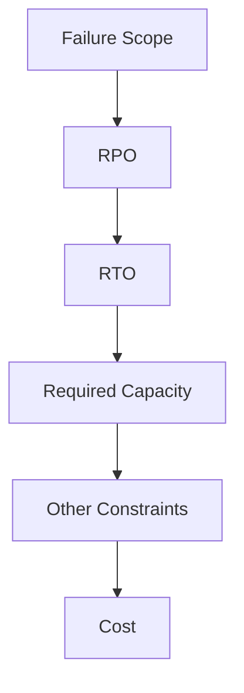

> **Start with the failure, not the AWS service.**

---

# 2. Core Decision Process

When reading an architecture question, ask:

1. **What can fail?**
   - Instance?
   - Availability Zone?
   - Region?
   - Data?
   - Dependency?

2. **How much data can be lost?**
   - RPO

3. **How long can the application be unavailable?**
   - RTO

4. **How much capacity must remain after the failure?**
   - Especially important for fault-tolerant architectures.

5. **Are there additional constraints?**
   - Latency
   - Throughput
   - Consistency
   - Data residency
   - Security
   - Operational effort

6. **Which valid solution is the most cost-effective?**

> [!TIP]
> **Exam Strategy**
>
> Do **not** choose the cheapest architecture first.

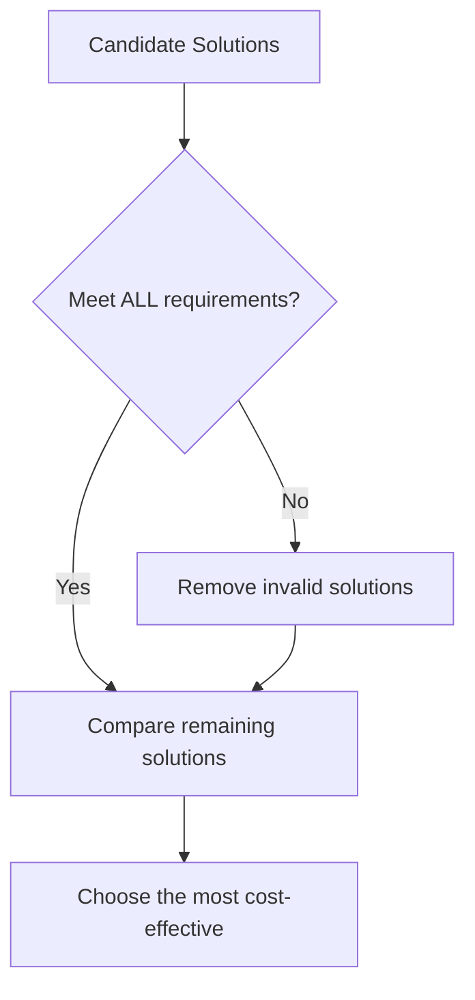

---

# 3. Failure Scope Decision Map

| Requirement                                     | Start With                                                   | Check Before Choosing                                 |
| ----------------------------------------------- | ------------------------------------------------------------ | ----------------------------------------------------- |
| Survive an **instance failure**                 | Auto Scaling / managed failover                              | Replacement time and remaining capacity               |
| Survive an **AZ failure**                       | [Multi-AZ High Availability](high_availability.md)           | Every critical tier and dependency must survive       |
| Survive a **Regional outage**                   | [Cross-Region Disaster Recovery](disaster_recovery.md)       | RPO, RTO, replication and traffic routing             |
| Recover from **accidental deletion/corruption** | [Backup / PITR / Versioning](backup_and_restore.md)          | Retention, restore time and backup isolation          |
| Absorb **traffic/work bursts**                  | [Queue / Buffer](resilient_design_patterns.md)               | Retention, retries, duplicates and backlog            |
| Scale application capacity                      | [Stateless Horizontal Scaling](resilient_design_patterns.md) | External session state and downstream capacity        |
| Prevent cascading failures                      | [Failure Isolation](resilient_design_patterns.md)            | Timeouts, bounded retries and separate resource pools |

---

# 4. Failure → Architecture

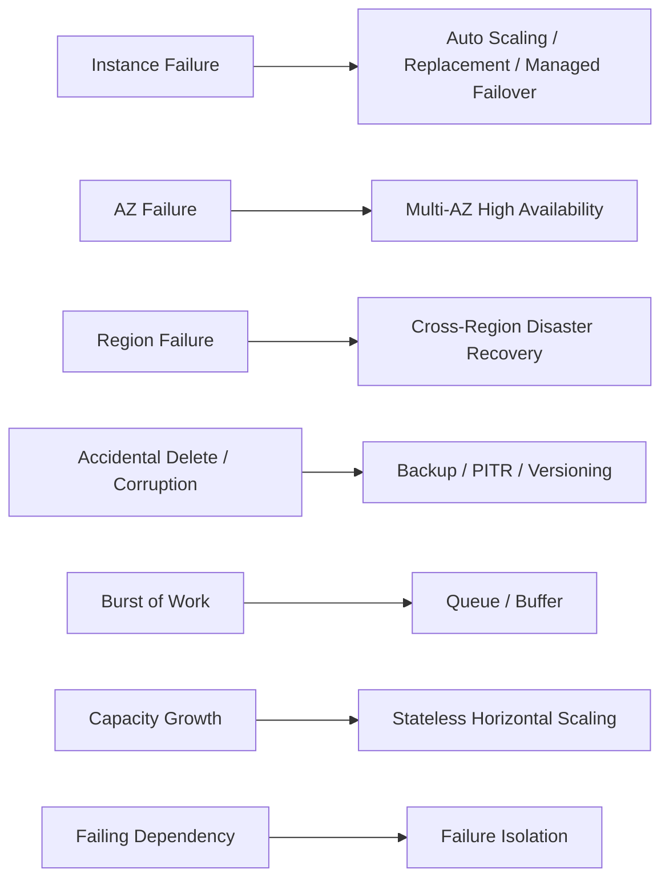

> [!CAUTION]
> **Failure Scope Includes Data Failures**
>
> Not every failure is infrastructure-related.
>
> **Replication and Multi-AZ do not replace backups.**
>
> A logical error can be replicated to otherwise healthy infrastructure.

---

# 5. RPO vs RTO

## RPO — Recovery Point Objective

**¿Cuántos datos puede permitirse perder el negocio?**

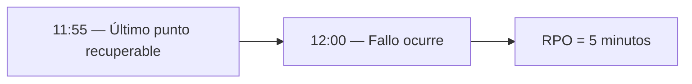

> [!TIP]
> **RPO → PÉRDIDA DE DATOS**
>
> Un RPO más bajo generalmente requiere backups más frecuentes o mecanismos de replicación.

---

## RTO — Recovery Time Objective

**¿Cuánto tiempo puede estar inactivo el sistema?**

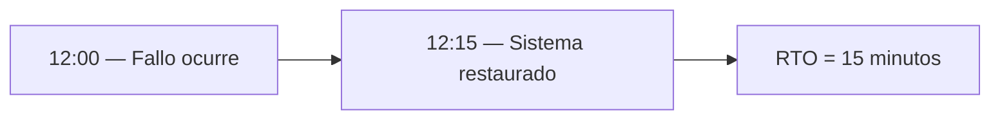

> [!TIP]
> **RTO → TIEMPO DE INACTIVIDAD**
>
> Un RTO más bajo generalmente requiere infraestructura en espera (standby) o activa.

> [!WARNING]
> **RPO y RTO son independientes.**
>
> Puedes tener RPO = 0 (sin pérdida de datos) pero RTO = 1h (tiempo de conmutación).

---

# 6. High Availability

High availability asks:

> **Can the application continue operating through expected component failures?**

Typical pattern:

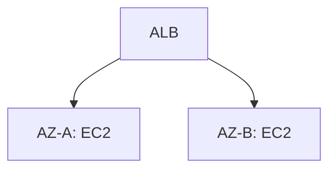

If one AZ fails:

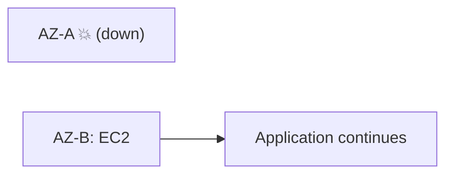

> [!IMPORTANT]
> High availability requires checking **every critical dependency**.
>
> A Multi-AZ application tier does not help if a required dependency exists only in one AZ.

---

# 7. Fault Tolerance

Fault tolerance asks:

> **Can the workload continue at the required capacity through a defined failure?**

Example requirement:

> The application requires at least **2 running instances**, even if one AZ fails.

This is insufficient:

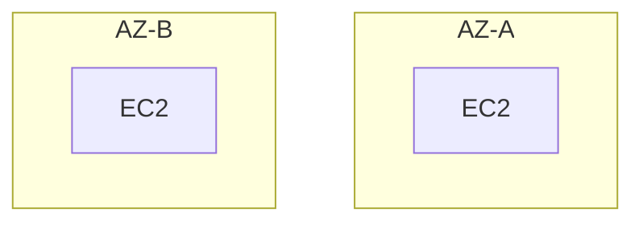

Normal capacity: **2 instances**

But after AZ-A fails:

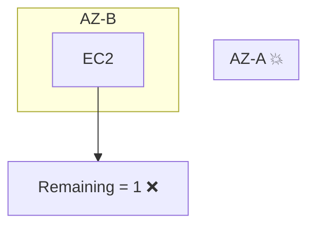

Instead, provision enough capacity across both AZs:

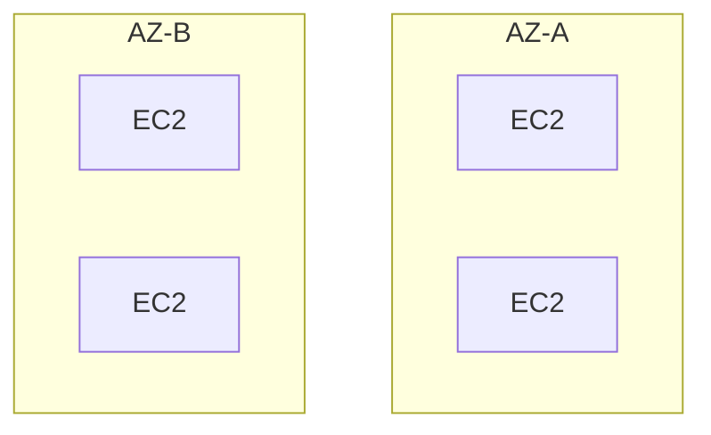

After losing one AZ:

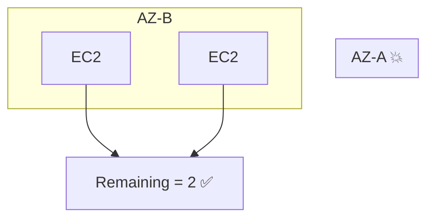

> [!TIP]
> **Exam Pattern**
>
> **Must maintain N instances/capacity after an AZ failure**
>
> → Provision enough capacity so the surviving AZ(s) already satisfy the requirement.

---

# 8. Disaster Recovery

Disaster recovery asks:

> **How will the workload recover after a disaster?**

Usually associated with larger failure scopes:

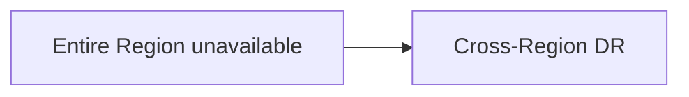

Common strategies:

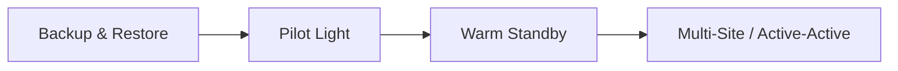

| As you move right                | Cost | Complexity | RTO | RPO |
| -------------------------------- | ---: | ---------: | --: | --: |
| Backup & Restore → Active-Active |    ↑ |          ↑ |   ↓ |   ↓ |

> [!TIP]
> **Exam Pattern**
>
> Do not choose Active-Active merely because it provides the strongest resilience.
>
> Choose the least expensive DR strategy that satisfies the required **RPO and RTO**.

---

# 9. Backup vs Replication

This distinction is critical.

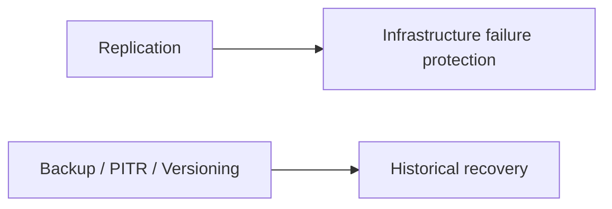

Example:

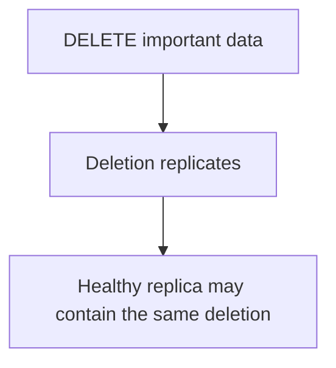

Therefore:

> **Replication does not automatically protect against logical corruption or accidental deletion.**

---

# 10. Database Decision Map

Do not confuse these:

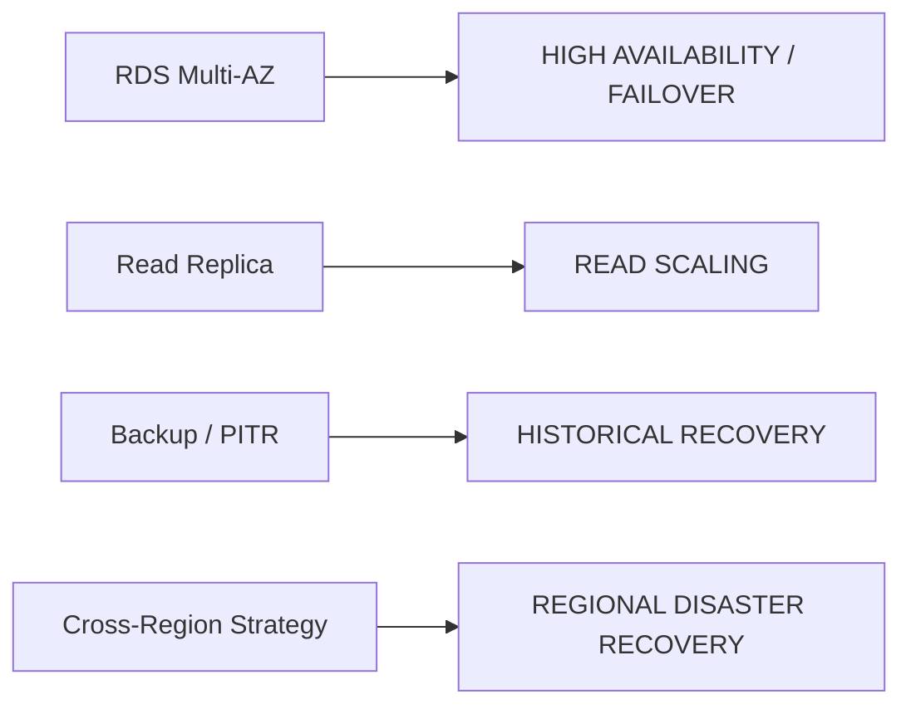

| Requirement                  | Think           |
| ---------------------------- | --------------- |
| Primary DB instance fails    | Multi-AZ        |
| Too many `SELECT` queries    | Read Replica    |
| Records accidentally deleted | PITR / Backup   |
| Entire Region unavailable    | Cross-Region DR |

> [!CAUTION]
> **Exam Trap**
>
> **Read replicas, backups and standby databases are not interchangeable.**
>
> First identify whether the requirement is:
>
> - Failover
> - Read scaling
> - Historical recovery
> - Regional disaster recovery

---

# 11. Decoupling and Queues

Queues improve resilience by separating components.

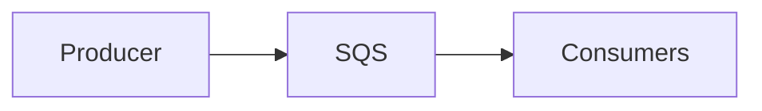

Without a queue:

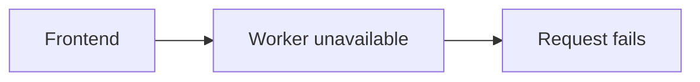

With a queue:

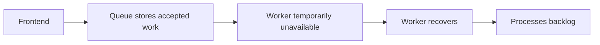

Important considerations:

- Message retention
- Retries
- Duplicate processing
- Idempotency
- Dead-letter queues
- Consumer scaling

> [!TIP]
> **Exam Pattern**
>
> **Traffic spikes + asynchronous processing + don't lose accepted work**
>
> → Queue / decoupled architecture

---

# 12. Stateless Horizontal Scaling

Applications scale and recover more easily when compute instances do not contain important local state.

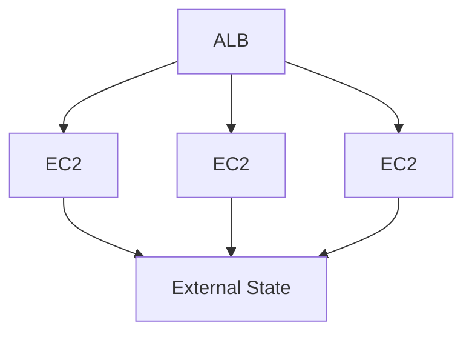

Store durable/shared state externally when appropriate:

- S3
- DynamoDB
- RDS / Aurora
- ElastiCache
- EFS

> [!CAUTION]
> **Exam Trap**
>
> Auto Scaling the application tier does not solve a downstream bottleneck.
>
> Always check:

```mermaid
flowchart LR
    A[Application scales] --> B{Can the database / queue / storage / dependency scale too?}
```

---

# 13. Failure Isolation

A failing dependency should not take down the entire application.

Patterns include:

- Timeouts
- Bounded retries
- Exponential backoff
- Circuit breakers
- Queues
- Separate resource pools

Avoid:

```mermaid
flowchart TD
    A[Dependency fails] --> B[Infinite retries]
    B --> C[More load]
    C --> D[Dependency becomes worse]
    D --> E[Entire application fails]
```

Prefer:

```mermaid
flowchart TD
    A[Dependency fails] --> B["Timeout / bounded retry"]
    B --> C[Isolate failure]
    C --> D[Application remains available]
```

---

# 14. Core Architecture Concepts

| Concept               | Question It Answers                                             | Does NOT Automatically Provide            |
| --------------------- | --------------------------------------------------------------- | ----------------------------------------- |
| **High Availability** | Can the service continue through expected component failures?   | Regional recovery or historical recovery  |
| **Fault Tolerance**   | Can it continue through a defined failure at required capacity? | Protection against every possible failure |
| **Disaster Recovery** | How do we restore service after a disaster?                     | Zero downtime or zero data loss           |
| **Durability**        | How reliably is stored data preserved?                          | Immediate availability                    |
| **Scalability**       | Can capacity grow with demand?                                  | Automatic scaling or redundancy           |
| **Elasticity**        | Can capacity grow and shrink with demand?                       | Elimination of downstream bottlenecks     |

---

# 15. High Availability vs Fault Tolerance

```mermaid
flowchart LR
    A[HIGH AVAILABILITY] --> A1[Minimize downtime] --> A2["Recover / fail over quickly"]
    B[FAULT TOLERANCE] --> B1["Continue operating through the defined failure"] --> B2["Required capacity already survives"]
```

Example:

```mermaid
flowchart LR
    A["ASG can launch replacement instances"] --> A1[High Availability]
    B["Enough instances already running after AZ loss"] --> B1[Fault Tolerance]
```

> [!TIP]
> **Memory**
>
> **HA = RECOVER**
>
> **FT = CONTINUE**

---

# 16. High Availability vs Disaster Recovery

```mermaid
flowchart LR
    A["Expected component / AZ failure"] --> B[High Availability]
    C["Large disaster / Regional failure"] --> D[Disaster Recovery]
```

Do not automatically deploy to multiple Regions when the question only requires surviving an AZ failure.

---

# 17. Durability vs Availability

```mermaid
flowchart LR
    A[DURABILITY] --> A1["Is my data preserved?"]
    B[AVAILABILITY] --> B1["Can I access/use the service now?"]
```

A system can have highly durable data while temporarily being unavailable.

> [!CAUTION]
> **Exam Trap**
>
> **High durability ≠ High availability**

---

# 18. Cost-Effective Architecture

**Most cost-effective** does not mean:

> Choose the cheapest option.

It means:

> Choose the cheapest option that **satisfies every requirement**.

```mermaid
flowchart TD
    A[Requirement] --> B[Evaluate Solutions]
    B --> C{"Meets RPO? Meets RTO? Meets scale? Meets HA? Meets security?"}
    C --> D[Valid Solutions Only]
    D --> E["Lowest Cost / Operational Effort"]
```

Example:

```mermaid
flowchart LR
    A["Regional Disaster"] --> B["Backup & Restore: Cheapest, but RTO may be too high ❌"]
    A --> C["Warm Standby: More expensive, meets required RTO ✅"]
    A --> D["Active-Active: Most expensive, also meets RTO ✅"]
```

If Warm Standby satisfies all requirements:

> ✅ Choose **Warm Standby**, not Active-Active.

---

# 19. High-Value Exam Traps

> [!WARNING]
> **Trap 1 — Multi-AZ vs Multi-Region**
>
> They address different failure scopes.
>
> - AZ failure → Multi-AZ
> - Region failure → Multi-Region / Cross-Region DR

---

> [!WARNING]
> **Trap 2 — Replication vs Backup**
>
> Replication does not replace historical recovery.
>
> - Infrastructure failure → Replication / HA
> - Delete / corruption → Backup / PITR / Versioning

---

> [!WARNING]
> **Trap 3 — Managed ≠ Automatically Resilient**
>
> A managed service still requires appropriate:
>
> - Deployment mode
> - Scaling configuration
> - Backup strategy
> - Application behavior

---

> [!WARNING]
> **Trap 4 — Weakest Critical Dependency**
>
> Application availability depends on **all required components**.
>
> Multi-AZ App + Single-AZ Critical Dependency → Application can still fail

---

> [!WARNING]
> **Trap 5 — Read Replica vs Multi-AZ**
>
> - Read Replica → READ SCALE
> - Multi-AZ → HA / FAILOVER

---

> [!WARNING]
> **Trap 6 — High Durability**
>
> Durable data can still be temporarily unavailable.
>
> **Durability ≠ Availability**

---

> [!WARNING]
> **Trap 7 — Auto Scaling Replacement**
>
> The ability to launch replacements does not mean the workload has enough **immediate surviving capacity**.
>
> If the question says **"Must maintain N instances after an AZ failure"** → calculate the capacity remaining after losing an AZ.

---

> [!WARNING]
> **Trap 8 — Most Cost-Effective**
>
> Do not choose the cheapest option that fails a requirement.
>
> First satisfy the requirements. **Then optimize cost.**

---

# 20. Scenario Check

## Scenario 1 — AZ Failure

> An application must survive an AZ failure at the lowest practical cost.

```mermaid
flowchart LR
    A["Failure Scope: AZ"] --> B["Requirement: Continue serving"]
    B --> C["Architecture: Complete Multi-AZ design"]
```

Do not automatically choose Multi-Region.

---

## Scenario 2 — Regional Failure

> The application must recover if the entire primary AWS Region becomes unavailable.

```mermaid
flowchart LR
    A["Failure Scope: Region"] --> B["Architecture: Cross-Region DR"]
    B --> C["Then evaluate: RPO + RTO"]
```

---

## Scenario 3 — Accidental Deletion

> A user accidentally deletes important production records.

```mermaid
flowchart LR
    A["Logical Data Failure"] --> B["Need previous state"]
    B --> C["Backup / PITR / Versioning"]
```

Multi-AZ alone does not solve this.

---

## Scenario 4 — Traffic Burst

> The application receives unpredictable bursts of jobs and cannot lose accepted work.

```mermaid
flowchart LR
    A[Producer] --> B[Queue] --> C[Workers]
```

→ Decouple and buffer.

---

## Scenario 5 — Required Surviving Capacity

> At least two EC2 instances must remain available even after losing one of two AZs.

```mermaid
flowchart TD
    subgraph AZ_A["AZ-A"]
        A1[EC2]
        A2[EC2]
    end

    subgraph AZ_B["AZ-B"]
        B1[EC2]
        B2[EC2]
    end

    A1 & A2 & B1 & B2 --> T["Total = 4"]
```

Need after failure = 2, AZs = 2 → Provision enough capacity **before** the failure.

---

# 21. Architecture Decision in 30 Seconds

```mermaid
flowchart TD
    Q[What can fail?] --> I["Instance / AZ → Multi-AZ / HA"]
    Q --> R["Region → Cross-Region DR"]
    Q --> D["Data delete / corruption → Backup / PITR / Versioning"]
    Q --> B["Burst / async work → Queue"]
    Q --> C["Capacity growth → Stateless Horizontal Scaling"]
    Q --> F["Cascading failure → Failure Isolation"]

    Q2["How much data can I lose?"] --> RPO
    Q3["How long can I be down?"] --> RTO
    Q4["How much capacity must survive?"] --> FT["Fault Tolerance"]
    Q5["Most cost-effective?"] --> CH["Cheapest architecture that meets ALL requirements"]
```

> [!NOTE]
> **SAA Memory**
>
> **Start with the failure, not the AWS service.**
>
> - AZ failure → Multi-AZ
> - Region failure → Cross-Region DR
> - Data failure → Backup / PITR
> - Burst → Queue
> - Scale → Stateless
> - Data loss → RPO
> - Downtime → RTO
> - Required surviving capacity → Fault Tolerance
> - **Cost comes AFTER requirements.**

---

# 📚 Study Order

1. [High Availability](high_availability.md)
2. [Disaster Recovery](disaster_recovery.md)
3. [Backup and Restore](backup_and_restore.md)
4. [Resilient Design Patterns](resilient_design_patterns.md)

---

# 🔗 Related Notes

## Compute

- [Auto Scaling](../Compute/aws_auto_scaling.md)
- [EC2](../Compute/aws_ec2.md)
- [Elastic Load Balancing](../Compute/aws_elb.md)

## Database

- [RDS](../Database/aws_rds.md)
- [Aurora](../Database/aws_aurora.md)
- [DynamoDB](../Database/aws_dynamodb.md)

## Storage

- [S3](../Storage/aws_s3.md)
- [EFS](../Storage/aws_efs.md)

## Networking

- [VPC](../Networking/aws_vpc.md)

---

# 📚 Sources

- AWS Certified Solutions Architect – Associate (SAA-C03), Domain 2: Design Resilient Architectures
- AWS Well-Architected Framework — Reliability Pillar

---

**Reviewed:** 2026-09-23  
**Focus:** SAA-C03 architecture decisions, not implementation runbooks.
