# EC2 Auto Scaling — Elastic and Highly Available Compute

## 📑 Table of Contents

1. [Mental Model](#1-mental-model)
2. [Auto Scaling Group](#2-auto-scaling-group)
3. [Minimum, Desired and Maximum Capacity](#3-minimum-desired-and-maximum-capacity)
4. [Launch Templates](#4-launch-templates)
5. [Multi-AZ and High Availability](#5-multi-az-and-high-availability)
6. [Scaling Policies](#6-scaling-policies)
7. [Choosing the Right Scaling Metric](#7-choosing-the-right-scaling-metric)
8. [Health Checks and Replacement](#8-health-checks-and-replacement)
9. [Warmup, Grace Period and Cooldown](#9-warmup-grace-period-and-cooldown)
10. [Warm Pools](#10-warm-pools)
11. [Lifecycle Hooks](#11-lifecycle-hooks)
12. [Scale-In and Termination Policies](#12-scale-in-and-termination-policies)
13. [Instance Refresh](#13-instance-refresh)
14. [Standby](#14-standby)
15. [Auto Scaling with ALB](#15-auto-scaling-with-alb)
16. [EC2 Auto Scaling vs Other Services](#16-ec2-auto-scaling-vs-other-services)
17. [Auto Scaling Decision Map](#17-auto-scaling-decision-map)
18. [High-Value Exam Traps](#18-high-value-exam-traps)
19. [Scenario Check](#19-scenario-check)
20. [Auto Scaling in 30 Seconds](#20-auto-scaling-in-30-seconds)

---

# 1. Mental Model

> [!TIP]
> 🧠 **Mental Model**
>
> **EC2 Auto Scaling = Maintain healthy capacity + Adjust capacity when demand changes**
>
> ```text
> Launch Template
>       ↓
> Auto Scaling Group
>       ↓
> EC2 Instances
>       ↓
> Replace unhealthy instances
> +
> Scale Out / Scale In
> ```

The Auto Scaling Group manages the **fleet**.

The Load Balancer manages **traffic distribution**.

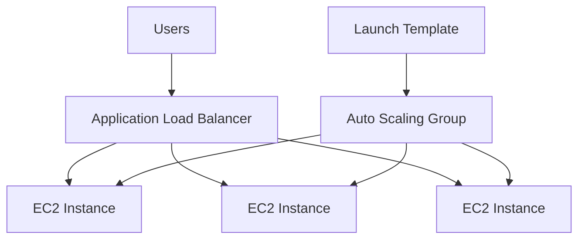

> [!IMPORTANT]
> 🎯 **SAA Memory**
>
> ```text
> ALB
> → ROUTES TRAFFIC
>
> ASG
> → MANAGES EC2 CAPACITY
>
> Launch Template
> → DEFINES NEW INSTANCES
> ```

---

# 2. Auto Scaling Group

An Auto Scaling Group defines and maintains a group of EC2 instances.

Its two major responsibilities are:

```text
1. Maintain healthy desired capacity
2. Adjust desired capacity according to demand
```

For example:

```text
Desired = 3

Instance 1 ✅
Instance 2 💀
Instance 3 ✅

        ↓

ASG launches replacement

        ↓

Instance 1 ✅
Instance 4 ✅
Instance 3 ✅
```

This happens even without a traffic-based scaling event.

> [!IMPORTANT]
> Auto Scaling is not only about adding instances during high traffic.
>
> It also maintains **healthy capacity**.

---

# 3. Minimum, Desired and Maximum Capacity

An ASG has three fundamental capacity settings:

```text
MINIMUM
DESIRED
MAXIMUM
```

Example:

```text
Min     = 2
Desired = 4
Max     = 8
```

Conceptually:

```text
2 ≤ 4 ≤ 8
↑   ↑   ↑
Min Desired Max
```

| Setting     | Meaning                           |
| ----------- | --------------------------------- |
| **Minimum** | Lower capacity boundary           |
| **Desired** | Current target capacity           |
| **Maximum** | Upper boundary for normal scaling |

---

## Scale Out

Suppose:

```text
Min     = 2
Desired = 4
Max     = 8
```

Demand increases:

```text
Desired 4
   ↓
Desired 6
```

The ASG launches two additional instances.

---

## Scale In

Demand decreases:

```text
Desired 6
   ↓
Desired 3
```

The ASG terminates eligible instances.

> [!TIP]
> 💡 **Exam Pattern**
>
> ```text
> Scale Out
> → Increase desired capacity
>
> Scale In
> → Decrease desired capacity
> ```

---

# 4. Launch Templates

A Launch Template defines how new EC2 instances should be launched.

It can contain configuration such as:

- AMI
- Instance type
- Security Groups
- IAM instance profile
- User Data
- Storage configuration
- Key pair

Architecture:

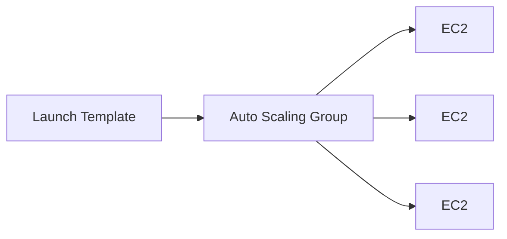

> [!IMPORTANT]
> 🎯 **SAA Memory**
>
> **Launch Template = INSTANCE CONFIGURATION**
>
> **ASG = FLEET CAPACITY**

---

## Updating a Launch Template

Changing the Launch Template used for future launches does **not automatically replace all existing instances**.

```text
New Launch Template Version
        ↓
Future Instances use it
```

If existing instances also need to be replaced gradually:

```text
Instance Refresh
```

---

# 5. Multi-AZ and High Availability

An ASG can launch instances across multiple Availability Zones.

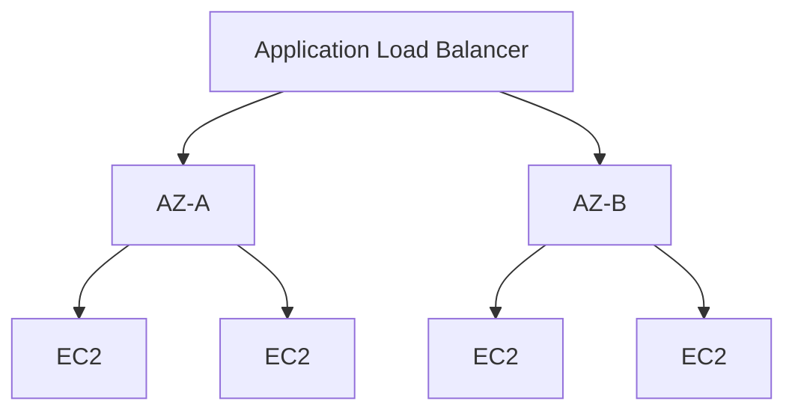

This improves availability if an AZ fails.

> [!CAUTION]
> ⚠️ **Exam Trap**
>
> Selecting multiple AZs does not automatically mean you have enough capacity to survive an AZ failure.

Example:

```text
2 AZs
Desired Capacity = 1
```

You still have only:

```text
1 running instance
```

not one instance per AZ.

---

## Capacity Planning for AZ Failure

Suppose the requirement says:

```text
Application must have at least
2 running instances
even if one of 2 AZs fails
```

A possible architecture is:

```text
AZ-A → 2 instances
AZ-B → 2 instances

Total minimum capacity = 4
```

If one AZ fails:

```text
AZ-A 💀

AZ-B
├── EC2 ✅
└── EC2 ✅
```

The application still immediately has two instances.

> [!TIP]
> 💡 **Exam Pattern**
>
> Always distinguish:
>
> ```text
> "Configured across multiple AZs"
> ```
>
> from:
>
> ```text
> "Enough running capacity to survive an AZ failure"
> ```

---

# 6. Scaling Policies

The major scaling policies to know are:

| Policy                 | Trigger                      | Best Fit                                |
| ---------------------- | ---------------------------- | --------------------------------------- |
| **Target Tracking**    | Target metric value          | Maintain metric around desired target   |
| **Step Scaling**       | Size of threshold breach     | Different actions depending on severity |
| **Scheduled Scaling**  | Known schedule               | Predictable known events                |
| **Predictive Scaling** | Forecast historical patterns | Recurring predictable demand            |
| **Simple Scaling**     | Alarm + cooldown             | Legacy scaling pattern                  |

---

## Target Tracking

Think:

**Thermostat**

Example:

```text
Target CPU = 50%
```

If:

```text
CPU = 80%
```

ASG can scale out.

If:

```text
CPU = 20%
```

ASG can scale in.

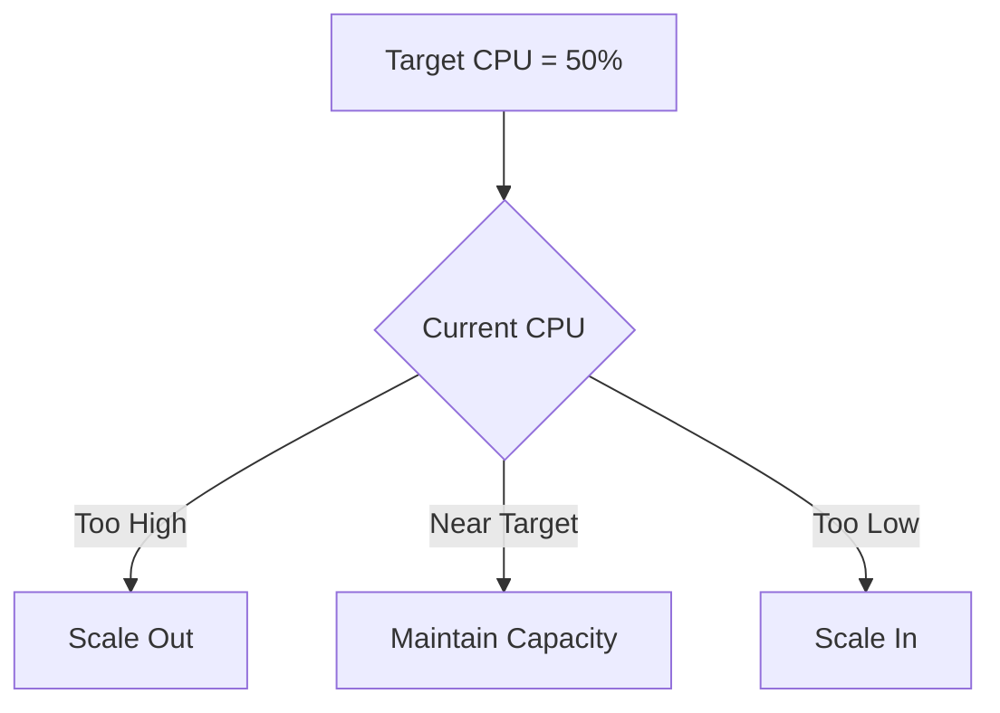

> [!TIP]
> 💡 **Exam Pattern**
>
> ```text
> Maintain CPU around 50%
> → Target Tracking
> ```

Other useful metrics can include ALB requests per target.

---

## Step Scaling

Step Scaling changes capacity according to the **severity** of an alarm breach.

Example:

```text
CPU 60–70%
→ Add 1 instance

CPU 70–80%
→ Add 2 instances

CPU > 80%
→ Add 4 instances
```

> [!TIP]
> 💡 **Exam Pattern**
>
> ```text
> Bigger overload
> → Bigger scaling action
> ```
>
> → **Step Scaling**

---

## Scheduled Scaling

Use when demand changes at a known time.

Example:

```text
Every weekday at 08:45
        ↓
Increase desired capacity
        ↓
Traffic arrives at 09:00
```

> [!TIP]
> 💡 **Exam Pattern**
>
> ```text
> Known time
> → Scheduled Scaling
> ```

---

## Predictive Scaling

Predictive Scaling uses historical patterns to forecast future demand.

```text
Historical Pattern
      ↓
Forecast
      ↓
Prepare Capacity
      ↓
Expected Traffic
```

Think:

```text
Every Monday morning traffic increases
        ↓
Predictive Scaling
```

Predictive Scaling can be combined with dynamic scaling for unexpected changes.

---

## Scheduled vs Predictive

```text
Known exact schedule
→ Scheduled Scaling

Recurring pattern inferred from history
→ Predictive Scaling
```

> [!CAUTION]
> ⚠️ **Exam Trap**
>
> ```text
> "Traffic increases every day at exactly 9 AM"
> → Scheduled can fit
>
> "Traffic follows recurring historical patterns"
> → Predictive
> ```

---

## Simple Scaling

Simple Scaling uses an alarm and waits for a cooldown after the scaling activity.

Think:

```text
Alarm
  ↓
Scaling Action
  ↓
Cooldown
```

For SAA, recognize it mainly as the older scaling model.

> [!CAUTION]
> Do not apply Simple Scaling cooldown behavior to every scaling policy.

---

# 7. Choosing the Right Scaling Metric

A good scaling metric should represent **load per unit of capacity**.

For example:

```text
Average CPU
Requests per target
Backlog per worker
```

A poor metric can cause ineffective scaling.

---

## SQS Worker Fleet

Suppose EC2 workers process messages from SQS.

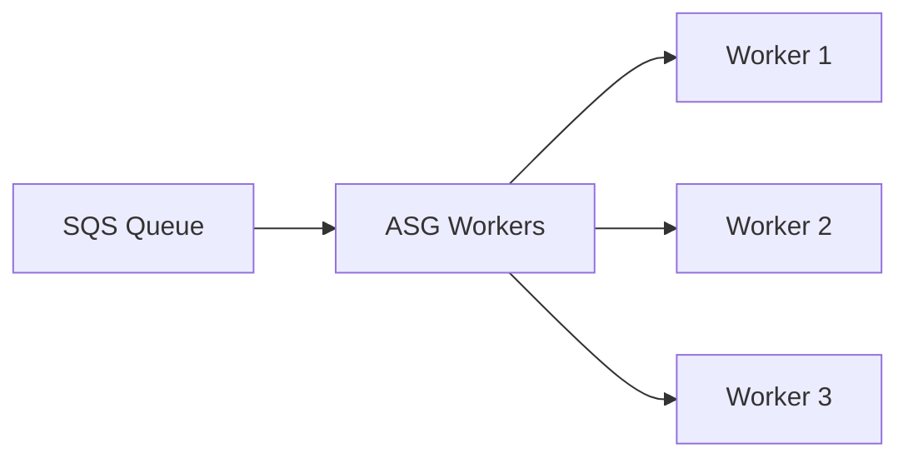

Using only CPU may be misleading.

Example:

```text
Queue = 10,000 messages
CPU = 20%
```

Workers might be waiting on I/O while the queue continues growing.

A useful metric is:

```text
Backlog per Instance
```

Conceptually:

```text
ApproximateNumberOfMessagesVisible
───────────────────────────────────
Number of InService Instances
```

---

## Target Backlog per Instance

A useful planning approximation:

```text
Target Backlog per Instance
≈
Acceptable Queue Latency
────────────────────────
Average Processing Time per Message
```

Example:

```text
Acceptable latency = 100 seconds

Average processing time = 10 seconds/message

100 / 10 = 10
```

Target:

```text
≈ 10 queued messages per worker
```

> [!TIP]
> 💡 **Exam Pattern**
>
> ```text
> SQS
> +
> EC2 Workers
> +
> Queue Backlog
> ```
>
> → Scale using **Backlog per Instance**

This is a planning estimate, not a strict latency guarantee.

---

# 8. Health Checks and Replacement

ASG health checks determine whether instances should remain in service.

By default, EC2 Auto Scaling uses EC2 health information.

```text
EC2 Health Check
      ↓
Unhealthy?
      ↓
Replace Instance
```

---

## EC2 vs ELB Health

Imagine:

```text
EC2 Instance
OS running ✅

Application
/api/health → 500 ❌
```

From EC2's perspective:

```text
Instance = healthy
```

But from the load balancer's perspective:

```text
Application target = unhealthy
```

If the ASG is configured to use ELB health checks, application-level target health can cause replacement.

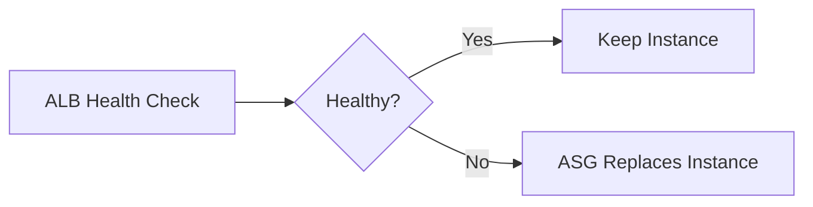

> [!TIP]
> 💡 **Exam Pattern**
>
> ```text
> EC2 is running
> BUT
> Application health check fails
> ```
>
> → Configure the ASG to use **ELB health checks**

---

# 9. Warmup, Grace Period and Cooldown

These three concepts are easy to confuse.

| Feature                       | Think                                                     |
| ----------------------------- | --------------------------------------------------------- |
| **Health Check Grace Period** | Don't replace the new instance too quickly                |
| **Instance Warmup**           | Don't let initializing capacity distort scaling decisions |
| **Cooldown**                  | Wait after Simple Scaling action                          |

---

## Health Check Grace Period

A new instance may need time to start its application.

```text
Launch
  ↓
Boot
  ↓
Install / Initialize
  ↓
Application Ready
```

The grace period gives it time before configured health failures trigger replacement.

> [!IMPORTANT]
> **Grace Period → HEALTH**

---

## Instance Warmup

A newly launched instance may not yet contribute full capacity.

Warmup helps scaling calculations account for that initialization period.

```text
Launch
  ↓
Warming Up
  ↓
Fully Contributing
```

> [!IMPORTANT]
> **Warmup → SCALING CALCULATIONS**

---

## Cooldown

Cooldown is associated with Simple Scaling.

```text
Scale
 ↓
Wait
 ↓
Evaluate next Simple Scaling action
```

> [!IMPORTANT]
> **Cooldown → SIMPLE SCALING**

---

## Memory Trick

```text
GRACE
→ Don't kill me yet

WARMUP
→ Don't count my capacity incorrectly yet

COOLDOWN
→ Don't scale again yet
```

---

# 10. Warm Pools

Some applications take a long time to initialize.

A Warm Pool keeps pre-initialized instances available so they can enter service faster.

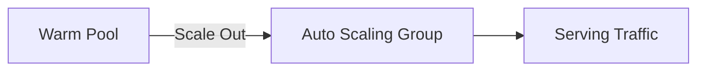

Think:

```text
Slow startup
+
Need faster scale-out
        ↓
Warm Pool
```

> [!CAUTION]
> ⚠️ **Exam Trap**
>
> Warm Pool instances are not simply extra active targets already serving normal production traffic.

---

# 11. Lifecycle Hooks

Lifecycle Hooks pause instances during launch or termination so custom actions can run.

---

## Launch Hook

```text
Launch Instance
      ↓
Lifecycle Hook
      ↓
Custom Initialization
      ↓
InService
```

Possible uses:

- Download configuration
- Register with external system
- Run custom initialization

---

## Termination Hook

```text
Scale In
   ↓
Lifecycle Hook
   ↓
Custom Cleanup
   ↓
Terminate
```

Possible uses:

- Save logs
- Finish cleanup
- Notify another system

> [!IMPORTANT]
> 🎯 **Mental Model**
>
> ```text
> Lifecycle Hook
> → PAUSE TRANSITION FOR CUSTOM WORK
> ```

> [!CAUTION]
> Lifecycle hooks have timeouts.
>
> They cannot pause an instance indefinitely.

---

# 12. Scale-In and Termination Policies

When desired capacity decreases, the ASG needs to determine:

```text
Which instance should terminate?
```

That is the job of the **Termination Policy**.

> [!IMPORTANT]
>
> ```text
> Scaling Policy
> → WHEN / HOW MUCH capacity changes
>
> Termination Policy
> → WHICH instance is removed
> ```

---

## Default Termination Logic

Do not memorize:

```text
"Always terminate the oldest instance."
```

That is incorrect.

The default logic considers factors such as:

1. Availability Zone balance
2. Outdated launch configurations/templates
3. Older launch template versions
4. Remaining tie-breaking rules

Mixed instance groups can have additional considerations such as purchase-option balance and allocation strategy.

> [!TIP]
> 💡 **SAA Memory**
>
> The first high-level objective is to preserve **AZ balance**.

---

## Scale-In Protection

Scale-In Protection prevents an instance from being selected for normal ASG scale-in.

```text
Instance A → Protected
Instance B → Eligible
Instance C → Eligible
```

During scale-in:

```text
B or C can be selected
A is protected
```

But:

> [!CAUTION]
> ⚠️ **Scale-In Protection ≠ Universal Termination Protection**

It does not guarantee protection from:

- Health-based replacement
- Manual termination
- Spot interruption
- Other failure mechanisms

Design applications so instances remain replaceable.

---

# 13. Instance Refresh

Suppose you update:

```text
AMI v1
↓
AMI v2
```

Updating the Launch Template alone does not automatically replace existing instances.

Use:

**Instance Refresh**

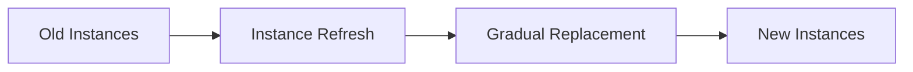

Instance Refresh can roll out new configurations gradually while respecting health and capacity controls.

> [!TIP]
> 💡 **Exam Pattern**
>
> ```text
> New AMI / Launch Template
> +
> Replace existing ASG instances gradually
> ```
>
> → **Instance Refresh**

---

# 14. Standby

Standby allows an instance to be temporarily removed from active ASG service.

```text
InService
   ↓
Standby
   ↓
Maintenance
   ↓
InService
```

Useful for:

- Troubleshooting
- Maintenance
- Testing changes

Depending on how the operation is performed, desired capacity behavior must be considered.

> [!CAUTION]
> Standby is not the same as Scale-In Protection.
>
> ```text
> Standby
> → Temporarily remove from active service
>
> Scale-In Protection
> → Keep active instance from normal scale-in selection
> ```

---

# 15. Auto Scaling with ALB

A classic SAA architecture:

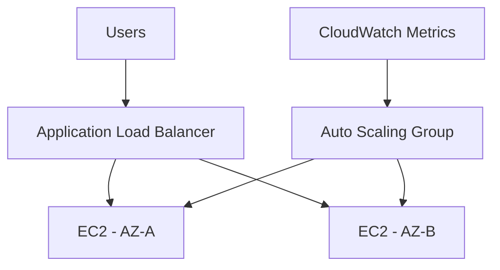

Responsibilities:

```text
ALB
→ Distribute requests

ASG
→ Maintain / scale instances

CloudWatch
→ Provide metrics and alarms
```

---

## Deregistration Delay

During instance removal, the load balancer can allow existing requests time to complete.

```text
Target
  ↓
Deregister
  ↓
Drain Existing Requests
  ↓
Remove
```

This is different from ASG lifecycle hooks.

```text
Deregistration Delay
→ LOAD BALANCER request draining

Lifecycle Hook
→ ASG instance transition workflow
```

---

# 16. EC2 Auto Scaling vs Other Services

| Service                      | Main Responsibility                 |
| ---------------------------- | ----------------------------------- |
| **EC2 Auto Scaling**         | EC2 fleet capacity and replacement  |
| **Application Auto Scaling** | Scaling supported non-EC2 resources |
| **Elastic Load Balancing**   | Traffic distribution                |
| **CloudWatch**               | Metrics / alarms                    |
| **CloudTrail**               | AWS API audit activity              |

---

## Application Auto Scaling

Do not confuse it with EC2 Auto Scaling.

Application Auto Scaling can scale supported resources such as:

```text
ECS service task count
DynamoDB provisioned capacity
Lambda provisioned concurrency
```

Think:

```text
EC2 Fleet
→ EC2 Auto Scaling

Supported Application Resource
→ Application Auto Scaling
```

See [AWS Containers](aws_containers.md).

---

# 17. Auto Scaling Decision Map

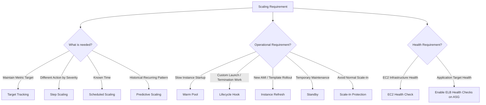

---

# 18. High-Value Exam Traps

> [!CAUTION]
> ⚠️ **Trap 1 — ALB vs ASG**
>
> ```text
> ALB
> → Routes Traffic
>
> ASG
> → Launches / Replaces / Scales EC2
> ```

---

> [!CAUTION]
> ⚠️ **Trap 2 — Multi-AZ Does Not Guarantee Capacity**
>
> ```text
> 2 AZs + Desired = 1
> ≠
> 1 instance in each AZ
> ```

---

> [!CAUTION]
> ⚠️ **Trap 3 — ELB Health**
>
> ELB target health does not automatically mean the ASG will replace the instance unless the appropriate health checks are configured for the ASG.

---

> [!CAUTION]
> ⚠️ **Trap 4 — Target Tracking Metric**
>
> Use a metric that meaningfully reflects utilization relative to capacity.
>
> ```text
> Raw Queue Length
> ≠
> Backlog per Worker
> ```

---

> [!CAUTION]
> ⚠️ **Trap 5 — Scaling vs Termination Policy**
>
> ```text
> Scaling Policy
> → WHEN / HOW MUCH
>
> Termination Policy
> → WHICH INSTANCE
> ```

---

> [!CAUTION]
> ⚠️ **Trap 6 — Updating Launch Template**
>
> ```text
> Update Launch Template
> ≠
> Replace Existing Instances
>
> Replace Existing Fleet
> → Instance Refresh
> ```

---

> [!CAUTION]
> ⚠️ **Trap 7 — Scale-In Protection**
>
> Scale-In Protection does not protect against every possible termination mechanism.

---

> [!CAUTION]
> ⚠️ **Trap 8 — Warm Pool**
>
> ```text
> Warm Pool
> → Pre-initialized capacity
>
> NOT
> → Active production targets already serving normal traffic
> ```

---

> [!CAUTION]
> ⚠️ **Trap 9 — Warmup vs Grace Period**
>
> ```text
> Grace Period
> → HEALTH
>
> Warmup
> → SCALING CALCULATIONS
> ```

---

> [!CAUTION]
> ⚠️ **Trap 10 — Scheduled vs Predictive**
>
> ```text
> Known Schedule
> → Scheduled Scaling
>
> Forecast Historical Pattern
> → Predictive Scaling
> ```

---

> [!CAUTION]
> ⚠️ **Trap 11 — Maximum Capacity**
>
> Setting:
>
> ```text
> Max = 20
> ```
>
> does not guarantee AWS can successfully launch 20 instances.
>
> Scaling can still be limited by:
>
> - Service quotas
> - Instance availability
> - Subnet IP addresses
> - Launch failures

---

> [!CAUTION]
> ⚠️ **Trap 12 — Downstream Bottleneck**
>
> More EC2 instances do not automatically improve performance.
>
> ```text
> More Workers
>       ↓
> More DB Connections
>       ↓
> Database Bottleneck 💀
> ```
>
> Identify the actual bottleneck.

---

# 19. Scenario Check

## Scenario 1 — Maintain CPU at 50%

> An application should automatically adjust capacity to keep average CPU utilization around 50%.

```text
Maintain Metric Target
        ↓
Target Tracking
```

---

## Scenario 2 — Severe Load Requires More Capacity

> The application should add one instance at moderate CPU utilization and four instances when CPU utilization becomes very high.

```text
Scaling Action Depends on Severity
        ↓
Step Scaling
```

---

## Scenario 3 — Known Morning Traffic

> Traffic increases every weekday at 9 AM and capacity should be ready before users arrive.

```text
Known Time
    ↓
Scheduled Scaling
```

---

## Scenario 4 — Recurring Historical Traffic

> Traffic follows recurring patterns and capacity should be prepared based on historical demand.

```text
Historical Pattern
       ↓
Predictive Scaling
```

---

## Scenario 5 — Application Is Unhealthy

> EC2 status checks pass, but the web application's health endpoint fails.

```text
EC2 Healthy
+
Application Unhealthy
        ↓
ELB Health Check
        ↓
ASG Replacement
```

---

## Scenario 6 — Slow Startup

> Instances require several minutes of initialization and the company needs faster scale-out.

```text
Slow Startup
     ↓
Warm Pool
```

---

## Scenario 7 — Custom Cleanup Before Termination

> Before an instance terminates, logs must be copied to another location.

```text
Termination
    ↓
Lifecycle Hook
    ↓
Copy Logs
    ↓
Terminate
```

---

## Scenario 8 — New AMI

> A new AMI must be gradually deployed across all existing instances in an ASG.

```text
New AMI
+
Existing Fleet
+
Gradual Replacement
        ↓
Instance Refresh
```

---

## Scenario 9 — Queue Workers

> An SQS queue grows while worker CPU remains low because workers spend much of their time waiting on I/O.

```text
CPU ❌

Queue Backlog
÷
InService Workers
        ↓
Backlog per Instance ✅
```

Scale based on useful demand rather than CPU alone.

---

## Scenario 10 — Mission-Critical Multi-AZ

> An application runs across two AZs and must have at least two instances immediately available even if one entire AZ fails.

Think about the required capacity **after losing an AZ**, not merely the number of configured AZs.

One straightforward design:

```text
AZ-A → 2 instances
AZ-B → 2 instances

Total → 4
```

If either AZ fails:

```text
Remaining capacity → 2
```

> [!TIP]
> **HA requirement determines minimum running capacity.**

---

# 20. Auto Scaling in 30 Seconds

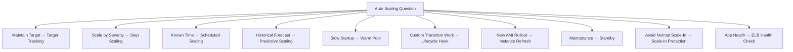

> [!NOTE]
> 🧠 **SAA Memory**
>
> **ASG → MAINTAIN + SCALE EC2**
>
> **ALB → ROUTE TRAFFIC**
>
> **MIN → LOWER BOUND**
>
> **DESIRED → CURRENT TARGET**
>
> **MAX → UPPER BOUND**
>
> **TARGET TRACKING → MAINTAIN TARGET**
>
> **STEP → SCALE BY SEVERITY**
>
> **SCHEDULED → KNOWN TIME**
>
> **PREDICTIVE → FORECAST**
>
> **GRACE PERIOD → HEALTH**
>
> **WARMUP → SCALING CALCULATIONS**
>
> **COOLDOWN → SIMPLE SCALING**
>
> **WARM POOL → FASTER STARTUP**
>
> **LIFECYCLE HOOK → PAUSE TRANSITION**
>
> **INSTANCE REFRESH → ROLL OUT NEW CONFIG**
>
> **STANDBY → MAINTENANCE**
>
> **SCALE-IN PROTECTION → DON'T SELECT ME FOR NORMAL SCALE-IN**
>
> **TERMINATION POLICY → WHICH INSTANCE**
>
> **SQS WORKERS → BACKLOG PER INSTANCE**

---

# 🔗 Related Notes

## Compute

- [Compute Overview](compute_overview.md)
- [Amazon EC2](aws_ec2.md)
- [Elastic Load Balancing](aws_elb.md)
- [AWS Containers](aws_containers.md)

## Architecture

- [High Availability](../Architecture/high_availability.md)
- [Resilient Design Patterns](../Architecture/resilient_design_patterns.md)

## Management

- [Amazon CloudWatch](../Management/aws_cloudwatch.md)

---

# 📚 Study Order

1. Min / Desired / Max
2. Launch Templates
3. Multi-AZ Capacity
4. Target Tracking
5. Step / Scheduled / Predictive Scaling
6. Health Checks
7. Grace Period vs Warmup vs Cooldown
8. Warm Pools / Lifecycle Hooks
9. Scale-In Protection / Termination Policies
10. Instance Refresh

---

# 📚 Sources

- AWS EC2 Auto Scaling — Scaling Policies
- AWS EC2 Auto Scaling — Health Checks
- AWS EC2 Auto Scaling — SQS-Based Scaling
- AWS EC2 Auto Scaling — Instance Warmup
- AWS EC2 Auto Scaling — Termination Policies
- AWS EC2 Auto Scaling — Instance Scale-In Protection
- AWS EC2 Auto Scaling — Instance Refresh

---

**Reviewed:** 2026-09-23  
**Focus:** SAA-C03 elasticity, high availability, health checks and EC2 fleet management.
