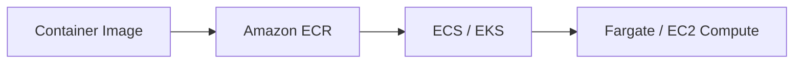
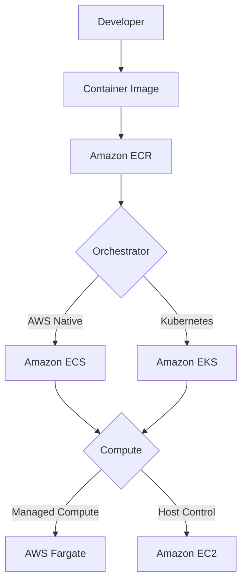
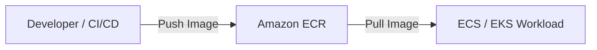
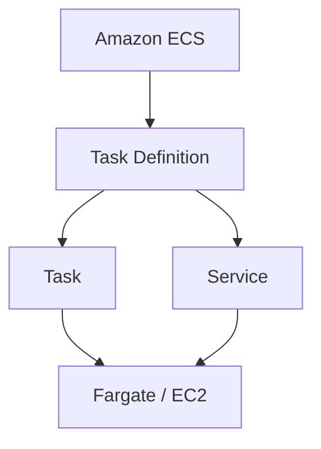
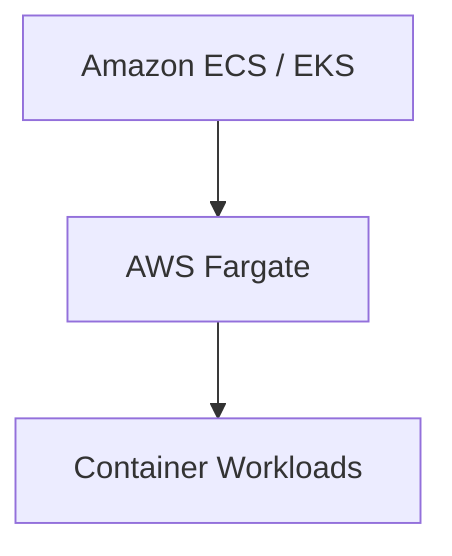
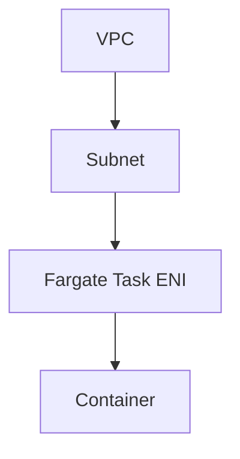
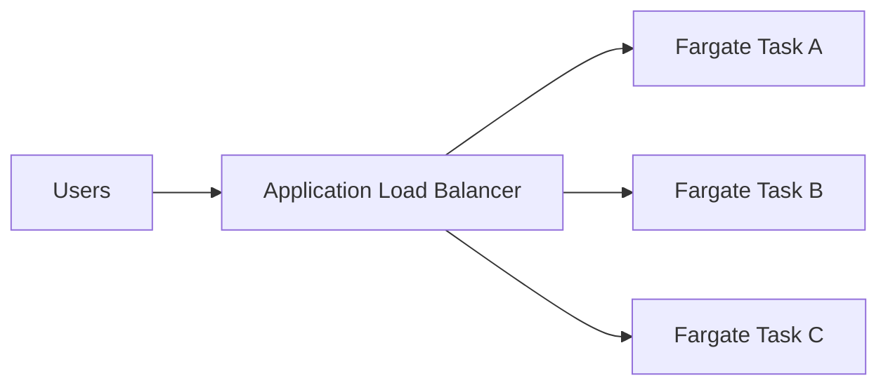
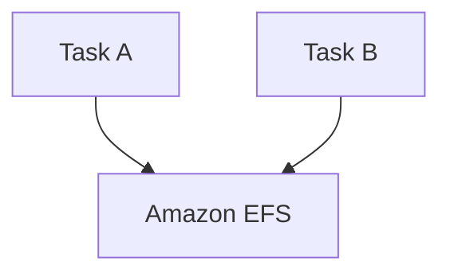
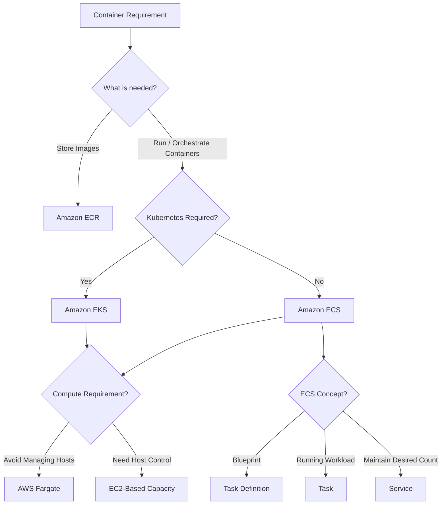
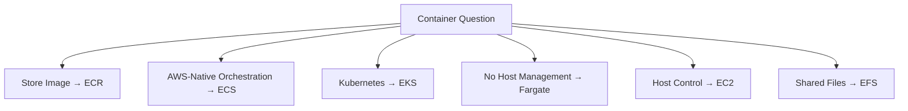

---
aliases:
  - Containers
  - Amazon ECS
  - Amazon EKS
  - AWS Fargate
  - Amazon ECR
tags:
  - aws/saa
  - compute
---

# Containers — ECS, EKS, Fargate and ECR

## 📑 Table of Contents

1. [Mental Model](#1-mental-model)
2. [Container Architecture](#2-container-architecture)
3. [Amazon ECR](#3-amazon-ecr)
4. [Amazon ECS](#4-amazon-ecs)
5. [ECS Task Definitions, Tasks and Services](#5-ecs-task-definitions-tasks-and-services)
6. [Amazon EKS](#6-amazon-eks)
7. [AWS Fargate](#7-aws-fargate)
8. [ECS on EC2](#8-ecs-on-ec2)
9. [IAM Roles](#9-iam-roles)
10. [Networking](#10-networking)
11. [Load Balancing](#11-load-balancing)
12. [Storage and State](#12-storage-and-state)
13. [Scaling and High Availability](#13-scaling-and-high-availability)
14. [Fargate Spot](#14-fargate-spot)
15. [Containers vs Other Compute Services](#15-containers-vs-other-compute-services)
16. [Decision Map](#16-decision-map)
17. [High-Value Exam Traps](#17-high-value-exam-traps)
18. [Scenario Check](#18-scenario-check)
19. [Containers in 30 Seconds](#19-containers-in-30-seconds)

---

# 1. Mental Model

> [!TIP]
> 🧠 **Mental Model**
>
> Do not compare ECR, ECS, EKS and Fargate as if they did the same job.
>
> ```text
> ECR
> → STORE IMAGE
>
> ECS / EKS
> → ORCHESTRATE CONTAINERS
>
> FARGATE / EC2
> → PROVIDE COMPUTE
> ```

The basic architecture is:



> [!IMPORTANT]
> 🎯 **SAA Memory**
>
> ```text
> ECR = REGISTRY
>
> ECS = AWS-NATIVE ORCHESTRATOR
>
> EKS = KUBERNETES
>
> FARGATE = SERVERLESS CONTAINER COMPUTE
>
> EC2 = HOST CONTROL
> ```

The most important distinction:

```text
WHO STORES?
→ ECR

WHO ORCHESTRATES?
→ ECS / EKS

WHERE DOES IT RUN?
→ Fargate / EC2
```

---

# 2. Container Architecture

A container architecture normally has several separate layers.



This separation is extremely important for exam questions.

> [!CAUTION]
> ⚠️ **Exam Trap**
>
> ```text
> Fargate
> ≠
> Container Orchestrator
> ```
>
> Fargate provides compute for supported ECS/EKS workloads.

---

# 3. Amazon ECR

**Amazon Elastic Container Registry (ECR)** stores and distributes container images.

Think:

> **ECR = Docker/OCI Image Registry**

```text
Build Image
    ↓
Push Image
    ↓
Amazon ECR
    ↓
ECS / EKS pulls image
```

Architecture:



ECR supports capabilities such as:

- Private container repositories
- Image scanning
- Image lifecycle policies
- Image distribution

> [!TIP]
> 💡 **Exam Pattern**
>
> ```text
> Private Container Image Registry
> ```
>
> → **Amazon ECR**

> [!CAUTION]
> ⚠️ **Exam Trap**
>
> ```text
> ECR
> → STORES IMAGES
>
> ECR
> ≠
> RUN CONTAINERS
> ```

---

# 4. Amazon ECS

**Amazon Elastic Container Service (ECS)** is AWS-native container orchestration.

Think:

> **ECS = AWS Container Orchestrator**



ECS is a strong starting point when:

```text
Need Containers
+
No Kubernetes Requirement
+
Want AWS-Native Orchestration
        ↓
Amazon ECS
```

> [!TIP]
> 💡 **Exam Pattern**
>
> ```text
> Containers
> +
> AWS Native
> +
> No Kubernetes Requirement
> ```
>
> → **Amazon ECS**

---

# 5. ECS Task Definitions, Tasks and Services

These terms are very important.

---

## Task Definition

A **Task Definition** is the blueprint for running containers.

It can define:

- Container image
- CPU
- Memory
- Ports
- Environment configuration
- IAM roles
- Storage-related configuration

Think:

> **Task Definition = BLUEPRINT**

Example:

```text
Task Definition
├── Image: app:v2
├── CPU
├── Memory
├── Port: 8080
└── IAM Role
```

Task definitions are versioned.

---

## Task

A **Task** is a running instance of a task definition.

```text
Task Definition
      ↓
     RUN
      ↓
     Task
```

Think:

> **Task = RUNNING WORKLOAD**

A standalone task can be useful for one-off work.

---

## Service

An ECS **Service** maintains a desired number of tasks.

Example:

```text
Desired Count = 3

ECS Service
├── Task 1
├── Task 2
└── Task 3
```

If one stops:

```text
Task 2 ❌
   ↓
ECS Service
   ↓
Launch Replacement
```

Think:

> **Service = KEEP TASKS RUNNING**

Services can integrate with load balancers.

> [!IMPORTANT]
> 🧠 **SAA Memory**
>
> ```text
> TASK DEFINITION
> → BLUEPRINT
>
> TASK
> → RUNNING INSTANCE
>
> SERVICE
> → MAINTAIN DESIRED TASK COUNT
>
> CLUSTER
> → LOGICAL GROUP
> ```

---

## Cluster

An ECS Cluster is a logical grouping for workloads and capacity.

Think:

```text
Cluster
├── Service A
│   ├── Task
│   └── Task
│
└── Service B
    ├── Task
    └── Task
```

---

## Capacity Provider

A capacity provider describes how ECS uses/manages a capacity source.

Strategies can distribute tasks across appropriate providers.

For SAA, keep the basic distinction:

```text
TASK SCALING
→ How many containers?

CAPACITY SCALING
→ Where can those containers run?
```

---

# 6. Amazon EKS

**Amazon Elastic Kubernetes Service (EKS)** provides managed Kubernetes.

Think:

> **EKS = KUBERNETES ON AWS**

```text
Kubernetes Requirement
        ↓
Amazon EKS
```

Strong clues:

- Existing Kubernetes workloads
- Kubernetes APIs
- Kubernetes ecosystem/tools
- Kubernetes portability requirements

> [!TIP]
> 💡 **Exam Pattern**
>
> ```text
> Company already uses Kubernetes
> +
> Wants managed AWS solution
> ```
>
> → **Amazon EKS**

---

## Managed Control Plane

AWS manages the EKS Kubernetes control plane.

But:

> [!CAUTION]
> ⚠️ **Exam Trap**
>
> ```text
> Managed EKS Control Plane
> ≠
> AWS Automatically Manages Everything
> ```

Worker/data-plane responsibility depends on the compute mode selected.

---

## EKS Compute

Depending on architecture and supported configuration, EKS workloads can use options such as:

```text
EKS
├── EC2
├── Fargate
└── Managed Compute Options
```

The source note also highlights **EKS Auto Mode**, which manages more of the data plane than standard EKS.

For SAA, however, memorize first:

```text
EKS
→ KUBERNETES

FARGATE
→ MANAGED COMPUTE
```

---

# 7. AWS Fargate

AWS Fargate provides managed compute for supported container workloads.

Think:

> **Fargate = Run Containers Without Managing Worker Servers**

Architecture:



With Fargate, AWS manages the underlying compute infrastructure.

You focus more on:

- Container configuration
- CPU/memory
- Networking
- IAM
- Application

rather than provisioning and patching container hosts.

> [!TIP]
> 💡 **Exam Pattern**
>
> ```text
> Containers
> +
> Avoid Managing EC2 Hosts
> ```
>
> → **AWS Fargate**

---

## Fargate Is Not an Orchestrator

This distinction is extremely important.

```text
ECS
→ ORCHESTRATOR

EKS
→ ORCHESTRATOR

FARGATE
→ COMPUTE
```

Therefore:

```text
ECS + Fargate
```

is completely valid.

So is a supported:

```text
EKS + Fargate
```

architecture.

---

# 8. ECS on EC2

Containers can also run using EC2-based capacity.

Think:

```text
ECS
 ↓
EC2 Instances
 ↓
Containers
```

EC2 capacity is useful when the workload requires:

- Greater host control
- Specialized hardware
- Requirements incompatible with Fargate
- Specific host-level capabilities

> [!IMPORTANT]
> 🧠 **Decision**
>
> ```text
> LESS HOST MANAGEMENT
> → FARGATE
>
> MORE HOST CONTROL
> → EC2
> ```

---

## Two Scaling Layers

For a conventional ECS-on-EC2 architecture:

```text
Layer 1
→ ECS Tasks

Layer 2
→ EC2 Capacity
```

Example:

```text
Desired Tasks = 20

Available EC2 Capacity
= Enough for only 10 tasks
```

Increasing desired tasks alone cannot magically create host capacity.

> [!CAUTION]
> ⚠️ **Exam Trap**
>
> ```text
> MORE TASKS
> ≠
> MORE EC2 HOST CAPACITY
> ```

Both layers may require scaling.

---

## Managed EC2 Options

The source material also notes that ECS offers **Managed Instances** for supported EC2 capabilities with infrastructure operations handled by AWS.

Therefore:

> [!WARNING]
> Avoid memorizing:
>
> ```text
> EC2 containers
> → AWS manages nothing
> ```
>
> as a universal statement.
>
> For SAA, first understand the core **Fargate vs EC2 host-control** distinction, then pay attention to the specific compute mode named in the question.

---

# 9. IAM Roles

This is one of the best container exam traps.

For ECS, distinguish:

```text
TASK ROLE

TASK EXECUTION ROLE

EC2 CONTAINER INSTANCE ROLE
```

---

## Task Role

The **Task Role** is used by the application code running inside the task.

Example:

```text
Application in Container
        ↓
Task Role
        ↓
Amazon S3
```

Examples:

- Read S3 objects
- Write DynamoDB items
- Call AWS APIs

Think:

> **Task Role = APPLICATION PERMISSIONS**

---

## Task Execution Role

The **Task Execution Role** is used by ECS/Fargate for startup and related operations.

Examples:

```text
Pull Image from ECR

Publish Logs

Retrieve Configured Startup Secrets
```

Think:

> **Task Execution Role = START THE TASK**

---

## EC2 Container Instance Role

For conventional ECS on EC2, the ECS agent on the container host uses the EC2 container-instance role for host interaction with ECS.

Think:

```text
EC2 HOST
→ Container Instance Role
```

---

## Don't Confuse

| Role                        | Used By                        | Example              |
| --------------------------- | ------------------------------ | -------------------- |
| **Task Role**               | Application                    | Read S3              |
| **Task Execution Role**     | ECS/Fargate startup operations | Pull ECR image       |
| **Container Instance Role** | ECS agent on EC2 host          | Register/manage host |

> [!IMPORTANT]
> 🧠 **SAA Memory**
>
> ```text
> APP NEEDS AWS ACCESS?
> → TASK ROLE
>
> ECS NEEDS TO START TASK?
> → TASK EXECUTION ROLE
>
> EC2 HOST AGENT?
> → CONTAINER INSTANCE ROLE
> ```

> [!CAUTION]
> ⚠️ **Exam Trap**
>
> Giving `s3:GetObject` to the **task execution role** does not automatically give application code S3 permissions.
>
> Application permissions belong in the **task role**.

---

## EKS Workload Permissions

For EKS, use supported workload IAM mechanisms such as:

- EKS Pod Identity
- IAM Roles for Service Accounts

depending on the selected configuration.

The important concept is the same:

```text
Workload
→ Least-Privilege IAM Permissions
```

---

# 10. Networking

## Fargate Networking

ECS Fargate uses:

**`awsvpc` networking**

Tasks receive networking resources such as:

```text
ENI
+
Private IP
+
Security Groups
```

Conceptually:



> [!IMPORTANT]
> Think:
>
> ```text
> FARGATE TASK
> → ENI + SECURITY GROUP
> ```

---

## Private Subnets

Tasks in private subnets still need a valid network path to services they use.

For example:

```text
Private Fargate Task
        ↓
Needs ECR Image
```

The architecture requires appropriate:

```text
NAT
or
VPC Endpoints
```

depending on the required services and design.

---

## Private ECR Pulls

Private ECR image pulls can require:

```text
ECR API Endpoint

ECR Docker Endpoint

S3 Connectivity for Image Layers
```

> [!CAUTION]
> ⚠️ **Exam Trap**
>
> An ECR endpoint alone does not necessarily mean every network dependency needed for private image pulls is solved.

---

## Public IP

Unlike Lambda, a Fargate task can be assigned a public IP in an appropriate public-subnet configuration.

> [!IMPORTANT]
> Don't confuse:
>
> ```text
> Lambda in Public Subnet
> → Does NOT simply get public IPv4
>
> Fargate Task
> → Can be configured with public IP
> ```

---

# 11. Load Balancing

ECS services can integrate with load balancers.

A common architecture:



For Fargate tasks using `awsvpc` networking, use:

**IP target type**

Think:

```text
Fargate
→ Task Has ENI/IP
→ Load Balancer Targets IP
```

> [!CAUTION]
> ⚠️ **Exam Trap**
>
> ```text
> ECS Fargate + ALB
> → IP TARGETS
> ```

---

# 12. Storage and State

Container images should generally not be treated as persistent application storage.

Think:

```text
IMAGE
→ APPLICATION PACKAGE

RUNTIME FILESYSTEM
→ NOT AUTHORITATIVE DURABLE STATE
```

> [!CAUTION]
> ⚠️ **Exam Trap**
>
> ```text
> Container Image
> ≠
> Persistent Runtime Data
> ```

Store important state externally.

Examples include:

```text
Amazon S3

Amazon EFS

RDS / Aurora

DynamoDB
```

depending on the workload.

---

## Shared File Storage

If compatible containers require shared persistent files:

```text
Containers
    ↓
Amazon EFS
```

Example:



> [!TIP]
> 💡 **Exam Pattern**
>
> ```text
> Multiple Container Tasks
> +
> Shared Persistent Files
> ```
>
> → Consider **Amazon EFS**

Always verify compute and OS compatibility rather than assuming every storage option works everywhere.

---

# 13. Scaling and High Availability

## ECS Service Scaling

ECS services can scale the number of tasks.

```text
Demand ↑
   ↓
More Tasks
```

Think:

> **Service Scaling = NUMBER OF TASKS**

---

## EC2 Capacity Scaling

When using EC2 capacity:

```text
More Tasks
     ↓
May Need More EC2 Capacity
```

Think:

> **Cluster Capacity = AVAILABLE HOSTS**

---

## Fargate

Fargate removes the EC2 host-fleet management layer.

You still manage:

- Task sizing
- Desired task count
- Application scaling
- Quotas
- Networking

> [!IMPORTANT]
> Fargate removes **host management**, not every scaling responsibility.

---

## Multi-AZ

For highly available services:

```text
AZ-A
├── Task

AZ-B
├── Task
```

Spread service tasks across Availability Zones and retain enough healthy capacity.

> [!TIP]
> 💡 **Exam Pattern**
>
> ```text
> Highly Available Container Application
> ```
>
> → Multiple tasks across multiple AZs

---

# 14. Fargate Spot

Fargate Spot provides lower-cost compute for workloads that can tolerate interruption.

Think:

```text
INTERRUPTIBLE
+
FLEXIBLE
+
COST OPTIMIZATION
        ↓
Fargate Spot
```

Good candidates:

- Fault-tolerant processing
- Replaceable workers
- Interruptible workloads

Bad candidate:

```text
One irreplaceable critical task
```

> [!TIP]
> 💡 **Exam Pattern**
>
> ```text
> Container Workload
> +
> Fault Tolerant
> +
> Cost Optimization
> ```
>
> → Consider **Fargate Spot**

---

# 15. Containers vs Other Compute Services

## ECS vs EKS

```text
AWS-Native Containers
→ ECS

Kubernetes Requirement
→ EKS
```

---

## Fargate vs EC2

```text
Avoid Managing Hosts
→ Fargate

Need Host Control / Specialized Requirements
→ EC2
```

---

## Containers vs Lambda

```text
Short Event-Driven Function
→ Lambda

Containerized Application / Long-Running Service
→ ECS / EKS
```

> [!CAUTION]
> A large traffic burst alone does not mean Lambda is automatically the correct choice.
>
> Evaluate the execution model and workload requirements.

---

## Containers vs AWS Batch

```text
Long-Running Container Service
→ ECS / EKS

Finite Batch Jobs
→ AWS Batch
```

Batch can use supported container compute options.

---

## Quick Comparison

| Requirement                             | Starting Point   |
| --------------------------------------- | ---------------- |
| Private container image registry        | **ECR**          |
| AWS-native orchestration                | **ECS**          |
| Kubernetes                              | **EKS**          |
| Avoid worker-server management          | **Fargate**      |
| Host control / specialized requirements | **EC2 capacity** |
| Short event-driven function             | **Lambda**       |
| Finite scheduled/queued jobs            | **AWS Batch**    |
| Shared persistent files                 | **EFS**          |

---

# 16. Decision Map



---

# 17. High-Value Exam Traps

> [!CAUTION]
> ⚠️ **Trap 1 — ECR**
>
> ```text
> ECR
> → STORE IMAGE
>
> ECR
> ≠
> RUN CONTAINER
> ```

---

> [!CAUTION]
> ⚠️ **Trap 2 — Fargate**
>
> ```text
> Fargate
> → COMPUTE
>
> ECS / EKS
> → ORCHESTRATION
> ```

---

> [!CAUTION]
> ⚠️ **Trap 3 — ECS vs EKS**
>
> ```text
> AWS-Native
> → ECS
>
> Kubernetes
> → EKS
> ```

---

> [!CAUTION]
> ⚠️ **Trap 4 — Task Role**
>
> ```text
> APPLICATION PERMISSIONS
> → TASK ROLE
>
> TASK STARTUP
> → TASK EXECUTION ROLE
> ```

---

> [!CAUTION]
> ⚠️ **Trap 5 — Task Scaling**
>
> ```text
> MORE TASKS
> ≠
> MORE EC2 HOST CAPACITY
> ```

---

> [!CAUTION]
> ⚠️ **Trap 6 — Fargate Networking**
>
> ```text
> Fargate
> → awsvpc
> → Task ENI
> → Security Group
> ```

---

> [!CAUTION]
> ⚠️ **Trap 7 — ALB Targets**
>
> ```text
> ECS Fargate + ALB
> → IP TARGETS
> ```

---

> [!CAUTION]
> ⚠️ **Trap 8 — Container State**
>
> ```text
> Container Filesystem
> ≠
> Durable Application Storage
> ```

---

> [!CAUTION]
> ⚠️ **Trap 9 — Private ECR**
>
> Private tasks need a valid network path for ECR and associated image-layer access.
>
> Do not assume one endpoint automatically solves every dependency.

---

> [!CAUTION]
> ⚠️ **Trap 10 — EKS**
>
> AWS manages the EKS control plane.
>
> That does not mean every worker/application responsibility automatically disappears.

---

> [!CAUTION]
> ⚠️ **Trap 11 — Fargate**
>
> ```text
> No EC2 Host Management
> ≠
> No Configuration / Scaling / Quotas
> ```

---

# 18. Scenario Check

## Scenario 1 — AWS-Native Containers

> A company wants to deploy containerized applications on AWS without requiring Kubernetes.

```text
Containers
+
No Kubernetes
        ↓
Amazon ECS
```

---

## Scenario 2 — Kubernetes Migration

> A company already operates Kubernetes workloads and wants a managed Kubernetes control plane on AWS.

```text
Kubernetes
     ↓
Amazon EKS
```

---

## Scenario 3 — No Host Management

> A company wants to run ECS containers without provisioning or patching EC2 container hosts.

```text
ECS
 ↓
Fargate
```

---

## Scenario 4 — Specialized Host Requirements

> A container workload requires host-level control or a capability not supported by the selected Fargate configuration.

```text
Need Host Control
       ↓
EC2-Based Capacity
```

---

## Scenario 5 — Application Cannot Read S3

> An ECS task starts correctly, but application code receives `AccessDenied` when reading an S3 object.

The image was already pulled successfully.

Check:

```text
Application
 ↓
TASK ROLE
 ↓
S3 Permissions
```

> [!TIP]
> **Answer: Review the ECS task role and relevant resource policies.**
>
> Adding S3 permissions only to the task execution role does not grant those permissions to application code.

---

## Scenario 6 — Cannot Pull ECR Image

> An ECS task cannot pull its private image from ECR because of IAM permissions.

Check the permissions used for task startup:

```text
ECS / Fargate
      ↓
Task Execution Role
      ↓
ECR
```

---

## Scenario 7 — Shared Files

> Multiple container tasks need simultaneous access to shared persistent files.

```text
Task A ─┐
        ├── Amazon EFS
Task B ─┘
```

---

## Scenario 8 — More Tasks but No Capacity

> An ECS-on-EC2 service increases its desired task count, but new tasks cannot be placed because the cluster lacks available resources.

```text
Task Demand ↑
+
Host Capacity Full
        ↓
Need Additional EC2 Capacity
```

Increasing desired task count alone is insufficient.

---

## Scenario 9 — Fault-Tolerant Workers

> A containerized worker workload is fault tolerant and can tolerate interruption. Cost optimization is the priority.

```text
Interruptible
+
Container
+
Cost Optimization
        ↓
Fargate Spot
```

---

# 19. Containers in 30 Seconds



> [!NOTE]
> 🧠 **SAA Memory**
>
> **ECR → STORE IMAGE**
>
> **ECS → AWS-NATIVE ORCHESTRATION**
>
> **EKS → KUBERNETES**
>
> **FARGATE → MANAGED COMPUTE**
>
> **EC2 → HOST CONTROL**
>
> **TASK DEFINITION → BLUEPRINT**
>
> **TASK → RUNNING WORKLOAD**
>
> **SERVICE → MAINTAIN TASK COUNT**
>
> **TASK ROLE → APPLICATION PERMISSIONS**
>
> **TASK EXECUTION ROLE → STARTUP / ECR / LOGS**
>
> **FARGATE → awsvpc + ENI**
>
> **FARGATE + ALB → IP TARGETS**
>
> **EFS → SHARED PERSISTENT FILES**
>
> ---
>
> Fastest distinctions:
>
> ```text
> STORE?
> → ECR
>
> ORCHESTRATE?
> → ECS / EKS
>
> KUBERNETES?
> → EKS
>
> NO HOST MANAGEMENT?
> → FARGATE
>
> NEED HOST CONTROL?
> → EC2
>
> APP NEEDS S3?
> → TASK ROLE
>
> ECS NEEDS TO PULL IMAGE?
> → TASK EXECUTION ROLE
> ```

---

# 🔗 Related Notes

## Compute

- [Compute Overview](compute_overview.md)
- [AWS Lambda](aws_lambda.md)
- [AWS Batch](aws_batch.md)
- [Amazon EC2](aws_ec2.md)
- [EC2 Auto Scaling](aws_auto_scaling.md)

## Storage

- [Amazon EFS](../Storage/aws_efs.md)

## Networking

- [Amazon VPC](../Networking/aws_vpc.md)
- [VPC Endpoints](../Networking/aws_vpc_endpoints.md)

---

# 📚 Study Order

1. ECR vs ECS vs EKS vs Fargate
2. ECS Task Definition / Task / Service
3. ECS vs EKS
4. Fargate vs EC2
5. Task Role vs Task Execution Role
6. Fargate Networking
7. ECS + ALB
8. Storage and EFS
9. Task Scaling vs EC2 Capacity Scaling
10. High Availability
11. Fargate Spot
12. Exam Traps

---

# 📚 Sources

- Amazon ECS — Overview and Compute Options
- Amazon EKS — Overview
- Amazon ECS — Task Definitions
- Amazon ECS — Task IAM Role
- Amazon ECS — Task Execution IAM Role
- Amazon ECS — Fargate Task Networking
- Amazon ECR — VPC Endpoints

---

**Reviewed:** 2026-09-24  
**Focus:** SAA-C03 container orchestration, compute selection, IAM, networking, scaling and storage.
