---
aliases:
  - AWS Elastic Beanstalk
  - Elastic Beanstalk
  - Beanstalk
tags:
  - aws/saa
  - compute
---

# AWS Elastic Beanstalk

## 📑 Table of Contents

1. [Mental Model](#1-mental-model)
2. [Core Architecture](#2-core-architecture)
3. [Application, Version and Environment](#3-application-version-and-environment)
4. [Environment Tiers](#4-environment-tiers)
5. [Web Server Environment](#5-web-server-environment)
6. [Worker Environment](#6-worker-environment)
7. [Scaling and High Availability](#7-scaling-and-high-availability)
8. [Persistent Data](#8-persistent-data)
9. [IAM Roles](#9-iam-roles)
10. [Deployment Policies](#10-deployment-policies)
11. [Blue/Green Deployment](#11-bluegreen-deployment)
12. [Beanstalk Standard vs Cluster](#12-beanstalk-standard-vs-cluster)
13. [Beanstalk vs Other Services](#13-beanstalk-vs-other-services)
14. [Decision Map](#14-decision-map)
15. [High-Value Exam Traps](#15-high-value-exam-traps)
16. [Scenario Check](#16-scenario-check)
17. [Beanstalk in 30 Seconds](#17-beanstalk-in-30-seconds)

---

# 1. Mental Model

> [!TIP]
> 🧠 **Mental Model**
>
> **You provide the application. Elastic Beanstalk provisions and operates the application environment using AWS resources.**

```text
APPLICATION CODE
      ↓
ELASTIC BEANSTALK
      ↓
AWS ENVIRONMENT
```

Conceptually:

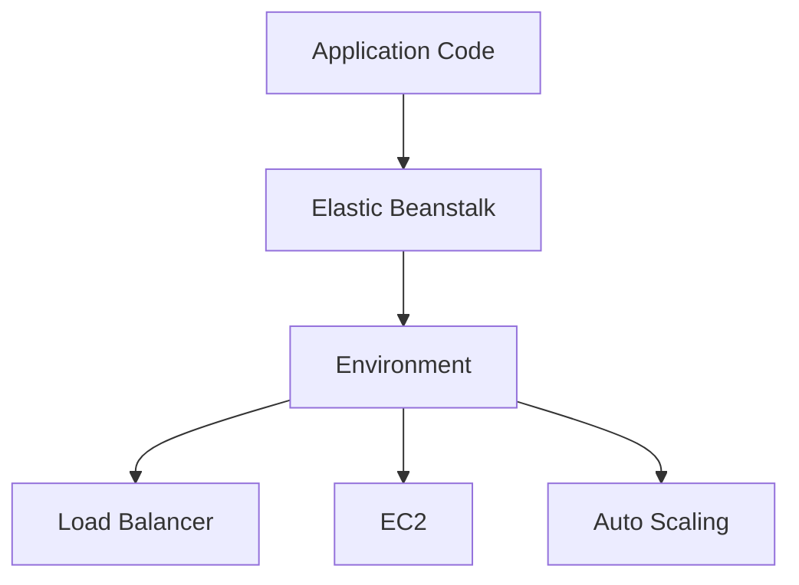

Beanstalk reduces the operational work required to deploy and manage an application environment.

You still:

- Configure the environment
- Own application behavior
- Choose deployment strategy
- Design availability
- Manage persistent application data
- Pay for the underlying AWS resources

> [!IMPORTANT]
> 🎯 **SAA Memory**
>
> ```text
> BEANSTALK
> → DEPLOY APPLICATION
> → MANAGE ENVIRONMENT
> → USE AWS RESOURCES UNDERNEATH
> ```

> [!CAUTION]
> **Managed does not automatically mean highly available.**

---

# 2. Core Architecture

The basic Beanstalk flow is:

```text
Application
    ↓
Application Version
    ↓
Environment
    ↓
AWS Resources
```

Example:

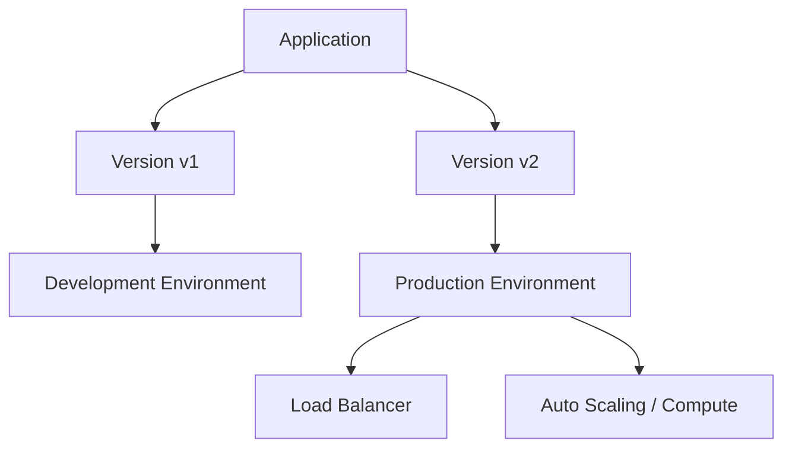

For SAA, think:

> **Elastic Beanstalk = Managed Application Platform**

It is useful when the company wants to focus on application deployment rather than manually assembling and operating all supporting infrastructure.

---

# 3. Application, Version and Environment

These three terms are fundamental.

## Application

An **Application** is the logical collection containing:

- Application versions
- Environments
- Configuration

Think:

```text
APPLICATION
→ LOGICAL CONTAINER
```

---

## Application Version

An **Application Version** is a specific deployable version of the application code.

Example:

```text
MyApp

├── Version 1
├── Version 2
└── Version 3
```

Think:

```text
APPLICATION VERSION
→ DEPLOYABLE CODE VERSION
```

---

## Environment

An **Environment** contains the resources running a deployed application version.

Example:

```text
MyApp

├── Development Environment
├── Test Environment
└── Production Environment
```

Think:

```text
ENVIRONMENT
→ RUNNING APPLICATION INFRASTRUCTURE
```

> [!IMPORTANT]
> 🧠 **SAA Memory**
>
> ```text
> APPLICATION
> → LOGICAL COLLECTION
>
> VERSION
> → DEPLOYABLE CODE
>
> ENVIRONMENT
> → RUNNING RESOURCES
> ```

---

# 4. Environment Tiers

For **Beanstalk Standard**, the familiar EC2-based model, the source distinguishes:

```text
WEB SERVER ENVIRONMENT

WORKER ENVIRONMENT
```

Web server environments can be configured as:

```text
Load-Balanced
or
Single-Instance
```

---

## Quick Comparison

| Tier / Configuration             | Purpose                     | Important Detail                  |
| -------------------------------- | --------------------------- | --------------------------------- |
| **Web Server — Load-Balanced**   | Serve HTTP requests         | Load balancing + scalable compute |
| **Web Server — Single-Instance** | Simple low-cost application | No redundant web compute          |
| **Worker**                       | Background processing       | Uses SQS-based work delivery      |

> [!NOTE]
> 🧠 **Memory**
>
> ```text
> WEB SERVER
> → HTTP REQUESTS
>
> WORKER
> → BACKGROUND JOBS
> ```

---

# 5. Web Server Environment

A load-balanced web environment can use resources such as:

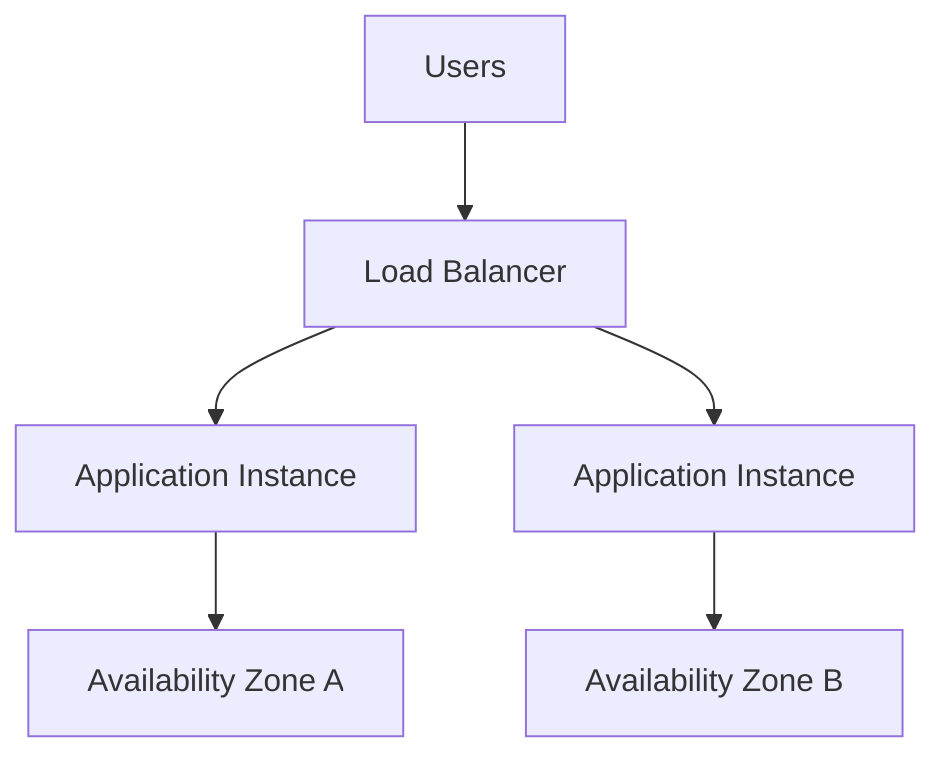

Typical responsibilities include:

```text
Receive HTTP Requests
        ↓
Load Balance
        ↓
Application Instances
        ↓
Scale Capacity
```

For high availability:

- Use suitable load-balanced configuration
- Use multiple AZs
- Maintain adequate capacity

> [!CAUTION]
> ⚠️ **Exam Trap**
>
> ```text
> BEANSTALK ENVIRONMENT
> ≠
> AUTOMATICALLY MULTI-AZ / HIGHLY AVAILABLE
> ```

The environment must be configured appropriately.

---

## Single-Instance Environment

A single-instance environment provides a simpler and lower-cost configuration.

```text
User
 ↓
Application Instance
```

But:

```text
Single Instance
→ No Redundant Web Compute
```

> [!TIP]
> 💡 **Exam Pattern**
>
> ```text
> Development / Test
> +
> Minimize Cost
> +
> HA Not Required
> ```
>
> → Consider a **Single-Instance Environment**

---

# 6. Worker Environment

A Worker Environment processes background work using SQS.

Conceptually:

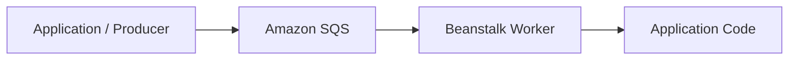

The worker daemon delivers messages to the local application for processing.

Think:

```text
WEB TIER
→ SERVE REQUESTS

WORKER TIER
→ PROCESS BACKGROUND JOBS
```

> [!IMPORTANT]
> Worker applications must still be designed for:
>
> - Retries
> - Duplicate processing
> - Idempotency where appropriate

> [!TIP]
> 💡 **Exam Pattern**
>
> ```text
> Elastic Beanstalk
> +
> Background Processing
> +
> Queue
> ```
>
> → **Worker Environment + SQS**

---

# 7. Scaling and High Availability

Beanstalk can work with AWS scaling and load-balancing capabilities.

A typical production architecture:

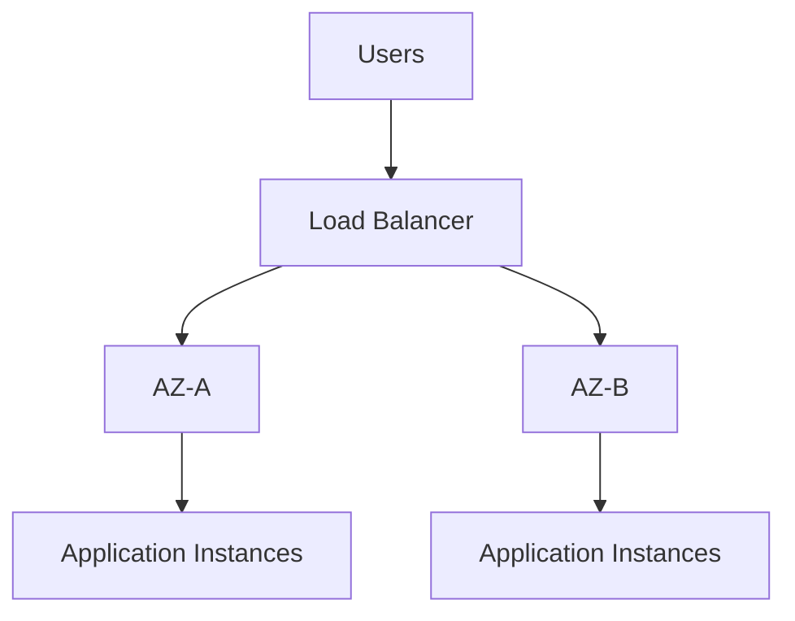

For availability, configure:

```text
Multiple AZs
+
Load Balancing
+
Adequate Capacity
```

> [!IMPORTANT]
> **Auto Scaling and Load Balancing still require appropriate configuration.**

Managed deployment does not eliminate architectural decisions.

---

# 8. Persistent Data

Beanstalk instances can be replaced.

Therefore:

> [!CAUTION]
> ⚠️ **Do not keep important application state only on local instance storage.**

Think:

```text
REPLACEABLE INSTANCE
        ↓
LOCAL DATA MAY DISAPPEAR
```

Keep important state in appropriate external services.

Examples may include:

```text
Amazon S3

Amazon RDS

Other External Persistent Stores
```

---

## RDS

For production, consider using an external RDS database with an independent lifecycle.

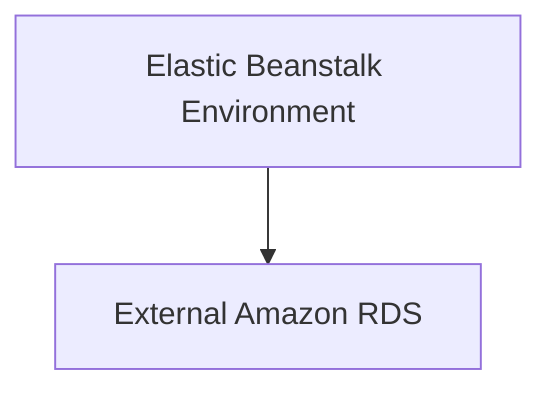

This helps decouple:

```text
APPLICATION ENVIRONMENT LIFECYCLE

from

DATABASE LIFECYCLE
```

> [!IMPORTANT]
> 🧠 **SAA Memory**
>
> ```text
> PRODUCTION DATABASE
> → PREFER INDEPENDENT LIFECYCLE
> ```

This becomes especially important for:

- Environment termination
- Blue/green deployments
- Application replacement

> [!CAUTION]
> ⚠️ **Exam Trap**
>
> Swapping or replacing a Beanstalk environment does **not** automatically migrate, undo or synchronize database changes.

---

# 9. IAM Roles

The source distinguishes two important permission concepts for Standard environments:

```text
SERVICE ROLE

EC2 INSTANCE PROFILE
```

---

## Service Role

The **Service Role** authorizes operations performed by the Beanstalk service.

Think:

```text
ELASTIC BEANSTALK SERVICE
        ↓
SERVICE ROLE
        ↓
AWS OPERATIONS
```

---

## EC2 Instance Profile

The **EC2 Instance Profile** supplies permissions used by the application instances in Standard environments.

Example:

```text
Application on EC2
       ↓
Instance Profile
       ↓
Amazon S3
```

> [!IMPORTANT]
> 🧠 **SAA Memory**
>
> ```text
> BEANSTALK SERVICE NEEDS PERMISSION
> → SERVICE ROLE
>
> APPLICATION INSTANCE NEEDS PERMISSION
> → EC2 INSTANCE PROFILE
> ```

> [!CAUTION]
> ⚠️ **Exam Trap**
>
> ```text
> Service Role
> ≠
> EC2 Instance Profile
> ```

Always identify **which actor** needs the permission.

---

# 10. Deployment Policies

This is one of the most important Beanstalk topics for SAA.

The source distinguishes:

```text
ALL AT ONCE

ROLLING

ROLLING WITH ADDITIONAL BATCH

IMMUTABLE

TRAFFIC SPLITTING

BLUE/GREEN
```

---

## Deployment Comparison

| Strategy                          | Deployment                                       | Capacity / Risk                            |
| --------------------------------- | ------------------------------------------------ | ------------------------------------------ |
| **All at Once**                   | Update all instances together                    | Fastest; brief outage expected             |
| **Rolling**                       | Update batches of existing instances             | Reduced serving capacity during deployment |
| **Rolling with Additional Batch** | Add temporary capacity before rotating instances | Maintains intended serving capacity        |
| **Immutable**                     | Create a fresh fleet                             | Safer rollback; temporary extra capacity   |
| **Traffic Splitting**             | Send a percentage of traffic to new fleet        | Canary-style validation                    |
| **Blue/Green**                    | Separate environment + CNAME swap                | Strong environment isolation               |

---

## All at Once

```text
OLD
├── v1
├── v1
└── v1

      ↓

UPDATE ALL

      ↓

NEW
├── v2
├── v2
└── v2
```

Characteristics:

```text
FAST

SIMPLE

BRIEF OUTAGE EXPECTED
```

> [!TIP]
> 💡 **Exam Pattern**
>
> ```text
> Fast Deployment
> +
> Downtime Acceptable
> ```
>
> → **All at Once**

---

## Rolling

Instances are updated in batches.

```text
Batch 1
v1 → v2

Batch 2
v1 → v2

Batch 3
v1 → v2
```

During deployment:

```text
Old Version
+
New Version
```

may coexist.

The key trade-off:

> **Available serving capacity can be reduced during each batch.**

> [!TIP]
> 💡 **Exam Pattern**
>
> ```text
> Deploy in Batches
> +
> Reduced Capacity Acceptable
> ```
>
> → **Rolling**

---

## Rolling with Additional Batch

Beanstalk adds additional capacity before updating existing instances.

```text
Current Capacity
      +
Additional Batch
      ↓
Perform Rolling Deployment
```

Think:

> **Rolling + Extra Capacity**

The important benefit:

```text
Maintain Intended Serving Capacity
During Deployment
```

> [!TIP]
> 💡 **Exam Pattern**
>
> ```text
> Rolling Deployment
> +
> Must Preserve Capacity
> ```
>
> → **Rolling with Additional Batch**

---

## Immutable

Immutable deployment creates a fresh set of instances.

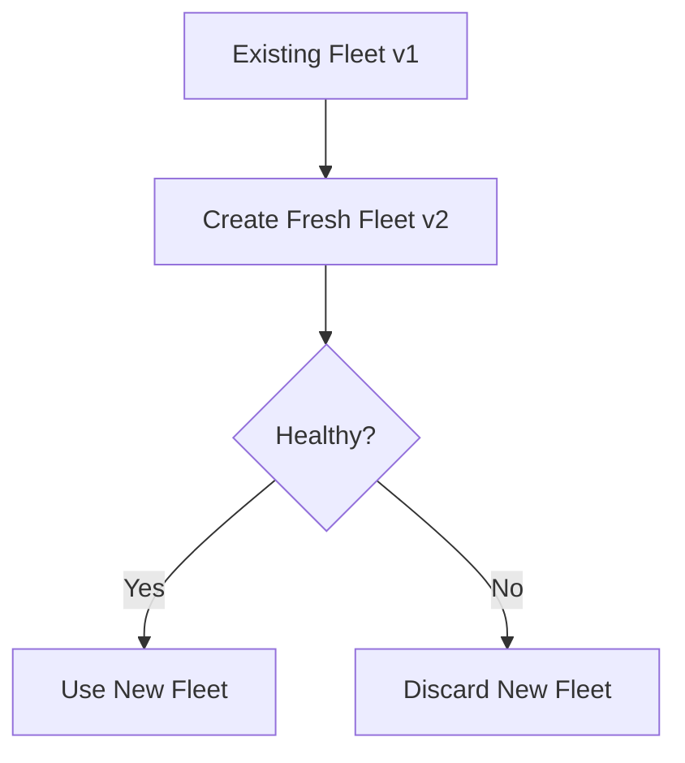

The original fleet is not updated in place.

Think:

```text
NEW INSTANCES
+
VALIDATE
+
OLD FLEET REMAINS AVAILABLE DURING DEPLOYMENT
```

> [!TIP]
> 💡 **Exam Pattern**
>
> ```text
> Safer Deployment
> +
> Fresh Instances
> +
> Easy Recovery from Failed Deployment
> ```
>
> → **Immutable**

---

## Traffic Splitting

Traffic splitting sends a configured portion of traffic to the new version/fleet.

Example:

```text
95% → Existing Version

5% → New Version
```

Think:

> **Traffic Splitting = CANARY-STYLE DEPLOYMENT**

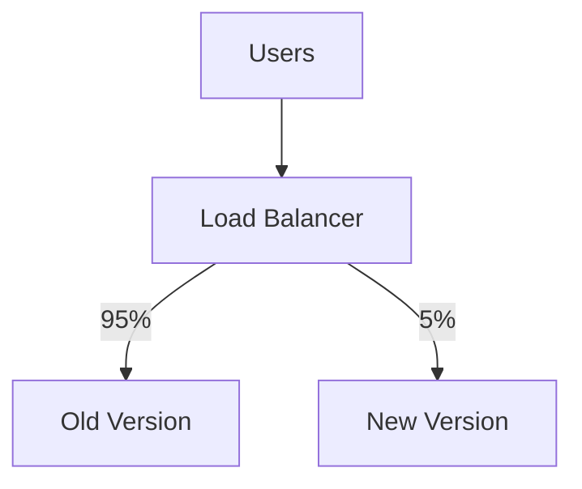

> [!TIP]
> 💡 **Exam Pattern**
>
> ```text
> Test New Version
> With Small Percentage of Real Traffic
> ```
>
> → **Traffic Splitting**

---

# 11. Blue/Green Deployment

Blue/green uses **two separate environments**.

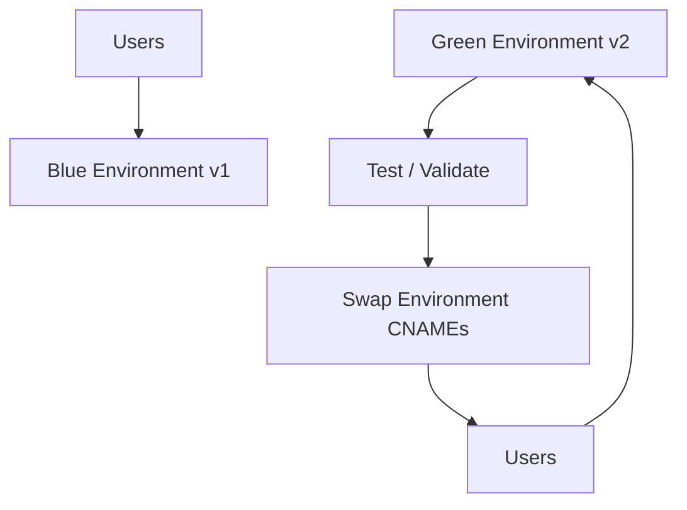

Conceptually:

```text
BLUE
→ CURRENT PRODUCTION

GREEN
→ NEW ENVIRONMENT
```

After testing:

```text
CNAME SWAP
```

routes users to the new environment.

> [!TIP]
> 💡 **Exam Pattern**
>
> ```text
> Completely Separate Environment
> +
> Test Before Production
> +
> Controlled Traffic Switch
> ```
>
> → **Blue/Green**

---

## Blue/Green vs Immutable

This is a high-value distinction.

### Immutable

```text
Same Environment Deployment
+
Fresh Instance Fleet
```

### Blue/Green

```text
Separate Environment
+
Test Independently
+
CNAME Swap
```

> [!IMPORTANT]
> 🧠 **SAA Memory**
>
> ```text
> IMMUTABLE
> → NEW FLEET
>
> BLUE/GREEN
> → NEW ENVIRONMENT
> ```

> [!CAUTION]
> ⚠️ **Exam Trap**
>
> Fresh instances during an immutable deployment do **not** mean you have created a separate blue/green environment.

---

## CNAME Swap Caveat

A CNAME swap changes application routing.

It does not automatically:

```text
Migrate Database Data

Undo Database Writes

Guarantee Schema Compatibility
```

DNS/client caching can also affect how quickly clients transition.

> [!WARNING]
> Do not terminate the old environment until traffic migration and validation are complete.

---

# 12. Beanstalk Standard vs Cluster

The source distinguishes:

```text
BEANSTALK STANDARD

BEANSTALK CLUSTER
```

This note primarily focuses on **Beanstalk Standard**, the familiar EC2-based application environment.

**Beanstalk Cluster** runs containers using EKS and has a different configuration model.

> [!WARNING]
> Do not automatically apply Standard-specific concepts such as its EC2 instance-profile and deployment details to Cluster environments.

For SAA, prioritize:

```text
BEANSTALK
→ MANAGED APPLICATION ENVIRONMENT
```

Then pay attention if the question explicitly identifies the environment model.

---

# 13. Beanstalk vs Other Services

## Beanstalk vs CloudFormation

```text
ELASTIC BEANSTALK
→ APPLICATION-ENVIRONMENT FOCUSED

CLOUDFORMATION
→ GENERAL INFRASTRUCTURE AS CODE
```

They can coexist.

> [!CAUTION]
> They are not mutually exclusive services.

---

## Beanstalk vs Lambda

```text
CONVENTIONAL WEB APPLICATION
+
MANAGED APPLICATION ENVIRONMENT
→ BEANSTALK

SHORT EVENT-DRIVEN FUNCTION
→ LAMBDA
```

> [!CAUTION]
> A sudden traffic spike alone is not sufficient to choose Lambda over Beanstalk.
>
> Consider:
>
> - Workload compatibility
> - Runtime
> - Duration
> - Scaling characteristics
> - Concurrency requirements

---

## Beanstalk vs ECS / EKS

```text
MANAGED APPLICATION DEPLOYMENT
→ BEANSTALK

DIRECT CONTAINER ORCHESTRATION CONTROL
→ ECS / EKS
```

> [!WARNING]
> Beanstalk can also support containerized applications.
>
> Therefore:
>
> ```text
> CONTAINER
> ≠ AUTOMATICALLY ECS
> ```

Look at the amount of orchestration/control required.

---

## Quick Comparison

| Requirement                             | Starting Point         |
| --------------------------------------- | ---------------------- |
| Managed conventional web app deployment | **Elastic Beanstalk**  |
| General Infrastructure as Code          | **CloudFormation**     |
| Short event-driven function             | **Lambda**             |
| Direct container orchestration          | **ECS / EKS**          |
| Background Beanstalk processing         | **Worker Environment** |

---

# 14. Decision Map

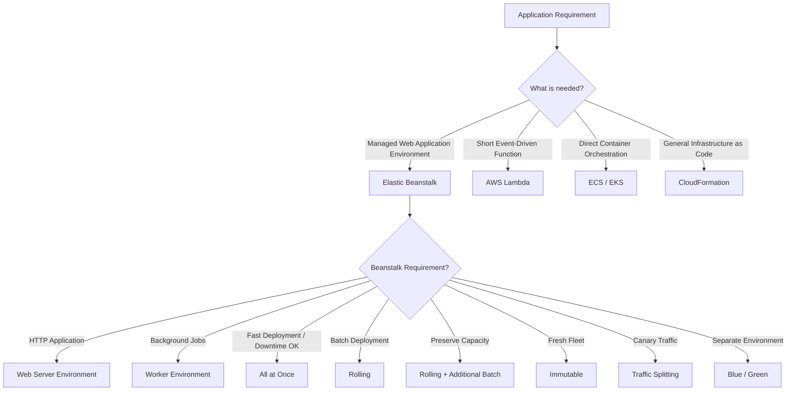

---

# 15. High-Value Exam Traps

> [!CAUTION]
> ⚠️ **Trap 1 — Managed ≠ HA**
>
> ```text
> Beanstalk Managed Environment
> ≠
> Automatically Highly Available
> ```
>
> Configure multiple AZs and adequate capacity when required.

---

> [!CAUTION]
> ⚠️ **Trap 2 — Rolling**
>
> ```text
> ROLLING
> → UPDATES BATCHES
> → CAN REDUCE SERVING CAPACITY
> ```

---

> [!CAUTION]
> ⚠️ **Trap 3 — Rolling + Additional Batch**
>
> ```text
> NEED ROLLING
> +
> PRESERVE CAPACITY
> → ADDITIONAL BATCH
> ```

---

> [!CAUTION]
> ⚠️ **Trap 4 — Immutable vs Blue/Green**
>
> ```text
> IMMUTABLE
> → FRESH FLEET
>
> BLUE/GREEN
> → SEPARATE ENVIRONMENT
> ```

---

> [!CAUTION]
> ⚠️ **Trap 5 — Traffic Splitting**
>
> ```text
> SMALL % OF REAL TRAFFIC
> → TRAFFIC SPLITTING
> ```

---

> [!CAUTION]
> ⚠️ **Trap 6 — Database**
>
> ```text
> CNAME SWAP
> ≠
> DATABASE MIGRATION
> ```
>
> Deployment strategy does not automatically make incompatible database changes safe.

---

> [!CAUTION]
> ⚠️ **Trap 7 — Persistent State**
>
> ```text
> LOCAL INSTANCE STORAGE
> ≠
> DURABLE APPLICATION STATE
> ```

---

> [!CAUTION]
> ⚠️ **Trap 8 — IAM Roles**
>
> ```text
> BEANSTALK SERVICE
> → SERVICE ROLE
>
> APPLICATION INSTANCE
> → INSTANCE PROFILE
> ```

---

> [!CAUTION]
> ⚠️ **Trap 9 — Worker Environment**
>
> ```text
> WEB REQUEST
> → WEB SERVER TIER
>
> BACKGROUND SQS JOB
> → WORKER TIER
> ```

---

> [!CAUTION]
> ⚠️ **Trap 10 — Lambda**
>
> ```text
> TRAFFIC SPIKE
> ≠
> AUTOMATICALLY LAMBDA
> ```
>
> First determine whether the workload fits Lambda's execution model.

---

> [!CAUTION]
> ⚠️ **Trap 11 — Containers**
>
> ```text
> CONTAINER
> ≠
> AUTOMATICALLY ECS / EKS
> ```
>
> Beanstalk can also support containerized applications.

---

> [!CAUTION]
> ⚠️ **Trap 12 — Old Environment**
>
> Do not terminate the old blue environment before traffic migration and validation are complete.

---

# 16. Scenario Check

## Scenario 1 — Simple Managed Web App

> A development team wants to deploy a conventional web application without manually configuring the underlying environment components.

```text
Application
    ↓
Elastic Beanstalk
```

**Answer: Elastic Beanstalk**

---

## Scenario 2 — Background Processing

> A Beanstalk application needs to process background jobs from a queue.

```text
Amazon SQS
    ↓
Beanstalk Worker Environment
```

**Answer: Worker Environment**

---

## Scenario 3 — Fast Deployment

> A development environment needs the fastest deployment and brief downtime is acceptable.

```text
Fast
+
Downtime Acceptable
       ↓
All at Once
```

**Answer: All at Once**

---

## Scenario 4 — Rolling Deployment

> A company wants to update instances in batches and can tolerate temporarily reduced serving capacity.

```text
Batch Update
+
Reduced Capacity Acceptable
        ↓
Rolling
```

**Answer: Rolling**

---

## Scenario 5 — Preserve Capacity

> A production application must deploy in batches without reducing its intended serving capacity.

```text
Rolling
+
Preserve Capacity
        ↓
Rolling with Additional Batch
```

**Answer: Rolling with Additional Batch**

---

## Scenario 6 — Fresh Fleet

> A company wants a new application version deployed to fresh instances while leaving the original fleet unchanged if the deployment fails.

```text
Fresh Fleet
+
Safe Failure Recovery
        ↓
Immutable
```

**Answer: Immutable**

---

## Scenario 7 — Canary Deployment

> A company wants to expose a small percentage of production traffic to a new application version before a full rollout.

```text
Small Traffic %
      ↓
Traffic Splitting
```

**Answer: Traffic Splitting**

---

## Scenario 8 — Separate Production Candidate

> A production application needs a fully separate environment that can be tested before receiving production traffic.

```text
Blue Environment
+
Green Environment
+
CNAME Swap
```

**Answer: Blue/Green**

---

## Scenario 9 — Persistent Database

> A production application uses RDS and environments may be replaced during blue/green deployments.

Prefer:

```text
Beanstalk Environment
        ↓
External RDS
        ↓
Independent Lifecycle
```

This avoids tightly coupling database lifetime to the application environment.

---

## Scenario 10 — Permission Problem

> The application running on the Standard environment's EC2 instances cannot read an S3 object.

Check:

```text
Application Instance
        ↓
EC2 Instance Profile
        ↓
S3 Permissions
```

Not merely the Beanstalk service role.

---

# 17. Beanstalk in 30 Seconds

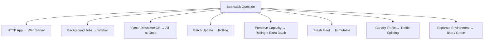

> [!NOTE]
> 🧠 **SAA Memory**
>
> **BEANSTALK → MANAGED APPLICATION ENVIRONMENT**
>
> **APPLICATION → LOGICAL COLLECTION**
>
> **VERSION → DEPLOYABLE CODE**
>
> **ENVIRONMENT → RUNNING RESOURCES**
>
> **WEB SERVER → HTTP**
>
> **WORKER → SQS BACKGROUND JOBS**
>
> **ALL AT ONCE → FAST + OUTAGE**
>
> **ROLLING → BATCHES + REDUCED CAPACITY**
>
> **ROLLING + ADDITIONAL BATCH → PRESERVE CAPACITY**
>
> **IMMUTABLE → FRESH FLEET**
>
> **TRAFFIC SPLITTING → CANARY**
>
> **BLUE/GREEN → SEPARATE ENVIRONMENT + CNAME SWAP**
>
> **SERVICE ROLE → BEANSTALK SERVICE**
>
> **INSTANCE PROFILE → APPLICATION INSTANCE**
>
> ---
>
> Fastest distinctions:
>
> ```text
> MANAGED WEB APP?
> → BEANSTALK
>
> BACKGROUND JOB?
> → WORKER ENVIRONMENT
>
> FASTEST DEPLOYMENT?
> → ALL AT ONCE
>
> DEPLOY IN BATCHES?
> → ROLLING
>
> PRESERVE CAPACITY?
> → ROLLING + ADDITIONAL BATCH
>
> NEW FLEET?
> → IMMUTABLE
>
> SMALL % OF TRAFFIC?
> → TRAFFIC SPLITTING
>
> COMPLETELY SEPARATE ENVIRONMENT?
> → BLUE/GREEN
> ```

---

# 🔗 Related Notes

## Compute

- [Compute Overview](compute_overview.md)
- [AWS Lambda](aws_lambda.md)
- [Containers](aws_containers.md)
- [EC2 Auto Scaling](aws_auto_scaling.md)
- [Elastic Load Balancing](aws_elb.md)

## Database

- [Amazon RDS](../Database/aws_rds.md)

---

# 📚 Study Order

1. Beanstalk Mental Model
2. Application vs Version vs Environment
3. Web Server vs Worker
4. High Availability
5. All at Once
6. Rolling
7. Rolling with Additional Batch
8. Immutable
9. Traffic Splitting
10. Blue/Green
11. Persistent Data / RDS
12. Service Role vs Instance Profile
13. Beanstalk vs Lambda / ECS / CloudFormation
14. Exam Traps

---

# 📚 Sources

- AWS Elastic Beanstalk — Concepts
- AWS Elastic Beanstalk — Deployment Policies
- AWS Elastic Beanstalk — Blue/Green Deployments
- AWS Elastic Beanstalk — Worker Environments
- AWS Elastic Beanstalk — Amazon RDS
- AWS Elastic Beanstalk — Cluster Architecture

---

**Reviewed:** 2026-09-24  
**Focus:** SAA-C03 application deployment, environment tiers, deployment strategies, high availability and persistent state.
