---
aliases:
  - AWS Lambda
  - Lambda
tags:
  - aws/saa
  - compute
---

# AWS Lambda — Serverless Event-Driven Compute

## 📑 Table of Contents

1. [Mental Model](#1-mental-model)
2. [Core Architecture](#2-core-architecture)
3. [Execution Model and Limits](#3-execution-model-and-limits)
4. [Invocation Models](#4-invocation-models)
5. [Error Handling and Retries](#5-error-handling-and-retries)
6. [Lambda with SQS](#6-lambda-with-sqs)
7. [Lambda with Kinesis and DynamoDB Streams](#7-lambda-with-kinesis-and-dynamodb-streams)
8. [Concurrency](#8-concurrency)
9. [Reserved vs Provisioned Concurrency](#9-reserved-vs-provisioned-concurrency)
10. [SnapStart](#10-snapstart)
11. [Permissions](#11-permissions)
12. [VPC Networking](#12-vpc-networking)
13. [Lambda and Databases](#13-lambda-and-databases)
14. [State and Storage](#14-state-and-storage)
15. [Versions and Aliases](#15-versions-and-aliases)
16. [Monitoring](#16-monitoring)
17. [Lambda vs Other Compute Services](#17-lambda-vs-other-compute-services)
18. [Decision Map](#18-decision-map)
19. [High-Value Exam Traps](#19-high-value-exam-traps)
20. [Scenario Check](#20-scenario-check)
21. [Lambda in 30 Seconds](#21-lambda-in-30-seconds)

---

# 1. Mental Model

> [!TIP]
> 🧠 **Mental Model**
>
> **AWS Lambda = Event happens → Run code**
>
> ```text
> Event
>   ↓
> Lambda
>   ↓
> Code Executes
>   ↓
> Downstream Service
> ```

AWS Lambda is serverless, event-driven compute.

AWS manages the execution infrastructure while you design:

- Function code
- Permissions
- Networking
- State
- Retries
- Concurrency
- Downstream access
- Failure handling

> [!IMPORTANT]
> 🎯 **SAA Memory**
>
> ```text
> EVENT
> → LAMBDA
> → ACTION
> ```
>
> Common examples:
>
> ```text
> API Gateway → Lambda
>
> S3 → Lambda
>
> EventBridge → Lambda
>
> SQS → Lambda
>
> DynamoDB Streams → Lambda
> ```

> [!CAUTION]
> An event being accepted does **not** necessarily mean the business operation completed successfully.

---

# 2. Core Architecture

A typical Lambda architecture:

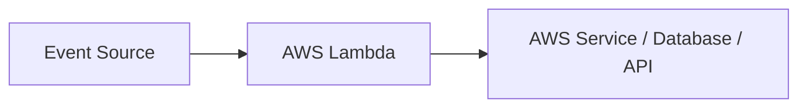

Examples:

```text
S3 Object Created
        ↓
      Lambda
        ↓
 Process File
```

```text
API Request
    ↓
API Gateway
    ↓
  Lambda
    ↓
 DynamoDB
```

```text
SQS
 ↓
Lambda
 ↓
RDS
```

Lambda automatically creates execution environments as demand increases, subject to service quotas and scaling behavior.

> [!IMPORTANT]
> **Automatic scaling ≠ unlimited concurrency**

---

# 3. Execution Model and Limits

## Maximum Execution Time

A standard Lambda invocation can run for up to:

**900 seconds = 15 minutes**

> [!CAUTION]
> ⚠️ **Exam Trap**
>
> ```text
> One uninterrupted job takes 2 hours
> → NOT standard Lambda
> ```

Consider services such as:

- ECS / Fargate
- EC2
- AWS Batch

depending on the workload.

---

## Memory and CPU

Lambda CPU allocation increases with configured memory.

Think:

```text
More Memory
     ↓
More CPU
```

Increasing memory can sometimes reduce execution time enough to reduce total cost.

> [!CAUTION]
> The smallest memory configuration is not automatically the cheapest configuration.

---

## Packaging

Lambda code can be packaged as:

```text
ZIP
or
Container Image
```

### ZIP

Dependencies can be included directly or shared using **Lambda Layers**.

### Container Image

Dependencies are packaged inside the image.

> [!CAUTION]
> ⚠️ **Exam Trap**
>
> ```text
> Lambda Container Image
> ≠
> Unlimited Container Runtime
> ```
>
> Packaging Lambda as a container image does not remove Lambda invocation limits.

---

# 4. Invocation Models

This is one of the most important Lambda topics for SAA.

There are three major models:

```text
SYNCHRONOUS

ASYNCHRONOUS

EVENT SOURCE MAPPING
```

---

## Synchronous Invocation

Think:

> **Caller waits for the response**

Examples:

- API Gateway
- Application Load Balancer
- Direct invocation

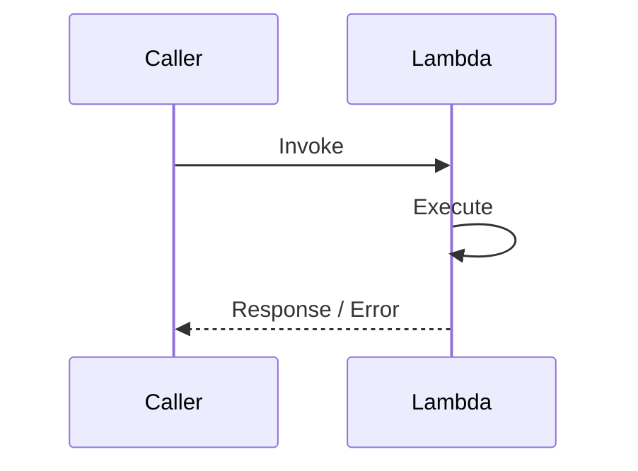

If the function fails:

```text
Lambda
 ↓
Error returned to caller
 ↓
Caller / integration decides retry behavior
```

> [!NOTE]
> 🧠 **Memory**
>
> ```text
> SYNC
> → CALLER WAITS
> ```

---

## Asynchronous Invocation

Think:

> **Event is accepted first and processed afterward**

Examples include:

- S3 notifications
- SNS
- EventBridge targets

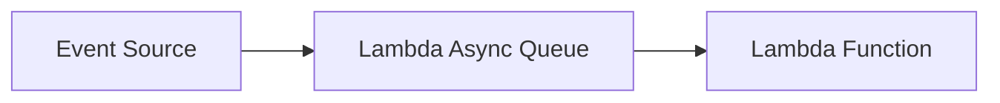

Lambda queues the event internally and manages asynchronous processing.

> [!NOTE]
> 🧠 **Memory**
>
> ```text
> ASYNC
> → LAMBDA QUEUES EVENT
> ```

---

## Event Source Mapping

Lambda can also read/poll records from supported event sources.

Important examples:

```text
SQS

Kinesis Data Streams

DynamoDB Streams
```

Architecture:

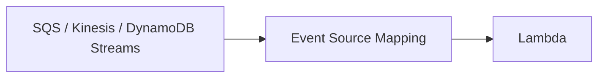

> [!IMPORTANT]
> 🎯 **Don't Confuse**
>
> ```text
> S3 / SNS / EventBridge
> → ASYNC INVOCATION
>
> SQS / Kinesis / DynamoDB Streams
> → EVENT SOURCE MAPPING
> ```

---

## Quick Comparison

| Model                    | Examples                       | Who manages delivery/retry behavior? |
| ------------------------ | ------------------------------ | ------------------------------------ |
| **Synchronous**          | API Gateway, ALB, direct       | Caller / integration                 |
| **Asynchronous**         | S3, SNS, EventBridge           | Lambda async processing              |
| **Event Source Mapping** | SQS, Kinesis, DynamoDB Streams | Lambda reads source                  |

> [!IMPORTANT]
> 🧠 **SAA Memory**
>
> ```text
> SYNC
> → CALL ME AND WAIT
>
> ASYNC
> → SEND EVENT AND CONTINUE
>
> EVENT SOURCE MAPPING
> → LAMBDA READS SOURCE
> ```

---

# 5. Error Handling and Retries

Retry behavior depends on the invocation model.

This is critical.

---

## Synchronous Failure

```text
Caller
 ↓
Lambda
 ↓
ERROR
 ↓
Caller
```

The caller or integrating service decides whether to retry.

---

## Asynchronous Failure

For asynchronous **function errors**, Lambda retries twice by default.

Conceptually:

```text
Event
 ↓
Attempt 1 ❌
 ↓
Retry 1 ❌
 ↓
Retry 2 ❌
 ↓
Failure Handling
```

Throttling and system errors have different retry behavior and are governed by configuration such as event age.

After retries are exhausted, configure appropriate failure handling such as:

```text
On-Failure Destination

or

Async DLQ
```

---

## Destinations vs Async DLQ

Conceptually:

```text
Destination
→ Invocation record

Async DLQ
→ Failed event
```

> [!CAUTION]
> ⚠️ **Exam Trap**
>
> Lambda's asynchronous invocation DLQ is **not the same thing** as an SQS source queue's redrive DLQ.

---

## Idempotency

Duplicate processing is possible.

Therefore:

> **Lambda workloads should often be designed to be idempotent.**

Example:

```text
Payment Event
     ↓
Lambda executes
     ↓
Timeout occurs
     ↓
Retry
```

The timeout does not prove the payment operation failed.

Without idempotency:

```text
Payment processed twice
```

> [!IMPORTANT]
> 🎯 **SAA Memory**
>
> ```text
> RETRIES
> → DUPLICATES POSSIBLE
> → IDEMPOTENCY
> ```

---

# 6. Lambda with SQS

This is one of the highest-value Lambda integrations for SAA.

Architecture:

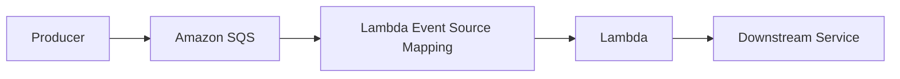

Lambda polls the queue using an **event source mapping**.

> [!CAUTION]
> ⚠️ **Exam Trap**
>
> SQS processing is asynchronous from the application's perspective, but:
>
> ```text
> SQS → Lambda
> ```
>
> uses an **Event Source Mapping**, not Lambda's asynchronous invocation queue.

---

## Successful Message

```text
SQS Message
    ↓
Lambda Processes Successfully
    ↓
Message Deleted
```

---

## Failed Message

```text
SQS Message
    ↓
Lambda Fails
    ↓
Visibility Timeout Expires
    ↓
Message Available Again
```

---

## Visibility Timeout

The visibility timeout must allow Lambda enough time to process the message.

The source note uses the AWS recommendation:

```text
Visibility Timeout
≥
6 × Lambda Function Timeout
+
Batching Window
```

> [!TIP]
> 💡 **Exam Pattern**
>
> If messages become visible again while processing is still happening:
>
> → Check the **SQS visibility timeout**

---

## Partial Batch Responses

Suppose Lambda receives:

```text
Message A ✅
Message B ✅
Message C ❌
Message D ✅
```

Without appropriate partial failure handling, successful work may be retried unnecessarily.

With partial batch responses:

```text
A → Success
B → Success
C → Retry
D → Success
```

> [!IMPORTANT]
> 🎯 **SAA Memory**
>
> ```text
> ONE MESSAGE FAILS IN BATCH
> → PARTIAL BATCH RESPONSE
> ```

Combine this with **idempotent processing**.

---

## SQS DLQ

For repeatedly failing SQS messages, configure:

```text
Source Queue
    ↓
Redrive Policy
    ↓
DLQ
```

> [!CAUTION]
> ⚠️ **Exam Trap**
>
> ```text
> SQS → Lambda
> ```
>
> Persistent bad messages:
>
> → **SQS redrive policy / SQS DLQ**
>
> Not the Lambda asynchronous-invocation DLQ.

---

## Buffering Bursts

SQS is useful between producers and Lambda when you need to absorb sudden traffic.

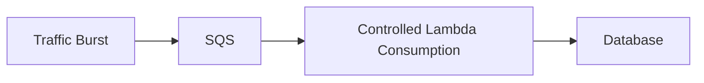

Think:

> **SQS = BUFFER**

This can protect downstream systems.

> [!TIP]
> 💡 **Exam Pattern**
>
> ```text
> Sudden Burst
> +
> Lambda
> +
> Database Must Be Protected
> ```
>
> → **SQS + controlled Lambda consumption**

---

# 7. Lambda with Kinesis and DynamoDB Streams

Kinesis and DynamoDB Streams also use event source mappings.

```text
Kinesis
   ↓
Lambda

DynamoDB Streams
   ↓
Lambda
```

Processing follows shard/checkpoint semantics.

---

## Ordering

Ordering is maintained:

```text
PER SHARD
```

Not globally across every shard.

> [!CAUTION]
> ⚠️ **Exam Trap**
>
> ```text
> Multiple Shards
> ≠
> One Global Ordering
> ```

---

## Failed Records

A bad record can delay progress through a shard.

Depending on the source and configuration, supported strategies include:

- Retry limits
- Partial failure handling
- Batch splitting

---

# 8. Concurrency

Concurrency means:

> **How many Lambda executions are running at the same time?**

For ordinary request processing, a useful approximation is:

```text
Concurrency
≈
Requests per Second
×
Average Duration in Seconds
```

Example:

```text
200 requests/sec
×
0.5 sec
=
~100 concurrent executions
```

> [!NOTE]
> This is a sizing estimate.
>
> Actual behavior is also affected by:
>
> - Service quotas
> - Scaling rates
> - Burst behavior
> - Event-source configuration

---

## Why Concurrency Matters

Lambda can scale quickly.

But downstream services might not.

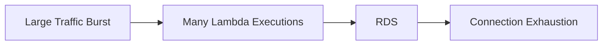

> [!CAUTION]
> ⚠️ **Exam Trap**
>
> ```text
> Lambda scales automatically
> ≠
> Database scales automatically
> ```

---

# 9. Reserved vs Provisioned Concurrency

This is one of the most important Lambda distinctions.

---

## Reserved Concurrency

Reserved concurrency:

```text
ALLOCATES
+
CAPS
```

the concurrency available to a function.

Example:

```text
Reserved Concurrency = 100

Function
→ Maximum 100 concurrent executions
```

Think:

> **Reserved = RESERVE + LIMIT**

Useful for:

- Guaranteeing capacity for a function
- Preventing one function from consuming excessive concurrency
- Protecting downstream systems

Setting:

```text
Reserved Concurrency = 0
```

effectively throttles the function.

> [!CAUTION]
> Reserved concurrency does **not** pre-initialize execution environments.

Therefore:

```text
Reserved Concurrency
≠
Cold Start Solution
```

---

## Provisioned Concurrency

Provisioned concurrency prepares initialized execution environments in advance.

```text
Provisioned Environments
        ↓
Ready Before Request
        ↓
Lower Startup Latency
```

Think:

> **Provisioned = PRE-WARMED**

Useful for latency-sensitive workloads.

> [!TIP]
> 💡 **Exam Pattern**
>
> ```text
> Lambda
> +
> Predictable Traffic
> +
> Minimize Cold Starts
> ```
>
> → **Provisioned Concurrency**

---

## Reserved vs Provisioned

| Requirement                      | Reserved | Provisioned |
| -------------------------------- | -------: | ----------: |
| Reserve concurrency capacity     |       ✅ |          ❌ |
| Cap maximum function concurrency |       ✅ |          ❌ |
| Pre-initialize environments      |       ❌ |          ✅ |
| Reduce cold-start latency        |       ❌ |          ✅ |
| Additional provisioned cost      |        — |          ✅ |

> [!IMPORTANT]
> 🧠 **SAA Memory**
>
> ```text
> RESERVED
> → RESERVE + CAP
>
> PROVISIONED
> → PRE-WARM
> ```

> [!CAUTION]
> Provisioned concurrency is not itself a maximum concurrency setting.
>
> Traffic beyond provisioned capacity may use on-demand execution if capacity permits.

---

# 10. SnapStart

SnapStart reduces initialization latency using snapshots for supported runtimes/configurations.

Conceptually:

```text
Initialize Function
       ↓
Create Snapshot
       ↓
Future Environment
       ↓
Restore Snapshot
```

Think:

> **SnapStart = Restore initialized state instead of initializing from scratch**

> [!CAUTION]
> SnapStart has runtime/configuration compatibility requirements.
>
> It cannot be combined with provisioned concurrency on the same function version.

---

# 11. Permissions

There are two very different permission questions.

---

## Execution Role

The execution role answers:

> **What can the Lambda function do?**

Example:

```text
Lambda
 ↓
Execution Role
 ↓
S3 GetObject
```

Typical permissions:

- Read S3
- Write DynamoDB
- Access Secrets Manager
- Write logs
- Call other AWS services

Think:

> **Execution Role = Lambda → AWS**

---

## Invocation Permission

Invocation permissions answer:

> **Who can invoke Lambda?**

Example:

```text
S3
 ↓
Lambda Resource Policy
 ↓
Lambda
```

Think:

> **Resource Policy = AWS Service / Caller → Lambda**

---

## Don't Confuse

> [!IMPORTANT]
> 🧠 **SAA Memory**
>
> ```text
> WHAT CAN LAMBDA DO?
> → Execution Role
>
> WHO CAN CALL LAMBDA?
> → Resource Policy / Invocation Permission
> ```

> [!CAUTION]
> Giving Lambda permission to read S3 does **not** automatically give S3 permission to invoke Lambda.

These are opposite permission directions.

---

# 12. VPC Networking

By default, Lambda can access supported public AWS service endpoints and the internet through its managed networking.

If Lambda needs to reach resources inside your VPC:

```text
RDS
ElastiCache
Private EC2
Internal Services
```

configure VPC connectivity with suitable:

- Subnets
- Security Groups

Architecture:

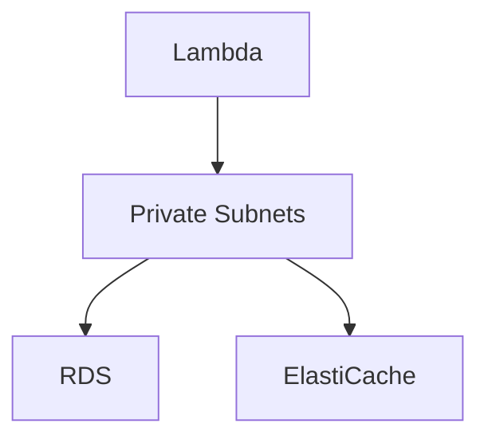

---

## Internet Access from VPC-Connected Lambda

This is a classic exam trap.

> [!CAUTION]
> ⚠️ **Exam Trap**
>
> Putting a Lambda function in a **public subnet does not give it a public IPv4 address**.

A common IPv4 architecture is:

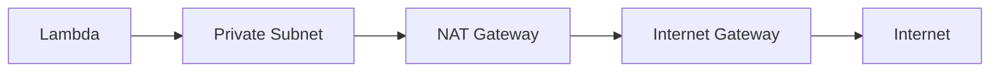

Think:

```text
VPC Lambda
+
Internet Access
        ↓
Private Subnet
+
NAT Gateway
```

---

## VPC Endpoints

For supported AWS services, private connectivity can use VPC endpoints.

Example:

```text
Lambda
 ↓
VPC Endpoint
 ↓
Supported AWS Service
```

This can avoid routing that service traffic through a NAT Gateway.

---

# 13. Lambda and Databases

Lambda can create many concurrent executions very quickly.

Relational databases usually have connection limits.

Problem:

```text
1000 Lambda Executions
        ↓
1000 DB Connections
        ↓
RDS Overload
```

Potential architecture:

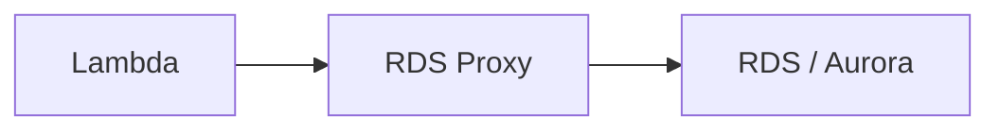

RDS Proxy pools and manages database connections.

> [!TIP]
> 💡 **Exam Pattern**
>
> ```text
> Lambda
> +
> RDS
> +
> Too Many Connections
> ```
>
> → **RDS Proxy**

> [!CAUTION]
> RDS Proxy does not make the database infinitely scalable.

---

## Secrets

Database credentials should not simply be hardcoded.

For rotating credentials:

```text
AWS Secrets Manager
```

> [!CAUTION]
> Encrypted Lambda environment variables protect stored values, but do not themselves provide credential rotation.

---

# 14. State and Storage

Lambda functions should generally be treated as **stateless**.

Execution environments can sometimes be reused.

But:

> **Reuse is not guaranteed.**

Therefore authoritative state should be stored externally.

Examples:

```text
Amazon S3
DynamoDB
RDS / Aurora
EFS
```

---

## `/tmp`

Lambda provides temporary local storage.

Think:

```text
/tmp
→ SCRATCH / TEMPORARY
```

Useful for:

- Temporary files
- Intermediate processing
- Reusable local cache when an environment happens to be reused

> [!CAUTION]
> `/tmp` should not be the only durable copy of important data.

---

## EFS

Lambda can use EFS for shared persistent file storage with appropriate networking and permissions.

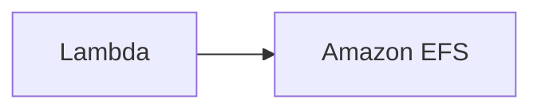

Think:

```text
Shared Persistent Files
→ EFS
```

---

# 15. Versions and Aliases

## Versions

Published Lambda versions are immutable snapshots of code/configuration.

```text
Version 1
Version 2
Version 3
```

Think:

> **Version = Immutable Release**

---

## Aliases

Aliases provide stable names pointing to versions.

Example:

```text
PROD
 ↓
Version 5
```

Aliases can also support weighted traffic shifting between two versions.

```text
PROD
 ├── 90% → Version 5
 └── 10% → Version 6
```

Useful for gradual deployments.

> [!TIP]
> 💡 **Exam Pattern**
>
> ```text
> Gradually Send Some Lambda Traffic to New Version
> ```
>
> → **Versions + Alias Traffic Shifting**

---

# 16. Monitoring

Amazon CloudWatch provides Lambda metrics such as:

- Invocations
- Errors
- Duration
- Throttles
- Concurrency

Logs can also be sent to CloudWatch Logs with appropriate permissions.

Think:

```text
Lambda
→ EXECUTE

CloudWatch
→ OBSERVE
```

Distributed tracing can help identify latency across dependencies.

---

## Don't Monitor Only Function Errors

For asynchronous architectures, also monitor upstream backlog.

Example:

```text
SQS
 ↓
100,000 Messages Waiting
 ↓
Lambda Errors = 0
```

The system can still have a serious problem.

Monitor:

```text
Queue Backlog
Event Age
Concurrency
Throttles
Errors
Duration
```

> [!IMPORTANT]
> A quiet Lambda function does not necessarily mean there is no work waiting upstream.

---

# 17. Lambda vs Other Compute Services

| Requirement                       | Starting Point                         |
| --------------------------------- | -------------------------------------- |
| Event-driven short-lived code     | **Lambda**                             |
| Simple direct HTTP endpoint       | **Lambda Function URL**                |
| API routing/auth/management       | **API Gateway + Lambda**               |
| Long-running container workload   | **ECS / Fargate**                      |
| Long-running VM workload          | **EC2**                                |
| Batch processing / job scheduling | **AWS Batch**                          |
| Buffer asynchronous bursts        | **SQS + Lambda**                       |
| CloudFront edge customization     | **CloudFront Functions / Lambda@Edge** |

---

## Lambda vs ECS / Fargate

```text
Event-Driven
+
Short-Lived
+
No Server Management
→ Lambda
```

versus:

```text
Long-Running Process
+
Container Workload
→ ECS / Fargate
```

---

## Lambda vs AWS Batch

```text
Event-Driven Function
→ Lambda

Scheduled / Resource-Intensive Batch Job
→ AWS Batch
```

---

## Lambda Function URL vs API Gateway

```text
Simple HTTP Endpoint
→ Lambda Function URL

API Management
+
Routing
+
Authorization Features
+
API Controls
→ API Gateway
```

---

# 18. Decision Map

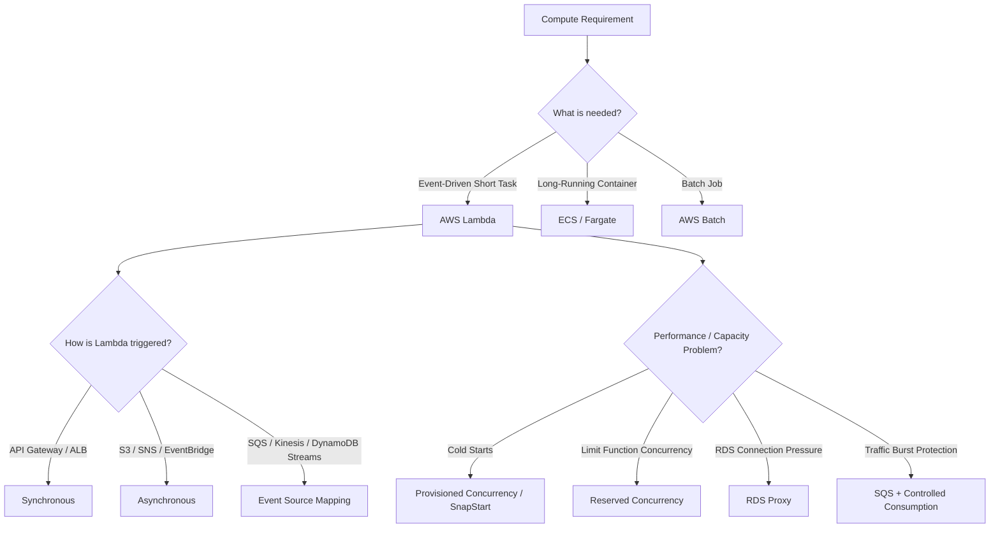

---

# 19. High-Value Exam Traps

> [!CAUTION]
> ⚠️ **Trap 1 — 15 Minutes**
>
> ```text
> Standard Lambda Invocation
> → Maximum 15 Minutes
> ```

---

> [!CAUTION]
> ⚠️ **Trap 2 — SQS**
>
> ```text
> SQS → Lambda
> ```
>
> uses an **event source mapping**, not Lambda's internal asynchronous invocation queue.

---

> [!CAUTION]
> ⚠️ **Trap 3 — Reserved Concurrency**
>
> ```text
> RESERVED
> → RESERVE + CAP
> ```
>
> It does not eliminate cold starts.

---

> [!CAUTION]
> ⚠️ **Trap 4 — Provisioned Concurrency**
>
> ```text
> PROVISIONED
> → PRE-WARM
> ```
>
> It does not automatically cap maximum concurrency.

---

> [!CAUTION]
> ⚠️ **Trap 5 — Public Subnet**
>
> ```text
> Lambda in Public Subnet
> ≠
> Lambda Gets Public IPv4
> ```

---

> [!CAUTION]
> ⚠️ **Trap 6 — Execution Role**
>
> ```text
> Execution Role
> → What Lambda Can Do
>
> Resource Policy
> → Who Can Invoke Lambda
> ```

---

> [!CAUTION]
> ⚠️ **Trap 7 — Retries**
>
> ```text
> Retry
> → Duplicate Processing Possible
> ```
>
> Design idempotent side effects.

---

> [!CAUTION]
> ⚠️ **Trap 8 — Timeout**
>
> A Lambda timeout does not prove a downstream operation failed.
>
> The downstream write may already have completed.

---

> [!CAUTION]
> ⚠️ **Trap 9 — SQS DLQ**
>
> ```text
> SQS Source Message Keeps Failing
> → SQS Redrive Policy / DLQ
> ```
>
> Do not confuse it with Lambda's asynchronous invocation DLQ.

---

> [!CAUTION]
> ⚠️ **Trap 10 — Auto Scaling**
>
> Lambda can scale faster than a downstream database.
>
> Control concurrency and manage connections appropriately.

---

> [!CAUTION]
> ⚠️ **Trap 11 — Container Image**
>
> ```text
> Lambda Container Image
> ≠
> ECS Container
> ```
>
> Lambda execution limits still apply.

---

> [!CAUTION]
> ⚠️ **Trap 12 — State**
>
> ```text
> Execution Environment
> /tmp
> ```
>
> should not be treated as the authoritative durable state.

---

# 20. Scenario Check

## Scenario 1 — Sudden API Traffic

> An API receives unpredictable bursts of requests lasting only a few seconds and requires serverless compute.

```text
API Gateway
     ↓
Lambda
```

Strong fit for event-driven serverless execution.

---

## Scenario 2 — Two-Hour Job

> A processing job runs continuously for two hours.

```text
2 Hours
>
15 Minutes
```

Not a standard single Lambda invocation.

Consider:

```text
ECS / Fargate
AWS Batch
EC2
```

depending on the workload.

---

## Scenario 3 — Cold Starts

> A latency-sensitive API receives predictable traffic and must minimize Lambda initialization latency.

```text
Cold Start Problem
        ↓
Provisioned Concurrency
```

---

## Scenario 4 — Protect Database

> Lambda automatically scales during traffic spikes and overwhelms an RDS database with connections.

```text
Lambda
 ↓
RDS Proxy
 ↓
RDS
```

Also consider concurrency controls when appropriate.

---

## Scenario 5 — SQS Batch Failure

> One message in an SQS batch fails while the others already updated records successfully.

```text
SQS Batch
├── A ✅
├── B ✅
├── C ❌
└── D ✅
```

Use:

```text
Partial Batch Responses
+
Idempotent Processing
```

Persistently failing messages should use the queue's redrive policy/DLQ.

---

## Scenario 6 — VPC Internet Access

> A Lambda function connected to a VPC must access both a private RDS database and a public external API over IPv4.

```text
Lambda
 ↓
Private Subnet
 ↓
NAT Gateway
 ↓
Internet Gateway
 ↓
External API
```

Putting Lambda in a public subnet alone does not provide public IPv4 internet access.

---

## Scenario 7 — S3 Permission

> Lambda needs to read objects from S3.

```text
Lambda
 ↓
Execution Role
 ↓
s3:GetObject
```

---

## Scenario 8 — S3 Invokes Lambda

> An S3 bucket must invoke Lambda after an object is uploaded.

```text
S3
 ↓
Invocation Permission
 ↓
Lambda
```

Do not confuse this with Lambda's execution role.

---

## Scenario 9 — Buffer a Burst

> Thousands of events arrive suddenly, but the downstream database can process only a limited number at once.

```text
Producer
 ↓
SQS
 ↓
Controlled Lambda Consumption
 ↓
Database
```

Think:

> **BUFFER + CONTROL**

---

# 21. Lambda in 30 Seconds

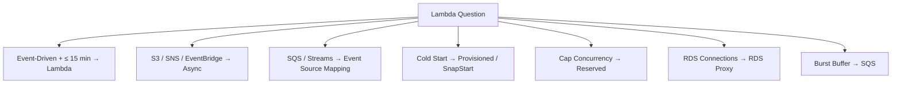

> [!NOTE]
> 🧠 **SAA Memory**
>
> **LAMBDA → EVENT-DRIVEN SERVERLESS**
>
> **MAX INVOCATION → 15 MINUTES**
>
> **SYNC → CALLER WAITS**
>
> **ASYNC → LAMBDA QUEUES EVENT**
>
> **SQS / KINESIS / DDB STREAMS → EVENT SOURCE MAPPING**
>
> **RESERVED → RESERVE + CAP**
>
> **PROVISIONED → PRE-WARM**
>
> **EXECUTION ROLE → WHAT LAMBDA CAN DO**
>
> **RESOURCE POLICY → WHO CAN INVOKE LAMBDA**
>
> **SQS → BUFFER**
>
> **RDS PROXY → CONNECTION POOL**
>
> **/tmp → TEMPORARY**
>
> **EFS → SHARED PERSISTENT FILES**
>
> ---
>
> Fastest distinctions:
>
> ```text
> LIMIT CONCURRENCY?
> → RESERVED
>
> REDUCE COLD STARTS?
> → PROVISIONED / SNAPSTART
>
> TOO MANY DB CONNECTIONS?
> → RDS PROXY
>
> BUFFER BURST?
> → SQS
>
> LONGER THAN 15 MIN?
> → OTHER COMPUTE
> ```

---

# 🔗 Related Notes

## Compute

- [Compute Overview](compute_overview.md)
- [AWS Batch](aws_batch.md)
- [AWS Containers](aws_containers.md)
- [Amazon EC2](aws_ec2.md)

## Integration

- [Amazon API Gateway](../Integration/aws_apigateway.md)
- [Amazon Kinesis](../Integration/aws_kinesis.md)

## Database

- [Amazon DynamoDB](../Database/aws_dynamodb.md)
- [Amazon RDS](../Database/aws_rds.md)

## Storage

- [Amazon EFS](../Storage/aws_efs.md)

---

# 📚 Study Order

1. Lambda Mental Model
2. 15-Minute Limit
3. Sync vs Async vs Event Source Mapping
4. SQS + Lambda
5. Retry + Idempotency
6. Reserved vs Provisioned Concurrency
7. Execution Role vs Invocation Permission
8. VPC Networking
9. Lambda + RDS Proxy
10. State and Storage
11. Versions + Aliases
12. Exam Traps

---

# 📚 Sources

- AWS Lambda — Quotas
- AWS Lambda — Retry Behavior
- AWS Lambda — Asynchronous Error Handling
- AWS Lambda — Using Lambda with Amazon SQS
- AWS Lambda — SQS Event Source Mapping Configuration
- AWS Lambda — Concurrency
- AWS Lambda — SnapStart
- AWS Lambda — VPC Internet Access
- AWS Lambda — Permissions

---

**Reviewed:** 2026-09-24  
**Focus:** SAA-C03 event-driven compute, invocation models, SQS integration, concurrency, networking and permissions.
