---
aliases:
  - AWS Glue
  - Glue
  - AWS Glue Data Catalog
tags:
  - aws/saa
  - data
---

# AWS Glue — Serverless Data Integration & ETL

## 📑 Table of Contents

1. [Mental Model](#1-mental-model)
2. [Core Architecture](#2-core-architecture)
3. [AWS Glue Data Catalog](#3-aws-glue-data-catalog)
4. [Glue Crawlers](#4-glue-crawlers)
5. [Classifiers](#5-classifiers)
6. [Glue ETL Jobs](#6-glue-etl-jobs)
7. [Job Bookmarks](#7-job-bookmarks)
8. [DynamicFrames](#8-dynamicframes)
9. [Glue Connections](#9-glue-connections)
10. [Common Architectures](#10-common-architectures)
11. [Event-Driven ETL](#11-event-driven-etl)
12. [Glue Studio](#12-glue-studio)
13. [Glue DataBrew](#13-glue-databrew)
14. [Glue Schema Registry](#14-glue-schema-registry)
15. [Security](#15-security)
16. [Monitoring](#16-monitoring)
17. [Glue vs Other Services](#17-glue-vs-other-services)
18. [Decision Map](#18-decision-map)
19. [High-Value Exam Traps](#19-high-value-exam-traps)
20. [Scenario Check](#20-scenario-check)
21. [Glue in 30 Seconds](#21-glue-in-30-seconds)

---

# 1. Mental Model

> [!TIP]
> 🧠 **Mental Model**
>
> **AWS Glue = Serverless Data Integration / ETL**
>
> ```text
> DISCOVER
>    ↓
> CATALOG
>    ↓
> TRANSFORM
>    ↓
> LOAD
> ```

The core Glue architecture is:

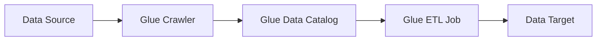

> [!IMPORTANT]
> 🎯 **SAA Memory**
>
> ```text
> CRAWLER
> → DISCOVER SCHEMA
>
> DATA CATALOG
> → STORE METADATA
>
> ETL JOB
> → TRANSFORM DATA
>
> JOB BOOKMARK
> → REMEMBER PROCESSING STATE
> ```

AWS Glue is commonly used to:

- Discover data
- Catalog metadata
- Transform datasets
- Prepare data for analytics
- Build serverless ETL pipelines

---

# 2. Core Architecture

ETL means:

```text
EXTRACT
→ Read data

TRANSFORM
→ Clean / convert / enrich

LOAD
→ Write to target
```

Common data stores include:

- Amazon S3
- Amazon RDS
- Amazon Redshift
- Amazon DynamoDB
- JDBC-compatible databases

Example:

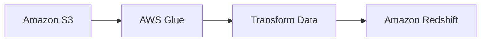

> [!TIP]
> 🎯 **Exam Pattern**
>
> ```text
> Serverless ETL
> +
> Transform Large Datasets
> +
> Minimal Infrastructure Management
> ```
>
> → **AWS Glue**

---

# 3. AWS Glue Data Catalog

The **AWS Glue Data Catalog** is a centralized metadata repository.

It can store metadata such as:

- Databases
- Tables
- Columns
- Schemas
- Partitions
- Data locations

Example:

```text
Amazon S3

sales/
└── orders.parquet
        ↑
        │ describes
        │
Glue Data Catalog

Database: sales_db
└── Table: orders
    ├── order_id
    ├── customer_id
    └── amount
```

> [!IMPORTANT]
> **The Glue Data Catalog stores METADATA, not the actual data.**

Think:

```text
S3
→ DATA

GLUE DATA CATALOG
→ METADATA ABOUT THE DATA
```

---

## Glue Data Catalog + Athena

Athena can use the Glue Data Catalog for table/schema metadata.


The responsibilities are different:

```text
Glue Data Catalog
→ WHERE / WHAT is the data?

Athena
→ QUERY the data
```

> [!TIP]
> 🎯 **Exam Pattern**
>
> ```text
> Query S3 Using SQL
> → Athena
>
> Automatically Discover S3 Schema
> → Glue Crawler
>
> Store Table Metadata
> → Glue Data Catalog
> ```

---

# 4. Glue Crawlers

A **Glue Crawler** scans data sources and discovers metadata.

It can identify:

- Data format
- Schema
- Columns
- Partitions
- Table metadata

Then it writes discovered metadata to the:

**Glue Data Catalog**


Crawlers can run:

- On demand
- On a schedule

For stable incremental datasets, incremental crawling can process newly added folders rather than crawling everything again.

> [!TIP]
> 🎯 **Exam Pattern**
>
> ```text
> Automatically Discover Schema
> ```
>
> → **Glue Crawler**

> [!CAUTION]
> ⚠️ **Exam Trap**
>
> ```text
> Crawler
> → DISCOVERS metadata
>
> Data Catalog
> → STORES metadata
> ```
>
> The Crawler is not the metadata repository.

---

# 5. Classifiers

A **Classifier** helps a Glue Crawler determine the structure/schema of data.

Glue provides built-in classifiers.

Custom classifiers can also be created for formats such as:

- CSV
- JSON
- XML
- Grok

Mental model:

```text
Crawler
   ↓
Classifier
   ↓
"What format/schema is this?"
   ↓
Data Catalog
```

> [!NOTE]
> 🧠 **Memory**
>
> ```text
> CRAWLER
> → DISCOVER
>
> CLASSIFIER
> → INTERPRET FORMAT / SCHEMA
> ```

---

# 6. Glue ETL Jobs

A **Glue ETL Job** performs the actual data processing.

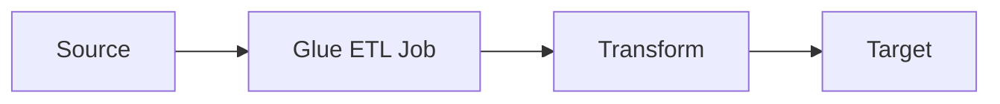

Common transformations include:

- Clean
- Filter
- Join
- Map
- Convert formats
- Flatten
- Enrich

Common job types in the source note include:

- Apache Spark
- Streaming ETL
- Python shell

> [!TIP]
> 🎯 **Exam Pattern**
>
> ```text
> Transform Large Dataset
> +
> Serverless
> ```
>
> → **Glue ETL Job**

---

## Crawler vs ETL Job

This distinction is essential:

| Component   | Purpose                  |
| ----------- | ------------------------ |
| **Crawler** | Discover schema/metadata |
| **ETL Job** | Transform/process data   |

Think:

```text
CRAWLER
→ Understand the data

JOB
→ Change the data
```

> [!CAUTION]
> A Crawler does not perform the ETL transformation itself.

---

# 7. Job Bookmarks

**Job Bookmarks maintain processing state.**

They help Glue remember which data has already been processed.

Example:

```text
FIRST RUN

Files 1 → 100
      ↓
Processed ✅


SECOND RUN

Files 1 → 100
      ↓
Skip

Files 101 → 120
      ↓
Process ✅
```

Useful for:

- Incremental ETL
- Preventing unnecessary reprocessing
- Processing only new data

> [!TIP]
> 🎯 **Exam Pattern**
>
> ```text
> Process Only New Data
>
> Avoid Reprocessing Old Data
> ```
>
> → **Glue Job Bookmarks**

---

## Crawler vs Job Bookmark

> [!IMPORTANT]
> 🧠 **Don't Confuse**
>
> ```text
> CRAWLER
> → DISCOVERS / CATALOGS DATA
>
> JOB BOOKMARK
> → REMEMBERS PROCESSING STATE
> ```

> [!CAUTION]
> ⚠️ **Exam Trap**
>
> If the requirement says:
>
> **"Do not process previously processed data again"**
>
> think:
>
> **Job Bookmark**, not Crawler.

---

# 8. DynamicFrames

A **DynamicFrame** is an AWS Glue data abstraction designed for ETL.

It is useful for:

- Semi-structured data
- Nested data
- Schema inconsistencies
- Data cleaning/transformation

Each record can contain its own schema information.

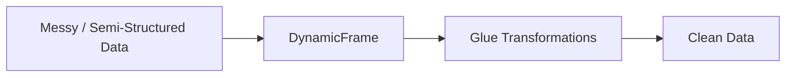

---

## DynamicFrame vs Spark DataFrame

> [!NOTE]
> 🧠 **Mental Model**
>
> ```text
> Spark DataFrame
> → Structured Spark Processing
>
> Glue DynamicFrame
> → ETL with More Schema Flexibility
> ```

> [!TIP]
> 🎯 **Exam Pattern**
>
> ```text
> Glue
> +
> Semi-Structured / Inconsistent Schema
> ```
>
> → Consider **DynamicFrame**

---

# 9. Glue Connections

Glue Connections store information required to connect Glue to external or data-store resources.

Common uses include:

- Amazon RDS
- Amazon Redshift
- JDBC databases
- Network connectivity

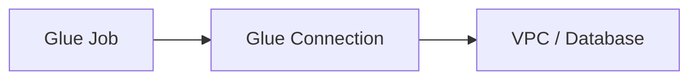

For private resources, Glue may need appropriate VPC networking to reach the target.

> [!TIP]
> 🎯 **Exam Pattern**
>
> ```text
> Glue
> +
> Private RDS / JDBC Database
> ```
>
> → **Glue Connection + VPC Connectivity**

---

## Private Connectivity Mental Model

```text
Glue Job
   ↓
Glue Connection
   ↓
VPC Networking
   ↓
Private Database
```

> [!CAUTION]
> ⚠️ **Exam Trap**
>
> A Glue Connection does not magically bypass networking.
>
> The network path, security groups and required connectivity must still allow access.

---

# 10. Common Architectures

## S3 → Glue → Redshift

Use when data needs transformation before loading into a data warehouse.

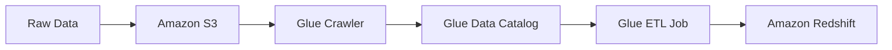

Think:

```text
RAW DATA
→ DISCOVER
→ CATALOG
→ TRANSFORM
→ DATA WAREHOUSE
```

---

## S3 → Glue → S3 → Athena

A common analytics pipeline:

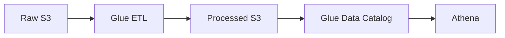

Example transformation:

```text
CSV
 ↓
Glue
 ↓
Parquet
 ↓
Athena
```

> [!TIP]
> 🎯 **Exam Pattern**
>
> ```text
> Raw S3 Data
> +
> Convert to Analytics-Friendly Format
> ```
>
> → **Glue**

Then:

```text
Query Processed S3 Data with SQL
→ Athena
```

---

# 11. Event-Driven ETL

Glue jobs can participate in event-driven ETL pipelines.

Example architecture from the source note:


Useful for automated ETL pipelines when processing should begin after new data arrives.

Mental model:

```text
NEW DATA
   ↓
EVENT
   ↓
TRIGGER
   ↓
GLUE ETL
```

---

# 12. Glue Studio

**AWS Glue Studio** provides a visual interface for building and managing Glue ETL jobs.

It can be used to:

- Visually create ETL pipelines
- Configure sources and targets
- Edit transformations
- Run jobs
- Monitor jobs

> [!NOTE]
> 🧠 **Mental Model**
>
> ```text
> GLUE
> → ETL ENGINE / DATA INTEGRATION
>
> GLUE STUDIO
> → VISUAL INTERFACE FOR GLUE ETL
> ```

> [!TIP]
> 🎯 **Exam Pattern**
>
> ```text
> Visually Build Glue ETL Pipeline
> ```
>
> → **Glue Studio**

---

# 13. Glue DataBrew

**AWS Glue DataBrew** provides visual data preparation.

Useful for:

- Cleaning data
- Normalizing data
- Profiling datasets
- Preparing data without writing much code

> [!TIP]
> 🎯 **Exam Pattern**
>
> ```text
> Business Analyst
> +
> Clean / Prepare Data Visually
> +
> Minimal Coding
> ```
>
> → **Glue DataBrew**

---

## Studio vs DataBrew

| Requirement                             | Service           |
| --------------------------------------- | ----------------- |
| Visually build/manage Glue ETL jobs     | **Glue Studio**   |
| Visually clean/profile/prepare datasets | **Glue DataBrew** |

Think:

```text
STUDIO
→ BUILD ETL

DATABREW
→ PREPARE / CLEAN DATA
```

---

# 14. Glue Schema Registry

**Glue Schema Registry** provides centralized schema management for streaming applications.

It integrates with services such as:

- Amazon Kinesis Data Streams
- Amazon MSK / Apache Kafka
- AWS Lambda

It helps:

- Discover schemas
- Control schemas
- Evolve schemas
- Enforce schema compatibility

Architecture:

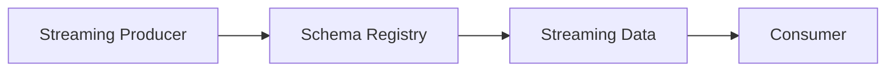

> [!TIP]
> 🎯 **Exam Pattern**
>
> ```text
> Streaming Data
> +
> Manage / Evolve Schemas
> ```
>
> → **Glue Schema Registry**

> [!CAUTION]
> Don't confuse:
>
> ```text
> Glue Data Catalog
> → Metadata Catalog for Data
>
> Glue Schema Registry
> → Schema Management for Streaming Applications
> ```

---

# 15. Security

Glue uses IAM roles and policies to access AWS resources.

Example:

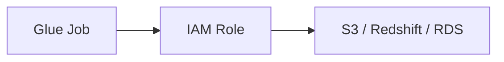

Think:

```text
Glue Job
   ↓
IAM Role
   ↓
AWS Resources
```

Apply least privilege.

---

## Encryption

Glue security configurations can protect resources such as:

- S3 data
- CloudWatch Logs
- Job bookmarks

Encryption can involve:

- SSE-S3
- SSE-KMS

Data in transit can use SSL.

---

## AWS KMS

KMS can protect Glue-related resources such as:

- Job bookmarks
- ETL-related data
- Logs
- Data Catalog metadata / connection information

> [!TIP]
> 🎯 **Exam Pattern**
>
> ```text
> Glue Data
> +
> Customer-Controlled Encryption Keys
> ```
>
> → **AWS KMS**

---

# 16. Monitoring

## CloudWatch Logs

Used for:

```text
Glue Job / Crawler Logs
```

---

## CloudWatch Metrics

Used for:

```text
Job Metrics
+
Operational Monitoring
```

---

## CloudTrail

Used to determine:

```text
Who performed Glue API actions?
```

> [!IMPORTANT]
> 🧠 **Memory**
>
> ```text
> CLOUDWATCH
> → WHAT IS HAPPENING?
>
> CLOUDTRAIL
> → WHO DID WHAT?
> ```

---

# 17. Glue vs Other Services

This is one of the most important sections for SAA.

---

## Glue vs Athena

|                    | AWS Glue               | Amazon Athena                 |
| ------------------ | ---------------------- | ----------------------------- |
| Main purpose       | ETL / Data integration | SQL queries                   |
| Transform data     | ✅                     | Limited / not primary purpose |
| Query S3 using SQL | ❌                     | ✅                            |
| Data Catalog       | Provides it            | Can use it                    |
| Schema discovery   | Crawler                | ❌                            |
| Serverless         | ✅                     | ✅                            |

Mental model:

```text
GLUE
→ PREPARE DATA

ATHENA
→ QUERY DATA
```

> [!TIP]
> 🎯 **Exam Pattern**
>
> ```text
> Transform S3 Data
> → Glue
>
> Query S3 with SQL
> → Athena
> ```

---

## Glue vs EMR

### AWS Glue

```text
Serverless / Managed ETL
Minimal Infrastructure Management
ETL-Focused
```

### Amazon EMR

```text
Managed Big-Data Platform
More Framework / Configuration Control
Spark / Hadoop / Other Big-Data Workloads
```

> [!IMPORTANT]
> 🧠 **Memory**
>
> ```text
> SERVERLESS ETL
> → GLUE
>
> BIG-DATA PLATFORM + MORE CONTROL
> → EMR
> ```

> [!TIP]
> 🎯 **Exam Pattern**
>
> ```text
> Transform Data
> +
> Minimal Operations
> ```
>
> → **Glue**
>
> ```text
> Need More Control over Big-Data Framework / Platform
> ```
>
> → **EMR**

---

## Glue vs DMS

This distinction is extremely important.

### AWS Glue

```text
Extract
   ↓
Transform
   ↓
Load
```

Primary clue:

> **TRANSFORM DATA**

### AWS DMS

```text
Database A
    ↓
AWS DMS
    ↓
Database B
```

Primary clue:

> **MIGRATE / REPLICATE DATABASES**

> [!IMPORTANT]
> 🧠 **SAA Memory**
>
> ```text
> GLUE
> → TRANSFORM
>
> DMS
> → MIGRATE / REPLICATE
> ```

> [!TIP]
> 🎯 **Exam Pattern**
>
> ```text
> Oracle → RDS
> +
> Minimal Downtime
> ```
>
> → **DMS**
>
> ```text
> Clean / Transform Data Before Analytics
> ```
>
> → **Glue**

---

## Glue vs SCT

From the exam comparison in the source note:

```text
Heterogeneous Database Schema Conversion
→ AWS SCT
```

Think:

```text
SCT
→ CONVERT SCHEMA

DMS
→ MOVE / REPLICATE DATA
```

---

## High-Value Comparison

| Requirement                      | Think                 |
| -------------------------------- | --------------------- |
| Serverless ETL                   | **Glue**              |
| Discover schema                  | **Glue Crawler**      |
| Store metadata                   | **Glue Data Catalog** |
| Query S3 with SQL                | **Athena**            |
| Process only new data            | **Job Bookmark**      |
| Flexible ETL abstraction         | **DynamicFrame**      |
| Visual ETL development           | **Glue Studio**       |
| Visual data preparation          | **DataBrew**          |
| Streaming schemas                | **Schema Registry**   |
| Database migration               | **DMS**               |
| Heterogeneous schema conversion  | **SCT**               |
| Big-data platform / more control | **EMR**               |

---

# 18. Decision Map

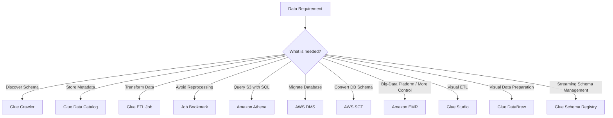

---

# 19. High-Value Exam Traps

> [!CAUTION]
> ⚠️ **Trap 1 — Crawler vs Catalog**
>
> ```text
> CRAWLER
> → DISCOVERS METADATA
>
> DATA CATALOG
> → STORES METADATA
> ```

---

> [!CAUTION]
> ⚠️ **Trap 2 — Catalog Stores Metadata**
>
> ```text
> Glue Data Catalog
> ≠ Actual Dataset
> ```
>
> The actual data can remain in S3 or another data store.

---

> [!CAUTION]
> ⚠️ **Trap 3 — Crawler vs Job**
>
> ```text
> CRAWLER
> → DISCOVER
>
> JOB
> → TRANSFORM
> ```

---

> [!CAUTION]
> ⚠️ **Trap 4 — Crawler vs Bookmark**
>
> ```text
> CRAWLER
> → SCHEMA / METADATA
>
> BOOKMARK
> → PROCESSING STATE
> ```

---

> [!CAUTION]
> ⚠️ **Trap 5 — Glue vs Athena**
>
> ```text
> GLUE
> → PREPARE / TRANSFORM
>
> ATHENA
> → QUERY
> ```

---

> [!CAUTION]
> ⚠️ **Trap 6 — Glue vs DMS**
>
> ```text
> GLUE
> → TRANSFORM DATA
>
> DMS
> → MIGRATE / REPLICATE DATABASES
> ```

---

> [!CAUTION]
> ⚠️ **Trap 7 — DMS vs SCT**
>
> ```text
> DMS
> → MOVE DATA
>
> SCT
> → CONVERT DATABASE SCHEMA
> ```

---

> [!CAUTION]
> ⚠️ **Trap 8 — Glue vs EMR**
>
> ```text
> SERVERLESS ETL
> → GLUE
>
> MORE BIG-DATA PLATFORM CONTROL
> → EMR
> ```

---

> [!CAUTION]
> ⚠️ **Trap 9 — Glue Connection**
>
> ```text
> Glue Connection
> ≠ Automatic Network Connectivity
> ```
>
> Private databases still require appropriate VPC/network configuration.

---

> [!CAUTION]
> ⚠️ **Trap 10 — Studio vs DataBrew**
>
> ```text
> GLUE STUDIO
> → BUILD ETL
>
> DATABREW
> → VISUAL DATA PREPARATION
> ```

---

> [!CAUTION]
> ⚠️ **Trap 11 — Catalog vs Schema Registry**
>
> ```text
> DATA CATALOG
> → DATASET METADATA
>
> SCHEMA REGISTRY
> → STREAMING SCHEMAS
> ```

---

# 20. Scenario Check

## Scenario 1 — Discover S3 Schema

> A company receives thousands of Parquet/CSV files in S3 and wants to automatically discover their schemas and create table metadata.

```text
Amazon S3
    ↓
Glue Crawler
    ↓
Glue Data Catalog
```

**Answer: Glue Crawler + Glue Data Catalog**

---

## Scenario 2 — Query S3

> Analysts need to run SQL directly against data stored in S3.

```text
S3
 ↓
Glue Data Catalog
 ↓
Athena
```

**Answer: Amazon Athena**

Glue can provide the metadata/cataloging layer, but Athena performs the SQL queries.

---

## Scenario 3 — Transform CSV to Parquet

> A company needs to transform large amounts of CSV data in S3 into Parquet for analytics without managing servers.

```text
CSV
 ↓
Glue ETL
 ↓
Parquet
```

**Answer: AWS Glue**

---

## Scenario 4 — Process Only New Data

> A Glue job runs every day and should avoid processing files it already handled.

```text
Glue Job
   ↓
Job Bookmark
```

**Answer: Glue Job Bookmark**

---

## Scenario 5 — Private RDS Database

> A Glue job needs to connect to an RDS database in a private VPC.

```text
Glue Job
   ↓
Glue Connection
   ↓
VPC Connectivity
   ↓
Private RDS
```

**Answer: Glue Connection + appropriate VPC networking**

---

## Scenario 6 — Database Migration

> A company must migrate an Oracle database to AWS with minimal downtime.

```text
Oracle
 ↓
DMS
 ↓
AWS Database
```

**Answer: AWS DMS**

Not Glue just because data is moving.

---

## Scenario 7 — Heterogeneous Migration

> A company migrates from one database engine to another and must convert the source database schema.

```text
Source Schema
    ↓
AWS SCT
    ↓
Target Schema
```

Then data migration can use:

```text
AWS DMS
```

Think:

```text
SCT → SCHEMA

DMS → DATA
```

---

## Scenario 8 — Business Analyst

> A business analyst wants to visually clean and normalize datasets without writing much code.

```text
Glue DataBrew
```

---

## Scenario 9 — Streaming Schemas

> Producers and consumers need centralized schema management and compatibility controls for streaming records.

```text
Streaming Application
        ↓
Glue Schema Registry
```

---

## Scenario 10 — Big-Data Control

> A company needs greater control over Spark/Hadoop and the underlying big-data platform rather than a primarily serverless ETL service.

```text
More Big-Data Control
        ↓
Amazon EMR
```

---

# 21. Glue in 30 Seconds

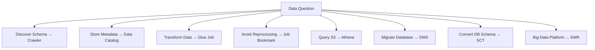

> [!NOTE]
> 🧠 **SAA Memory**
>
> **GLUE → SERVERLESS DATA INTEGRATION / ETL**
>
> **CRAWLER → DISCOVER SCHEMA**
>
> **DATA CATALOG → STORE METADATA**
>
> **ETL JOB → TRANSFORM DATA**
>
> **JOB BOOKMARK → REMEMBER PROCESSING STATE**
>
> **DYNAMICFRAME → SCHEMA-FLEXIBLE ETL**
>
> **CONNECTION → CONNECT TO DATA STORES / VPC RESOURCES**
>
> **STUDIO → VISUAL ETL**
>
> **DATABREW → VISUAL DATA PREPARATION**
>
> **SCHEMA REGISTRY → STREAMING SCHEMAS**
>
> **ATHENA → QUERY DATA**
>
> **DMS → MIGRATE / REPLICATE DATABASES**
>
> **SCT → CONVERT DATABASE SCHEMA**
>
> **EMR → BIG-DATA PLATFORM / MORE CONTROL**
>
> ---
>
> Fastest distinctions:
>
> ```text
> DISCOVER?
> → CRAWLER
>
> STORE METADATA?
> → DATA CATALOG
>
> TRANSFORM?
> → GLUE JOB
>
> PROCESS ONLY NEW DATA?
> → JOB BOOKMARK
>
> QUERY S3?
> → ATHENA
>
> MIGRATE DATABASE?
> → DMS
>
> CONVERT DATABASE SCHEMA?
> → SCT
>
> NEED MORE BIG-DATA CONTROL?
> → EMR
> ```

---

# 🔗 Related Notes

## Data

- [AWS Lake Formation](aws_lakeformation.md)

## Database

- [AWS DMS](../Database/aws_dms.md)
- [Amazon Redshift](../Database/aws_redshift.md)

## Integration

- [Amazon Kinesis](../Integration/aws_kinesis.md)

## Compute

- [AWS Lambda](../Compute/aws_lambda.md)

## Security

- [AWS IAM](../Security/aws_iam.md)

---

# 📚 Study Order

1. Glue Mental Model
2. Crawler vs Data Catalog
3. Glue ETL Jobs
4. Job Bookmarks
5. Glue + Athena
6. Glue vs DMS
7. DMS vs SCT
8. Glue vs EMR
9. Glue Connections + VPC
10. DynamicFrames
11. Glue Studio vs DataBrew
12. Schema Registry
13. Security + Monitoring
14. Exam Traps

---

# 📚 Sources

- AWS Glue — Overview
- AWS Glue — Data Catalog
- AWS Glue — Crawlers
- AWS Glue — Classifiers
- AWS Glue — ETL Jobs
- AWS Glue — Job Bookmarks
- AWS Glue — DynamicFrames
- AWS Glue — Connections
- AWS Glue Studio
- AWS Glue DataBrew
- AWS Glue Schema Registry
- AWS Glue — Security
- AWS Glue — Monitoring

---

**Reviewed:** 2026-09-24  
**Focus:** SAA-C03 serverless ETL, schema discovery, metadata cataloging, incremental processing and analytics integration.
