# Amazon Aurora — High-Performance Relational Database

## 📑 Table of Contents

1. [Mental Model](#1-mental-model)
2. [Aurora Architecture](#2-aurora-architecture)
3. [Aurora Replicas and Read Scaling](#3-aurora-replicas-and-read-scaling)
4. [Aurora Endpoints](#4-aurora-endpoints)
5. [Aurora Auto Scaling](#5-aurora-auto-scaling)
6. [Aurora Serverless v2](#6-aurora-serverless-v2)
7. [Aurora Global Database](#7-aurora-global-database)
8. [Storage and I/O](#8-storage-and-io)
9. [Backup and Recovery](#9-backup-and-recovery)
10. [Security and Connections](#10-security-and-connections)
11. [Aurora vs Other Databases](#11-aurora-vs-other-databases)
12. [Aurora Decision Map](#12-aurora-decision-map)
13. [High-Value Exam Traps](#13-high-value-exam-traps)
14. [Scenario Check](#14-scenario-check)
15. [Aurora in 30 Seconds](#15-aurora-in-30-seconds)

---

# 1. Mental Model

> [!TIP]
> 🧠 **Mental Model**
>
> **Aurora = Relational compute separated from shared distributed storage**
>
> Think:
>
> ```text
> WRITER
> → Writes
>
> READERS
> → Read Scaling + Failover Targets
>
> SHARED STORAGE
> → Distributed across multiple AZs
> ```

Aurora is compatible with:

- MySQL
- PostgreSQL

but compatibility does not mean every engine feature or extension is identical.

> [!IMPORTANT]
> 🎯 **SAA Memory**
>
> **Aurora = 1 Writer + up to 15 Aurora Replicas + Shared Multi-AZ Storage**

---

# 2. Aurora Architecture

A conventional Aurora cluster separates **compute** from **storage**.

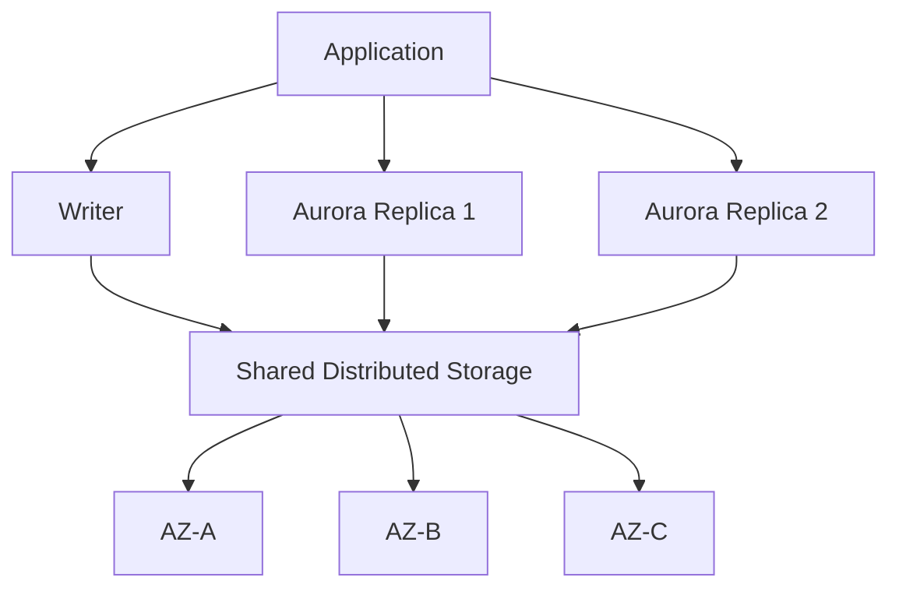

Aurora storage maintains:

```text
6 copies
across
3 Availability Zones
```

and grows automatically as required.

The important distinction is:

```text
Compute
→ Writer + Aurora Replicas

Storage
→ Shared Distributed Storage
```

> [!CAUTION]
> ⚠️ **Exam Trap**
>
> **6 storage copies ≠ 6 database instances**
>
> The six copies provide storage durability.
>
> They are not six query-serving databases.

---

## Writer

A typical Aurora cluster has **one writer**.

```text
INSERT
UPDATE
DELETE
        ↓
Writer
```

The writer can also process reads, but read-heavy workloads can be offloaded to Aurora Replicas.

> [!IMPORTANT]
> Adding Aurora Replicas does not create multiple independent writers.

---

# 3. Aurora Replicas and Read Scaling

Aurora supports up to **15 Aurora Replicas**.

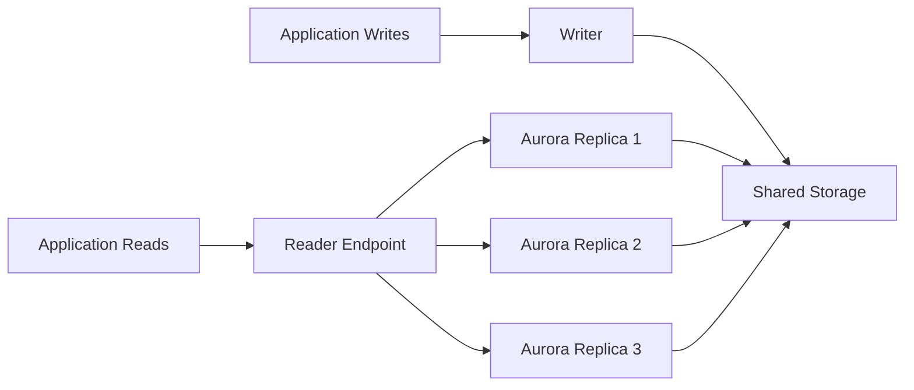

Aurora Replicas provide:

- Read scaling
- Additional compute capacity for reads
- Failover targets

> [!TIP]
> 💡 **Exam Pattern**
>
> **Aurora database has heavy SELECT traffic**
>
> → **Add Aurora Replicas**

---

## Replicas and High Availability

Because readers can act as failover targets, replicas also improve compute availability.

```text
Writer 💀
   ↓
Promote Aurora Replica
   ↓
New Writer
```

Failover priority can influence which replica is selected.

> [!IMPORTANT]
> 🎯 **SAA Memory**
>
> **Aurora Replica**
>
> ```text
> READ SCALE
> +
> FAILOVER TARGET
> ```

The distributed storage itself does not eliminate the value of replicas.

Storage may survive a failure, but Aurora still needs database **compute** capable of taking over the writer role.

---

# 4. Aurora Endpoints

Aurora provides different endpoints for different routing requirements.

| Endpoint                      | Routes To                   | Main Purpose           |
| ----------------------------- | --------------------------- | ---------------------- |
| **Cluster / Writer Endpoint** | Current writer              | Reads + Writes         |
| **Reader Endpoint**           | Aurora Replicas             | Read scaling           |
| **Instance Endpoint**         | One specific instance       | Direct instance access |
| **Custom Endpoint**           | Selected group of instances | Workload isolation     |

---

## Writer Endpoint

Use for:

```text
INSERT
UPDATE
DELETE
SELECT when appropriate
```

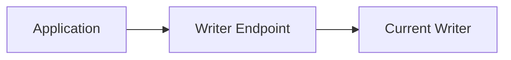

The endpoint continues to represent the writer role after failover.

> [!TIP]
> 💡 **Exam Pattern**
>
> **Application writes**
>
> → **Writer Endpoint**

---

## Reader Endpoint

The Reader Endpoint distributes **connections** across available Aurora Replicas.

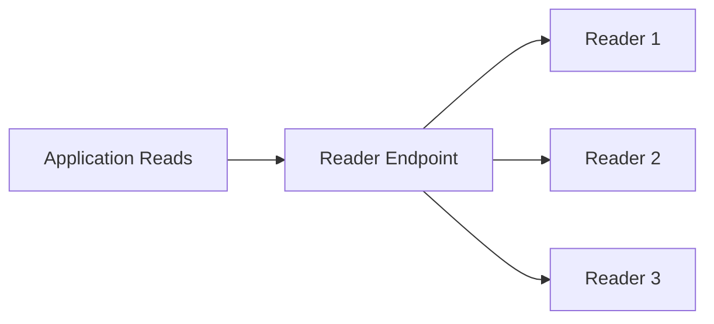

> [!CAUTION]
> ⚠️ **Exam Trap**
>
> The Reader Endpoint balances:
>
> **CONNECTIONS**
>
> not:
>
> **every individual SQL query**

A connection pool can therefore keep many queries on the same selected reader.

---

## Reader Endpoint with No Replicas

An important edge case:

```text
No Aurora Replicas
        ↓
Reader Endpoint
        ↓
Writer
```

Therefore:

> [!WARNING]
> **Reader Endpoint ≠ security boundary**
>
> Do not depend on the Reader Endpoint to guarantee read-only access.
>
> Use database users and privileges for authorization.

---

## Instance Endpoint

An Instance Endpoint connects directly to one particular DB instance.

```text
Application
    ↓
Instance Endpoint
    ↓
Reader 2
```

Useful for:

- Diagnostics
- Specific workloads
- Direct instance targeting

It does not automatically follow the writer role.

---

## Custom Endpoint

Custom Endpoints allow selected groups of Aurora instances to serve specific workloads.

Example:

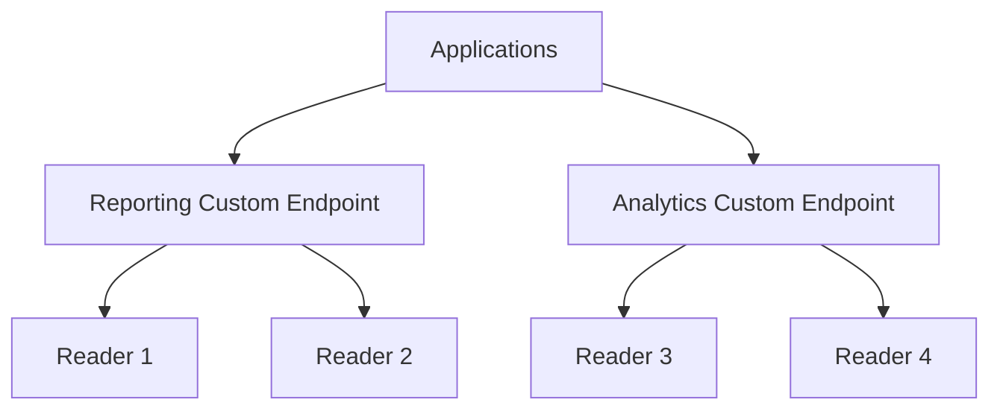

> [!TIP]
> 💡 **Exam Pattern**
>
> **Different workloads must use different groups of Aurora Replicas**
>
> → **Custom Endpoints**

---

# 5. Aurora Auto Scaling

Aurora Auto Scaling dynamically adjusts the **number of supported Aurora Replicas** according to demand.

This is extremely important:

> [!IMPORTANT]
> 🎯 **Aurora Auto Scaling**
>
> ```text
> Changes NUMBER OF READERS
> ```
>
> It does **not** mean making one existing reader vertically larger.

Example:

```text
Normal Traffic

Writer
├── Reader 1
└── Reader 2
```

Peak traffic:

```text
Peak READ Traffic 📈

Writer
├── Reader 1
├── Reader 2
├── Reader 3  ← Auto Scaling
└── Reader 4  ← Auto Scaling
```

When demand decreases:

```text
Traffic 📉

Writer
├── Reader 1
└── Reader 2
```

> [!TIP]
> 💡 **Exam Pattern**
>
> ```text
> Aurora
> +
> Fluctuating READ traffic
> +
> Peak periods
> +
> Cost-effective
>         ↓
> Aurora Auto Scaling
> ```

This avoids permanently provisioning unnecessary reader capacity just for occasional peaks.

---

## Auto Scaling vs Manually Adding Replicas

```text
Predictable / stable read demand
→ Aurora Replicas

Fluctuating read demand
→ Aurora Auto Scaling
```

---

# 6. Aurora Serverless v2

Aurora Serverless v2 scales **database compute capacity**.

Capacity is measured in:

```text
ACUs
Aurora Capacity Units
```

Conceptually:

```text
Low Load
→ Fewer ACUs

High Load
→ More ACUs
```

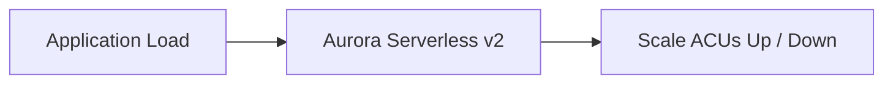

Serverless v2 operates within configured capacity bounds.

---

## Auto Scaling vs Serverless v2

This is a very important distinction.

| Feature                  | What Scales?                                |
| ------------------------ | ------------------------------------------- |
| **Aurora Auto Scaling**  | Number of Aurora Replicas                   |
| **Aurora Serverless v2** | Compute capacity of serverless DB instances |
| **Aurora Storage**       | Storage capacity                            |

> [!IMPORTANT]
> 🎯 **SAA Memory**
>
> ```text
> More READERS
> → Aurora Auto Scaling
>
> More / Less COMPUTE
> → Aurora Serverless v2
>
> More STORAGE
> → Automatic Storage Growth
> ```

---

## Serverless v2 Use Case

Think Serverless v2 when the relational workload has:

- Variable compute demand
- Unpredictable usage
- Significant changes in workload intensity

> [!CAUTION]
> ⚠️ **Exam Trap**
>
> Do not assume:
>
> ```text
> Aurora Auto Scaling
> =
> Aurora Serverless
> ```
>
> They scale different dimensions.

Serverless v2 still requires sensible:

- Capacity limits
- HA design
- Workload testing
- Cost evaluation

Supported configurations can also have auto-pause behavior when configured accordingly; do not rely on the outdated blanket rule that Serverless v2 can never pause.

---

# 7. Aurora Global Database

Aurora Global Database extends Aurora across multiple AWS Regions.

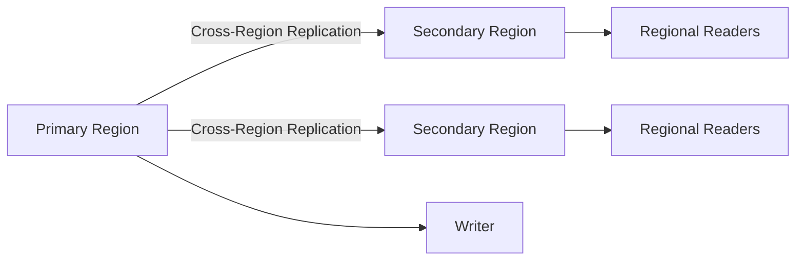

Primary use cases:

```text
Global Reads
+
Low-Latency Regional Reads
+
Cross-Region Disaster Recovery
```

> [!IMPORTANT]
> 🎯 **SAA Memory**
>
> **Aurora Global Database = MULTI-REGION**

Cross-Region replication is asynchronous.

---

## When to Think Global Database

```text
Users around the world
+
Relational database
+
Low-latency regional reads
        ↓
Aurora Global Database
```

or:

```text
Aurora
+
Cross-Region DR
        ↓
Aurora Global Database
```

---

## Auto Scaling vs Global Database

A very common exam distinction:

```text
READ traffic fluctuates
inside one Region
        ↓
Aurora Auto Scaling
```

versus:

```text
Users distributed globally
need regional reads
        ↓
Aurora Global Database
```

> [!CAUTION]
> ⚠️ **Exam Trap**
>
> Do not choose Global Database merely because you need **more read capacity**.
>
> Look for:
>
> **MULTI-REGION / GLOBAL USERS / REGIONAL DR**

---

## Global Write Forwarding

Where supported, Global Write Forwarding allows writes issued in a secondary Region to be forwarded to the primary Region's writer.

Conceptually:

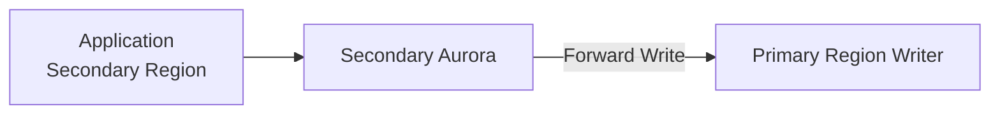

This does **not** mean every Region has an independent active writer.

> [!CAUTION]
> ⚠️ **Exam Trap**
>
> **Global Write Forwarding ≠ independent active-active writers**

---

# 8. Storage and I/O

Aurora's storage layer is:

- Shared by cluster instances
- Distributed across multiple AZs
- Automatically growing

```text
Writer ──────┐
Reader 1 ────┼──→ Shared Aurora Storage
Reader 2 ────┘
```

This differs from traditional database architectures where replicas may maintain separate full storage copies at the instance level.

---

## Aurora Standard vs I/O-Optimized

Aurora supports different storage cost models.

Conceptually:

```text
Aurora Standard
→ Compute + Storage + I/O charges

Aurora I/O-Optimized
→ Different cost model for I/O-intensive workloads
```

> [!TIP]
> 💡 **Exam Pattern**
>
> Very I/O-intensive Aurora workload:
>
> → Evaluate **Aurora I/O-Optimized**
>
> Do not assume it is always cheaper; compare the total workload cost.

---

# 9. Backup and Recovery

Important Aurora recovery mechanisms:

| Feature              | Purpose                                         |
| -------------------- | ----------------------------------------------- |
| **PITR / Snapshot**  | Historical recovery                             |
| **Backtrack**        | Rewind supported Aurora MySQL cluster           |
| **Clone**            | Fast copy-on-write development/test environment |
| **Replica Failover** | Recover from writer failure                     |

---

## PITR / Snapshot

Use when you need historical recovery.

```text
Accidental corruption
        ↓
PITR / Snapshot
        ↓
Restore
        ↓
New Cluster
```

As with RDS recovery, plan:

- Validation
- Application endpoint changes
- Cutover

See [Amazon RDS](aws_rds.md).

---

## Backtrack

Backtrack allows supported Aurora MySQL clusters to move the database state backward in time without performing a traditional restore.

Conceptually:

```text
10:00 ✅
10:05 ✅
10:07 Bad Change 💀
10:10 Current State

Backtrack
   ↓
10:06
```

> [!IMPORTANT]
> 🎯 **SAA Memory**
>
> **Backtrack → Aurora MySQL**
>
> NOT:
>
> **Aurora PostgreSQL**

Backtrack must be appropriately enabled/configured and has version/feature restrictions.

---

## Backtrack vs PITR

```text
Backtrack
→ Rewind existing supported Aurora MySQL cluster

PITR
→ Restore historical state into a new cluster
```

> [!CAUTION]
> ⚠️ **Exam Trap**
>
> Backtrack affects the cluster's database state.
>
> It is not an "undo this one row" feature.

Valid writes made after the selected backtrack point can also be affected.

Backups remain necessary.

---

## Clone

Aurora cloning creates a fast copy-on-write copy.

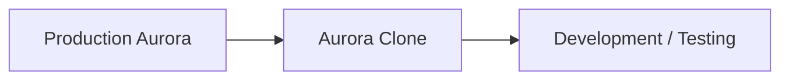

Useful for:

- Development
- Testing
- Experiments

Because cloning uses copy-on-write behavior, creating the clone does not initially require a complete physical duplication of all database storage.

> [!CAUTION]
> An Aurora Clone is not a replacement for an independent backup strategy.

---

## Replica Failover

Replica failover solves:

```text
Writer Failure
```

It does not solve:

```text
Accidental DELETE
Logical Corruption
Bad Application Write
```

because logical changes can be reflected in the shared database state.

---

# 10. Security and Connections

Aurora shares many security concepts with RDS.

Important mechanisms include:

- VPC placement
- Security Groups
- KMS encryption at rest
- TLS in transit
- IAM Database Authentication
- Secrets Manager
- RDS Proxy

See [Amazon RDS](aws_rds.md).

---

## RDS Proxy

For applications creating many database connections:

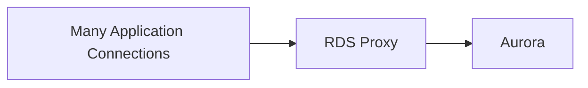

Think:

```text
Lambda
+
Aurora
+
Too many DB connections
        ↓
RDS Proxy
```

RDS Proxy manages connections.

It does not cache query results.

---

# 11. Aurora vs Other Databases

| Requirement                                                   | Starting Point              |
| ------------------------------------------------------------- | --------------------------- |
| AWS-optimized MySQL/PostgreSQL-compatible relational database | **Aurora**                  |
| Traditional managed relational engines                        | [Amazon RDS](aws_rds.md)    |
| Variable Aurora compute                                       | **Aurora Serverless v2**    |
| Fluctuating Aurora read traffic                               | **Aurora Auto Scaling**     |
| Multi-Region relational reads / DR                            | **Aurora Global Database**  |
| Key-value/document massive scale                              | [DynamoDB](aws_dynamodb.md) |
| Native multi-Region key-value writes                          | **DynamoDB Global Tables**  |
| Large data warehouse / BI analytics                           | [Redshift](aws_redshift.md) |

---

# 12. Aurora Decision Map

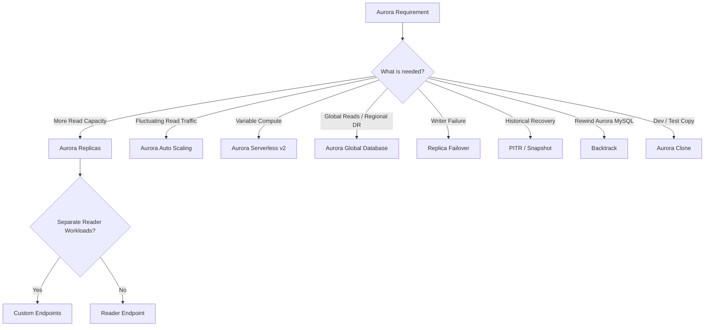

---

# 13. High-Value Exam Traps

> [!WARNING]
> **Trap 1 — Reader Endpoint**
>
> ```text
> Reader Endpoint
> → Balances CONNECTIONS
>
> NOT
>
> → Individual SQL queries
> ```

---

> [!WARNING]
> **Trap 2 — Reader Endpoint without Replicas**
>
> If there are no Aurora Replicas, the Reader Endpoint can connect to the writer.
>
> It is not a read-only authorization boundary.

---

> [!WARNING]
> **Trap 3 — Storage Copies**
>
> ```text
> 6 Storage Copies
> ≠
> 6 Database Instances
> ```

---

> [!WARNING]
> **Trap 4 — Aurora Auto Scaling**
>
> ```text
> Aurora Auto Scaling
> → Number of READERS
>
> Serverless v2
> → COMPUTE capacity
> ```

---

> [!WARNING]
> **Trap 5 — Global Database**
>
> Need more reads during local peak periods?
>
> → Aurora Auto Scaling
>
> Need reads near users in multiple Regions?
>
> → Aurora Global Database

---

> [!WARNING]
> **Trap 6 — Backtrack**
>
> ```text
> Aurora MySQL
> → Supported configurations can use Backtrack
>
> Aurora PostgreSQL
> → No Backtrack
> ```

---

> [!WARNING]
> **Trap 7 — Failover vs Logical Recovery**
>
> ```text
> Writer Failure
> → Replica Failover
>
> Accidental Data Change
> → PITR / Backtrack when applicable
> ```

---

> [!WARNING]
> **Trap 8 — Global Write Forwarding**
>
> Write forwarding does not create independent writable primary databases in every Region.

---

> [!WARNING]
> **Trap 9 — Custom Endpoint**
>
> ```text
> Reader Endpoint
> → General reader pool
>
> Instance Endpoint
> → One specific instance
>
> Custom Endpoint
> → Selected GROUP of instances
> ```

---

# 14. Scenario Check

## Scenario 1 — Increasing Read Traffic

> An Aurora application receives increasing read traffic and needs additional read capacity.

```text
Read Scaling
    ↓
Aurora Replicas
```

---

## Scenario 2 — Peak Read Traffic

> An e-commerce application experiences unpredictable read traffic during peak periods. The solution should minimize unnecessary cost outside peak periods.

```text
Fluctuating READ Traffic
+
Peak Periods
+
Cost-Effective
        ↓
Aurora Auto Scaling
```

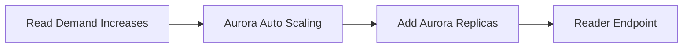

> [!TIP]
> **Answer: Aurora Auto Scaling**

Not Global Database unless there is an actual **multi-Region** requirement.

---

## Scenario 3 — Global Users

> Users in North America, Europe and Asia need low-latency relational reads close to their Regions.

```text
Global Users
+
Regional Reads
        ↓
Aurora Global Database
```

---

## Scenario 4 — Variable Compute

> A relational application has highly variable compute requirements and needs database compute capacity to adjust with demand.

```text
Variable COMPUTE
        ↓
Aurora Serverless v2
```

---

## Scenario 5 — Separate Reporting Readers

> Production reads and heavy reporting workloads must use different groups of Aurora Replicas.

```text
Selected Reader Groups
        ↓
Custom Endpoints
```

The generic Reader Endpoint does not separate workloads by application intent.

---

## Scenario 6 — Writer Failure

> The Aurora writer fails and the application needs a replacement writer.

```text
Writer Failure
     ↓
Promote Aurora Replica
     ↓
New Writer
```

---

## Scenario 7 — Accidental Change

> A supported Aurora MySQL cluster experiences an accidental data modification and administrators need to rewind the existing cluster.

```text
Aurora MySQL
+
Rewind Existing Cluster
        ↓
Backtrack
```

---

## Scenario 8 — Development Copy

> Developers need a fast copy of a large production Aurora database for testing without initially duplicating all storage.

```text
Development / Testing
+
Copy-on-Write
        ↓
Aurora Clone
```

---

# 15. Aurora in 30 Seconds

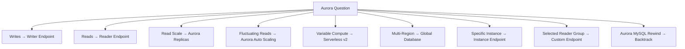

> [!NOTE]
> 🧠 **SAA Memory**
>
> **Aurora → MySQL / PostgreSQL compatible**
>
> **1 Writer + up to 15 Aurora Replicas**
>
> **Storage → 6 copies across 3 AZs**
>
> **Writer Endpoint → READ + WRITE**
>
> **Reader Endpoint → READ CONNECTIONS**
>
> **Reader Endpoint balances CONNECTIONS, not queries**
>
> **Instance Endpoint → ONE instance**
>
> **Custom Endpoint → SELECTED GROUP**
>
> **Aurora Replicas → READ SCALE + FAILOVER TARGET**
>
> **Aurora Auto Scaling → NUMBER OF READERS**
>
> **Serverless v2 → COMPUTE / ACUs**
>
> **Global Database → MULTI-REGION**
>
> **Backtrack → Aurora MySQL**
>
> **Clone → COPY-ON-WRITE dev/test copy**
>
> **PITR → historical recovery**
>
> **RDS Proxy → CONNECTION POOL**

---

# 🔗 Related Notes

## Database

- [Database Overview](database_overview.md)
- [Amazon RDS](aws_rds.md)
- [Amazon DynamoDB](aws_dynamodb.md)
- [Amazon ElastiCache](aws_elasticache.md)
- [Amazon Redshift](aws_redshift.md)

## Networking

- [Amazon Route 53](../Networking/aws_route53.md)

## Security

- [AWS IAM](../Security/aws_iam.md)

---

# 📚 Sources

- AWS Aurora — High Availability
- AWS Aurora — Reader Endpoints
- AWS Aurora — Auto Scaling
- AWS Aurora — Serverless v2
- AWS Aurora — Global Database
- AWS Aurora — Backtrack
- AWS Aurora — Storage Reliability

---

**Reviewed:** 2026-09-23  
**Focus:** SAA-C03 Aurora architecture, read scaling, endpoints, compute scaling and multi-Region design.
