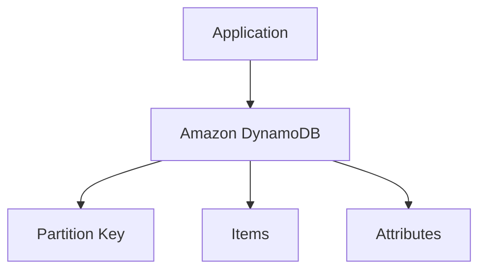
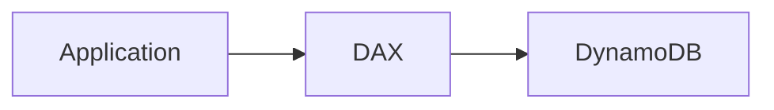
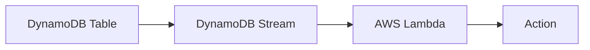
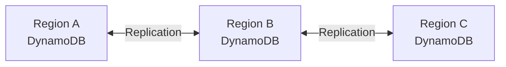
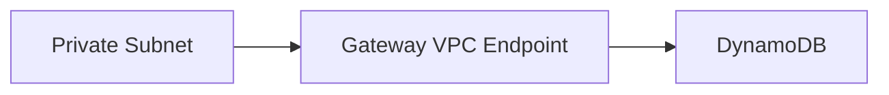
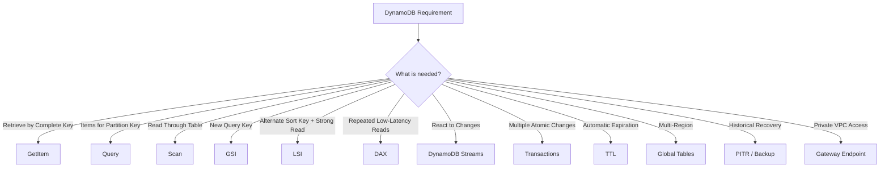
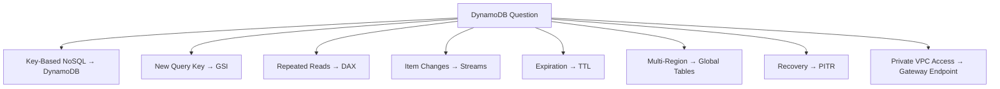

# Amazon DynamoDB — Serverless NoSQL Database

## 📑 Table of Contents

1. [Mental Model](#1-mental-model)
2. [Core Architecture](#2-core-architecture)
3. [Primary Keys](#3-primary-keys)
4. [GetItem vs Query vs Scan](#4-getitem-vs-query-vs-scan)
5. [Secondary Indexes — GSI vs LSI](#5-secondary-indexes--gsi-vs-lsi)
6. [Read Consistency](#6-read-consistency)
7. [Capacity Modes](#7-capacity-modes)
8. [Hot Partitions](#8-hot-partitions)
9. [DynamoDB Accelerator — DAX](#9-dynamodb-accelerator--dax)
10. [DynamoDB Streams](#10-dynamodb-streams)
11. [Transactions and Conditional Writes](#11-transactions-and-conditional-writes)
12. [Global Tables](#12-global-tables)
13. [TTL](#13-ttl)
14. [Backup and Recovery](#14-backup-and-recovery)
15. [Security and Private Access](#15-security-and-private-access)
16. [DynamoDB vs Other Databases](#16-dynamodb-vs-other-databases)
17. [Decision Map](#17-decision-map)
18. [High-Value Exam Traps](#18-high-value-exam-traps)
19. [Scenario Check](#19-scenario-check)
20. [DynamoDB in 30 Seconds](#20-dynamodb-in-30-seconds)

---

# 1. Mental Model

> [!TIP]
> 🧠 **Mental Model**
>
> **DynamoDB = Serverless NoSQL + Key-Based Access + Massive Scale**
>
> ```text
> Application
>      ↓
> Partition Key
>      ↓
> DynamoDB
>      ↓
> Very Low-Latency Access
> ```

DynamoDB is a managed **key-value and document NoSQL database** with Regional Multi-AZ resilience.

The most important design principle is:

> **Design the keys around the questions the application asks.**

DynamoDB scales extremely well when applications access data through well-designed keys.

It does **not** make arbitrary scans efficient.

> [!IMPORTANT]
> 🎯 **SAA Memory**
>
> ```text
> FLEXIBLE SCHEMA
> +
> MASSIVE SCALE
> +
> LOW LATENCY
> +
> KEY-BASED ACCESS
>        ↓
> DynamoDB
> ```

---

# 2. Core Architecture

DynamoDB is:

- NoSQL
- Key-value and document
- Serverless
- Fully managed
- Multi-AZ within a Region
- Designed for low-latency access
- Horizontally scalable



An item can contain different attributes from another item.

Example:

```text
Item 1
PK = USER#100
Name = Gabriela
Email = ...

Item 2
PK = PRODUCT#500
Name = Keyboard
Price = 150
Category = Electronics
```

> [!IMPORTANT]
> Flexible attributes do not eliminate the need for good data-model design.

---

## Maximum Item Size

Maximum DynamoDB item size:

**400 KB**

This includes attribute names and values.

For large objects:

```text
Large Object
    ↓
Amazon S3

Metadata / Reference
    ↓
DynamoDB
```

> [!TIP]
> 💡 **Exam Pattern**
>
> ```text
> Large Files / Images / Documents
> ```
>
> → Store object in **S3**
>
> → Store metadata/reference in **DynamoDB**

---

# 3. Primary Keys

DynamoDB supports two primary-key designs.

---

## Simple Primary Key

Uses only a:

**Partition Key**

```text
Partition Key
     ↓
   Item
```

Example:

```text
UserID = 123
```

The partition key uniquely identifies the item.

---

## Composite Primary Key

Uses:

```text
Partition Key
+
Sort Key
```

Example:

```text
UserID = 123
Timestamp = 2026-09-24T10:00
```

Multiple items can share the same partition key but have different sort keys.

```text
USER#123
│
├── ORDER#001
├── ORDER#002
└── ORDER#003
```

The complete combination:

```text
Partition Key + Sort Key
```

uniquely identifies an item.

---

## Partition Key

The partition key helps determine how data and traffic are distributed.

Good partition keys generally help spread traffic across many values.

Think:

```text
Partition Key
→ DISTRIBUTE
```

---

## Sort Key

The sort key organizes related items sharing the same partition-key value.

Think:

```text
Sort Key
→ ORGANIZE RELATED ITEMS
```

Example:

```text
CustomerID
    ↓
Orders sorted by timestamp
```

> [!NOTE]
> 🧠 **SAA Memory**
>
> ```text
> PARTITION KEY
> → DISTRIBUTE
>
> SORT KEY
> → ORGANIZE
> ```

---

# 4. GetItem vs Query vs Scan

This distinction is extremely important.

| Operation   | Behavior                                         |
| ----------- | ------------------------------------------------ |
| **GetItem** | Retrieve one item using its complete primary key |
| **Query**   | Retrieve items for one partition-key value       |
| **Scan**    | Read through table/index contents                |

---

## GetItem

Think:

```text
I KNOW THE COMPLETE PRIMARY KEY
        ↓
GetItem
```

Example:

```text
PK = USER#123
SK = PROFILE
```

---

## Query

A Query requires equality on a partition-key value.

Optional conditions can be applied to the sort key.

```text
PK = CUSTOMER#123
        ↓
Query
        ↓
ORDER#001
ORDER#002
ORDER#003
```

> [!TIP]
> 💡 **Exam Pattern**
>
> ```text
> Efficient key-based retrieval
> → Query
> ```

---

## Scan

Scan reads through table or index contents.

```text
Table
 ↓
Item
 ↓
Item
 ↓
Item
 ↓
Item
```

It can consume significant capacity for large datasets.

> [!CAUTION]
> ⚠️ **Exam Trap**
>
> ```text
> Query
> → KEY-BASED
>
> Scan
> → READ THROUGH DATA
> ```

If an application repeatedly performs large scans, the data model or access pattern may need redesign.

---

## Filter Expressions

Filters are applied **after DynamoDB reads candidate items**.

```text
Read Items
    ↓
Apply Filter
    ↓
Return Matching Items
```

Therefore:

> [!CAUTION]
> ⚠️ **Exam Trap**
>
> A filter expression does **not** undo the read capacity already consumed by the items that were read.

```text
FILTER
≠
FREE READ REDUCTION
```

---

# 5. Secondary Indexes — GSI vs LSI

Indexes provide additional access patterns.

The two important types are:

```text
GSI
→ Global Secondary Index

LSI
→ Local Secondary Index
```

---

## GSI

A GSI can use a different partition key from the base table.

Think:

> **GSI = NEW ACCESS PATTERN**

Example:

Base table:

```text
PK = UserID
```

But application needs:

```text
Find user by Email
```

Create:

```text
GSI
PK = Email
```

> [!TIP]
> 💡 **Exam Pattern**
>
> ```text
> Need to efficiently query using another key
> ```
>
> → **GSI**

---

## LSI

An LSI:

- Uses the **same partition key** as the base table
- Uses an alternate sort key
- Must be created when the table is created

Think:

```text
Same Partition Key
+
Different Sort Key
```

---

## GSI vs LSI

| Property       | GSI                          | LSI                                      |
| -------------- | ---------------------------- | ---------------------------------------- |
| Partition key  | Can differ                   | Same as table                            |
| Sort key       | Optional/different           | Alternate sort key                       |
| Creation       | Table creation or later      | Table creation only                      |
| Strong reads   | ❌                           | ✅ Supported                             |
| Eventual reads | ✅                           | ✅                                       |
| Capacity       | Separate in provisioned mode | Shares table capacity                    |
| Main purpose   | New access pattern           | Alternate ordering within same partition |

> [!IMPORTANT]
> 🧠 **SAA Memory**
>
> ```text
> GSI
> → DIFFERENT PARTITION KEY
> → NEW ACCESS PATTERN
> → EVENTUAL ONLY
>
> LSI
> → SAME PARTITION KEY
> → DIFFERENT SORT KEY
> → CAN BE STRONG
> ```

---

## GSI Consistency

GSI propagation is asynchronous.

Therefore GSI reads are eventually consistent.

> [!CAUTION]
> ⚠️ **Exam Trap**
>
> You cannot make a GSI strongly consistent by enabling a flag.
>
> ```text
> GSI
> → EVENTUAL ONLY
> ```

If the application must immediately read a newly written value with strong consistency, use an appropriate base-table or LSI access pattern instead.

---

# 6. Read Consistency

DynamoDB supports different read consistency models depending on the access path.

---

## Eventually Consistent Read

This is the ordinary/default read behavior.

A recently written value might not immediately appear in a read.

Think:

```text
Write
 ↓
Replication
 ↓
Eventually visible
```

---

## Strongly Consistent Read

Supported base-table and LSI reads can request strong consistency.

Think:

```text
Write
 ↓
Strong Read
 ↓
Latest committed regional value
```

> [!IMPORTANT]
> Strong consistency does not make GSI reads strongly consistent.

---

## Quick Comparison

```text
Base Table
→ Eventual or Strong

LSI
→ Eventual or Strong

GSI
→ Eventual Only
```

This is the main consistency distinction to memorize.

---

# 7. Capacity Modes

DynamoDB offers two major capacity modes.

---

## On-Demand

Best fit for:

- Unknown traffic
- Variable traffic
- Unpredictable workloads
- Minimal capacity planning

Think:

```text
UNPREDICTABLE
→ ON-DEMAND
```

> [!TIP]
> 💡 **Exam Pattern**
>
> ```text
> Unpredictable Workload
> +
> Minimal Capacity Management
> ```
>
> → **DynamoDB On-Demand**

---

## Provisioned

You configure read and write capacity.

Useful when traffic is more predictable and capacity planning is worthwhile.

Provisioned capacity can use Auto Scaling.

Think:

```text
PREDICTABLE
→ PROVISIONED
```

> [!CAUTION]
> ⚠️ **Exam Trap**
>
> Auto Scaling does not mean capacity changes are instantaneous.
>
> Sudden spikes still need appropriate planning.

---

## Capacity Decision

```text
Unknown / Variable
→ On-Demand

Predictable
→ Provisioned + optional Auto Scaling
```

---

## RCU and WCU

### Read Capacity Unit — RCU

For standard nontransactional reads:

```text
1 RCU
→ 1 strongly consistent read/sec
→ up to 4 KB
```

or:

```text
1 RCU
→ 2 eventually consistent reads/sec
→ up to 4 KB each
```

---

### Write Capacity Unit — WCU

```text
1 WCU
→ 1 standard write/sec
→ up to 1 KB
```

Item sizes are rounded up to the applicable boundary.

---

### Example

10 strongly consistent reads per second of 6 KB items:

```text
6 KB
→ round to 8 KB
→ 2 RCUs per read

10 × 2
= 20 RCUs
```

> [!NOTE]
> For SAA, understand the principle rather than trying to apply this simple formula blindly to every DynamoDB API operation.

---

# 8. Hot Partitions

A good DynamoDB design distributes requests across partition-key values.

Problem:

```text
Millions of items
+
Almost all traffic hits ONE partition-key value
        ↓
HOT PARTITION
```

Example:

```text
PK = GLOBAL
```

for every request.

Bad idea.

---

## High Cardinality

High-cardinality partition keys can help distribute data and traffic.

Examples:

```text
CustomerID
OrderID
DeviceID
```

But:

> [!CAUTION]
> ⚠️ **Exam Trap**
>
> High cardinality alone does not guarantee good traffic distribution.
>
> One extremely popular partition-key value can still become hot.

Potential approaches include:

- Better key design
- Write sharding
- Caching
- Access-pattern redesign

> [!IMPORTANT]
> 🎯 **Memory**
>
> ```text
> HOT KEY
> → HOT PARTITION
> ```

---

# 9. DynamoDB Accelerator — DAX

DAX is a caching service designed specifically for DynamoDB.

Think:

> **DAX = DynamoDB Cache**

Architecture:



DAX can provide very low-latency access for repeated eventually consistent reads.

> [!TIP]
> 💡 **Exam Pattern**
>
> ```text
> DynamoDB
> +
> Repeated Reads
> +
> Very Low Latency
> ```
>
> → **DAX**

---

## DAX Consistency

DAX primarily accelerates supported eventually consistent reads from its cache.

Strongly consistent and transactional reads are passed through to DynamoDB rather than receiving the same cache acceleration.

> [!CAUTION]
> ⚠️ **Exam Trap**
>
> ```text
> DAX
> ≠
> Strongly Consistent Cache
> ```

---

## What DAX Does NOT Fix

DAX does not fix:

```text
Bad Partition Key
Hot Writes
Bad Data Model
GSI Strong Consistency Requirement
```

> [!IMPORTANT]
> DAX solves a **read caching problem**, not a data-model problem.

---

## DAX vs ElastiCache

```text
DynamoDB-specific cache
→ DAX

General application cache
→ ElastiCache
```

---

# 10. DynamoDB Streams

DynamoDB Streams captures changes made to table items.

Events include:

```text
INSERT
MODIFY
REMOVE
```

Architecture:



Common use cases:

- Trigger Lambda
- Event-driven processing
- Replication workflows
- Notifications
- Audit-related processing

> [!TIP]
> 💡 **Exam Pattern**
>
> ```text
> React when DynamoDB item changes
> ```
>
> → **DynamoDB Streams**

---

## Stream Retention

DynamoDB Streams retains change records for:

**24 hours**

Ordering is maintained for changes to each individual item.

It is not one global ordering across the entire table.

---

## Streams + Lambda

A very common SAA architecture:

```text
DynamoDB
   ↓
Streams
   ↓
Lambda
   ↓
SNS / SQS / Other Action
```

> [!CAUTION]
> ⚠️ **Exam Trap**
>
> Lambda event-source processing can result in records being processed more than once.
>
> Downstream effects should therefore be **idempotent**.

---

# 11. Transactions and Conditional Writes

## Conditional Writes

Conditional writes allow an operation only when a condition is true.

Example:

```text
Create item
ONLY IF
item does not already exist
```

or:

```text
Update item
ONLY IF
version = expected version
```

Think:

```text
ONE OPERATION
+
CONDITION
→ Conditional Write
```

---

## Transactions

Use transactions when multiple supported operations must succeed or fail together.

```text
Operation A
+
Operation B
+
Operation C
        ↓
ALL SUCCEED
or
ALL FAIL
```

Think:

```text
MULTIPLE ATOMIC CHANGES
→ DynamoDB Transactions
```

> [!CAUTION]
> ⚠️ **Exam Trap**
>
> A BatchWrite operation is **not** automatically an all-or-nothing transaction.

```text
Batch
≠
Transaction
```

---

# 12. Global Tables

DynamoDB Global Tables provide multi-Region replication.

Think:

> **Global Tables = Multi-Region DynamoDB**



Use cases:

- Global applications
- Regional disaster resilience
- Local access from multiple Regions
- Multi-Region writes

---

## MREC

**Multi-Region Eventual Consistency**

This is the default global-table consistency mode.

Replication between Regions is asynchronous.

```text
Region A Write
     ↓
Asynchronous Replication
     ↓
Region B
```

Concurrent conflicts use last-writer-wins behavior.

> [!CAUTION]
> A strong read in one MREC Region can still miss a very recent write made in another Region.

Think:

```text
MREC
→ ASYNC
→ LOWER WRITE LATENCY
→ NONZERO REPLICATION LAG
```

---

## MRSC

**Multi-Region Strong Consistency**

MRSC provides synchronous cross-Region durability and supported strong reads across replicas.

Think:

```text
MRSC
→ SYNCHRONOUS
→ STRONG MULTI-REGION CONSISTENCY
```

This introduces additional latency and topology/feature constraints.

The source note highlights a supported three-Region topology:

```text
3 Replicas

or

2 Replicas + Witness
```

It also notes constraints such as:

```text
No TTL
No LSI
```

> [!CAUTION]
> ⚠️ **Exam Trap**
>
> ```text
> "Global Tables are always eventually consistent"
> ```
>
> is no longer universally correct.
>
> Distinguish:
>
> **MREC vs MRSC**

---

## Global Tables Are Not Backups

> [!CAUTION]
> ⚠️ **Exam Trap**
>
> Replication does not provide historical recovery.
>
> A bad write or deletion can propagate to other Regions.

```text
GLOBAL TABLE
→ AVAILABILITY / MULTI-REGION

BACKUP / PITR
→ RECOVERY HISTORY
```

---

# 13. TTL

TTL allows items to expire automatically.

An item contains an expiration timestamp expressed in Unix epoch seconds.

```text
Item
+
Expiration Timestamp
        ↓
TTL
        ↓
Asynchronous Deletion
```

Useful for:

- Sessions
- Temporary records
- Expiring data
- Old events

> [!CAUTION]
> ⚠️ **Exam Trap**
>
> TTL deletion is **not exact at the expiration timestamp**.
>
> Expired items are removed asynchronously, typically within days.

Therefore:

```text
Authorization Expiry
≠
Depend only on TTL deletion
```

Applications should enforce expiry when serving time-sensitive sessions or tokens.

---

# 14. Backup and Recovery

DynamoDB supports:

```text
Point-in-Time Recovery
+
On-Demand Backups
```

---

## PITR

PITR supports a configurable recovery window of up to:

**35 days**

Think:

```text
Accidental Modification / Deletion
        ↓
PITR
```

---

## On-Demand Backup

Creates a chosen recovery point.

Useful for:

- Long-term recovery points
- Operational backups
- Compliance requirements

---

## Restore Behavior

A restore creates a:

**NEW TABLE**

```text
Backup / PITR
      ↓
Restore
      ↓
NEW DynamoDB Table
```

> [!CAUTION]
> ⚠️ **Exam Trap**
>
> DynamoDB restore does not simply rewind the existing table in place.
>
> Plan:
>
> ```text
> Restore
> → Validate
> → Cut Over Application
> ```

---

# 15. Security and Private Access

DynamoDB integrates with AWS security controls.

Important concepts:

```text
IAM
→ Authorization

Encryption
→ Data Protection

VPC Endpoint
→ Private Network Access
```

---

## DynamoDB Gateway Endpoint

DynamoDB supports a **Gateway VPC Endpoint**.



This can allow supported VPC workloads to access DynamoDB without using an Internet Gateway or NAT Gateway for that traffic.

> [!TIP]
> 💡 **Exam Pattern**
>
> ```text
> Private VPC
> +
> DynamoDB
> +
> Avoid Internet / NAT
> ```
>
> → **DynamoDB Gateway Endpoint**

---

> [!CAUTION]
> ⚠️ **Exam Trap**
>
> A VPC endpoint does not replace IAM authorization.
>
> ```text
> Endpoint
> → NETWORK PATH
>
> IAM
> → AUTHORIZATION
> ```

---

# 16. DynamoDB vs Other Databases

## DynamoDB vs RDS / Aurora

```text
DynamoDB
→ NoSQL
→ Key-Value / Document
→ Massive Scale
→ Flexible Attributes

RDS / Aurora
→ Relational
→ SQL
→ Joins / Relational Model
```

> [!TIP]
> 💡 **Exam Pattern**
>
> ```text
> Flexible Schema
> +
> Massive Scale
> +
> Predictable Key-Based Access
> ```
>
> → **DynamoDB**

But:

```text
Complex Joins
+
Relational Relationships
+
SQL Workload
```

→ **RDS / Aurora**

---

## PartiQL

DynamoDB supports PartiQL, a SQL-compatible query language.

However:

> [!CAUTION]
> PartiQL does **not** turn DynamoDB into a relational database supporting arbitrary relational joins.

---

## Quick Comparison

| Requirement                           | Mechanism                              |
| ------------------------------------- | -------------------------------------- |
| New key-based query pattern           | **GSI / redesigned keys**              |
| Latest committed regional table value | **Supported strongly consistent read** |
| Multi-item atomic changes             | **Transactions**                       |
| Conditional atomic update             | **Conditional Write**                  |
| Automatic cleanup                     | **TTL**                                |
| React to item changes                 | **Streams**                            |
| DynamoDB read cache                   | **DAX**                                |
| Multi-Region DynamoDB                 | **Global Tables**                      |
| Historical recovery                   | **PITR / Backup**                      |
| Complex relational joins              | **RDS / Aurora**                       |

---

# 17. Decision Map



---

# 18. High-Value Exam Traps

> [!CAUTION]
> ⚠️ **Trap 1 — Query vs Scan**
>
> ```text
> QUERY
> → Key-Based
>
> SCAN
> → Reads Through Data
> ```

---

> [!CAUTION]
> ⚠️ **Trap 2 — Filter Expression**
>
> A filter is applied after candidate items are read.
>
> It does not undo the consumed read capacity.

---

> [!CAUTION]
> ⚠️ **Trap 3 — GSI Consistency**
>
> ```text
> GSI
> → EVENTUAL ONLY
> ```
>
> Strong consistency cannot simply be enabled for GSI reads.

---

> [!CAUTION]
> ⚠️ **Trap 4 — LSI**
>
> ```text
> Same Partition Key
> +
> Alternate Sort Key
> +
> Created With Table
> ```
>
> → **LSI**

---

> [!CAUTION]
> ⚠️ **Trap 5 — On-Demand**
>
> On-demand reduces capacity planning.
>
> It does **not** make bad partition-key design disappear.

---

> [!CAUTION]
> ⚠️ **Trap 6 — Hot Partition**
>
> ```text
> Millions of Keys
> +
> One Extremely Popular Key
> ```
>
> can still create a hot partition.

---

> [!CAUTION]
> ⚠️ **Trap 7 — DAX**
>
> ```text
> DAX
> → READ CACHE
> ```
>
> It does not fix:
>
> - Hot writes
> - Bad key design
> - Strongly consistent cache requirements

---

> [!CAUTION]
> ⚠️ **Trap 8 — Streams**
>
> ```text
> React to DynamoDB Changes
> → Streams
> ```
>
> Streams are not DAX and DAX is not Streams.

---

> [!CAUTION]
> ⚠️ **Trap 9 — Batch vs Transaction**
>
> ```text
> BatchWrite
> ≠
> Transaction
> ```

---

> [!CAUTION]
> ⚠️ **Trap 10 — TTL**
>
> ```text
> Expiration Timestamp
> ≠
> Exact Deletion Time
> ```

---

> [!CAUTION]
> ⚠️ **Trap 11 — Global Tables**
>
> ```text
> Multi-Region Replication
> ≠
> Historical Backup
> ```

---

> [!CAUTION]
> ⚠️ **Trap 12 — Restore**
>
> ```text
> DynamoDB Restore
> → NEW TABLE
> ```

---

> [!CAUTION]
> ⚠️ **Trap 13 — Gateway Endpoint**
>
> ```text
> Gateway Endpoint
> → Private Network Path
>
> IAM
> → Authorization
> ```

---

# 19. Scenario Check

## Scenario 1 — New Query Pattern

> An application stores users by UserID but must efficiently retrieve users by Email.

```text
Current PK
→ UserID

New Access Pattern
→ Email
```

> [!TIP]
> **Answer: Create a suitable GSI**

---

## Scenario 2 — Immediate Read Through GSI

> An application writes an item and must immediately retrieve the latest value through a GSI using strong consistency.

```text
GSI
→ Eventual Only
```

Increasing capacity or adding DAX does not change this property.

> [!TIP]
> **Answer: Use a suitable base-table/LSI access path or redesign the access pattern**

---

## Scenario 3 — Unpredictable Traffic

> A new application has highly unpredictable DynamoDB traffic and the company wants minimal capacity management.

```text
Unpredictable
+
Minimal Management
        ↓
On-Demand
```

---

## Scenario 4 — Repeated Reads

> A read-heavy application repeatedly accesses the same DynamoDB items and needs extremely low latency.

```text
DynamoDB
+
Repeated Reads
+
Very Low Latency
        ↓
DAX
```

---

## Scenario 5 — Item Change Processing

> A Lambda function must execute whenever a DynamoDB item is inserted, modified or removed.

```text
DynamoDB
    ↓
Streams
    ↓
Lambda
```

---

## Scenario 6 — Temporary Sessions

> Session records should automatically expire after a specified timestamp.

```text
Expiration Timestamp
        ↓
TTL
```

But the application should still validate the expiry time if authorization depends on it.

---

## Scenario 7 — Private Access

> EC2 instances in private subnets must access DynamoDB without sending that traffic through a NAT Gateway.

```text
Private Subnet
     ↓
DynamoDB Gateway Endpoint
     ↓
DynamoDB
```

---

## Scenario 8 — Multi-Region Application

> A globally distributed application needs DynamoDB tables available in multiple AWS Regions.

```text
Multi-Region DynamoDB
        ↓
Global Tables
```

Choose the appropriate consistency model based on the application's requirements.

---

## Scenario 9 — Accidental Delete

> An administrator accidentally deletes or modifies important table data and the company needs to recover an earlier state.

```text
Historical Recovery
        ↓
PITR / Backup
        ↓
New Table
```

Global Tables alone do not solve this problem because bad changes can replicate.

---

# 20. DynamoDB in 30 Seconds



> [!NOTE]
> 🧠 **SAA Memory**
>
> **DYNAMODB → SERVERLESS NOSQL**
>
> **PARTITION KEY → DISTRIBUTE**
>
> **SORT KEY → ORGANIZE**
>
> **GETITEM → COMPLETE KEY**
>
> **QUERY → KEY-BASED**
>
> **SCAN → READ THROUGH DATA**
>
> **GSI → NEW ACCESS PATTERN + EVENTUAL ONLY**
>
> **LSI → SAME PK + DIFFERENT SK + CAN BE STRONG**
>
> **ON-DEMAND → UNPREDICTABLE**
>
> **PROVISIONED → PREDICTABLE**
>
> **DAX → CACHE READS**
>
> **STREAMS → CAPTURE CHANGES**
>
> **TRANSACTIONS → MULTI-ITEM ATOMICITY**
>
> **TTL → ASYNC EXPIRATION**
>
> **GLOBAL TABLES → MULTI-REGION**
>
> **PITR → RECOVERY**
>
> **GATEWAY ENDPOINT → PRIVATE ACCESS**
>
> ---
>
> Fastest distinctions:
>
> ```text
> GSI = NEW QUERY PATH
>
> DAX = CACHE READS
>
> STREAMS = CAPTURE CHANGES
>
> TTL = EXPIRE DATA
>
> GLOBAL TABLES = MULTI-REGION
> ```

---

# 🔗 Related Notes

## Database

- [Database Overview](database_overview.md)
- [Amazon RDS](aws_rds.md)
- [Amazon Aurora](aws_aurora.md)
- [Amazon ElastiCache](aws_elasticache.md)

## Networking

- [VPC Endpoints](../Networking/aws_vpc_endpoints.md)

## Compute

- [AWS Lambda](../Compute/aws_lambda.md)

---

# 📚 Study Order

1. DynamoDB Mental Model
2. Partition Key + Sort Key
3. GetItem vs Query vs Scan
4. GSI vs LSI
5. Read Consistency
6. On-Demand vs Provisioned
7. Hot Partitions
8. DAX
9. Streams
10. Transactions
11. TTL
12. Global Tables
13. PITR / Backup
14. Gateway Endpoint
15. Exam Traps

---

# 📚 Sources

- Amazon DynamoDB — Secondary Indexes
- Amazon DynamoDB — Read Consistency
- Amazon DynamoDB — Read/Write Capacity Modes
- DynamoDB Accelerator — Consistency
- Amazon DynamoDB — Global Tables
- Amazon DynamoDB — TTL
- Amazon DynamoDB — Point-in-Time Recovery

---

**Reviewed:** 2026-09-24  
**Focus:** SAA-C03 DynamoDB data modeling, indexes, consistency, caching, events and multi-Region architectures.
