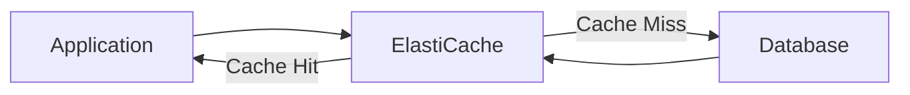
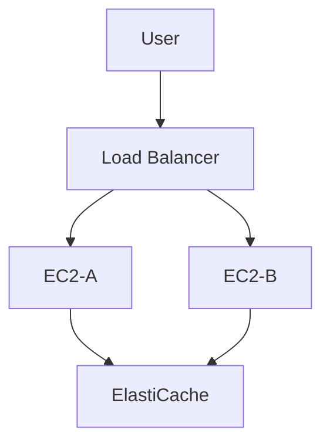
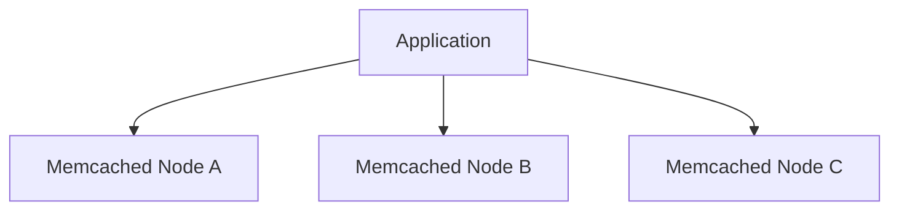
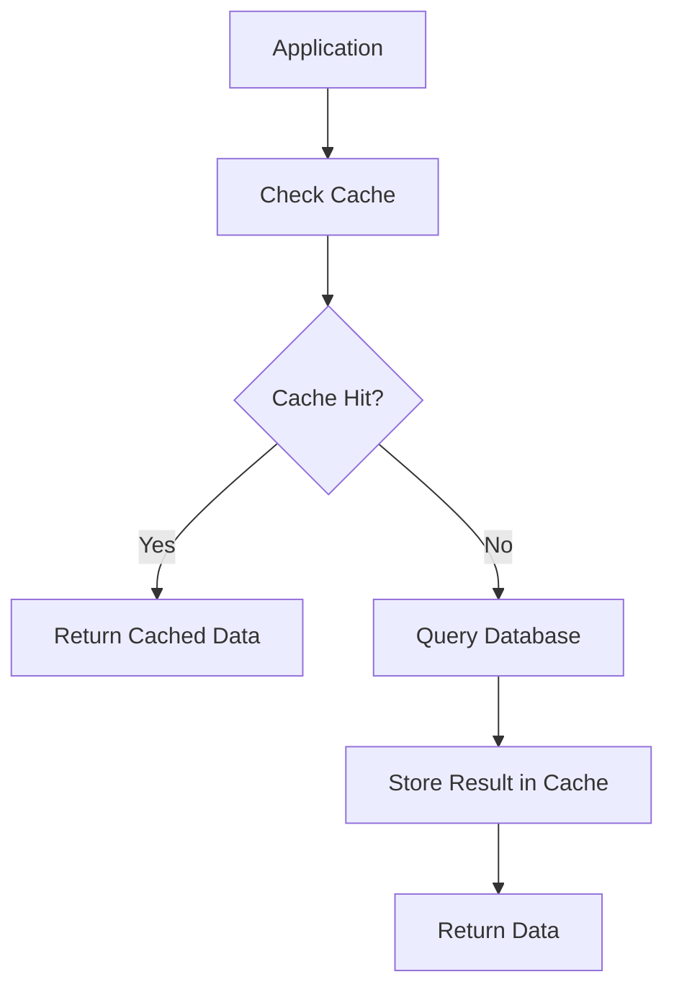
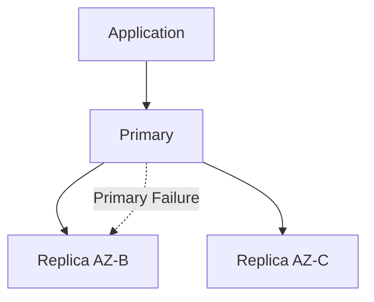
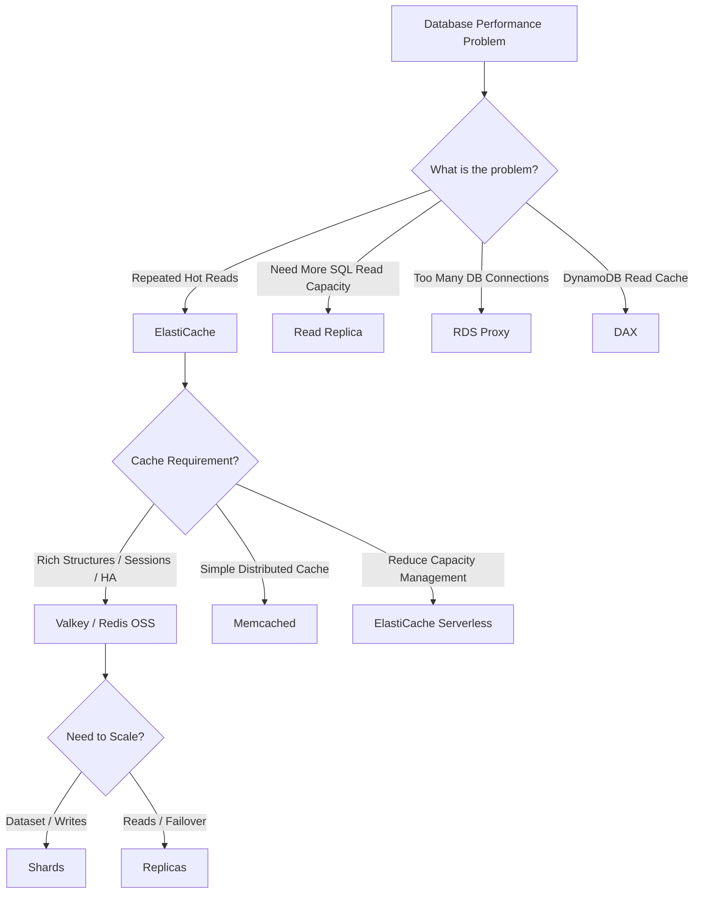
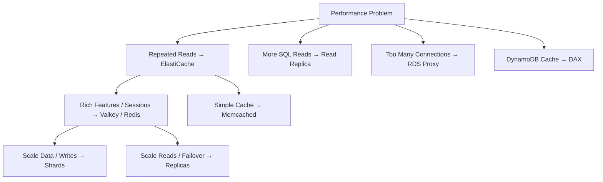

# Amazon ElastiCache — Managed In-Memory Caching

## 📑 Table of Contents

1. [Mental Model](#1-mental-model)
2. [Core Purpose](#2-core-purpose)
3. [Engines and Deployment Modes](#3-engines-and-deployment-modes)
4. [Valkey / Redis OSS](#4-valkey--redis-oss)
5. [Memcached](#5-memcached)
6. [Cache Patterns](#6-cache-patterns)
7. [TTL and Invalidation](#7-ttl-and-invalidation)
8. [Scaling](#8-scaling)
9. [High Availability](#9-high-availability)
10. [Durability](#10-durability)
11. [Security and Monitoring](#11-security-and-monitoring)
12. [ElastiCache vs Other Services](#12-elasticache-vs-other-services)
13. [Decision Map](#13-decision-map)
14. [High-Value Exam Traps](#14-high-value-exam-traps)
15. [Scenario Check](#15-scenario-check)
16. [ElastiCache in 30 Seconds](#16-elasticache-in-30-seconds)

---

# 1. Mental Model

> [!TIP]
> 🧠 **Mental Model**
>
> **ElastiCache = Serve reusable data from memory instead of repeatedly hitting the database**
>
> ```text
> Application
>      ↓
> ElastiCache
>    /     \
>  HIT     MISS
>   ↓        ↓
> Fast    Database
> Response    ↓
>          Populate Cache
> ```

The main purpose is:

```text
Repeated Reads
+
Reusable Data
+
Very Low Latency
+
Reduce Database Load
        ↓
Amazon ElastiCache
```

> [!IMPORTANT]
> 🎯 **SAA Memory**
>
> **ElastiCache = CACHE IN MEMORY**
>
> It does not automatically replace the database.
>
> The application still needs a strategy for:
>
> - Cache misses
> - Updates
> - Expiration
> - Invalidation
> - Cache failure

---

# 2. Core Purpose

Without caching:

```text
Application
    ↓
Database
    ↓
Application
```

Every repeated request can reach the database.

With ElastiCache:



Example:

```text
Product Description
Price Catalog
User Session
Leaderboard
Frequently Requested Data
```

can potentially be served from memory instead of repeatedly querying the database.

> [!TIP]
> 💡 **Exam Pattern**
>
> ```text
> Read-Heavy Application
> +
> Same Data Repeatedly Requested
> +
> Database Under Heavy Read Load
> ```
>
> → **Amazon ElastiCache**

---

# 3. Engines and Deployment Modes

The important engine choices are:

```text
Valkey / Redis OSS
Memcached
```

ElastiCache also provides **Serverless** deployment options that reduce capacity-management work.

| Option                     | Strong Fit                                                         |
| -------------------------- | ------------------------------------------------------------------ |
| **Valkey / Redis OSS**     | Rich data structures, sessions, leaderboards, replication/failover |
| **Memcached**              | Simple distributed key-value caching                               |
| **ElastiCache Serverless** | Reduce infrastructure/capacity management                          |

> [!IMPORTANT]
> For SAA, the first engine-selection question is usually:
>
> ```text
> Need richer features / HA / replication?
> → Valkey / Redis OSS
>
> Need simple distributed cache?
> → Memcached
> ```

---

# 4. Valkey / Redis OSS

Valkey and Redis OSS support richer caching and data-structure capabilities.

Think:

```text
RICH DATA STRUCTURES
+
REPLICATION
+
FAILOVER
+
SESSIONS
+
LEADERBOARDS
```

Common capabilities include:

- Key-value caching
- Rich data structures
- Sorted sets
- Sessions
- Replication
- Failover configurations

---

## Sorted Sets

A classic exam association is a leaderboard.

```text
Player A → 9500
Player B → 8700
Player C → 7200
```

Sorted sets make Valkey/Redis-compatible engines a natural fit.

> [!TIP]
> 💡 **Exam Pattern**
>
> ```text
> Real-Time Leaderboard
> +
> Ranking
> +
> Very Low Latency
> ```
>
> → **ElastiCache for Valkey / Redis OSS**

---

## Session Storage

Application sessions should generally not depend on one individual EC2 instance if the application needs horizontal scaling.

Bad architecture:

```text
User
 ↓
EC2-A
 ↓
Session stored locally
```

If the next request reaches EC2-B:

```text
Where is the session?
```

Instead:



> [!TIP]
> 💡 **Exam Pattern**
>
> ```text
> Stateless Web Tier
> +
> Shared Session Storage
> +
> Low Latency
> ```
>
> → Consider **ElastiCache for Valkey / Redis OSS**

> [!CAUTION]
> Moving sessions away from EC2 solves **instance-local state**.
>
> It does not automatically mean session data can never be lost.
>
> Availability and durability still depend on the selected configuration.

---

# 5. Memcached

Think:

> **Memcached = Simple Distributed Cache**

Node-based Memcached is a simpler distributed key-value caching model.



Cached data is partitioned across nodes.

Typical characteristics:

```text
Simple
+
Distributed
+
In-Memory Cache
```

> [!IMPORTANT]
> Node-based Memcached does not use the same native primary/replica failover model as Valkey/Redis OSS.

---

## Memcached Serverless Nuance

Do not automatically extend the limitations of classic node-based Memcached to every Serverless deployment.

ElastiCache Serverless provides managed capabilities including scaling and Multi-AZ replication for supported engines such as Memcached.

> [!CAUTION]
> ⚠️ **Exam Trap**
>
> ```text
> Node-Based Memcached
> ≠
> ElastiCache Serverless Memcached
> ```
>
> Deployment mode matters.

---

# 6. Cache Patterns

Understanding the basic cache patterns is useful for architecture questions.

---

## Cache-Aside / Lazy Loading

This is the easiest pattern to remember.

```text
Application
     ↓
Check Cache
     ↓
   HIT?
   /  \
 YES   NO
 ↓      ↓
Return Database
        ↓
     Populate
       Cache
```

Flow:



Advantages:

- Only requested data gets cached
- Reduces repeated database reads

Trade-offs:

- First request is slower
- Cached values can become stale

> [!NOTE]
> 🧠 **Memory**
>
> ```text
> LAZY LOADING
> → Fill cache when data is requested
> ```

---

## Write-Through Application Pattern

The application updates both the database and cache on the write path.

```text
Application
    ↓
Write
  /   \
DB    Cache
```

Think:

```text
WRITE
→ DATABASE + CACHE
```

Advantages:

- Cache can remain fresher when implemented correctly

Trade-offs:

- More work on writes
- Can cache data that is never read
- Database and cache updates are not automatically one atomic distributed transaction

> [!CAUTION]
> ⚠️ **Exam Trap**
>
> ```text
> Write-Through
> ≠
> Atomic DB + Cache Transaction
> ```

---

## Cache-Aside vs Write-Through

| Pattern           | Main Idea                   | Trade-Off                               |
| ----------------- | --------------------------- | --------------------------------------- |
| **Cache-Aside**   | Populate cache after a miss | First read slower / possible stale data |
| **Write-Through** | Update cache on write path  | More write work                         |

> [!IMPORTANT]
> 🧠 **SAA Memory**
>
> ```text
> LAZY
> → CACHE ON READ
>
> WRITE-THROUGH
> → CACHE ON WRITE
> ```

---

# 7. TTL and Invalidation

Cached data eventually needs to be refreshed or removed.

Two important mechanisms are:

```text
TTL
Invalidation
```

---

## TTL

TTL automatically expires cache entries after a selected interval.

```text
Cache Entry
    ↓
   TTL
    ↓
Expire
```

Benefits:

- Limits how old cached data can become

Trade-off:

- Expiration creates cache misses
- Backend load can increase when entries expire

> [!CAUTION]
> ⚠️ **Exam Trap**
>
> TTL does not guarantee that cached data immediately changes when the underlying database changes.

---

## Invalidation

Invalidation explicitly removes or updates cached data when the source changes.

```text
Database Changes
       ↓
Invalidate Cache
       ↓
Next Request Gets Fresh Data
```

Correct invalidation requires careful handling of:

- Race conditions
- Failures
- All application write paths

---

## Cache Stampede

Suppose a popular cache entry expires:

```text
Cache Entry Expires
        ↓
1000 Requests Arrive
        ↓
1000 Database Queries
```

This is a **cache stampede**.

Potential mitigation approaches include:

- Staggered expiration
- Request coalescing
- Controlled refresh

> [!IMPORTANT]
> Always consider what happens when the cache is:
>
> ```text
> COLD
> or
> UNAVAILABLE
> ```
>
> The database must still be able to handle the resulting load appropriately.

---

# 8. Scaling

There are different ways to scale ElastiCache.

Understanding the difference between **shards** and **replicas** is particularly important.

---

## Larger Nodes

Increasing node size provides more resources such as memory.

Think:

```text
BIGGER NODE
→ MORE CAPACITY PER NODE
```

---

## Shards

Sharding partitions the dataset.

```text
Dataset
   ↓
┌───────┬───────┬───────┐
│Shard A│Shard B│Shard C│
└───────┴───────┴───────┘
```

Think:

> **SHARD = SPLIT DATA**

Shards can help distribute:

- Dataset
- Write load
- Processing load

for compatible clustered workloads.

---

## Read Replicas

Replicas copy data from a primary.

```text
        Primary
       /       \
Replica A     Replica B
```

Think:

> **REPLICA = COPY DATA**

Replicas can:

- Offload eligible reads
- Provide failover targets

> [!CAUTION]
> ⚠️ **Exam Trap**
>
> More replicas do not create additional independent writers for the same shard.

---

## Sharding vs Replication

```text
SHARDING
→ SPLIT DATA

REPLICATION
→ COPY DATA
```

> [!IMPORTANT]
> 🎯 **SAA Memory**
>
> ```text
> SHARD
> → SCALE DATA / WRITES
>
> REPLICA
> → SCALE READS / FAILOVER
> ```

---

# 9. High Availability

Valkey/Redis-compatible deployments can use replication and failover configurations.

Conceptually:



Multi-AZ failover can improve availability.

However:

> [!CAUTION]
> ⚠️ **Exam Trap**
>
> Ordinary asynchronous replication can potentially lose very recent writes during failure.
>
> ```text
> Multi-AZ
> ≠
> Automatically Zero Data Loss
> ```

This matters particularly when using ElastiCache for:

- Sessions
- Important application state

Always ask:

```text
Can losing a recent cached update be tolerated?
```

---

# 10. Durability

Cache data is often treated as disposable or reconstructable.

However, durability capabilities depend on engine and configuration.

Current node-based **ElastiCache for Valkey** supports optional durability using a **Multi-AZ transaction log** in supported configurations.

The important distinction is:

```text
Ordinary Replica Failover
≠
Durable Transaction Log
```

---

## Synchronous Durable Writes

Conceptually:

```text
Write
 ↓
Persist
 ↓
Acknowledge
```

This prioritizes durability.

---

## Asynchronous Durable Writes

Conceptually:

```text
Write
 ↓
Acknowledge
 ↓
Persistence
```

This can reduce latency but may allow recent-write loss.

---

> [!CAUTION]
> ⚠️ **Exam Trap**
>
> Durability does not mean cached data can never disappear.
>
> Policies such as:
>
> - TTL
> - Eviction
> - Application deletion
>
> still matter.

---

## ElastiCache vs MemoryDB for Durability

If the requirement describes the in-memory system as the **primary durable database**, compare the requirement with MemoryDB rather than automatically assuming a traditional cache architecture.

Think:

```text
CACHE
→ ElastiCache

DURABLE IN-MEMORY PRIMARY DATABASE
→ Compare MemoryDB / supported durable configuration
```

---

# 11. Security and Monitoring

## Security

Depending on engine and deployment configuration, ElastiCache can use mechanisms such as:

- VPC isolation
- Security Groups
- TLS / encryption
- Authentication
- RBAC

> [!CAUTION]
> Do not assume every security feature applies identically to every engine and deployment mode.

---

## Monitoring

Important metrics include:

- Cache hit rate
- Memory usage
- Evictions
- CPU
- Connections
- Replication lag where applicable

---

## Cache Hit Rate

```text
Request
 ↓
Found in Cache?
```

High hit rate generally means the cache is serving a useful portion of requests.

A low hit rate might indicate:

- Poor cache keys
- Wrong data being cached
- TTL too short
- Ineffective caching strategy

> [!CAUTION]
> A low hit rate does not automatically mean:
>
> ```text
> "Buy a bigger cache node."
> ```
>
> The caching strategy itself may be the problem.

---

# 12. ElastiCache vs Other Services

This section is extremely important for SAA.

---

## ElastiCache vs RDS / Aurora Read Replica

```text
ElastiCache
→ CACHE EXISTING RESULTS

Read Replica
→ EXECUTE DATABASE READ QUERIES
```

Example:

```text
Same product description requested
thousands of times
        ↓
ElastiCache
```

versus:

```text
Need more SQL read capacity
+
Queries still need database execution
        ↓
Read Replica
```

> [!IMPORTANT]
> 🎯 **Don't Confuse**
>
> ```text
> REPEATED HOT DATA
> → ElastiCache
>
> MORE SQL READ CAPACITY
> → Read Replica
> ```

---

## ElastiCache vs DAX

```text
ElastiCache
→ General application caching

DAX
→ DynamoDB-specific caching
```

> [!TIP]
> 💡 **Exam Pattern**
>
> ```text
> DynamoDB
> +
> Repeated Eventually Consistent Reads
> +
> Very Low Latency
> ```
>
> → **DAX**

---

## ElastiCache vs RDS Proxy

These solve completely different problems.

```text
ElastiCache
→ TOO MANY REPEATED READS

RDS Proxy
→ TOO MANY DATABASE CONNECTIONS
```

Architecture:

```text
Repeated Data?
→ ElastiCache

Connection Storm?
→ RDS Proxy
```

> [!CAUTION]
> ⚠️ **Exam Trap**
>
> RDS Proxy is not a data cache.

---

## ElastiCache vs MemoryDB

```text
ElastiCache
→ Cache

MemoryDB
→ Durable in-memory primary database
```

Durability requirements should be evaluated explicitly rather than assuming all in-memory services provide identical guarantees.

---

## Quick Comparison

| Requirement                         | Starting Point                                 |
| ----------------------------------- | ---------------------------------------------- |
| Repeated application/database reads | **ElastiCache**                                |
| More relational read-query capacity | **RDS/Aurora Read Replica**                    |
| DynamoDB-specific cache             | **DAX**                                        |
| Too many relational DB connections  | **RDS Proxy**                                  |
| Leaderboard / sorted sets           | **Valkey / Redis OSS**                         |
| Shared low-latency sessions         | **Valkey / Redis OSS**                         |
| Durable in-memory primary database  | **MemoryDB / evaluate durability requirement** |

---

# 13. Decision Map



---

# 14. High-Value Exam Traps

> [!CAUTION]
> ⚠️ **Trap 1 — Cache vs Read Replica**
>
> ```text
> Repeated Same Data
> → ElastiCache
>
> More SQL Query Capacity
> → Read Replica
> ```

---

> [!CAUTION]
> ⚠️ **Trap 2 — ElastiCache vs RDS Proxy**
>
> ```text
> Too Many Reads
> → ElastiCache
>
> Too Many Connections
> → RDS Proxy
> ```

---

> [!CAUTION]
> ⚠️ **Trap 3 — DynamoDB**
>
> ```text
> DynamoDB-Specific Cache
> → DAX
> ```

---

> [!CAUTION]
> ⚠️ **Trap 4 — Replication vs Sharding**
>
> ```text
> REPLICATION
> → COPY DATA
>
> SHARDING
> → SPLIT DATA
> ```

---

> [!CAUTION]
> ⚠️ **Trap 5 — Write Scaling**
>
> More replicas do not scale the write workload of one primary shard.

---

> [!CAUTION]
> ⚠️ **Trap 6 — Multi-AZ**
>
> ```text
> Multi-AZ
> ≠
> Guaranteed Zero Recent-Write Loss
> ```
>
> Ordinary asynchronous replication may lose recent writes during failure.

---

> [!CAUTION]
> ⚠️ **Trap 7 — TTL**
>
> TTL bounds how long cached values live.
>
> It does not guarantee immediate freshness after the underlying database changes.

---

> [!CAUTION]
> ⚠️ **Trap 8 — Write-Through**
>
> ```text
> Database Write
> +
> Cache Write
> ```
>
> does not automatically create one atomic distributed transaction.

---

> [!CAUTION]
> ⚠️ **Trap 9 — Cache Failure**
>
> The database still needs to survive an appropriate amount of traffic if the cache becomes cold or unavailable.

---

> [!CAUTION]
> ⚠️ **Trap 10 — Memcached Serverless**
>
> Do not apply every limitation of classic node-based Memcached to ElastiCache Serverless Memcached.
>
> Deployment mode matters.

---

> [!CAUTION]
> ⚠️ **Trap 11 — Durability**
>
> Durable cache configuration does not disable:
>
> - TTL expiration
> - Eviction
> - Application deletion

---

# 15. Scenario Check

## Scenario 1 — Repeated Product Data

> An e-commerce application repeatedly reads product descriptions from a relational database. Product descriptions change infrequently and brief staleness is acceptable.

```text
Repeated Reads
+
Reusable Data
+
Staleness Acceptable
        ↓
ElastiCache
```

A cache-aside pattern with appropriate TTL/invalidation can reduce database load.

---

## Scenario 2 — Latest Inventory

> Every request must reflect the latest committed inventory value.

```text
Strict Freshness Requirement
        ↓
Ordinary Eventual Cache
may not be appropriate
```

Do not choose ElastiCache merely because it is faster.

---

## Scenario 3 — Leaderboard

> A gaming application needs a real-time leaderboard with score ranking.

```text
Leaderboard
+
Sorted Data
+
Low Latency
        ↓
Valkey / Redis OSS
```

---

## Scenario 4 — User Sessions

> An application runs on an Auto Scaling group behind an ALB. User sessions must not be tied to an individual EC2 instance.

```text
EC2-A ─┐
       ├── Shared Session Store
EC2-B ─┘
          ↓
   ElastiCache Valkey / Redis OSS
```

---

## Scenario 5 — More SQL Reads

> An application has many different complex SQL queries and needs additional relational database read capacity.

```text
More SQL Read Capacity
        ↓
RDS / Aurora Read Replica
```

Not necessarily ElastiCache.

---

## Scenario 6 — Too Many Connections

> Thousands of Lambda invocations create too many short-lived connections to an RDS database.

```text
Connection Problem
        ↓
RDS Proxy
```

Not ElastiCache.

---

## Scenario 7 — DynamoDB Cache

> A DynamoDB application repeatedly reads the same eventually consistent items and requires extremely low latency.

```text
DynamoDB
+
Repeated Reads
        ↓
DAX
```

---

## Scenario 8 — Scaling Writes

> A clustered Valkey workload needs to distribute a growing dataset and write workload.

```text
Scale Dataset / Writes
        ↓
More Shards
```

Not simply more read replicas.

---

# 16. ElastiCache in 30 Seconds



> [!NOTE]
> 🧠 **SAA Memory**
>
> **ELASTICACHE → IN-MEMORY CACHE**
>
> **VALKEY / REDIS → RICH FEATURES + SESSIONS + LEADERBOARDS**
>
> **MEMCACHED → SIMPLE DISTRIBUTED CACHE**
>
> **CACHE-ASIDE → CACHE ON READ**
>
> **WRITE-THROUGH → CACHE ON WRITE**
>
> **TTL → EXPIRE**
>
> **SHARDS → SPLIT DATA / SCALE WRITES**
>
> **REPLICAS → COPY DATA / SCALE READS / FAILOVER**
>
> **READ REPLICA → MORE SQL READ CAPACITY**
>
> **DAX → DYNAMODB CACHE**
>
> **RDS PROXY → CONNECTION POOL**
>
> ---
>
> Fastest distinction:
>
> ```text
> SAME DATA AGAIN?
> → ElastiCache
>
> MORE SQL READS?
> → Read Replica
>
> TOO MANY CONNECTIONS?
> → RDS Proxy
>
> DYNAMODB CACHE?
> → DAX
> ```

---

# 🔗 Related Notes

## Database

- [Database Overview](database_overview.md)
- [Amazon RDS](aws_rds.md)
- [Amazon Aurora](aws_aurora.md)
- [Amazon DynamoDB](aws_dynamodb.md)

---

# 📚 Study Order

1. ElastiCache Mental Model
2. Valkey / Redis vs Memcached
3. Cache-Aside
4. Write-Through
5. TTL / Invalidation
6. Shards vs Replicas
7. High Availability
8. ElastiCache vs Read Replica
9. ElastiCache vs DAX
10. ElastiCache vs RDS Proxy
11. Exam Traps
12. Durability Details

---

# 📚 Sources

- Amazon ElastiCache — Architecture and Deployment Options
- Amazon ElastiCache — Multi-AZ Failover
- Amazon ElastiCache — Caching Strategies
- Amazon ElastiCache — Durability
- Amazon ElastiCache — Durability and Eviction Options

---

**Reviewed:** 2026-09-24  
**Focus:** SAA-C03 caching strategies, engine selection, scaling, high availability and database performance.
