# Amazon RDS — Relational Database Service

## 📑 Table of Contents

1. [Mental Model](#1-mental-model)
2. [RDS Engines](#2-rds-engines)
3. [Availability and Read Scaling](#3-availability-and-read-scaling)
4. [Multi-AZ DB Instance](#4-multi-az-db-instance)
5. [Multi-AZ DB Cluster](#5-multi-az-db-cluster)
6. [Read Replicas](#6-read-replicas)
7. [Solve the Actual Bottleneck](#7-solve-the-actual-bottleneck)
8. [Backups, Snapshots and PITR](#8-backups-snapshots-and-pitr)
9. [Security and Authentication](#9-security-and-authentication)
10. [RDS Proxy](#10-rds-proxy)
11. [Monitoring and Operations](#11-monitoring-and-operations)
12. [RDS Decision Map](#12-rds-decision-map)
13. [RDS vs Other Databases](#13-rds-vs-other-databases)
14. [High-Value Exam Traps](#14-high-value-exam-traps)
15. [Scenario Check](#15-scenario-check)
16. [RDS in 30 Seconds](#16-rds-in-30-seconds)

---

# 1. Mental Model

> [!TIP]
> 🧠 **Mental Model**
>
> **Amazon RDS = Managed relational database infrastructure**
>
> AWS manages much of the infrastructure:
>
> - Hardware
> - OS maintenance
> - Database software patching
> - Backups
> - Failover mechanisms
> - Monitoring integration
>
> You still manage:
>
> - Schema
> - Queries
> - Indexes
> - Database users and privileges
> - Capacity decisions
> - Recovery strategy
> - Application connectivity

The most important exam distinction is:

```text
Availability problem?
→ Multi-AZ

Read scaling problem?
→ Read Replica

Connection problem?
→ RDS Proxy

Repeated expensive reads?
→ ElastiCache

Accidental DELETE / logical corruption?
→ PITR / Snapshot Restore
```

> [!IMPORTANT]
> 🎯 **SAA Memory**
>
> **Multi-AZ → HA**
>
> **Read Replica → READ SCALING**
>
> **RDS Proxy → CONNECTION SCALING**
>
> **ElastiCache → CACHE**
>
> **PITR → RECOVERY**

---

# 2. RDS Engines

Amazon RDS supports relational database engines including:

- MySQL
- PostgreSQL
- MariaDB
- Oracle
- Microsoft SQL Server
- IBM Db2

Amazon Aurora is also part of Amazon RDS, but has a different architecture.

See [Amazon Aurora](aws_aurora.md).

> [!TIP]
> 💡 **Exam Pattern**
>
> Existing relational application requiring SQL, transactions and a familiar relational engine:
>
> → **RDS / Aurora**
>
> Don't jump to DynamoDB simply because the workload needs scalability.

---

# 3. Availability and Read Scaling

This is one of the most important RDS topics for SAA.

| Deployment                | Replication / Topology                          |            Read Scaling |               Failover |
| ------------------------- | ----------------------------------------------- | ----------------------: | ---------------------: |
| **Single-AZ DB Instance** | One DB instance                                 |                      ❌ | ❌ No Multi-AZ standby |
| **Multi-AZ DB Instance**  | Primary + synchronous standby                   | ❌ Standby not readable |           ✅ Automatic |
| **Multi-AZ DB Cluster**   | 1 writer + 2 readable DB instances across 3 AZs |                      ✅ |                     ✅ |
| **Read Replica**          | Generally asynchronous                          |                      ✅ |     Promotion possible |

> [!CAUTION]
> ⚠️ **Exam Trap**
>
> The statement:
>
> **"Multi-AZ standby cannot serve reads"**
>
> applies to the classic **Multi-AZ DB Instance** architecture.
>
> It does **not** describe every Multi-AZ RDS deployment.

---

# 4. Multi-AZ DB Instance

Classic Multi-AZ:

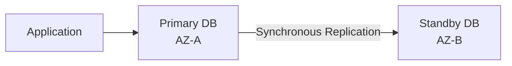

The standby exists for **High Availability**, not read scaling.

```text
Primary
  ↓
Reads + Writes

Standby
  ↓
HA / Failover
```

If the primary fails:

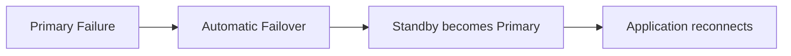

> [!IMPORTANT]
> 🎯 **SAA Memory**
>
> **Multi-AZ DB Instance = HA**
>
> NOT:
>
> **Read Scaling**

Applications should use the RDS endpoint rather than hardcoding an underlying IP address.

Existing database connections can break during failover, so applications should implement appropriate retry and reconnection logic.

---

## What Multi-AZ Protects Against

Think:

```text
Instance Failure
AZ Failure
Planned Maintenance
Infrastructure Failure
        ↓
Automatic Failover
```

But it does **not** solve logical corruption.

```text
DELETE FROM customers;
```

If that legitimate SQL operation reaches the primary, the database replication mechanism can propagate the resulting change.

> [!CAUTION]
> ⚠️ **Exam Trap**
>
> **Multi-AZ ≠ protection from accidental DELETE**
>
> For logical recovery:
>
> → **PITR / Snapshot Restore**

---

# 5. Multi-AZ DB Cluster

A Multi-AZ DB Cluster has:

```text
1 Writer
+
2 Readable DB Instances
+
3 Availability Zones
```

Conceptually:

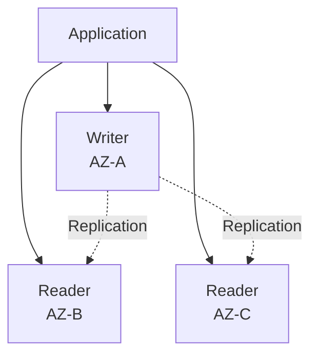

Unlike the standby of a classic Multi-AZ DB Instance, the additional DB instances can serve read traffic.

> [!IMPORTANT]
> 🎯 **Don't Confuse**
>
> ```text
> Multi-AZ DB Instance
> → Standby NOT readable
>
> Multi-AZ DB Cluster
> → Additional instances ARE readable
> ```

This can provide both:

```text
High Availability
       +
Read Capacity
```

for supported configurations.

---

# 6. Read Replicas

Read Replicas are primarily for **read scaling**.

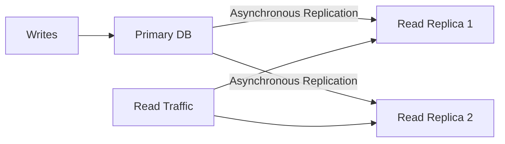

Typical use cases:

- Reporting
- Analytics queries
- Read-heavy applications
- Offloading reads from the primary
- Regional read capacity

> [!TIP]
> 💡 **Exam Pattern**
>
> **Database is overloaded by SELECT queries**
>
> → **Read Replica**

---

## Replication Lag

Read Replica replication is generally asynchronous.

Therefore:

```text
Write → Primary
        ↓
Replication
        ↓
Read Replica
```

There can be **replication lag**.

If an application requires the absolute latest data immediately after a write, consider whether reading from a replica satisfies that consistency requirement.

---

## Promotion

A Read Replica can be promoted to become an independent writable database.

```text
Read Replica
     ↓
Promotion
     ↓
Independent DB
```

> [!CAUTION]
> ⚠️ **Exam Trap**
>
> **Read Replica promotion ≠ Multi-AZ automatic failover**
>
> Multi-AZ:
>
> → HA / automatic failover
>
> Read Replica:
>
> → Read scaling / can be promoted

---

## Cross-Region Read Replicas

Supported engines can use Cross-Region Read Replicas for scenarios such as:

- Regional reads
- Geographic distribution
- DR architectures

But recovery planning must consider:

- Replication lag
- Promotion
- Application redirection
- DNS / endpoint changes

---

# 7. Solve the Actual Bottleneck

Do not automatically answer every RDS performance question with "Read Replica."

Identify the bottleneck first.

| Bottleneck         | Evaluate                               |
| ------------------ | -------------------------------------- |
| CPU / Memory       | Query tuning, indexes, instance sizing |
| Storage I/O        | gp3 / Provisioned IOPS as appropriate  |
| Storage Capacity   | Storage Autoscaling                    |
| Read Traffic       | Read Replicas                          |
| Repeated hot reads | [ElastiCache](aws_elasticache.md)      |
| Connection spikes  | RDS Proxy                              |
| Bad SQL            | Query / index optimization             |

---

## Storage Autoscaling

Storage Autoscaling increases database storage when required.

```text
Storage becoming full
        ↓
Storage Autoscaling
        ↓
Increase Storage Capacity
```

It does **not**:

- Add CPU
- Fix inefficient SQL
- Add writer capacity
- Horizontally scale writes
- Automatically shrink storage

> [!CAUTION]
> ⚠️ **Exam Trap**
>
> **Storage Autoscaling scales STORAGE, not compute.**

---

## Read Replica vs ElastiCache

```text
Need more SQL read capacity
→ Read Replica

Repeated requests for same hot data
→ ElastiCache
```

Example:

```text
SELECT product WHERE id = 123
SELECT product WHERE id = 123
SELECT product WHERE id = 123
SELECT product WHERE id = 123
```

If the same data is repeatedly requested and some caching is acceptable:

```text
Application
    ↓
ElastiCache ⚡
    ↓ cache miss
RDS
```

---

# 8. Backups, Snapshots and PITR

Three concepts to distinguish:

```text
Automated Backups
Manual Snapshots
Point-in-Time Recovery
```

---

## Automated Backups

Automated backups plus transaction logs support Point-in-Time Recovery within the configured retention window.

For supported RDS configurations, backup retention can generally be configured up to **35 days**.

---

## Manual Snapshots

A manual snapshot represents a chosen recovery point.

```text
Database
   ↓
Manual Snapshot
   ↓
Retained until deleted
```

Unlike automated backups, manual snapshots are not simply removed because the automated backup retention window expires.

---

## Point-in-Time Recovery

PITR allows restoration to a specific point within the available recovery window.

Example:

```text
10:00 Database OK
10:05 Database OK
10:07 Accidental DELETE 💀
10:10 Problem discovered
```

Restore approximately:

```text
→ 10:06
```

> [!TIP]
> 💡 **Exam Pattern**
>
> **Accidental DELETE / logical corruption**
>
> → **PITR**

Not Multi-AZ failover.

---

## Restore Behavior

A restore creates a **new DB resource**.

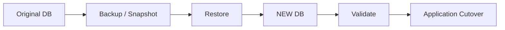

> [!CAUTION]
> ⚠️ **Exam Trap**
>
> Restore does not magically rewind the existing database in place.
>
> **Restore → New DB resource**

Recovery planning should include:

- Validation
- Networking
- Security groups
- Parameters
- Application endpoints
- Application cutover

---

## Snapshot Sharing

Snapshots can be copied or shared where supported.

For encrypted cross-account snapshot workflows, pay attention to:

```text
Customer-Managed KMS Key
        +
KMS Permissions
        +
Snapshot Permissions
```

> [!WARNING]
> An AWS-managed KMS key is not a general solution for cross-account encrypted snapshot sharing.

---

# 9. Security and Authentication

A common architecture is:

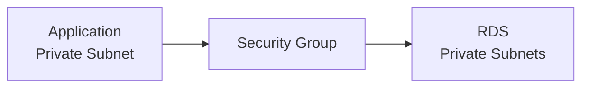

Common security controls include:

- Private network placement
- DB subnet groups
- Security Groups
- KMS encryption at rest
- TLS encryption in transit
- Database authentication
- Secrets Manager

---

## Security Groups

Prefer allowing database access from the application's **Security Group**, rather than broad CIDR ranges when appropriate.

Example:

```text
RDS Security Group

Inbound:
TCP 5432
Source: Application-SG
```

---

## IAM Database Authentication

IAM DB Authentication allows supported database engines/configurations to use temporary authentication tokens.

Conceptually:

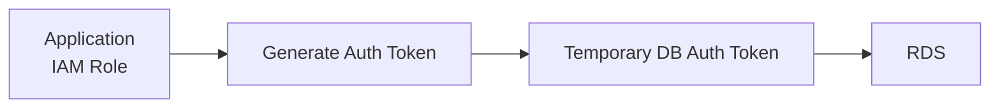

The IAM principal needs appropriate permission such as:

```text
rds-db:connect
```

The generated token is short-lived and is used to initiate authentication.

> [!IMPORTANT]
> 🎯 **SAA Memory**
>
> IAM DB Authentication does **not** eliminate database users or SQL privileges.
>
> ```text
> IAM
> → Can authenticate/connect
>
> Database privileges
> → What SQL operations the user can perform
> ```

---

## Secrets Manager

Secrets Manager can store and rotate supported database credentials.

```text
Application
    ↓
Secrets Manager
    ↓
Username + Password
    ↓
RDS
```

Do not confuse it with IAM DB Authentication.

| Mechanism                 | Model                                   |
| ------------------------- | --------------------------------------- |
| **Secrets Manager**       | Store / rotate database credentials     |
| **IAM DB Authentication** | Generate temporary authentication token |

---

# 10. RDS Proxy

RDS Proxy manages and reuses database connections.

Without Proxy:

```text
Lambda ─┐
Lambda ─┤
Lambda ─┼──→ Thousands of DB connections → RDS 😵
Lambda ─┤
Lambda ─┘
```

With Proxy:

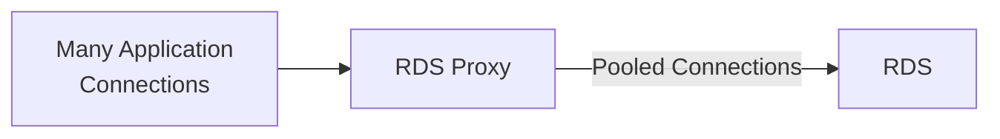

This is particularly useful for applications with:

- Large connection spikes
- Many short-lived connections
- Serverless workloads such as Lambda
- Failover scenarios where connection handling matters

> [!TIP]
> 💡 **Exam Pattern**
>
> **Lambda + RDS + too many connections**
>
> → **RDS Proxy**

---

## What RDS Proxy Does NOT Do

RDS Proxy does not:

- Cache query results
- Increase CPU
- Add storage
- Create unlimited database capacity
- Replace Read Replicas

> [!CAUTION]
> ⚠️ **Exam Trap**
>
> **RDS Proxy = CONNECTION POOL**
>
> **ElastiCache = DATA CACHE**

---

# 11. Monitoring and Operations

| Tool / Feature                   | Purpose                                                   |
| -------------------------------- | --------------------------------------------------------- |
| **CloudWatch Metrics**           | CPU, connections, storage, latency and other metrics      |
| **Enhanced Monitoring**          | OS/process-level metrics                                  |
| **CloudWatch Database Insights** | Database load, waits and SQL performance analysis         |
| **CloudTrail**                   | RDS control-plane API auditing                            |
| **Blue/Green Deployments**       | Test supported changes before controlled switchover       |
| **RDS Custom**                   | Greater OS/database customization for supported workloads |

---

## CloudWatch vs Enhanced Monitoring vs Database Insights

> [!IMPORTANT]
> 🎯 **SAA Memory**
>
> ```text
> General DB Metrics
> → CloudWatch
>
> OS / Process Metrics
> → Enhanced Monitoring
>
> SQL / DB Load / Waits
> → Database Insights
>
> AWS API Activity
> → CloudTrail
> ```

---

## Enhanced Monitoring

If the question asks:

> "Which processes or threads are consuming CPU/memory on the RDS host?"

Think:

```text
Enhanced Monitoring
```

---

## Database Insights

For database-performance analysis involving:

- DB load
- SQL
- Wait events
- Database bottlenecks

think:

```text
CloudWatch Database Insights
```

---

## CloudTrail

CloudTrail records AWS API activity related to RDS resources.

It is **not** a replacement for SQL/database audit logging.

```text
CreateDBInstance
ModifyDBInstance
DeleteDBInstance
        ↓
CloudTrail
```

Not:

```sql
SELECT *
FROM customers;
```

---

## Blue/Green Deployments

Blue/Green Deployments allow supported changes to be tested in a separate environment before a controlled switchover.

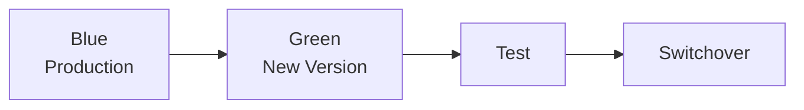

> [!WARNING]
> Blue/Green reduces deployment risk.
>
> It does not imply zero downtime or support every possible engine/change.

---

## RDS Custom

Ordinary RDS does not provide normal administrator/SSH access to the underlying host.

When supported workloads require deeper OS/database customization:

```text
More Control
    ↓
RDS Custom
```

If requirements exceed the managed-service boundaries entirely:

```text
Database on EC2
```

may be necessary, with greater operational responsibility.

---

# 12. RDS Decision Map

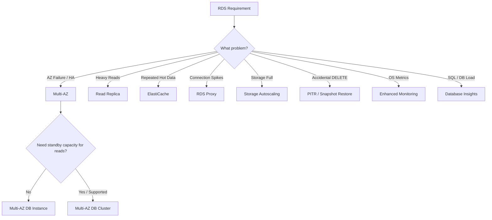

---

# 13. RDS vs Other Databases

| Requirement                                                       | Think                             |
| ----------------------------------------------------------------- | --------------------------------- |
| Traditional relational database                                   | **RDS**                           |
| MySQL/PostgreSQL-compatible AWS-optimized relational architecture | [Aurora](aws_aurora.md)           |
| Key-value/document, massive scale                                 | [DynamoDB](aws_dynamodb.md)       |
| Data warehouse / analytical SQL                                   | [Redshift](aws_redshift.md)       |
| Repeated hot data / caching                                       | [ElastiCache](aws_elasticache.md) |

---

# 14. High-Value Exam Traps

> [!WARNING]
> **Trap 1 — Multi-AZ vs Read Replica**
>
> ```text
> Multi-AZ → HA
> Read Replica → Read Scaling
> ```

---

> [!WARNING]
> **Trap 2 — Multi-AZ DB Instance vs DB Cluster**
>
> ```text
> DB Instance Standby
> → NOT readable
>
> DB Cluster additional instances
> → Readable
> ```

---

> [!WARNING]
> **Trap 3 — Read Replicas**
>
> Read Replicas do **not** add writer capacity.

---

> [!WARNING]
> **Trap 4 — Logical Corruption**
>
> Multi-AZ replication does not undo:
>
> ```sql
> DELETE FROM customers;
> ```
>
> Think **PITR / Restore**.

---

> [!WARNING]
> **Trap 5 — RDS Proxy**
>
> ```text
> RDS Proxy → Connections
> ElastiCache → Cached Data
> ```

---

> [!WARNING]
> **Trap 6 — Restore**
>
> Backup / PITR restore creates a **new DB resource**.
>
> Plan application cutover.

---

> [!WARNING]
> **Trap 7 — IAM**
>
> Permission to manage an RDS resource through AWS APIs does not automatically grant permission to execute SQL inside the database.

---

> [!WARNING]
> **Trap 8 — Storage Autoscaling**
>
> Storage Autoscaling:
>
> → increases storage
>
> It does not automatically:
>
> → increase CPU  
> → scale writes  
> → fix queries

---

# 15. Scenario Check

## Scenario 1 — AZ Failure

> A production relational database must automatically recover if its Availability Zone fails.

```text
High Availability
       ↓
Multi-AZ
```

---

## Scenario 2 — Heavy Reporting Queries

> Reporting queries are overloading the primary database.

```text
Read Scaling
     ↓
Read Replica
```

---

## Scenario 3 — Lambda Connection Storm

> Thousands of Lambda invocations create too many connections to RDS.

```text
Connection Scaling
       ↓
RDS Proxy
```

---

## Scenario 4 — Repeated Hot Reads

> The application repeatedly requests the same frequently accessed data and can tolerate caching.

```text
Repeated Hot Data
       ↓
ElastiCache
```

---

## Scenario 5 — Accidental DELETE

> An administrator accidentally deletes production records and the mistake is discovered several minutes later.

```text
Logical Corruption
       ↓
PITR
       ↓
Restore NEW DB
       ↓
Validate
       ↓
Application Cutover
```

Not Multi-AZ.

---

## Scenario 6 — HA + Readable Standby Capacity

> A company needs AZ-level failover and also wants the additional database instances to serve reporting reads.

```text
HA
+
Readable Instances
       ↓
Multi-AZ DB Cluster
```

A classic Multi-AZ DB Instance standby cannot serve those reads.

---

## Scenario 7 — Process-Level CPU Investigation

> CPU usage is high and administrators need OS/process-level information from the RDS host.

```text
Enhanced Monitoring
```

---

# 16. RDS in 30 Seconds

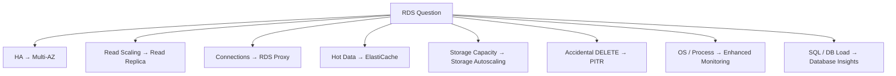

> [!NOTE]
> 🧠 **SAA Memory**
>
> **Multi-AZ → HA**
>
> **Read Replica → READ SCALING**
>
> **Multi-AZ DB Instance standby → NOT readable**
>
> **Multi-AZ DB Cluster → readable additional instances**
>
> **RDS Proxy → CONNECTION POOL**
>
> **ElastiCache → DATA CACHE**
>
> **Storage Autoscaling → STORAGE only**
>
> **PITR → logical recovery**
>
> **Restore → NEW DB**
>
> **Enhanced Monitoring → OS / PROCESS**
>
> **Database Insights → SQL / DB LOAD**
>
> **CloudTrail → AWS API activity**

---

# 🔗 Related Notes

## Database

- [Database Overview](database_overview.md)
- [Amazon Aurora](aws_aurora.md)
- [Amazon DynamoDB](aws_dynamodb.md)
- [Amazon ElastiCache](aws_elasticache.md)
- [Amazon Redshift](aws_redshift.md)
- [AWS DMS](aws_dms.md)

## Security

- [AWS IAM](../Security/aws_iam.md)

## Networking

- [Amazon VPC](../Networking/aws_vpc.md)

---

# 📚 Sources

- AWS RDS — Multi-AZ deployments
- AWS RDS — Multi-AZ DB clusters
- AWS RDS — Read replicas
- AWS RDS — Point-in-Time Recovery
- AWS RDS Proxy
- AWS RDS — IAM database authentication
- CloudWatch Database Insights

---

**Reviewed:** 2026-09-23  
**Focus:** SAA-C03 RDS architecture decisions, availability, scaling and recovery.
