# Amazon API Gateway — Managed Front Door for APIs

## 📑 Table of Contents

1. [Mental Model](#1-mental-model)
2. [API Types](#2-api-types)
3. [Integrations](#3-integrations)
4. [API Gateway + Lambda](#4-api-gateway--lambda)
5. [Authentication and Authorization](#5-authentication-and-authorization)
6. [Throttling](#6-throttling)
7. [API Keys and Usage Plans](#7-api-keys-and-usage-plans)
8. [Caching](#8-caching)
9. [Stages and Deployments](#9-stages-and-deployments)
10. [Canary Deployments](#10-canary-deployments)
11. [Endpoint Types](#11-endpoint-types)
12. [CORS](#12-cors)
13. [Request and Response Transformation](#13-request-and-response-transformation)
14. [API Gateway + WAF](#14-api-gateway--waf)
15. [API Gateway vs Other Services](#15-api-gateway-vs-other-services)
16. [API Gateway Decision Map](#16-api-gateway-decision-map)
17. [High-Value Exam Traps](#17-high-value-exam-traps)
18. [Scenario Check](#18-scenario-check)
19. [API Gateway in 30 Seconds](#19-api-gateway-in-30-seconds)

---

# 1. Mental Model

> [!TIP]
> 🧠 **Mental Model**
>
> **API Gateway = Managed Front Door for APIs**
>
> ```text
> Client
>   ↓
> API Gateway
>   ↓
> Backend
> ├── Lambda
> ├── HTTP Endpoint
> └── AWS Service
> ```

Amazon API Gateway is a managed service for creating, publishing, securing, monitoring, and managing APIs.

A very common serverless architecture:

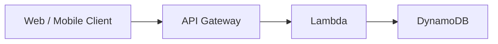

API Gateway commonly handles concerns such as:

- API routing
- Authentication and authorization
- Throttling
- Caching
- API lifecycle and deployments
- Monitoring
- Request/response processing

> [!IMPORTANT]
> 🎯 **SAA Memory**
>
> ```text
> Need to expose/manage an API?
> → API Gateway
>
> API + Serverless Backend?
> → API Gateway + Lambda
> ```

---

# 2. API Types

API Gateway provides three important API types:

| API Type          | Think                            |
| ----------------- | -------------------------------- |
| **REST API**      | Full API management features     |
| **HTTP API**      | Simpler, lower-cost HTTP APIs    |
| **WebSocket API** | Persistent two-way communication |

---

## REST API

Think:

- RESTful applications
- API keys
- Usage plans
- Caching
- Request/response transformations
- Advanced API management requirements

Example:

```text
GET    /users
POST   /orders
DELETE /items/123
```

> [!TIP]
> 💡 **Exam Pattern**
>
> Need features such as:
>
> ```text
> API Cache
> +
> API Keys / Usage Plans
> +
> Advanced Request Transformation
> ```
>
> → Think **REST API**

---

## HTTP API

Think:

- Simpler HTTP APIs
- Lower cost
- Lower latency
- Lambda or HTTP backends
- Fewer API management features than REST APIs

```text
Client
  ↓
HTTP API
  ↓
Lambda / HTTP Backend
```

> [!TIP]
> 💡 **Exam Pattern**
>
> ```text
> Simple HTTP API
> +
> Cost-effective
> +
> No advanced REST API features required
> ```
>
> → **HTTP API**

---

## WebSocket API

Used for persistent, bidirectional communication.

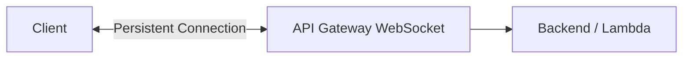

Common use cases:

- Chat applications
- Real-time dashboards
- Live notifications
- Interactive applications

> [!TIP]
> 💡 **Exam Pattern**
>
> **Real-time + two-way communication**
>
> → **WebSocket API**

---

# 3. Integrations

API Gateway sits between the client and backend integration.

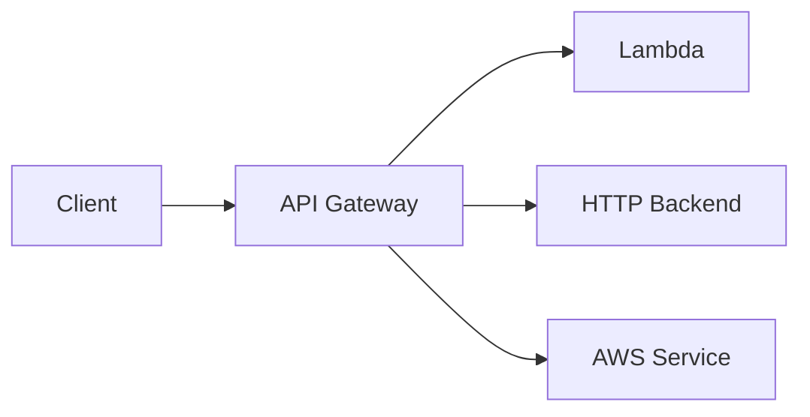

The important mental model is:

```text
Client
   ↓
API Gateway
   ↓
Integration
   ↓
Backend
```

API Gateway does not require Lambda.

> [!CAUTION]
> ⚠️ **Exam Trap**
>
> ```text
> API Gateway
> ≠
> Lambda-only service
> ```

Lambda is simply one of its most common integrations.

---

# 4. API Gateway + Lambda

One of the highest-value SAA architectures:

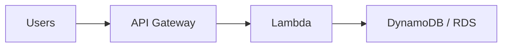

Benefits:

- Serverless
- Automatic scaling
- No EC2 management
- Good fit for unpredictable traffic

> [!TIP]
> 💡 **Exam Pattern**
>
> ```text
> API
> +
> Sudden Traffic Bursts
> +
> No Servers to Manage
> ```
>
> → **API Gateway + Lambda**

See [AWS Lambda](../Compute/aws_lambda.md).

---

# 5. Authentication and Authorization

Do not treat every API security mechanism as interchangeable.

For SAA, remember:

```text
AWS Identity
→ IAM

Application Users
→ Cognito

Custom Authorization Logic
→ Lambda Authorizer
```

---

## IAM Authorization

Think:

**AWS identities**

Requests can be signed using AWS Signature Version 4.

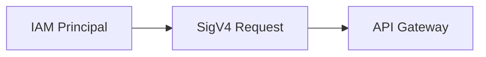

> [!TIP]
> 💡 **Exam Pattern**
>
> AWS principals need controlled access to an API
>
> → **IAM Authorization**

---

## Amazon Cognito

Think:

**Application users**

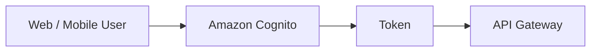

Useful when applications need user identity management.

> [!TIP]
> 💡 **Exam Pattern**
>
> ```text
> Web / Mobile Application
> +
> User Authentication
> ```
>
> → **Amazon Cognito**

---

## Lambda Authorizer

Think:

**Custom authorization logic**

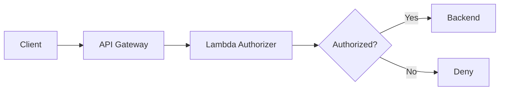

Useful when authorization requires custom logic.

> [!IMPORTANT]
> 🎯 **SAA Memory**
>
> ```text
> AWS Identity
> → IAM
>
> App Users
> → Cognito
>
> Custom Auth Logic
> → Lambda Authorizer
> ```

---

# 6. Throttling

API Gateway can control incoming request rates.

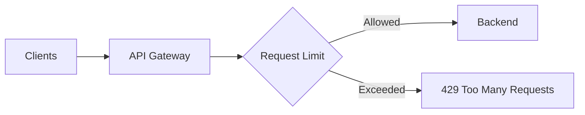

Two important concepts:

### Rate

Sustained request rate.

```text
Requests / second over time
```

### Burst

Short-term request spike that can be absorbed.

```text
Normal traffic
     ↓
Sudden spike 📈
     ↓
Burst capacity
```

> [!TIP]
> 💡 **Exam Pattern**
>
> **Protect backend from excessive API requests**
>
> → **API Gateway Throttling**

---

# 7. API Keys and Usage Plans

For REST APIs, usage plans can control how clients consume the API.

They can involve:

- API keys
- Throttling
- Quotas

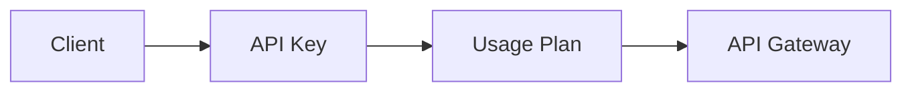

Think:

```text
Identify API consumer
+
Meter usage
+
Apply quota
+
Apply throttling
        ↓
API Key + Usage Plan
```

> [!CAUTION]
> ⚠️ **API Keys are NOT Authentication**
>
> API keys are primarily useful for:
>
> - Identifying clients
> - Metering
> - Usage plans
> - Quotas
> - Throttling
>
> Do not use an API key as the primary authorization mechanism for sensitive APIs.

---

## Authentication vs API Key

Do not confuse:

```text
WHO ARE YOU?
→ IAM / Cognito / Authorizer

HOW MUCH CAN THIS CLIENT USE?
→ API Key + Usage Plan
```

> [!IMPORTANT]
> 🎯 **SAA Memory**
>
> **API Key → CONSUMPTION**
>
> **IAM / Cognito / Authorizer → ACCESS CONTROL**

---

# 8. Caching

REST APIs can cache backend responses.

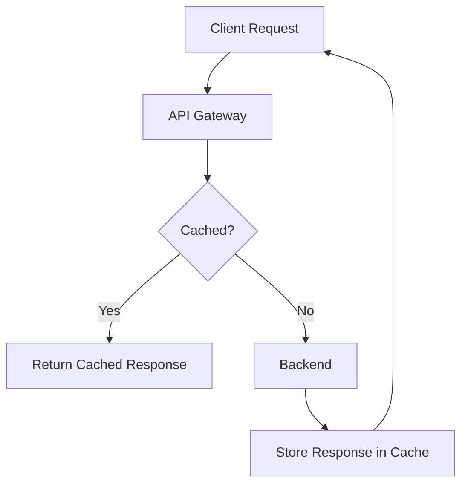

Benefits:

- Lower backend load
- Lower latency
- Fewer backend calls
- Fewer Lambda invocations when applicable

> [!TIP]
> 💡 **Exam Pattern**
>
> ```text
> Repeated API Reads
> +
> Same Responses
> +
> Reduce Backend Load
> ```
>
> → **API Gateway Cache**

For REST API caching, remember the commonly tested values:

```text
Default TTL
→ 300 seconds

Maximum TTL
→ 3600 seconds
```

> [!CAUTION]
> ⚠️ **Don't Confuse**
>
> ```text
> API Gateway Cache
> → Cache API responses
>
> CloudFront
> → Global edge caching / CDN
>
> ElastiCache
> → Application/database data cache
> ```

---

# 9. Stages and Deployments

Stages represent deployed API environments.

Examples:

```text
/dev
/test
/prod
```

Conceptually:

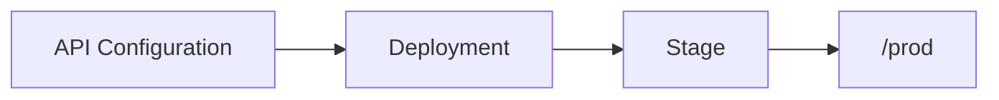

Stage-specific configuration can include features such as:

- Logging
- Throttling
- Caching
- Stage variables

> [!TIP]
> 💡 **Exam Pattern**
>
> **Different API deployment environments**
>
> → **Stages**

---

# 10. Canary Deployments

REST APIs can use canary releases to gradually introduce a new deployment.

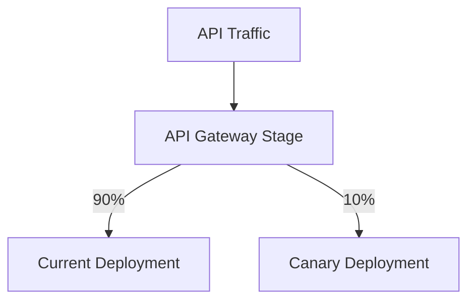

This allows a small percentage of traffic to test the new deployment before increasing exposure.

> [!TIP]
> 💡 **Exam Pattern**
>
> ```text
> Deploy New API Version
> +
> Small Percentage of Traffic
> +
> Gradual Testing
> ```
>
> → **Canary Release**

---

## Canary vs Blue/Green

Conceptually:

```text
Canary
→ Gradually shift a percentage of traffic

Blue/Green
→ Separate old and new environments
```

Do not automatically interpret every controlled deployment as Blue/Green.

---

# 11. Endpoint Types

For REST APIs, three important endpoint types are:

```text
Edge-Optimized
Regional
Private
```

---

## Edge-Optimized

Think:

**Geographically distributed clients**

```text
Global Clients
      ↓
AWS Edge Network
      ↓
API Gateway
```

Useful when clients are geographically distributed.

---

## Regional

Think:

**API deployed in one AWS Region**

```text
Clients
   ↓
Regional API Gateway Endpoint
```

A Regional API can also be combined with CloudFront when you want more control over the CDN configuration.

---

## Private

Think:

**Private API access from a VPC**

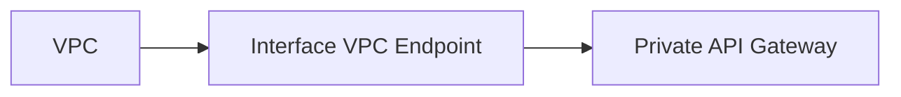

> [!TIP]
> 💡 **Exam Pattern**
>
> ```text
> Internal API
> +
> Must not be publicly accessible
> +
> VPC
> ```
>
> → **Private REST API + Interface VPC Endpoint**

---

# 12. CORS

CORS controls whether browser-based applications from one origin can access resources from another origin.

Example:

```text
Frontend:
https://app.example.com

API:
https://api.example.com
```

These are different origins.

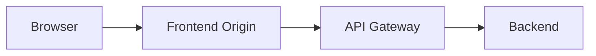

> [!TIP]
> 💡 **Exam Pattern**
>
> Browser frontend works with same-origin resources but fails when calling an API from another origin.
>
> → Check **CORS**

---

## CORS Is a Browser Concept

> [!CAUTION]
> ⚠️ **Exam Trap**
>
> CORS is not an API authentication mechanism.
>
> ```text
> CORS
> → Browser cross-origin access rules
>
> Authentication
> → IAM / Cognito / Authorizer
> ```

---

# 13. Request and Response Transformation

REST APIs can transform requests and responses between clients and integrations.

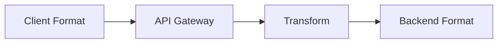

Useful when:

```text
Client Format
≠
Backend Format
```

For example, the client and backend might expect different request or response structures.

---

# 14. API Gateway + WAF

AWS WAF can protect supported API Gateway endpoints from malicious HTTP requests.

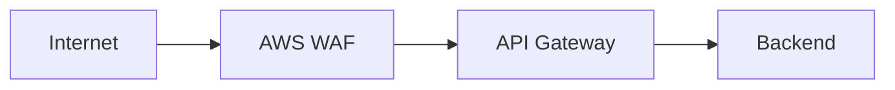

Think:

- SQL injection patterns
- XSS patterns
- HTTP request filtering
- Rate-based filtering rules

See [AWS WAF](../Security/aws_waf.md).

---

## WAF vs Throttling vs Shield

| Requirement                    | Service / Feature          |
| ------------------------------ | -------------------------- |
| Control API request rate       | **API Gateway Throttling** |
| Filter malicious HTTP requests | **AWS WAF**                |
| DDoS protection                | **AWS Shield**             |

> [!IMPORTANT]
> 🎯 **SAA Memory**
>
> ```text
> TOO MANY API REQUESTS
> → API Gateway Throttling
>
> MALICIOUS HTTP REQUEST
> → WAF
>
> DDoS
> → Shield
> ```

---

# 15. API Gateway vs Other Services

## API Gateway vs ALB

Both can handle HTTP traffic, but their primary mental models differ.

| Requirement                                | Think                    |
| ------------------------------------------ | ------------------------ |
| Managed API                                | **API Gateway**          |
| Serverless API + Lambda                    | **API Gateway**          |
| API keys / usage plans                     | **API Gateway**          |
| API caching                                | **API Gateway REST API** |
| WebSocket API                              | **API Gateway**          |
| Load balance EC2/ECS                       | **ALB**                  |
| Host/path-based application load balancing | **ALB**                  |

```text
Create / Manage an API
→ API Gateway

Load Balance Applications
→ ALB
```

See [Elastic Load Balancing](../Compute/aws_elb.md).

---

## API Gateway vs CloudFront

```text
CloudFront
→ CDN
→ Global edge delivery
→ Cache content close to users

API Gateway
→ API management
→ Authorization
→ Throttling
→ API routing
```

They can also work together:

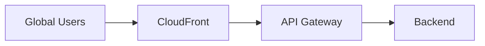

See [Amazon CloudFront](../Networking/aws_cloudfront.md).

---

## API Gateway vs Lambda Function URL

```text
Lambda Function URL
→ Simple HTTP endpoint directly to Lambda

API Gateway
→ Full API management layer
```

Think:

| Requirement                           | Think                   |
| ------------------------------------- | ----------------------- |
| Simple Lambda HTTP endpoint           | **Lambda Function URL** |
| Routing / API management              | **API Gateway**         |
| API lifecycle features                | **API Gateway**         |
| Advanced authorization requirements   | **API Gateway**         |
| Throttling / API consumption controls | **API Gateway**         |

> [!TIP]
> 💡 **Exam Pattern**
>
> ```text
> Just expose Lambda over HTTP
> → Function URL
>
> Build/manage an API
> → API Gateway
> ```

---

# 16. API Gateway Decision Map

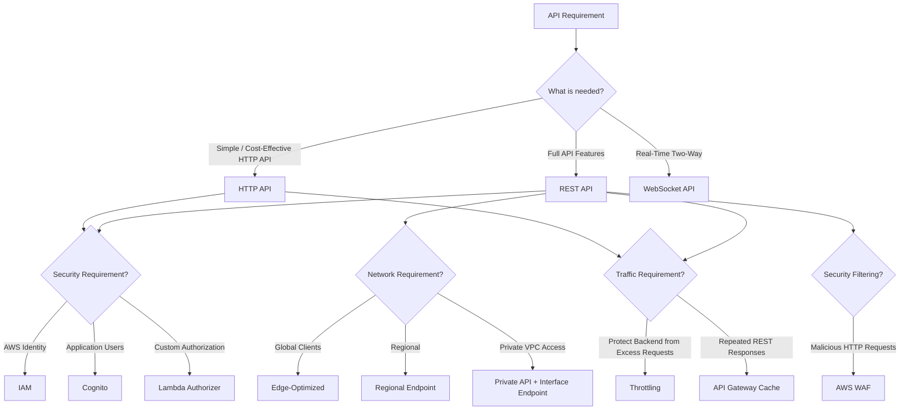

---

# 17. High-Value Exam Traps

> [!CAUTION]
> ⚠️ **Trap 1 — API Keys**
>
> ```text
> API Key
> ≠
> Authentication
> ```
>
> Think consumption, metering, quotas and usage plans.

---

> [!CAUTION]
> ⚠️ **Trap 2 — Traffic Bursts**
>
> ```text
> Serverless API
> +
> Sudden / Unpredictable Traffic
> → API Gateway + Lambda
> ```

---

> [!CAUTION]
> ⚠️ **Trap 3 — Excessive Requests**
>
> ```text
> Protect Backend from API Traffic
> → API Gateway Throttling
> ```

---

> [!CAUTION]
> ⚠️ **Trap 4 — Repeated Reads**
>
> ```text
> Repeated REST API Responses
> +
> Reduce Backend Calls
> → API Gateway Cache
> ```

---

> [!CAUTION]
> ⚠️ **Trap 5 — Bidirectional**
>
> ```text
> Real-Time
> +
> Persistent
> +
> Two-Way
> → WebSocket API
> ```

---

> [!CAUTION]
> ⚠️ **Trap 6 — Application Users**
>
> ```text
> App User Authentication
> → Cognito
>
> NOT
> → API Key
> ```

---

> [!CAUTION]
> ⚠️ **Trap 7 — Custom Authorization**
>
> ```text
> Custom Auth Logic
> → Lambda Authorizer
> ```

---

> [!CAUTION]
> ⚠️ **Trap 8 — Private API**
>
> ```text
> Private API
> +
> VPC
> → Interface VPC Endpoint
> ```

Do not confuse this with an S3/DynamoDB Gateway Endpoint.

---

> [!CAUTION]
> ⚠️ **Trap 9 — WAF**
>
> ```text
> SQL Injection / XSS
> → WAF
>
> Too Many API Requests
> → API Gateway Throttling
>
> DDoS
> → Shield
> ```

---

> [!CAUTION]
> ⚠️ **Trap 10 — CORS**
>
> ```text
> Browser
> +
> Different Origin
> +
> Request Blocked
> → CORS
> ```
>
> CORS is not authentication.

---

> [!CAUTION]
> ⚠️ **Trap 11 — HTTP API vs REST API**
>
> Do not automatically choose REST API for every HTTP-based API.
>
> ```text
> Simple + Cost-Effective
> → HTTP API
>
> Advanced API Management Features
> → REST API
> ```

---

# 18. Scenario Check

## Scenario 1 — Sudden API Traffic

> An application receives unpredictable bursts of API traffic and the company does not want to manage servers.

```text
API
+
Unpredictable Traffic
+
Serverless
        ↓
API Gateway + Lambda
```

---

## Scenario 2 — Protect Backend

> A backend service is overwhelmed because clients send too many API requests.

```text
Too Many Requests
        ↓
API Gateway Throttling
```

---

## Scenario 3 — Repeated GET Requests

> Thousands of users repeatedly request the same data and the backend is overloaded.

```text
Repeated Reads
+
Reduce Backend Calls
        ↓
API Gateway Cache
```

---

## Scenario 4 — Application Users

> A mobile application needs user sign-up, sign-in and controlled API access.

```text
Application Users
        ↓
Amazon Cognito
        ↓
API Gateway
```

---

## Scenario 5 — API Consumer Quotas

> Different API consumers should have different request quotas and usage limits.

```text
Client Consumption
+
Quota / Throttling
        ↓
API Key + Usage Plan
```

Not API key authentication.

---

## Scenario 6 — Chat Application

> An application requires persistent two-way communication between clients and the backend.

```text
Persistent
+
Bidirectional
        ↓
WebSocket API
```

---

## Scenario 7 — Private Internal API

> An application inside a VPC needs an API that must not be publicly accessible.

```text
VPC
 ↓
Interface VPC Endpoint
 ↓
Private REST API
```

---

## Scenario 8 — SQL Injection

> An API must block requests containing common SQL injection patterns.

```text
Malicious HTTP Request
        ↓
AWS WAF
```

---

## Scenario 9 — Browser Error

> A frontend hosted on one origin cannot call an API hosted on another origin from the browser.

```text
Browser
+
Different Origins
        ↓
CORS
```

---

## Scenario 10 — Simple Lambda Endpoint

> A Lambda function only needs a simple HTTP endpoint and full API management features are unnecessary.

```text
Simple HTTP Access
+
Lambda
        ↓
Lambda Function URL
```

---

# 19. API Gateway in 30 Seconds

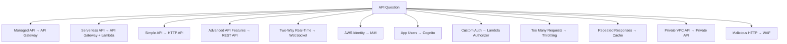

> [!NOTE]
> 🧠 **SAA Memory**
>
> **API → API GATEWAY**
>
> **SERVERLESS API → API GATEWAY + LAMBDA**
>
> **SIMPLE / COST-EFFECTIVE API → HTTP API**
>
> **ADVANCED API FEATURES → REST API**
>
> **REAL-TIME TWO-WAY → WEBSOCKET**
>
> **AWS IDENTITY → IAM**
>
> **APP USERS → COGNITO**
>
> **CUSTOM AUTH → LAMBDA AUTHORIZER**
>
> **API KEY → USAGE / QUOTAS, NOT AUTH**
>
> **TOO MANY REQUESTS → THROTTLING**
>
> **REPEATED RESPONSES → CACHE**
>
> **PRIVATE VPC API → PRIVATE API + INTERFACE ENDPOINT**
>
> **SQL INJECTION / XSS → WAF**
>
> **DDoS → SHIELD**
>
> **BROWSER CROSS-ORIGIN → CORS**

---

# 🔗 Related Notes

## Compute

- [AWS Lambda](../Compute/aws_lambda.md)
- [Elastic Load Balancing](../Compute/aws_elb.md)

## Networking

- [Amazon CloudFront](../Networking/aws_cloudfront.md)
- [VPC Endpoints](../Networking/aws_vpc_endpoints.md)

## Security

- [AWS IAM](../Security/aws_iam.md)
- [AWS WAF](../Security/aws_waf.md)
- [AWS Shield](../Security/aws_shield.md)

## Database

- [Amazon DynamoDB](../Database/aws_dynamodb.md)
- [Amazon RDS](../Database/aws_rds.md)

---

# 📚 Study Order

1. API Types
2. API Gateway + Lambda
3. Authentication and Authorization
4. Throttling
5. API Keys and Usage Plans
6. Caching
7. Endpoint Types
8. WAF / CORS
9. Stages and Canary Deployments
10. Service Comparisons

---

# 📚 Sources

- AWS API Gateway — API Types
- AWS API Gateway — REST APIs
- AWS API Gateway — HTTP APIs
- AWS API Gateway — WebSocket APIs
- AWS API Gateway — Authorization
- AWS API Gateway — Caching
- AWS API Gateway — Private APIs

---

**Reviewed:** 2026-09-23  
**Focus:** SAA-C03 API architecture, security, traffic management and serverless integration.
