# Amazon CloudWatch — Monitoring and Observability

## 📑 Table of Contents

1. [Mental Model](#1-mental-model)
2. [Core Components](#2-core-components)
3. [CloudWatch Metrics](#3-cloudwatch-metrics)
4. [CloudWatch Agent](#4-cloudwatch-agent)
5. [CloudWatch Logs](#5-cloudwatch-logs)
6. [CloudWatch Alarms](#6-cloudwatch-alarms)
7. [Dashboards](#7-dashboards)
8. [Custom Metrics](#8-custom-metrics)
9. [CloudWatch Logs Insights](#9-cloudwatch-logs-insights)
10. [Application Signals and Database Insights](#10-application-signals-and-database-insights)
11. [CloudWatch vs Other Services](#11-cloudwatch-vs-other-services)
12. [CloudWatch Decision Map](#12-cloudwatch-decision-map)
13. [High-Value Exam Traps](#13-high-value-exam-traps)
14. [Scenario Check](#14-scenario-check)
15. [CloudWatch in 30 Seconds](#15-cloudwatch-in-30-seconds)

---

# 1. Mental Model

> [!TIP]
> 🧠 **Mental Model**
>
> **CloudWatch = METRICS + LOGS + ALARMS + OBSERVABILITY**
>
> Think:
>
> ```text
> What is happening with my application or AWS resource?
>                     ↓
>                 CloudWatch
> ```

CloudWatch collects and analyzes operational information from AWS resources and applications.

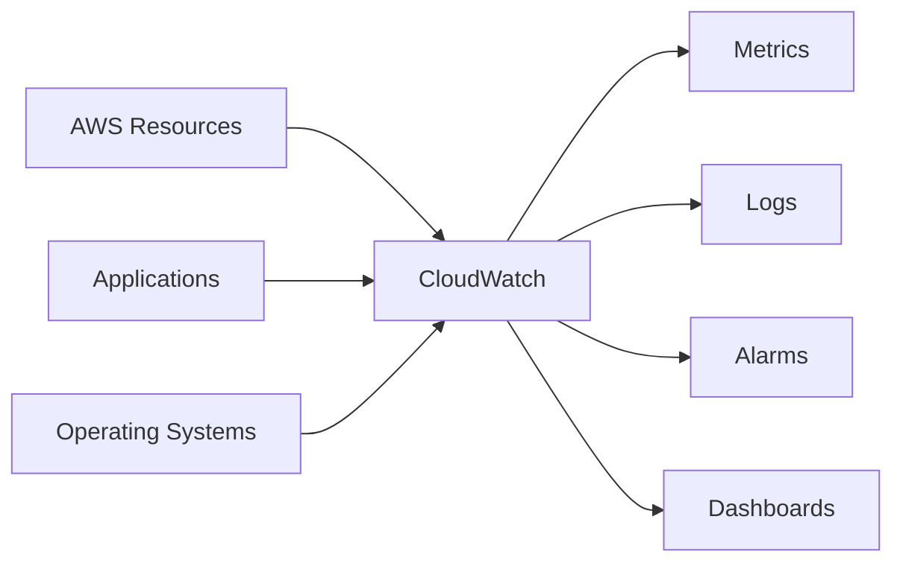

> [!IMPORTANT]
> 🎯 **SAA Memory**
>
> **METRICS → Numbers over time**
>
> **LOGS → Events / text records**
>
> **ALARMS → React to metric thresholds**
>
> **DASHBOARDS → Visualize**

---

# 2. Core Components

| Component                 | Purpose                                |
| ------------------------- | -------------------------------------- |
| **CloudWatch Metrics**    | Numerical measurements over time       |
| **CloudWatch Logs**       | Centralized log storage and analysis   |
| **CloudWatch Alarms**     | React to metric conditions             |
| **CloudWatch Dashboards** | Visualize metrics and alarms           |
| **CloudWatch Agent**      | Collect additional OS metrics and logs |
| **Logs Insights**         | Query and analyze CloudWatch Logs      |

Basic model:

```text
Collect
   ↓
Observe
   ↓
Detect
   ↓
React
```

---

# 3. CloudWatch Metrics

A metric represents numerical data over time.

Examples:

```text
CPUUtilization
NetworkIn
NetworkOut
RequestCount
DatabaseConnections
ApproximateNumberOfMessagesVisible
```

A metric belongs to a **namespace** and can have **dimensions** that identify the resource or context.

Conceptually:

```text
Namespace
   ↓
Metric
   ↓
Dimensions
   ↓
Datapoints
```

Example:

```text
AWS/EC2
   ↓
CPUUtilization
   ↓
InstanceId = i-123456789
```

---

## AWS Service Metrics

Many AWS services automatically publish metrics to CloudWatch.

Examples:

```text
EC2
RDS
Lambda
ALB
DynamoDB
SQS
```

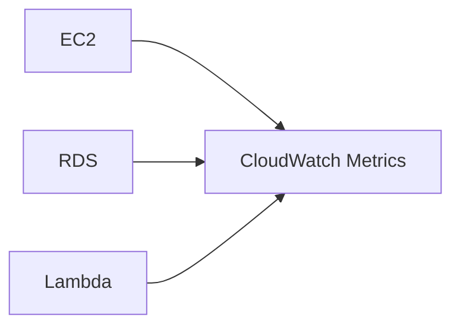

> [!IMPORTANT]
> AWS service metrics do not mean CloudWatch automatically knows everything happening **inside the operating system**.

This distinction is extremely important for EC2.

---

# 4. CloudWatch Agent

CloudWatch receives several EC2 infrastructure metrics automatically.

For example:

```text
CPU utilization
Network traffic
Disk I/O
Status checks
```

But some operating-system metrics are **not available by default**.

Important examples:

```text
Memory usage
Disk space / filesystem usage
```

For these, install and configure the:

**CloudWatch Agent**

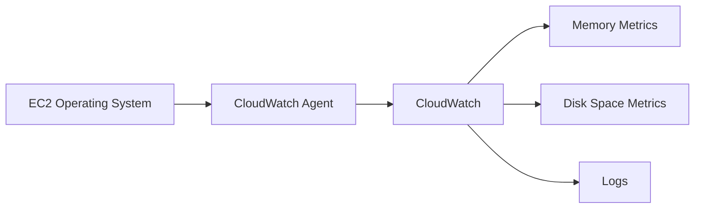

> [!TIP]
> 💡 **Exam Pattern**
>
> **EC2 memory utilization**
>
> → **CloudWatch Agent**
>
> **EC2 disk/filesystem space**
>
> → **CloudWatch Agent**

---

## Default EC2 Metrics vs Agent Metrics

| Metric                       | Available by Default? |
| ---------------------------- | --------------------: |
| CPU Utilization              |                    ✅ |
| Network In / Out             |                    ✅ |
| Disk I/O                     |                    ✅ |
| Instance Status Checks       |                    ✅ |
| Memory Utilization           |                    ❌ |
| Filesystem / Disk Space Used |                    ❌ |

> [!CAUTION]
> ⚠️ **Exam Trap**
>
> Do not confuse:
>
> **Disk I/O**
>
> with:
>
> **Disk space used**
>
> ```text
> Disk I/O
> → CloudWatch EC2 metric
>
> Disk space / filesystem usage
> → CloudWatch Agent
> ```

---

## Logs from EC2

The CloudWatch Agent can also send logs from an instance to CloudWatch Logs.

Example:

```text
/var/log/messages
/var/log/application.log
```

Architecture:

```text
EC2
 ↓
CloudWatch Agent
 ↓
CloudWatch Logs
```

---

# 5. CloudWatch Logs

CloudWatch Logs provides centralized log collection and storage.

Sources can include:

- Applications
- EC2 instances
- Lambda
- VPC Flow Logs
- Route 53 DNS query logs
- API Gateway
- Other AWS services

Conceptually:

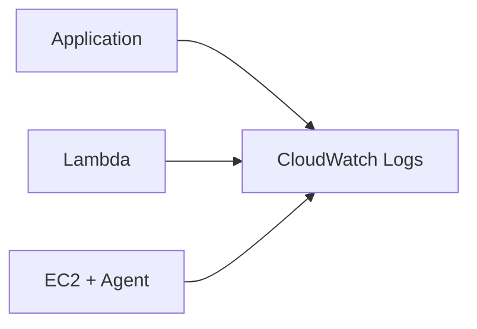

---

## Log Groups and Log Streams

CloudWatch Logs organizes data as:

```text
Log Group
   ↓
Log Stream
   ↓
Log Events
```

### Log Group

Represents a collection of related logs.

Example:

```text
/aws/lambda/payment-function
```

### Log Stream

Represents a sequence of log events from a particular source.

```text
Log Group
├── Stream A
├── Stream B
└── Stream C
```

> [!NOTE]
> 🧠 **SAA Memory**
>
> ```text
> Log Group
> → Collection of related logs
>
> Log Stream
> → Sequence of events from a source
> ```

---

## Log Retention

CloudWatch Logs supports configurable retention.

Think:

```text
Logs
 ↓
Retention Policy
 ↓
Delete after configured period
```

Do not assume logs must be stored indefinitely.

---

# 6. CloudWatch Alarms

CloudWatch Alarms evaluate **metrics**.

Example:

```text
CPUUtilization > 80%
for a defined evaluation period
```

Conceptually:

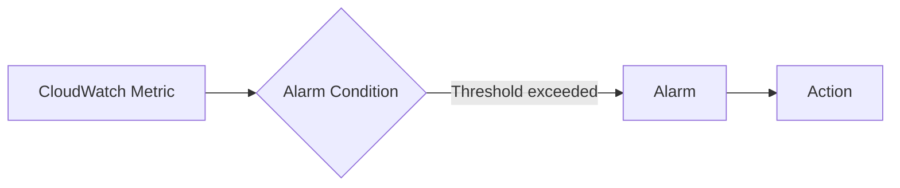

Common actions include integration with services such as:

- Amazon SNS
- EC2 actions
- Auto Scaling

---

## Alarm States

A CloudWatch Alarm can have three states:

```text
OK
ALARM
INSUFFICIENT_DATA
```

| State                 | Meaning                                   |
| --------------------- | ----------------------------------------- |
| **OK**                | Metric is within the configured threshold |
| **ALARM**             | Threshold condition is met                |
| **INSUFFICIENT_DATA** | Not enough data to determine state        |

---

## CloudWatch + SNS

Very common exam architecture:

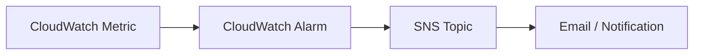

Think:

```text
Metric exceeds threshold
        ↓
CloudWatch Alarm
        ↓
SNS
        ↓
Notification
```

> [!TIP]
> 💡 **Exam Pattern**
>
> **Notify administrators when CPU exceeds a threshold**
>
> → **CloudWatch Alarm + SNS**

---

## CloudWatch + Auto Scaling

CloudWatch metrics and alarms can participate in scaling architectures.

```text
Metric
  ↓
CloudWatch
  ↓
Scaling Decision
  ↓
Auto Scaling
```

For example:

```text
High CPU
   ↓
Scale Out

Low CPU
   ↓
Scale In
```

See [AWS Auto Scaling](../Compute/aws_auto_scaling.md).

---

# 7. Dashboards

CloudWatch Dashboards provide visual monitoring views.

They can display:

- Metrics
- Graphs
- Alarms
- Operational information

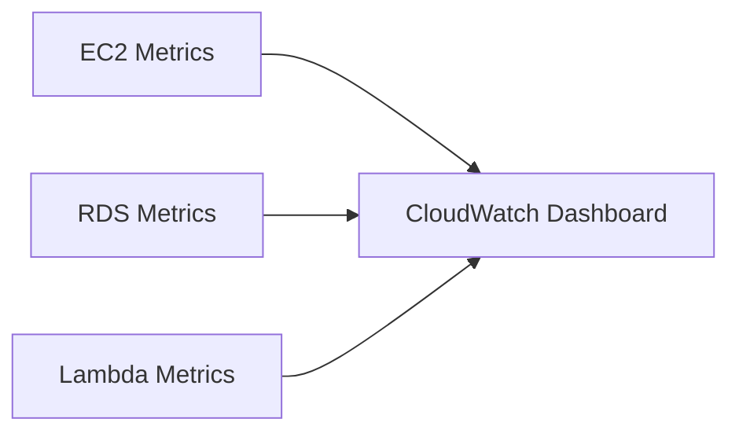

Think:

```text
Need a centralized visual operational view
→ CloudWatch Dashboard
```

---

# 8. Custom Metrics

Applications can publish their own metrics to CloudWatch.

Example:

```text
OrdersProcessed
ActiveUsers
CheckoutFailures
BusinessTransactions
```

Architecture:

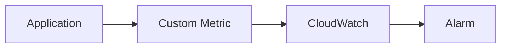

> [!TIP]
> 💡 **Exam Pattern**
>
> AWS doesn't provide the metric you need?
>
> → **Publish a Custom Metric**

---

# 9. CloudWatch Logs Insights

CloudWatch Logs Insights allows querying and analyzing log data stored in CloudWatch Logs.

Think:

```text
CloudWatch Logs
      ↓
Logs Insights
      ↓
Search / Filter / Analyze
```

Example requirements:

- Find application errors
- Analyze log patterns
- Search requests
- Troubleshoot failures

> [!IMPORTANT]
> 🎯 **SAA Memory**
>
> **Metrics → Numerical monitoring**
>
> **Logs Insights → Query logs**

---

# 10. Application Signals and Database Insights

CloudWatch includes additional observability capabilities for applications and databases.

For SAA, focus on the problem being solved rather than memorizing every feature.

---

## Database Insights

For supported databases, CloudWatch Database Insights helps analyze database performance such as:

- Database load
- Wait events
- SQL performance
- Database bottlenecks

Think:

```text
RDS CPU / Connections / Generic Metrics
→ CloudWatch Metrics

RDS OS / Process Metrics
→ Enhanced Monitoring

SQL / DB Load / Wait Events
→ Database Insights
```

See [Amazon RDS](../Database/aws_rds.md).

---

## Application Observability

For application-level observability, CloudWatch can help correlate operational signals such as metrics, logs and application telemetry.

For SAA, remember the broader distinction:

```text
Infrastructure / Application Monitoring
→ CloudWatch

AWS API Audit
→ CloudTrail
```

---

# 11. CloudWatch vs Other Services

This is one of the most important comparisons.

| Question                                           | Service             |
| -------------------------------------------------- | ------------------- |
| What is happening with my resources/app?           | **CloudWatch**      |
| Who called this AWS API?                           | **CloudTrail**      |
| Is this resource configured correctly/compliantly? | **AWS Config**      |
| Route events between services                      | **EventBridge**     |
| Manage/patch/run commands on resources             | **Systems Manager** |

---

## CloudWatch vs CloudTrail

```text
CloudWatch
→ MONITOR

CloudTrail
→ AUDIT
```

Example:

```text
EC2 CPU reached 95%
→ CloudWatch
```

versus:

```text
Who terminated this EC2 instance?
→ CloudTrail
```

> [!CAUTION]
> ⚠️ **Exam Trap**
>
> **High CPU → CloudWatch**
>
> **Who called TerminateInstances? → CloudTrail**

---

## CloudWatch vs AWS Config

```text
CloudWatch
→ Operational state / performance

AWS Config
→ Resource configuration / compliance
```

Example:

```text
CPU > 90%
→ CloudWatch

Security Group allows 0.0.0.0/0
and violates configuration policy
→ AWS Config
```

---

## CloudWatch vs EventBridge

CloudWatch and EventBridge can both participate in event-driven operational architectures, but their mental models are different.

```text
CloudWatch
→ Observe metrics/logs and trigger alarms

EventBridge
→ Route events based on rules
```

> [!IMPORTANT]
> 🎯 **Don't Confuse**
>
> **CloudWatch = OBSERVE**
>
> **EventBridge = ROUTE EVENTS**

---

## CloudWatch vs Systems Manager

```text
CloudWatch
→ Observe resource health/performance

Systems Manager
→ Operate/manage resources
```

Examples:

```text
Monitor CPU
→ CloudWatch

Run command on EC2
→ Systems Manager

Patch EC2 fleet
→ Systems Manager
```

---

# 12. CloudWatch Decision Map

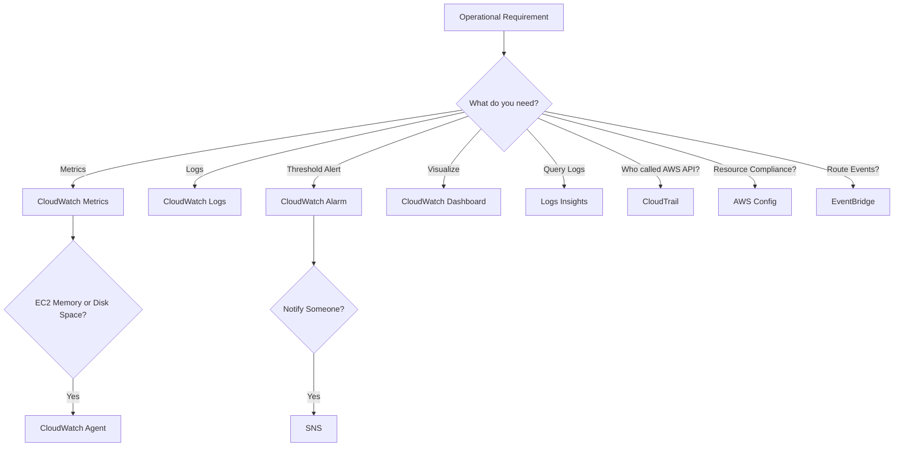

---

# 13. High-Value Exam Traps

> [!WARNING]
> **Trap 1 — EC2 Memory**
>
> CloudWatch does not receive EC2 memory utilization by default.
>
> ```text
> EC2 Memory
> → CloudWatch Agent
> ```

---

> [!WARNING]
> **Trap 2 — Disk I/O vs Disk Space**
>
> ```text
> Disk I/O
> → Available as EC2 metric
>
> Filesystem / Disk Space
> → CloudWatch Agent
> ```

---

> [!WARNING]
> **Trap 3 — CloudWatch vs CloudTrail**
>
> ```text
> What is happening?
> → CloudWatch
>
> Who performed an AWS API action?
> → CloudTrail
> ```

---

> [!WARNING]
> **Trap 4 — CloudWatch vs Config**
>
> ```text
> Performance / Operational Metrics
> → CloudWatch
>
> Resource Configuration / Compliance
> → AWS Config
> ```

---

> [!WARNING]
> **Trap 5 — Alarm vs Logs**
>
> CloudWatch Alarms evaluate **metrics**, not arbitrary raw log text directly.
>
> Log information can first be transformed into a metric when needed and then evaluated by an alarm.

---

> [!WARNING]
> **Trap 6 — CloudWatch Agent**
>
> Installing the agent does not replace CloudWatch.
>
> ```text
> Agent
> → Collects and sends data
>
> CloudWatch
> → Stores / monitors / analyzes it
> ```

---

> [!WARNING]
> **Trap 7 — SNS**
>
> CloudWatch Alarm detects the condition.
>
> SNS distributes the notification.
>
> ```text
> DETECT
> → CloudWatch Alarm
>
> NOTIFY
> → SNS
> ```

---

# 14. Scenario Check

## Scenario 1 — EC2 Memory

> Administrators need an alarm when an EC2 instance exceeds 85% memory utilization.

Memory is not a default EC2 CloudWatch metric.

```text
EC2
 ↓
CloudWatch Agent
 ↓
Memory Metric
 ↓
CloudWatch Alarm
```

> [!TIP]
> **Answer: CloudWatch Agent + CloudWatch Alarm**

---

## Scenario 2 — High CPU Notification

> Operations must receive an email when EC2 CPU utilization exceeds 80%.

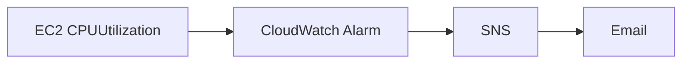

> [!TIP]
> **Answer: CloudWatch Alarm + SNS**

---

## Scenario 3 — Who Deleted the Instance?

> An EC2 instance disappeared and administrators need to determine which IAM identity called the termination API.

```text
Who called an AWS API?
        ↓
CloudTrail
```

Not CloudWatch.

---

## Scenario 4 — Security Group Compliance

> Administrators need to continuously identify security groups that violate an organization's configuration rules.

```text
Resource Configuration
+
Compliance
        ↓
AWS Config
```

---

## Scenario 5 — Application Logs

> Logs from multiple EC2 instances need to be centralized and searchable.

```text
EC2
 ↓
CloudWatch Agent
 ↓
CloudWatch Logs
 ↓
Logs Insights
```

---

## Scenario 6 — Database Process Metrics

> An RDS database has high CPU usage and administrators need operating-system and process-level information.

```text
RDS
 ↓
Enhanced Monitoring
```

Not the EC2 CloudWatch Agent.

---

## Scenario 7 — Database SQL Bottleneck

> Administrators need to analyze database load, SQL and wait events.

```text
RDS
 ↓
CloudWatch Database Insights
```

---

# 15. CloudWatch in 30 Seconds

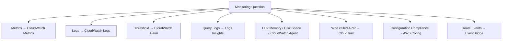

> [!NOTE]
> 🧠 **SAA Memory**
>
> **CloudWatch → MONITOR**
>
> **Metrics → NUMBERS**
>
> **Logs → RECORDS**
>
> **Alarms → THRESHOLDS**
>
> **Logs Insights → QUERY LOGS**
>
> **EC2 CPU → DEFAULT METRIC**
>
> **EC2 MEMORY → CLOUDWATCH AGENT**
>
> **EC2 DISK I/O → DEFAULT METRIC**
>
> **EC2 DISK SPACE → CLOUDWATCH AGENT**
>
> **CloudWatch Alarm → DETECT**
>
> **SNS → NOTIFY**
>
> **CloudTrail → WHO DID WHAT**
>
> **AWS Config → CONFIGURATION / COMPLIANCE**
>
> **EventBridge → ROUTE EVENTS**

---

# 🔗 Related Notes

## Management

- [Management Overview](management_overview.md)
- [AWS CloudTrail](aws_cloudtrail.md)
- [AWS Config](aws_config.md)
- [AWS Systems Manager](aws_systems_manager.md)

## Compute

- [Amazon EC2](../Compute/aws_ec2.md)
- [AWS Auto Scaling](../Compute/aws_auto_scaling.md)
- [AWS Lambda](../Compute/aws_lambda.md)

## Database

- [Amazon RDS](../Database/aws_rds.md)

## Integration

- [Amazon EventBridge](../Integration/aws_eventbridge.md)

---

# 📚 Sources

- AWS CloudWatch — What is Amazon CloudWatch?
- AWS CloudWatch — Metrics
- AWS CloudWatch — CloudWatch Agent
- AWS CloudWatch — CloudWatch Logs
- AWS CloudWatch — CloudWatch Alarms
- AWS CloudWatch — Logs Insights

---

**Reviewed:** 2026-09-23  
**Focus:** SAA-C03 monitoring, metrics, logs, alarms and observability decisions.
