# Amazon CloudFront — Global Content Delivery

## 📑 Table of Contents

1. [Mental Model](#1-mental-model)
2. [How CloudFront Works](#2-how-cloudfront-works)
3. [Origins and Cache Behaviors](#3-origins-and-cache-behaviors)
4. [Caching and Cache Keys](#4-caching-and-cache-keys)
5. [Private S3 Origins with OAC](#5-private-s3-origins-with-oac)
6. [Signed URLs and Signed Cookies](#6-signed-urls-and-signed-cookies)
7. [HTTPS and Certificates](#7-https-and-certificates)
8. [Origin Failover and Origin Shield](#8-origin-failover-and-origin-shield)
9. [Edge Computing](#9-edge-computing)
10. [Security](#10-security)
11. [CloudFront vs Other Global Services](#11-cloudfront-vs-other-global-services)
12. [CloudFront Decision Map](#12-cloudfront-decision-map)
13. [High-Value Exam Traps](#13-high-value-exam-traps)
14. [Scenario Check](#14-scenario-check)
15. [CloudFront in 30 Seconds](#15-cloudfront-in-30-seconds)

---

# 1. Mental Model

> [!TIP]
> 🧠 **Mental Model**
>
> **CloudFront = Global HTTP/HTTPS content delivery through edge locations**
>
> Put content closer to users to:
>
> - Reduce latency
> - Reduce origin load
> - Cache static content
> - Accelerate dynamic HTTP/HTTPS traffic
> - Protect and control access to content

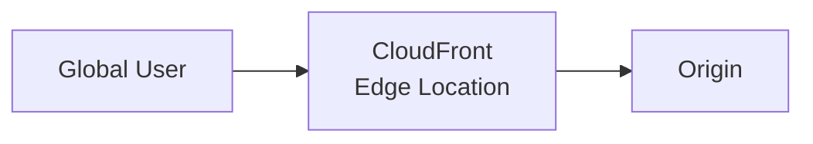

The basic decision:

```text
Request
   ↓
CloudFront Edge
   ↓
Cache Hit?
 ┌───────┴────────┐
Yes               No
 ↓                 ↓
Return           Origin
Cached           Request
Object              ↓
                  Response
                    ↓
                 Viewer
```

> [!IMPORTANT]
> 🎯 **SAA Memory**
>
> **CloudFront = HTTP/HTTPS GLOBAL DELIVERY**
>
> **Cache Hit → Edge serves response**
>
> **Cache Miss → CloudFront contacts origin**

CloudFront can also accelerate **dynamic content** even when caching is disabled or limited.

---

# 2. How CloudFront Works

CloudFront distributions sit between viewers and origins.

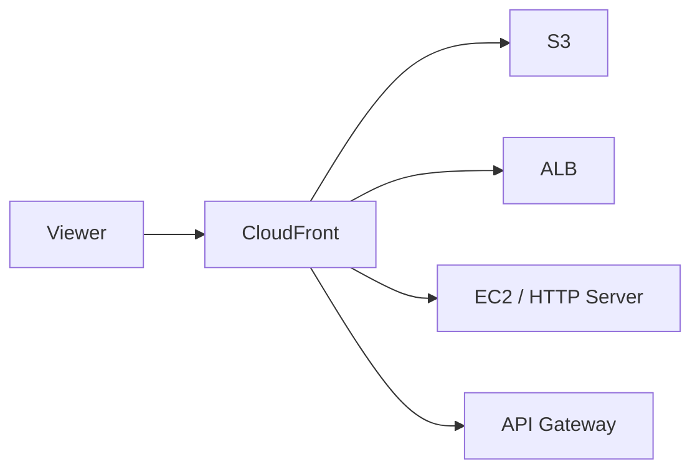

Common origins include:

- Amazon S3
- Application Load Balancer
- EC2 / HTTP servers
- API Gateway
- Supported VPC origins

CloudFront routes requests using **cache behaviors**.

---

# 3. Origins and Cache Behaviors

A distribution can have multiple origins.

Example:

```text
/images/*
    ↓
S3

/api/*
    ↓
ALB
```

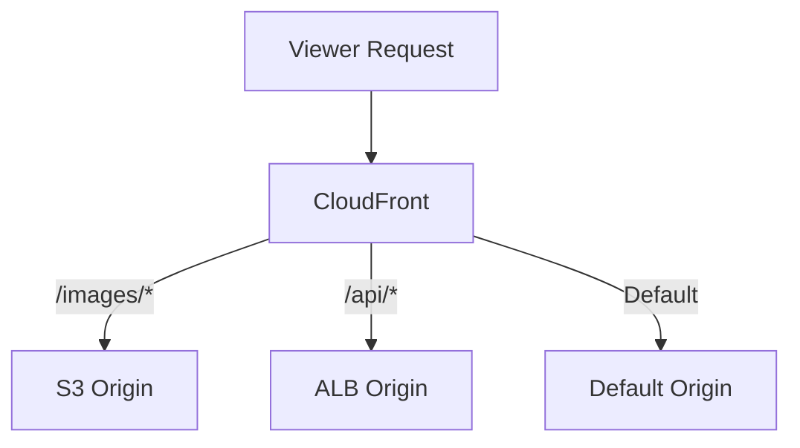

A cache behavior determines how CloudFront processes requests matching a path pattern.

Examples:

```text
/images/*
/api/*
/videos/*
*
```

> [!TIP]
> 💡 **Exam Pattern**
>
> **Different URL paths need different origins or caching rules**
>
> → **CloudFront Cache Behaviors**

---

## VPC Origins

Supported VPC origins allow CloudFront to reach supported private resources such as:

- ALB
- NLB
- EC2

through service-managed private connectivity.

Conceptually:

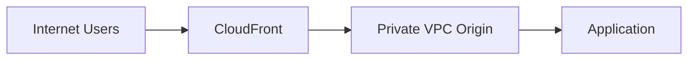

> [!IMPORTANT]
> Do not assume every CloudFront origin must be publicly reachable.

Always consider VPC-origin limitations for the required protocol and origin type.

---

# 4. Caching and Cache Keys

The **cache key** determines which requests can share the same cached response.

It can include configured values such as:

```text
URL Path
+
Query Strings
+
Headers
+
Cookies
```

Example:

```text
/products?id=123
/products?id=456
```

Depending on the cache policy, these requests might produce different cache entries.

---

## Cache Policy

A **Cache Policy** controls:

- TTL settings
- Headers included in cache key
- Cookies included in cache key
- Query strings included in cache key

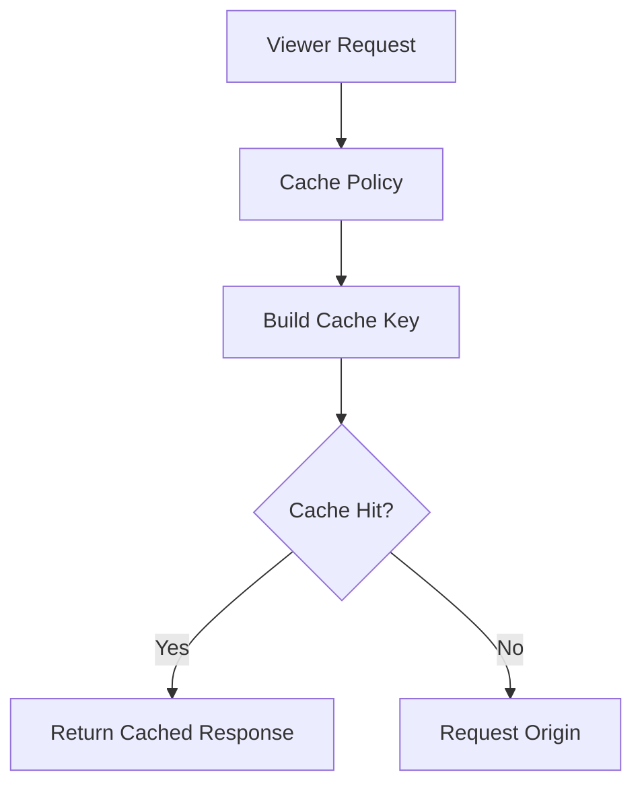

> [!IMPORTANT]
> 🎯 **SAA Memory**
>
> **Cache Policy → What makes responses different in the cache**

---

## Origin Request Policy

An **Origin Request Policy** determines which additional request values are forwarded to the origin **without necessarily including them in the cache key**.

```text
Cache Policy
→ What identifies cached variants

Origin Request Policy
→ What additional values reach the origin
```

> [!CAUTION]
> ⚠️ **Exam Trap**
>
> **Forwarded to origin ≠ automatically part of cache key**

This matters especially with personalized content.

For example:

```text
User A → Header: User-ID=A
User B → Header: User-ID=B
```

If the origin uses `User-ID` to generate personalized content but the value is not appropriately represented in the cache key:

```text
Different Users
      ↓
Same Cache Key
      ↓
Potentially Wrong Cached Response
```

For sensitive personalized responses, either:

- Design the cache key correctly
- Or disable caching where appropriate

---

## Cache Key Efficiency

Do not include unnecessary request values in the cache key.

For example:

```text
?product=123&utm_campaign=A
?product=123&utm_campaign=B
?product=123&utm_campaign=C
```

If the tracking parameter does not affect the actual content, including it can create unnecessary cache entries.

```text
More unnecessary cache variants
        ↓
Lower Cache Hit Ratio
        ↓
More Origin Requests
```

---

## TTL

TTL controls how long content remains cached.

```text
Higher TTL
→ More caching
→ Less origin load
→ Potentially older content

Lower TTL
→ Fresher content
→ More origin requests
```

> [!WARNING]
> A configured minimum TTL greater than zero can cause CloudFront to cache content even when the origin sends directives such as `no-cache`, `no-store`, or `private`.
>
> Choose cache policies deliberately.

---

## Cacheable HTTP Methods

CloudFront caches responses to:

```text
GET
HEAD
```

and can optionally cache:

```text
OPTIONS
```

Allowing:

```text
POST
PUT
PATCH
DELETE
```

does **not** mean their responses become cacheable.

> [!CAUTION]
> ⚠️ **Exam Trap**
>
> **Allow HTTP method ≠ Cache HTTP method**

---

## Invalidation vs Versioning

If cached content must be replaced before its TTL expires:

```text
CloudFront Invalidation
```

can remove selected cached paths.

Example:

```text
/images/logo.png
```

However, for normal deployments, versioned filenames are often preferable:

```text
logo-v1.png
logo-v2.png
```

> [!TIP]
> 💡 **Exam Pattern**
>
> Routine static asset deployment:
>
> → **Versioned filenames**
>
> Need to remove existing cached content before expiration:
>
> → **Invalidation**

Invalidation does not clear a user's independent browser cache.

---

# 5. Private S3 Origins with OAC

This is one of the highest-value CloudFront patterns for SAA.

Requirement:

```text
S3 must remain PRIVATE
        +
Users access objects through CloudFront
```

Solution:

```text
CloudFront
    +
Origin Access Control (OAC)
    +
S3 Bucket Policy
```

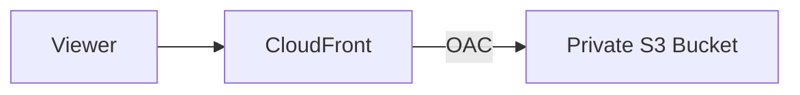

The S3 bucket remains private while CloudFront is authorized to access it.

> [!IMPORTANT]
> 🎯 **SAA Memory**
>
> **Private S3 + CloudFront → OAC**
>
> OAC is preferred over legacy **OAI**.

---

## Two Separate Access Boundaries

This distinction is extremely important:

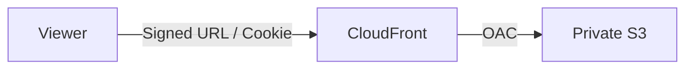

| Boundary | Mechanism |
|---|---|
| **Viewer → CloudFront** | Signed URL / Signed Cookie |
| **CloudFront → S3** | OAC + Bucket Policy |

> [!CAUTION]
> ⚠️ **Exam Trap**
>
> **OAC does NOT authenticate the viewer.**
>
> It controls:
>
> ```text
> CloudFront → S3
> ```
>
> not:
>
> ```text
> Viewer → CloudFront
> ```

---

## OAC + SSE-KMS

If the S3 objects use SSE-KMS, the relevant KMS permissions must also be configured.

Think:

```text
Private S3
    +
CloudFront OAC
    +
SSE-KMS
    ↓
Bucket Policy
+
KMS Permissions
```

---

## S3 REST Endpoint vs Website Endpoint

For private S3 content with OAC:

```text
S3 REST Origin
```

Use the standard S3 bucket origin pattern.

An **S3 Website Endpoint** behaves differently:

```text
S3 Website Endpoint
        ↓
Custom HTTP Origin
```

It does not support OAC/OAI.

Additionally, CloudFront-to-S3 website endpoint communication does not provide the same HTTPS origin model.

> [!CAUTION]
> ⚠️ **Exam Trap**
>
> **Private S3 + CloudFront + OAC**
>
> → Use the **S3 REST origin**
>
> NOT the S3 website endpoint.

---

# 6. Signed URLs and Signed Cookies

Signed URLs and Signed Cookies restrict **viewer access** to private CloudFront content.

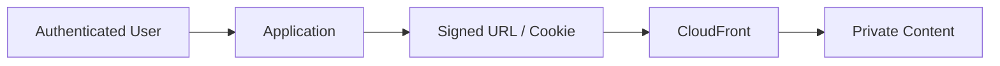

The application normally authenticates the user before issuing the signed artifact.

---

## Signed URL

Best suited when access is for:

- A specific object
- A small number of objects
- Clients where cookies are not appropriate

Example:

```text
https://cdn.example.com/movie.mp4?Signature=...
```

Think:

```text
ONE / SPECIFIC FILE
→ Signed URL
```

---

## Signed Cookies

Useful when access is required to:

- Multiple restricted files
- A group/path of content
- Existing URLs that should remain unchanged

Example:

```text
/videos/*
```

Think:

```text
MANY PRIVATE FILES
→ Signed Cookies
```

> [!IMPORTANT]
> 🎯 **SAA Memory**
>
> **Signed URL → specific file**
>
> **Signed Cookies → multiple files**

---

## CloudFront Signed URL vs S3 Presigned URL

Do not confuse them.

```text
CloudFront Signed URL
        ↓
CloudFront
        ↓
Origin
```

versus:

```text
S3 Presigned URL
        ↓
Direct S3 Access
```

| Requirement | Choose |
|---|---|
| Temporary direct S3 access | **S3 Presigned URL** |
| Restricted globally cached CloudFront content | **CloudFront Signed URL / Cookie** |

See [Amazon S3](../Storage/aws_s3.md).

---

# 7. HTTPS and Certificates

There are two separate TLS connections to consider:

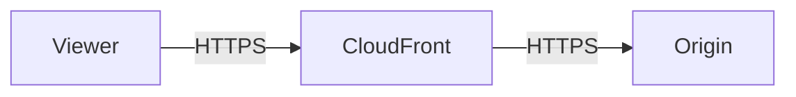

These are configured separately.

---

## Viewer Certificate

For a custom CloudFront domain:

```text
https://www.example.com
```

the ACM certificate used by CloudFront must be in:

```text
us-east-1
```

> [!IMPORTANT]
> 🎯 **SAA Memory**
>
> **CloudFront viewer ACM certificate → us-east-1**

---

## Origin Certificate

If the origin is an ALB:

```text
Viewer
  ↓
CloudFront
  ↓ HTTPS
ALB
```

the certificate used by the ALB belongs in the ALB's Region.

```text
CloudFront Viewer Certificate
→ us-east-1

ALB Certificate
→ ALB Region
```

> [!CAUTION]
> ⚠️ **Exam Trap**
>
> Do not assume every certificate in a CloudFront architecture belongs in `us-east-1`.
>
> The **CloudFront viewer certificate** does.
>
> An **ALB origin certificate** belongs in the ALB's Region.

---

# 8. Origin Failover and Origin Shield

## Origin Groups

CloudFront can define:

```text
Primary Origin
+
Secondary Origin
```

using an Origin Group.

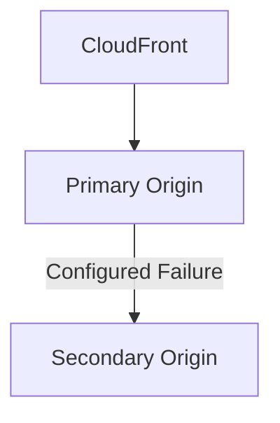

This provides origin failover for supported read requests.

---

## HTTP Method Limitation

Origin failover applies to supported requests such as:

```text
GET
HEAD
eligible OPTIONS
```

It does **not** provide general failover for write operations such as:

```text
POST
PUT
```

> [!CAUTION]
> ⚠️ **Exam Trap**
>
> **CloudFront Origin Failover is not general API write failover.**

---

## CloudFront Does Not Replicate Origin Data

If you configure:

```text
Primary S3 Bucket
        +
Secondary S3 Bucket
```

CloudFront does not automatically copy objects between them.

The secondary origin must already contain the required content/state.

For S3, replication may require a separate mechanism such as:

```text
S3 CRR
```

---

## Origin Shield

Origin Shield adds another caching layer that can consolidate requests going to the origin.

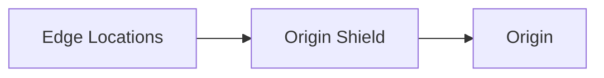

This can reduce duplicate origin requests.

> [!CAUTION]
> ⚠️ **Don't Confuse**
>
> **Origin Shield**
>
> → Additional caching layer
>
> **AWS Shield**
>
> → DDoS protection

---

# 9. Edge Computing

CloudFront supports code execution at the edge.

The main SAA distinction:

```text
CloudFront Functions
→ Lightweight viewer logic

Lambda@Edge
→ More advanced processing
```

---

## CloudFront Functions

Think:

- URL normalization
- Redirects
- Header manipulation
- Lightweight viewer request/response processing

```text
Viewer
   ↓
CloudFront Function
   ↓
CloudFront
```

---

## Lambda@Edge

Lambda@Edge supports more involved processing and additional CloudFront event points.

Think:

- More advanced request/response processing
- Authentication logic
- Origin-related processing
- More complex edge logic

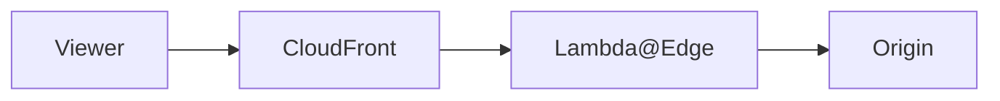

> [!TIP]
> 💡 **Exam Pattern**
>
> ```text
> Simple lightweight edge manipulation
> → CloudFront Functions
>
> More complex / origin-related edge logic
> → Lambda@Edge
> ```

For SAA, focus on the architectural difference rather than memorizing every runtime quota.

---

# 10. Security

CloudFront architectures commonly combine several independent controls:

```text
CloudFront
├── OAC
├── Signed URLs / Cookies
├── AWS WAF
├── AWS Shield
└── HTTPS
```

Each solves a different problem.

| Requirement | Mechanism |
|---|---|
| Protect private S3 origin | **OAC** |
| Restrict viewer access | **Signed URL / Cookie** |
| Filter malicious HTTP requests | **AWS WAF** |
| DDoS protection | **AWS Shield** |
| Encrypt traffic | **HTTPS / TLS** |

> [!IMPORTANT]
> 🎯 **Don't Confuse**
>
> **OAC → Origin Access**
>
> **Signed URL/Cookie → Viewer Access**
>
> **WAF → HTTP filtering**
>
> **Shield → DDoS**

---

## Protect the Origin

WAF and Shield do not automatically make a public origin private.

If users can directly call:

```text
https://origin.example.com
```

they may bypass CloudFront unless the origin is appropriately restricted.

> [!CAUTION]
> ⚠️ **Exam Trap**
>
> Protecting CloudFront does not automatically prevent **direct origin access**.

---

# 11. CloudFront vs Other Global Services

| Requirement | Choose |
|---|---|
| Global HTTP/HTTPS content delivery | **CloudFront** |
| Global static content caching | **CloudFront** |
| Dynamic web acceleration | **CloudFront** |
| Global TCP/UDP acceleration + static anycast IPs | [Global Accelerator](aws_global_accelerator.md) |
| Long-distance upload/download to one S3 bucket | **S3 Transfer Acceleration** |
| DNS routing / answer selection | [Route 53](aws_route53.md) |

---

## CloudFront vs Global Accelerator

```text
HTTP / HTTPS
+
CDN / Cache
        ↓
CloudFront
```

```text
TCP / UDP
+
Static Anycast IPs
+
Global Network Acceleration
        ↓
Global Accelerator
```

> [!TIP]
> 💡 **Exam Pattern**
>
> **Global non-HTTP TCP/UDP application**
>
> → Global Accelerator
>
> **Global website/content**
>
> → CloudFront

---

## CloudFront vs S3 Transfer Acceleration

```text
Users repeatedly DOWNLOAD same objects globally
        ↓
CloudFront
```

```text
Client transfers object over long distance
to/from ONE S3 bucket
        ↓
S3 Transfer Acceleration
```

> [!CAUTION]
> Transfer Acceleration does not cache content.

---

## CloudFront vs Route 53

```text
Route 53
→ DNS

CloudFront
→ Content Delivery
```

Route 53 can direct users to a CloudFront distribution, but the services solve different problems.

---

# 12. CloudFront Decision Map

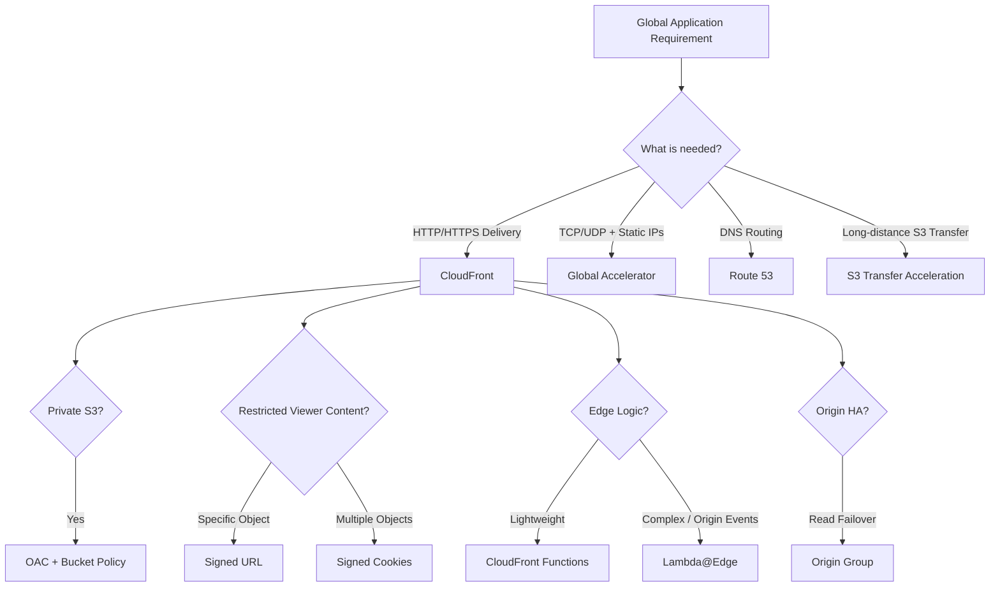

---

# 13. High-Value Exam Traps

> [!WARNING]
> **Trap 1 — OAC vs Signed URL**
>
> ```text
> OAC
> → CloudFront → S3
>
> Signed URL / Cookie
> → Viewer → CloudFront
> ```

---

> [!WARNING]
> **Trap 2 — Signed Cookies**
>
> Signed cookies do not make a publicly accessible S3 origin private.
>
> Protect the origin separately.

---

> [!WARNING]
> **Trap 3 — HTTP Methods**
>
> Allowing all HTTP methods does **not** mean CloudFront caches all methods.

---

> [!WARNING]
> **Trap 4 — Cache Policy vs Origin Request Policy**
>
> ```text
> Cache Policy
> → Cache key
>
> Origin Request Policy
> → Additional values forwarded to origin
> ```

---

> [!WARNING]
> **Trap 5 — Origin Failover**
>
> Origin failover is for supported read requests.
>
> Do not assume POST/PUT write requests automatically fail over.

---

> [!WARNING]
> **Trap 6 — Dynamic Content**
>
> CloudFront is not only for static cached files.
>
> It can accelerate dynamic HTTP/HTTPS traffic.

---

> [!WARNING]
> **Trap 7 — Certificates**
>
> ```text
> CloudFront viewer certificate
> → us-east-1
>
> ALB origin certificate
> → ALB Region
> ```

---

> [!WARNING]
> **Trap 8 — S3 Website Endpoint**
>
> S3 Website Endpoint:
>
> → Custom HTTP origin
>
> → No OAC/OAI
>
> For private S3 behind CloudFront:
>
> → Use S3 REST origin + OAC

---

> [!WARNING]
> **Trap 9 — Origin Shield**
>
> ```text
> Origin Shield → Cache optimization
> AWS Shield → DDoS protection
> ```

---

> [!WARNING]
> **Trap 10 — CloudFront vs Global Accelerator**
>
> Static global IP requirements are a strong Global Accelerator clue.
>
> CloudFront is primarily HTTP/HTTPS content delivery.

---

# 14. Scenario Check

## Scenario 1 — Private S3 Website Content

> A company distributes static files globally. The S3 bucket must remain private.

```text
Global HTTP Content
        +
Private S3
        ↓
CloudFront
+
OAC
+
Bucket Policy
```

---

## Scenario 2 — Paid Video Platform

> Subscribers download many video segments globally.
>
> Requirements:
>
> - S3 bucket cannot be public
> - Only subscribers can access content
> - Existing URLs should remain unchanged

There are **two separate security boundaries**:

```text
Viewer → CloudFront
        ↓
Signed Cookies

CloudFront → S3
        ↓
OAC
```

Architecture:

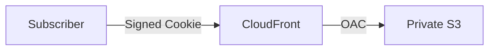

> [!TIP]
> **Answer: CloudFront + Signed Cookies + OAC + restrictive S3 bucket policy**

OAC alone does not verify whether the viewer is a subscriber.

---

## Scenario 3 — One Private Download

> A user purchases one digital file and should receive temporary access to that specific file through the CDN.

```text
Specific Private Object
        ↓
CloudFront Signed URL
```

---

## Scenario 4 — Private S3 Direct Download

> A user should temporarily download an object directly from S3 without CloudFront.

```text
Direct S3
   ↓
S3 Presigned URL
```

---

## Scenario 5 — Global Gaming Protocol

> A global application uses TCP/UDP and requires static global IP addresses.

```text
TCP / UDP
+
Static Anycast IPs
        ↓
Global Accelerator
```

Not CloudFront.

---

## Scenario 6 — Global Static Downloads

> Millions of users repeatedly download the same static files around the world.

```text
Repeated HTTP Downloads
        ↓
CloudFront
```

---

## Scenario 7 — Long-Distance S3 Upload

> Users across the world upload large objects directly to a centralized S3 bucket and uploads need acceleration.

```text
Client
  ↓
S3 Transfer Acceleration
  ↓
S3 Bucket
```

Not CloudFront caching.

---

## Scenario 8 — Primary Origin Failure

> Static content should be served from a secondary origin if the primary origin becomes unavailable.

```text
CloudFront
    ↓
Origin Group
    ├── Primary
    └── Secondary
```

Remember:

```text
GET / HEAD / eligible OPTIONS
→ Failover

POST / PUT
→ No general origin failover
```

---

# 15. CloudFront in 30 Seconds

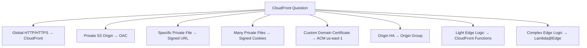

> [!NOTE]
> 🧠 **SAA Memory**
>
> **Global HTTP/HTTPS → CloudFront**
>
> **Cache Hit → Edge**
>
> **Cache Miss → Origin**
>
> **Private S3 → OAC**
>
> **Viewer → CloudFront → Signed URL / Cookie**
>
> **CloudFront → S3 → OAC**
>
> **One private file → Signed URL**
>
> **Many private files → Signed Cookies**
>
> **Direct temporary S3 access → S3 Presigned URL**
>
> **Viewer ACM certificate → us-east-1**
>
> **GET/HEAD origin failover → Origin Group**
>
> **Light edge logic → CloudFront Functions**
>
> **Complex edge logic → Lambda@Edge**
>
> **TCP/UDP + static global IPs → Global Accelerator**
>
> **Long-distance S3 transfer → Transfer Acceleration**

---

# 🔗 Related Notes

## Networking

- [Networking Overview](networking_overview.md)
- [AWS Global Accelerator](aws_global_accelerator.md)
- [Amazon Route 53](aws_route53.md)
- [Amazon VPC](aws_vpc.md)

## Storage

- [Amazon S3](../Storage/aws_s3.md)

## Security

- [AWS WAF](../Security/aws_waf.md)
- [AWS Shield](../Security/aws_shield.md)

---

# 📚 Sources

- AWS CloudFront — Cache keys and cache policies
- AWS CloudFront — Origin request policies
- AWS CloudFront — Cache behavior settings
- AWS CloudFront — Restrict access to S3 origins
- AWS CloudFront — Signed URLs and signed cookies
- AWS CloudFront — VPC origins
- AWS CloudFront — HTTPS and custom domains
- AWS CloudFront — Origin failover
- AWS CloudFront — Edge function choices

---

**Reviewed:** 2026-09-23  
**Focus:** SAA-C03 global content delivery, caching, private content and edge architecture.