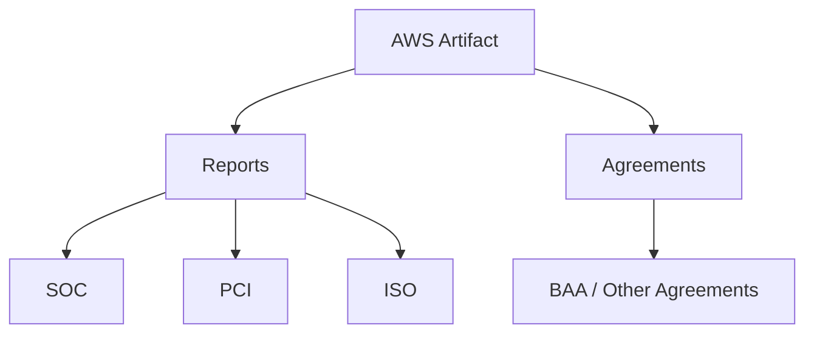
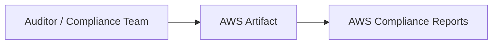
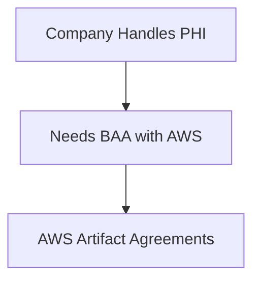
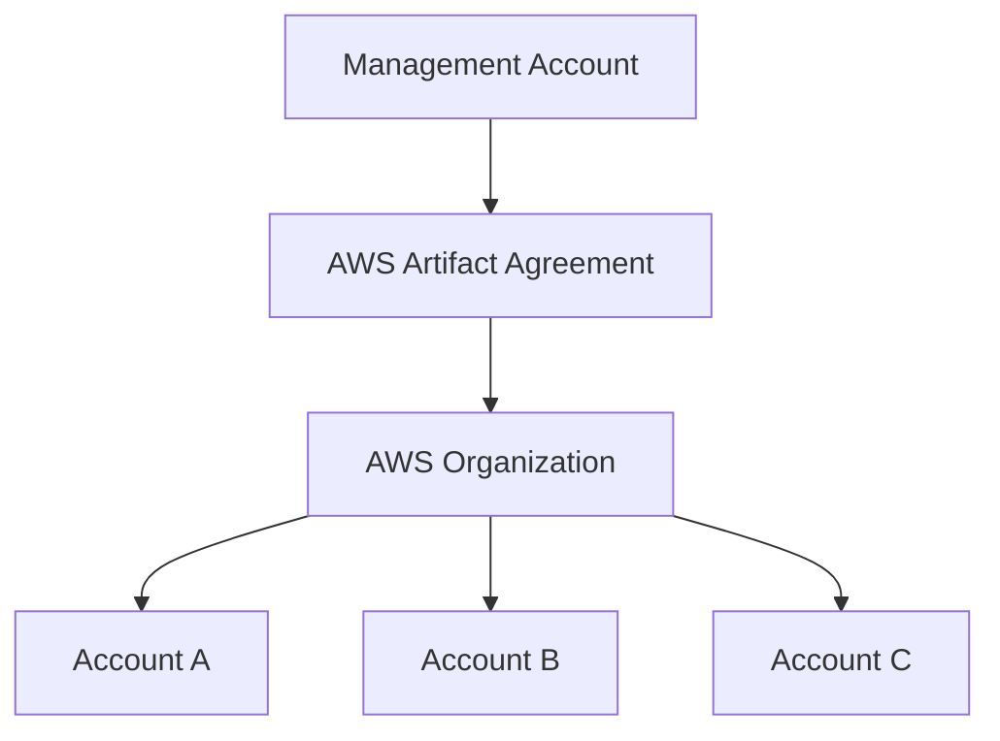
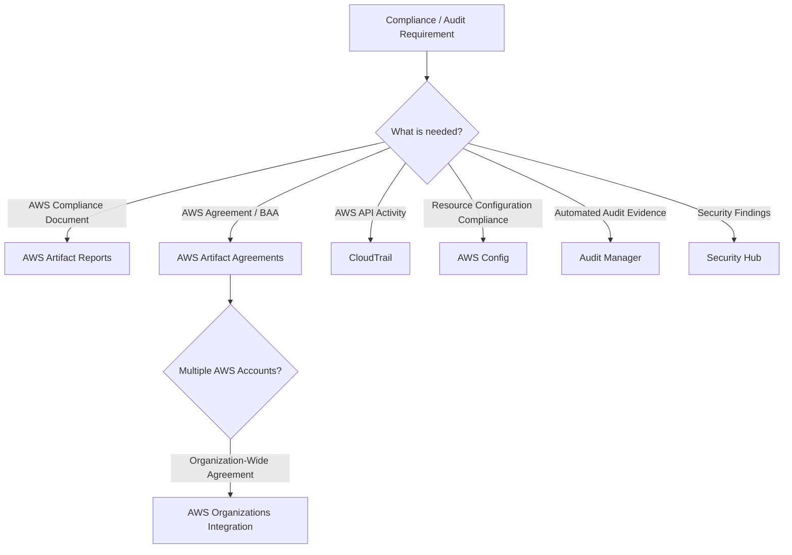
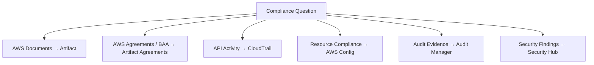

# AWS Artifact — Compliance Reports and Agreements

## 📑 Table of Contents

1. [Mental Model](#1-mental-model)
2. [Core Purpose](#2-core-purpose)
3. [Artifact Reports](#3-artifact-reports)
4. [Artifact Agreements](#4-artifact-agreements)
5. [AWS Organizations Integration](#5-aws-organizations-integration)
6. [Pricing](#6-pricing)
7. [Artifact vs Other Services](#7-artifact-vs-other-services)
8. [Artifact Decision Map](#8-artifact-decision-map)
9. [High-Value Exam Traps](#9-high-value-exam-traps)
10. [Scenario Check](#10-scenario-check)
11. [AWS Artifact in 20 Seconds](#11-aws-artifact-in-20-seconds)

---

# 1. Mental Model

> [!TIP]
> 🧠 **Mental Model**
>
> **AWS Artifact = AWS Compliance Documents + Agreements**
>
> ```text
> Need AWS Compliance Evidence?
>            ↓
>       AWS Artifact
>        /        \
>    Reports    Agreements
> ```

Think of Artifact as the place where AWS provides compliance-related documents and agreements.

> [!IMPORTANT]
> 🎯 **SAA Memory**
>
> ```text
> AWS compliance documentation
> → Artifact Reports
>
> Agreements with AWS
> → Artifact Agreements
> ```

---

# 2. Core Purpose

AWS Artifact provides on-demand access to AWS security and compliance documentation and agreements.

Common examples include:

- SOC reports
- PCI-related reports
- ISO certifications
- Business Associate Addendum (BAA)



> [!TIP]
> 💡 **Exam Pattern**
>
> ```text
> Auditor
> +
> Needs AWS compliance documentation
> ```
>
> → **AWS Artifact**

---

# 3. Artifact Reports

Artifact Reports provides access to AWS security and compliance documentation.



Examples:

```text
SOC Reports
PCI Reports
ISO Certifications
```

Typical scenario:

```text
Auditor:
"Provide evidence of AWS infrastructure compliance."

            ↓

      AWS Artifact
```

> [!TIP]
> 💡 **Exam Pattern**
>
> **Auditor requests AWS SOC / PCI / ISO documentation**
>
> → **AWS Artifact Reports**

---

# 4. Artifact Agreements

Artifact Agreements is used to review and manage certain agreements with AWS.

Depending on the agreement, organizations can perform actions such as:

- Review
- Accept
- Track
- Terminate

A common exam example is a:

**Business Associate Addendum (BAA)**



> [!TIP]
> 💡 **Exam Pattern**
>
> ```text
> Review / Accept AWS Agreement
> ```
>
> → **AWS Artifact Agreements**

---

## Reports vs Agreements

This distinction is simple but important:

| Requirement              | Artifact Feature |
| ------------------------ | ---------------- |
| Download SOC report      | **Reports**      |
| Obtain PCI documentation | **Reports**      |
| Obtain ISO documentation | **Reports**      |
| Review a BAA             | **Agreements**   |
| Accept an AWS agreement  | **Agreements**   |

> [!IMPORTANT]
> 🎯 **Memory**
>
> ```text
> REPORT
> → Artifact Reports
>
> CONTRACT / AGREEMENT
> → Artifact Agreements
> ```

---

# 5. AWS Organizations Integration

Artifact Agreements can integrate with AWS Organizations for organization-wide agreement management where supported.

Conceptually:



> [!TIP]
> 💡 **Exam Pattern**
>
> ```text
> AWS Agreement
> +
> Multiple AWS Accounts
> +
> AWS Organization
> ```
>
> → **AWS Artifact + AWS Organizations**

See [AWS Organizations](../Security/aws_organizations.md) if you create a dedicated Organizations note.

---

# 6. Pricing

AWS Artifact reports and agreements are available at no additional charge.

> [!NOTE]
> For SAA, pricing is much less important than recognizing the correct use case:
>
> **Compliance documents / agreements → Artifact**

---

# 7. Artifact vs Other Services

This is the most important section for the exam.

The key distinction is:

```text
AWS's Compliance Documentation
            ↓
         Artifact

Your Resource Compliance
            ↓
          Config

Your Audit Evidence
            ↓
      Audit Manager
```

---

## Artifact vs CloudTrail

```text
AWS Artifact
→ COMPLIANCE DOCUMENTS

AWS CloudTrail
→ API ACTIVITY / AUDIT TRAIL
```

Examples:

```text
"Give the auditor AWS's SOC report."
→ Artifact

"Who deleted this S3 bucket?"
→ CloudTrail
```

> [!IMPORTANT]
> 🎯 **Don't Confuse**
>
> **Artifact = DOCUMENTS**
>
> **CloudTrail = ACTIVITY**

---

## Artifact vs AWS Config

```text
AWS Artifact
→ AWS compliance reports / certifications

AWS Config
→ Your AWS resource configuration / compliance
```

Examples:

```text
"Obtain AWS PCI compliance documentation."
→ Artifact

"Does this S3 bucket comply with our configuration rules?"
→ AWS Config
```

> [!IMPORTANT]
> 🎯 **Don't Confuse**
>
> ```text
> AWS'S COMPLIANCE DOCUMENTS
> → Artifact
>
> YOUR RESOURCE COMPLIANCE
> → Config
> ```

---

## Artifact vs Audit Manager

```text
AWS Artifact
→ Obtain AWS compliance documents

AWS Audit Manager
→ Collect and organize evidence
  for your own audits
```

Examples:

```text
Need AWS SOC report
→ Artifact

Need automated evidence collection
for an internal audit
→ Audit Manager
```

> [!CAUTION]
> ⚠️ **Exam Trap**
>
> ```text
> AWS Compliance Documentation
> → Artifact
>
> Automated Audit Evidence Collection
> → Audit Manager
> ```

---

## Artifact vs Security Hub

```text
AWS Artifact
→ Compliance documentation

AWS Security Hub
→ Security findings and security posture
```

Think:

```text
Need a REPORT from AWS?
→ Artifact

Need SECURITY FINDINGS?
→ Security Hub
```

---

## Quick Comparison

| Requirement                         | Service                     |
| ----------------------------------- | --------------------------- |
| AWS SOC / PCI / ISO documentation   | **AWS Artifact**            |
| AWS agreement / BAA                 | **AWS Artifact Agreements** |
| Who performed an AWS API action?    | **CloudTrail**              |
| Resource configuration compliance   | **AWS Config**              |
| Automated audit evidence collection | **Audit Manager**           |
| Centralized security findings       | **Security Hub**            |

---

# 8. Artifact Decision Map



---

# 9. High-Value Exam Traps

> [!CAUTION]
> ⚠️ **Trap 1 — SOC / PCI / ISO**
>
> ```text
> Auditor requests AWS compliance report
> → AWS Artifact
> ```

---

> [!CAUTION]
> ⚠️ **Trap 2 — BAA**
>
> ```text
> Review / Accept BAA
> → AWS Artifact Agreements
> ```

---

> [!CAUTION]
> ⚠️ **Trap 3 — Artifact vs CloudTrail**
>
> ```text
> Compliance Document
> → Artifact
>
> Who called an API?
> → CloudTrail
> ```

---

> [!CAUTION]
> ⚠️ **Trap 4 — Artifact vs Config**
>
> ```text
> AWS Compliance Documentation
> → Artifact
>
> Your Resource Configuration Compliance
> → AWS Config
> ```

---

> [!CAUTION]
> ⚠️ **Trap 5 — Artifact vs Audit Manager**
>
> ```text
> Download AWS Audit / Compliance Report
> → Artifact
>
> Collect Evidence for Your Audit
> → Audit Manager
> ```

---

> [!CAUTION]
> ⚠️ **Trap 6 — Artifact vs Security Hub**
>
> ```text
> Compliance Document
> → Artifact
>
> Security Findings
> → Security Hub
> ```

---

> [!CAUTION]
> ⚠️ **Trap 7 — Artifact Does Not Make You Compliant**
>
> AWS Artifact provides AWS compliance documentation and agreements.
>
> It does **not** automatically make your architecture or workload compliant.

---

# 10. Scenario Check

## Scenario 1 — SOC Report

> An external auditor asks the company for AWS's SOC documentation.

```text
AWS Compliance Document
        ↓
AWS Artifact Reports
```

> [!TIP]
> **Answer: AWS Artifact**

---

## Scenario 2 — Business Associate Addendum

> A company handling protected health information needs to review and accept a BAA with AWS.

```text
AWS Agreement
     ↓
Artifact Agreements
```

> [!TIP]
> **Answer: AWS Artifact Agreements**

---

## Scenario 3 — Who Deleted the Bucket?

> A security team needs to determine which IAM identity called the API that deleted an S3 bucket.

```text
AWS API Activity
       ↓
CloudTrail
```

Not Artifact.

---

## Scenario 4 — Noncompliant Security Groups

> A company needs to continuously evaluate whether its security groups comply with configuration rules.

```text
Resource Configuration
+
Compliance
       ↓
AWS Config
```

Not Artifact.

---

## Scenario 5 — Audit Evidence Collection

> A company needs to automate evidence collection for its own compliance audit.

```text
Automated
Audit Evidence
      ↓
AWS Audit Manager
```

Not Artifact.

---

## Scenario 6 — Security Findings

> A security team needs a centralized view of security findings across AWS accounts.

```text
Security Findings
       ↓
Security Hub
```

Not Artifact.

---

# 11. AWS Artifact in 20 Seconds



> [!NOTE]
> 🧠 **SAA Memory**
>
> **ARTIFACT → AWS DOCUMENTS**
>
> **ARTIFACT AGREEMENTS → BAA / AGREEMENTS**
>
> **CLOUDTRAIL → ACTIVITY**
>
> **CONFIG → RESOURCE CONFIGURATION COMPLIANCE**
>
> **AUDIT MANAGER → AUDIT EVIDENCE**
>
> **SECURITY HUB → SECURITY FINDINGS**
>
> ---
>
> The fastest distinction:
>
> ```text
> AWS'S COMPLIANCE?
> → ARTIFACT
>
> YOUR RESOURCE COMPLIANCE?
> → CONFIG
>
> YOUR AUDIT EVIDENCE?
> → AUDIT MANAGER
> ```

---

# 🔗 Related Notes

## Security

- [AWS IAM](aws_iam.md)
- [AWS Macie](aws_macie.md)
- [AWS WAF](aws_waf.md)
- [AWS Shield](aws_shield.md)

## Management

- [AWS CloudTrail](../Management/aws_cloudtrail.md)
- [AWS Config](../Management/aws_config.md)

---

# 📚 Study Order

1. Artifact Reports
2. Artifact Agreements
3. Artifact vs CloudTrail
4. Artifact vs Config
5. Artifact vs Audit Manager
6. Artifact vs Security Hub

---

# 📚 Sources

- AWS Artifact — Compliance Reports
- AWS Artifact — Agreements
- AWS Artifact — AWS Organizations Integration

---

**Reviewed:** 2026-09-23  
**Focus:** SAA-C03 compliance documentation, agreements and audit-service distinctions.
