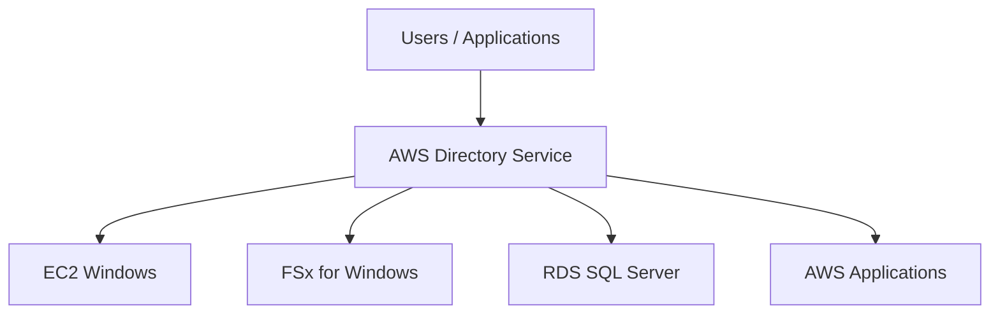
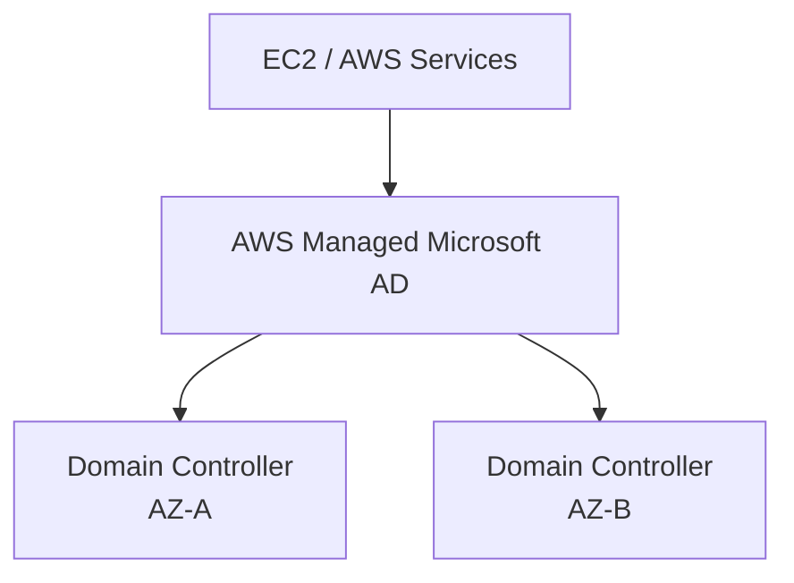
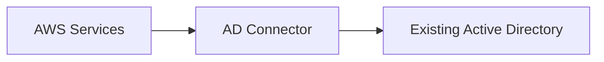
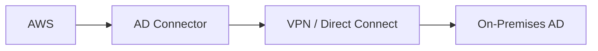
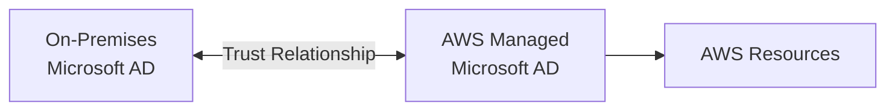
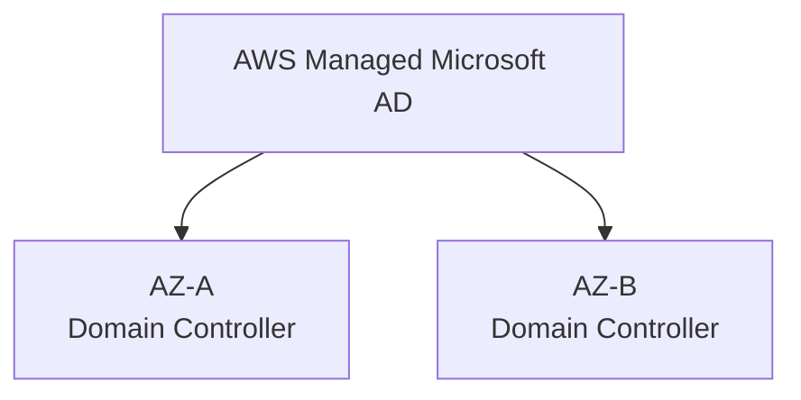
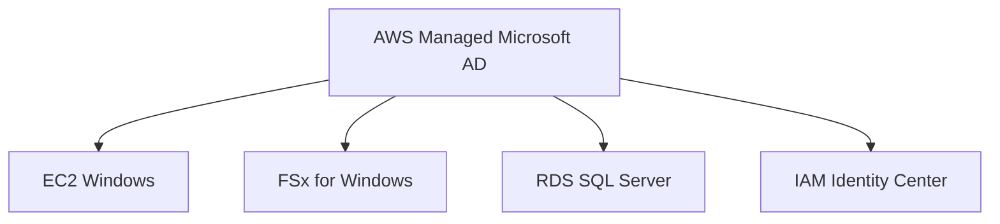
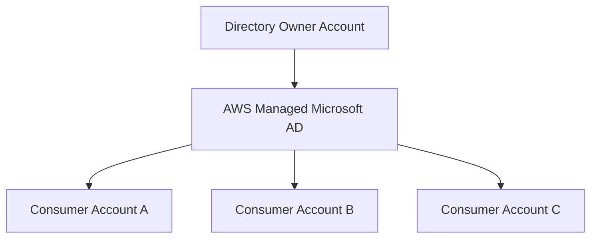
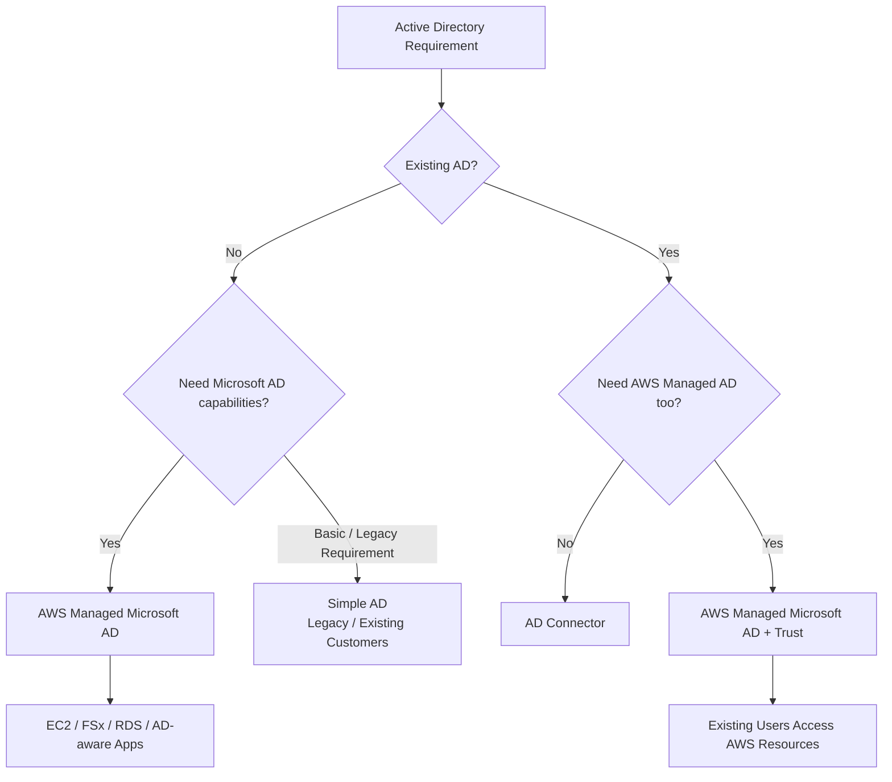
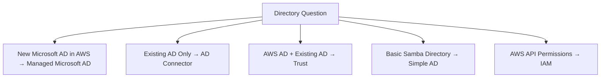

# AWS Directory Service — Managed Microsoft Active Directory

## 📑 Table of Contents

1. [Mental Model](#1-mental-model)
2. [Core Purpose](#2-core-purpose)
3. [Directory Options](#3-directory-options)
4. [AWS Managed Microsoft AD](#4-aws-managed-microsoft-ad)
5. [AD Connector](#5-ad-connector)
6. [Simple AD](#6-simple-ad)
7. [Trust Relationships](#7-trust-relationships)
8. [High Availability](#8-high-availability)
9. [AWS Service Integrations](#9-aws-service-integrations)
10. [Directory Sharing](#10-directory-sharing)
11. [Directory Service vs IAM and Identity Center](#11-directory-service-vs-iam-and-identity-center)
12. [Decision Map](#12-decision-map)
13. [High-Value Exam Traps](#13-high-value-exam-traps)
14. [Scenario Check](#14-scenario-check)
15. [AWS Directory Service in 30 Seconds](#15-aws-directory-service-in-30-seconds)

---

# 1. Mental Model

> [!TIP]
> 🧠 **Mental Model**
>
> **AWS Directory Service = Active Directory for AWS workloads**
>
> The first question is:
>
> ```text
> Do I need a NEW Microsoft AD in AWS?
> → AWS Managed Microsoft AD
>
> Do I already have AD and only need AWS to use it?
> → AD Connector
> ```

The most important SAA distinction is:

```text
AWS Managed Microsoft AD
→ AWS runs an actual Microsoft AD directory

AD Connector
→ Gateway to your existing directory
```

> [!IMPORTANT]
> 🎯 **SAA Memory**
>
> ```text
> NEW AD IN AWS
> → AWS Managed Microsoft AD
>
> USE EXISTING AD
> → AD Connector
>
> BASIC LEGACY DIRECTORY
> → Simple AD
> ```

---

# 2. Core Purpose

AWS Directory Service provides ways to use Microsoft Active Directory with AWS workloads and services.

Typical requirements include:

- Domain-join EC2 instances
- Run Microsoft AD-aware applications
- Authenticate users with Active Directory
- Integrate AWS workloads with existing on-premises AD
- Use Active Directory with services such as:
  - Amazon EC2
  - Amazon FSx for Windows File Server
  - Amazon RDS for SQL Server
  - AWS IAM Identity Center
  - Other directory-aware applications

Conceptually:



---

# 3. Directory Options

For SAA, focus mainly on these:

| Option                       | What It Is                                       | Strong Exam Clue                                  |
| ---------------------------- | ------------------------------------------------ | ------------------------------------------------- |
| **AWS Managed Microsoft AD** | Actual managed Microsoft Active Directory in AWS | Need full Microsoft AD capabilities               |
| **AD Connector**             | Proxy/gateway to existing AD                     | Existing on-prem AD, don't want another directory |
| **Simple AD**                | Samba-based AD-compatible directory              | Basic/legacy directory requirements               |

> [!NOTE]
> Simple AD is no longer available for new customer onboarding.
>
> Existing Simple AD customers can continue using it.
>
> For current architectures, AWS recommends evaluating **AWS Managed Microsoft AD** or **AD Connector** instead.

---

# 4. AWS Managed Microsoft AD

Also known as:

**AWS Directory Service for Microsoft Active Directory**

Think:

```text
ACTUAL MICROSOFT ACTIVE DIRECTORY
+
MANAGED BY AWS
```

AWS Managed Microsoft AD runs Microsoft Active Directory in AWS.

AWS manages infrastructure-related tasks such as:

- Domain controller deployment
- Monitoring
- Recovery
- Data replication
- Snapshots
- Software updates

Architecture:



> [!IMPORTANT]
> AWS Managed Microsoft AD is not merely an AD-compatible implementation.
>
> It runs actual Microsoft Active Directory.

---

## When to Use It

Strong clues include:

```text
Microsoft Active Directory
+
AWS
+
AD-aware workloads
```

Examples:

- Microsoft SharePoint
- .NET applications
- SQL Server applications
- Windows workloads
- Group Policy requirements
- Domain joins
- Trust relationships
- AWS services requiring Microsoft AD

> [!TIP]
> 💡 **Exam Pattern**
>
> ```text
> Need Microsoft AD capabilities in AWS
> +
> AWS should manage the directory
> ```
>
> → **AWS Managed Microsoft AD**

---

# 5. AD Connector

AD Connector solves a very different problem.

Think:

> **AD Connector = PROXY / GATEWAY to existing AD**

It allows AWS services to use an existing self-managed Microsoft Active Directory.



The existing directory can remain the source of identities.

> [!IMPORTANT]
> 🎯 **Mental Model**
>
> ```text
> Existing AD
> +
> Don't want another directory
> +
> AWS services need authentication
>        ↓
> AD Connector
> ```

---

## Credentials

AD Connector forwards authentication requests to the existing Active Directory.

Think:

```text
User
 ↓
AWS Service
 ↓
AD Connector
 ↓
Existing AD
 ↓
Authentication
```

> [!IMPORTANT]
> AD Connector does not create a new Microsoft Active Directory domain in AWS.
>
> It connects AWS to the directory you already operate.

---

## Connectivity

Because authentication ultimately depends on the existing directory, AWS needs network connectivity to it.

Typical hybrid architecture:



> [!CAUTION]
> ⚠️ **Exam Trap**
>
> If the existing on-premises AD becomes unreachable, AD Connector cannot magically authenticate users independently.
>
> It depends on connectivity to that directory.

---

## AD Connector Exam Pattern

> [!TIP]
> 💡 **Exam Pattern**
>
> ```text
> Existing Corporate Active Directory
> +
> Keep Existing Users / Credentials
> +
> AWS Services Need Authentication
> +
> Don't Create Another Directory
> ```
>
> → **AD Connector**

---

# 6. Simple AD

Simple AD is an Active Directory-compatible directory based on **Samba 4**.

Think:

```text
BASIC AD-COMPATIBLE DIRECTORY
```

It historically provided a lower-cost directory option for relatively simple environments.

It supports capabilities such as:

- User accounts
- Groups
- Basic Group Policies
- Kerberos-based SSO
- LDAP-compatible applications
- Domain joining supported workloads

However, it does not provide the full capabilities of AWS Managed Microsoft AD.

Examples of unsupported capabilities include:

- Trust relationships
- Some advanced Microsoft AD features
- Several AWS service integrations supported by Managed Microsoft AD

> [!CAUTION]
> ⚠️ **Current Status**
>
> **Simple AD is no longer open to new customers.**
>
> Existing customers can continue using existing Simple AD functionality.
>
> For new architectures, evaluate:
>
> ```text
> AWS Managed Microsoft AD
> or
> AD Connector
> ```

---

## Simple AD vs Managed Microsoft AD

```text
Simple AD
→ Samba-based
→ Basic AD compatibility

AWS Managed Microsoft AD
→ Actual Microsoft AD
→ Advanced AD capabilities
```

> [!CAUTION]
> ⚠️ **Exam Trap**
>
> ```text
> Need Trust Relationship
> → AWS Managed Microsoft AD
>
> NOT Simple AD
> ```

---

# 7. Trust Relationships

This is one of the most important SAA concepts.

AWS Managed Microsoft AD can establish trust relationships with existing self-managed Active Directory environments.

Architecture:



This allows users from existing directories to access supported AWS resources while maintaining their identities in the existing AD.

---

## Trust vs AD Connector

These are easy to confuse.

### AD Connector

```text
AWS
 ↓
AD Connector
 ↓
Existing AD
```

No separate AWS Microsoft AD domain is required.

---

### Managed Microsoft AD + Trust

```text
Existing AD
      ↕
    TRUST
      ↕
AWS Managed Microsoft AD
```

There are **two directories**.

> [!IMPORTANT]
> 🎯 **Don't Confuse**
>
> ```text
> Existing AD only
> +
> AWS needs to use it
> → AD Connector
>
> AWS Managed AD
> +
> Existing AD
> +
> Relationship between domains
> → Trust
> ```

---

## Trust Directions

AWS Managed Microsoft AD supports trust relationships such as:

```text
One-Way
Two-Way
```

The exact direction determines which users can access resources in the trusted domains.

> [!TIP]
> 💡 **Exam Pattern**
>
> ```text
> Existing Corporate AD
> +
> AWS Managed Microsoft AD
> +
> Users need access across domains
> ```
>
> → **Trust Relationship**

---

# 8. High Availability

AWS Managed Microsoft AD is designed for high availability.

A directory is deployed with domain controllers across different Availability Zones.



AWS manages:

```text
Monitoring
Replication
Recovery
Snapshots
Software Updates
```

> [!TIP]
> 💡 **Exam Pattern**
>
> ```text
> Highly Available
> +
> Managed Microsoft Active Directory
> +
> Multiple AZs
> ```
>
> → **AWS Managed Microsoft AD**

---

# 9. AWS Service Integrations

Directory Service can support directory-aware AWS workloads.

Important SAA associations include:

```text
EC2 Windows
→ Domain Join

FSx for Windows
→ Active Directory Integration

RDS SQL Server
→ Windows Authentication / AD Integration

IAM Identity Center
→ Workforce Identity Integration
```

Architecture example:



This connects directly with the FSx note:

```text
FSx for Windows
+
SMB
+
Active Directory
```

---

# 10. Directory Sharing

AWS Managed Microsoft AD can be shared across AWS accounts.

Conceptually:



This is useful in multi-account architectures where multiple AWS accounts need to use a centrally managed directory.

AWS Managed Microsoft AD integrates with AWS Organizations for directory sharing.

> [!TIP]
> 💡 **Exam Pattern**
>
> ```text
> Central Microsoft AD
> +
> Multiple AWS Accounts
> ```
>
> → **AWS Managed Microsoft AD Directory Sharing**

---

# 11. Directory Service vs IAM and Identity Center

These services solve different identity problems.

## Directory Service vs IAM

```text
Directory Service
→ USERS / COMPUTERS / DOMAINS
→ Microsoft Active Directory

IAM
→ AWS API PERMISSIONS
→ AWS users, roles and policies
```

Example:

```text
Join Windows EC2 to corporate domain
→ Directory Service

Allow Lambda to read S3
→ IAM Role
```

> [!IMPORTANT]
> 🎯 **Memory**
>
> ```text
> WINDOWS DOMAIN
> → Directory Service
>
> AWS PERMISSIONS
> → IAM
> ```

---

## Directory Service vs IAM Identity Center

```text
Directory Service
→ Directory infrastructure

IAM Identity Center
→ Workforce access to AWS accounts and applications
```

Identity Center can integrate with supported identity sources, including Active Directory configurations.

Think:

```text
Directory Service
→ WHO EXISTS IN THE DIRECTORY?

IAM Identity Center
→ HOW WORKFORCE USERS ACCESS AWS ACCOUNTS/APPS
```

> [!CAUTION]
> ⚠️ **Exam Trap**
>
> IAM Identity Center does not replace Microsoft Active Directory when an application specifically requires:
>
> - Domain joining
> - Windows AD
> - Group Policy
> - AD-aware applications

---

# 12. Decision Map



---

# 13. High-Value Exam Traps

> [!CAUTION]
> ⚠️ **Trap 1 — Existing AD**
>
> ```text
> Existing On-Premises AD
> +
> AWS services need authentication
> +
> Don't need another directory
> ```
>
> → **AD Connector**

---

> [!CAUTION]
> ⚠️ **Trap 2 — Actual Microsoft AD**
>
> ```text
> Need Microsoft AD in AWS
> +
> AWS manages infrastructure
> ```
>
> → **AWS Managed Microsoft AD**

---

> [!CAUTION]
> ⚠️ **Trap 3 — Trust**
>
> ```text
> Existing AD
> +
> AWS Managed Microsoft AD
> +
> Cross-domain access
> ```
>
> → **Trust Relationship**

---

> [!CAUTION]
> ⚠️ **Trap 4 — AD Connector vs Trust**
>
> ```text
> AD Connector
> → ONE EXISTING DIRECTORY
>
> Trust
> → TWO DIRECTORIES CONNECTED
> ```

---

> [!CAUTION]
> ⚠️ **Trap 5 — Simple AD**
>
> ```text
> Simple AD
> → Samba-based
>
> Managed Microsoft AD
> → Actual Microsoft AD
> ```

---

> [!CAUTION]
> ⚠️ **Trap 6 — Simple AD Trust**
>
> Simple AD does **not** support trust relationships.
>
> Need trust?
>
> → **AWS Managed Microsoft AD**

---

> [!CAUTION]
> ⚠️ **Trap 7 — Directory Service vs IAM**
>
> ```text
> Domain / Windows Identity
> → Directory Service
>
> AWS API Authorization
> → IAM
> ```

---

> [!CAUTION]
> ⚠️ **Trap 8 — AD Connector Dependency**
>
> AD Connector forwards requests to the existing directory.
>
> It is not an independent copy of your on-premises Active Directory.

---

> [!CAUTION]
> ⚠️ **Trap 9 — FSx for Windows**
>
> ```text
> FSx Windows
> +
> Active Directory
> ```
>
> Directory integration matters for Windows identity and permissions.

---

# 14. Scenario Check

## Scenario 1 — Existing Corporate AD

> A company already operates Microsoft Active Directory on premises. Employees must use their existing credentials with supported AWS services, and the company does not want to deploy another directory.

```text
Existing AD
+
Existing Credentials
+
No New Directory
        ↓
AD Connector
```

> [!TIP]
> **Answer: AD Connector**

---

## Scenario 2 — Microsoft AD in AWS

> A company needs to run Microsoft SharePoint and other AD-aware applications in AWS and wants AWS to manage the directory infrastructure.

```text
Microsoft AD
+
AWS Managed
+
AD-Aware Applications
        ↓
AWS Managed Microsoft AD
```

---

## Scenario 3 — Hybrid AD with Trust

> A company needs an AWS Managed Microsoft AD but wants employees from its existing on-premises AD domain to access AWS resources using their existing identities.

```text
On-Premises AD
        ↕
      TRUST
        ↕
AWS Managed Microsoft AD
```

> [!TIP]
> **Answer: AWS Managed Microsoft AD + Trust Relationship**

---

## Scenario 4 — Domain Join

> Windows EC2 instances need to join a managed Microsoft Active Directory domain in AWS.

```text
EC2 Windows
+
Domain Join
+
Managed Microsoft AD
        ↓
AWS Managed Microsoft AD
```

---

## Scenario 5 — FSx for Windows

> A company needs Windows SMB file shares with Active Directory authentication.

```text
SMB
+
Windows
+
Active Directory
        ↓
FSx for Windows
+
Directory Service
```

---

## Scenario 6 — AWS Permissions

> A Lambda function needs permission to read objects from an S3 bucket.

```text
AWS Service Permission
        ↓
IAM Role
```

Not Directory Service.

---

# 15. AWS Directory Service in 30 Seconds



> [!NOTE]
> 🧠 **SAA Memory**
>
> **MANAGED MICROSOFT AD → REAL MICROSOFT AD IN AWS**
>
> **AD CONNECTOR → USE EXISTING AD**
>
> **TRUST → CONNECT TWO AD DOMAINS**
>
> **SIMPLE AD → BASIC SAMBA-BASED AD**
>
> **IAM → AWS PERMISSIONS**
>
> ---
>
> Fastest decision:
>
> ```text
> NEW AD?
> → Managed Microsoft AD
>
> EXISTING AD?
> → AD Connector
>
> BOTH ADs?
> → Managed Microsoft AD + Trust
> ```
>
> And:
>
> ```text
> AD Connector
> = PROXY
>
> Managed Microsoft AD
> = DIRECTORY
>
> Trust
> = RELATIONSHIP BETWEEN DIRECTORIES
> ```

---

# 🔗 Related Notes

## Security

- [AWS IAM](aws_iam.md)
- [AWS RAM](aws_ram.md)

## Storage

- [Amazon FSx](../Storage/aws_fsx.md)

## Compute

- [Amazon EC2](../Compute/aws_ec2.md)

## Database

- [Amazon RDS](../Database/aws_rds.md)

---

# 📚 Study Order

1. Directory Service Mental Model
2. AWS Managed Microsoft AD
3. AD Connector
4. AD Connector vs Managed Microsoft AD
5. Trust Relationships
6. Simple AD
7. Directory Service + FSx / EC2 / RDS
8. Directory Service vs IAM / Identity Center
9. Exam Traps

---

# 📚 Sources

- AWS Directory Service — Overview
- AWS Directory Service — AWS Managed Microsoft AD
- AWS Directory Service — AD Connector
- AWS Directory Service — Simple AD
- AWS Directory Service — Trust Relationships
- AWS Directory Service — Directory Sharing
- Tutorials Dojo — AWS Directory Service study material

---

**Reviewed:** 2026-09-24  
**Focus:** SAA-C03 Active Directory selection, hybrid identity, AD Connector and trust relationships.
