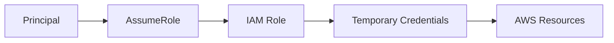
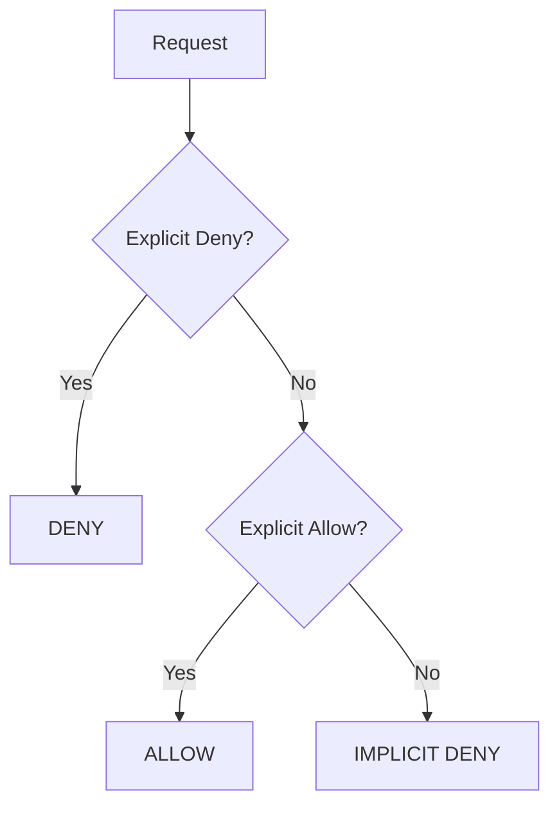
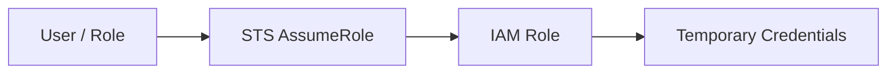
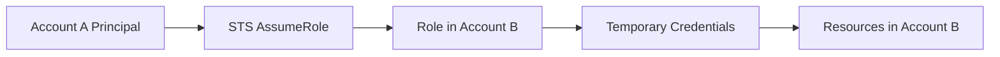
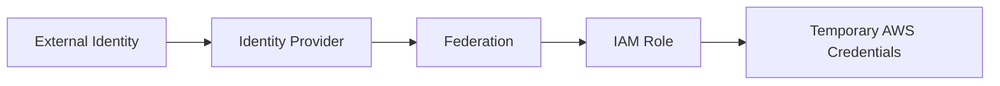
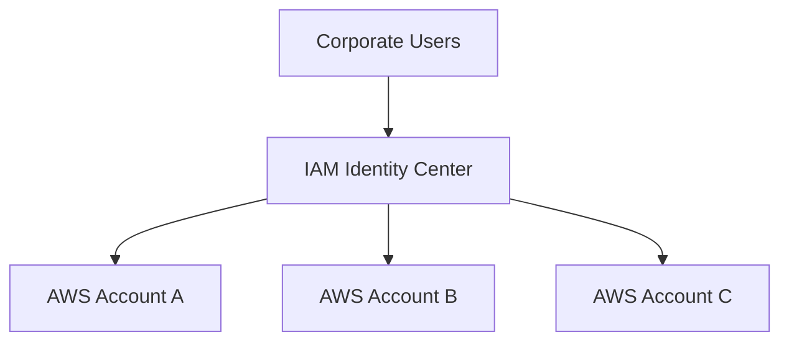
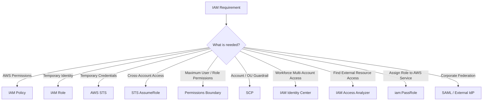
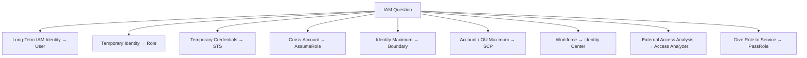

---
aliases:
  - AWS IAM
  - IAM
  - Identity and Access Management
tags:
  - aws/saa
  - security
---

# AWS Identity and Access Management (IAM)

## 📑 Table of Contents

1. [Mental Model](#1-mental-model)
2. [IAM Basics](#2-iam-basics)
3. [IAM Identities](#3-iam-identities)
4. [IAM Roles](#4-iam-roles)
5. [IAM Policies](#5-iam-policies)
6. [Identity-Based vs Resource-Based Policies](#6-identity-based-vs-resource-based-policies)
7. [Managed vs Inline Policies](#7-managed-vs-inline-policies)
8. [Policy Evaluation](#8-policy-evaluation)
9. [Permissions Boundaries](#9-permissions-boundaries)
10. [AWS Organizations SCPs](#10-aws-organizations-scps)
11. [AWS STS](#11-aws-sts)
12. [Trust Policy vs Permissions Policy](#12-trust-policy-vs-permissions-policy)
13. [Cross-Account Access](#13-cross-account-access)
14. [Federation](#14-federation)
15. [IAM Identity Center](#15-iam-identity-center)
16. [Permission Sets](#16-permission-sets)
17. [ABAC](#17-abac)
18. [IAM Access Analyzer](#18-iam-access-analyzer)
19. [IAM Conditions](#19-iam-conditions)
20. [IAM Roles for AWS Compute](#20-iam-roles-for-aws-compute)
21. [iam:PassRole](#21-iampassrole)
22. [MFA](#22-mfa)
23. [Directory Service Relationship](#23-directory-service-relationship)
24. [Decision Map](#24-decision-map)
25. [High-Value Exam Traps](#25-high-value-exam-traps)
26. [Scenario Check](#26-scenario-check)
27. [IAM in 30 Seconds](#27-iam-in-30-seconds)

---

# 1. Mental Model

> [!TIP]
> 🧠 **Mental Model**
>
> **IAM = WHO can do WHAT on WHICH AWS resource, under WHICH conditions.**
>
> ```text
> Principal
>    ↓
> Authentication
>    ↓
> IAM Policies
>    ↓
> Authorization
>    ↓
> AWS Resource
> ```

The core security principle is:

> **Least Privilege**

Grant only the permissions required to perform the task.

> [!IMPORTANT]
> 🎯 **SAA Memory**
>
> ```text
> WHO ARE YOU?
> → Authentication
>
> WHAT CAN YOU DO?
> → Authorization
>
> WHAT DEFINES PERMISSIONS?
> → IAM Policies
> ```

---

# 2. IAM Basics

AWS Identity and Access Management is used to securely control access to AWS resources.

IAM controls two fundamental concepts:

| Concept            | Question         |
| ------------------ | ---------------- |
| **Authentication** | Who are you?     |
| **Authorization**  | What can you do? |

```text
Login / Credentials
       ↓
Authentication
       ↓
Policies Evaluated
       ↓
Authorization
```

> [!IMPORTANT]
> **IAM is a global AWS service**, not a regional service.

---

# 3. IAM Identities

The fundamental IAM concepts are:

```text
Root User

IAM User

IAM Group

IAM Role
```

---

## Root User

The root user is created when the AWS account is created and has unrestricted account access.

Best practices:

- Enable MFA
- Do not use root for daily tasks
- Avoid root access keys
- Use appropriate IAM/workforce identities for normal administration

> [!CAUTION]
> ⚠️ **Exam Trap**
>
> ```text
> Root User
> → Maximum Account Privileges
> ```
>
> Protect it with **MFA** and avoid everyday use.

---

## IAM Users

An IAM user represents an identity inside an AWS account.

It can have:

- Console password
- Access keys
- IAM policies
- MFA

```text
IAM User
   │
   ├── Console Password
   │
   └── Access Key + Secret Key
```

A newly created IAM user has:

```text
NO permissions by default
```

> [!WARNING]
> For workforce/human access across AWS accounts, prefer:
>
> **IAM Identity Center**
>
> rather than creating large numbers of individual IAM users.

---

## IAM Groups

An IAM group is a collection of IAM users.

```text
Developers Group
       │
       ├── Alice
       ├── Bob
       └── Charlie
```

Policies can be attached to the group:

```text
Developers Group
       ↓
IAM Policy
       ↓
Permissions inherited by users
```

> [!IMPORTANT]
> IAM Groups:
>
> - Contain **users**
> - Cannot contain other groups
> - Cannot be assumed
> - Cannot log in

---

## User vs Group vs Role

| IAM Concept  | Purpose                                        |
| ------------ | ---------------------------------------------- |
| 👤 **User**  | Individual IAM identity                        |
| 👥 **Group** | Collection of IAM users                        |
| 🎭 **Role**  | Assumable identity using temporary credentials |
| 👑 **Root**  | AWS account root identity                      |

> [!NOTE]
> 🧠 **Memory**
>
> ```text
> USER
> → WHO you are
>
> GROUP
> → ORGANIZE users
>
> ROLE
> → WHO you temporarily become
> ```

---

# 4. IAM Roles

An IAM role is an identity with permissions but without the same long-term credentials associated with IAM users.

A principal assumes a role and receives temporary credentials.



Roles are commonly used by:

- EC2
- Lambda
- ECS
- AWS services
- Cross-account principals
- Federated users

> [!TIP]
> 💡 **Exam Pattern**
>
> ```text
> Application running on AWS
> needs AWS credentials
> ```
>
> ❌ Hard-code access keys
>
> ✅ **Use an IAM Role**

---

## Service Roles

AWS services can assume IAM roles to perform actions on your behalf.

Example:

```text
Lambda
   ↓
Execution Role
   ↓
S3 / DynamoDB / CloudWatch
```

Another example:

```text
EC2
 ↓
IAM Role
 ↓
S3
```

Think:

> **AWS compute/service needs AWS permissions → IAM Role**

---

## Service-Linked Roles

A **Service-Linked Role** is associated with a specific AWS service.

```text
AWS Service
     ↓
Service-Linked Role
     ↓
Actions required by service
```

AWS defines the permissions required by the service.

---

# 5. IAM Policies

IAM policies are JSON documents that define permissions.

Basic example:

```json
{
  "Effect": "Allow",
  "Action": "s3:GetObject",
  "Resource": "arn:aws:s3:::example-bucket/*"
}
```

Important elements:

| Element     | Meaning                                                   |
| ----------- | --------------------------------------------------------- |
| `Effect`    | Allow or Deny                                             |
| `Action`    | AWS API operation                                         |
| `Resource`  | Target resource                                           |
| `Condition` | Optional restrictions                                     |
| `Principal` | Who receives access in applicable resource-based policies |

Think:

```text
POLICY
├── Effect
├── Action
├── Resource
└── Condition
```

---

# 6. Identity-Based vs Resource-Based Policies

This distinction is extremely important.

---

## Identity-Based Policy

Attached to:

- Users
- Groups
- Roles

It answers:

> **What can this identity do?**

```text
IAM Role
   ↓
Identity Policy
   ↓
Allow s3:GetObject
```

Example:

```json
{
  "Effect": "Allow",
  "Action": "s3:GetObject",
  "Resource": "arn:aws:s3:::my-bucket/*"
}
```

---

## Resource-Based Policy

Attached directly to a supported resource.

Examples:

- S3 Bucket Policy
- SQS Queue Policy
- SNS Topic Policy
- KMS Key Policy
- Lambda Resource Policy

It answers:

> **Who can access this resource?**

```text
Principal
    ↓
Resource Policy
    ↓
AWS Resource
```

Example:

```json
{
  "Effect": "Allow",
  "Principal": {
    "AWS": "arn:aws:iam::111122223333:role/AppRole"
  },
  "Action": "s3:GetObject",
  "Resource": "arn:aws:s3:::my-bucket/*"
}
```

> [!TIP]
> 💡 **Exam Pattern**
>
> Resource-based policies are particularly important in many:
>
> **Cross-account access** scenarios.

---

## Quick Comparison

| Policy             | Attached To         | Main Question                 |
| ------------------ | ------------------- | ----------------------------- |
| **Identity-Based** | User / Group / Role | What can this identity do?    |
| **Resource-Based** | Resource            | Who can access this resource? |

> [!NOTE]
> 🧠 **Memory**
>
> ```text
> IDENTITY POLICY
> → "What can YOU do?"
>
> RESOURCE POLICY
> → "Who can access ME?"
> ```

---

# 7. Managed vs Inline Policies

## Managed Policy

A managed policy is reusable and can be attached to multiple identities.

```text
Managed Policy
   ├── User A
   ├── User B
   └── Role C
```

Types include:

```text
AWS Managed Policy

Customer Managed Policy
```

Think:

> **Managed Policy = REUSABLE**

---

## Inline Policy

An inline policy is embedded directly into one identity.

```text
Role
 └── Inline Policy
```

Think:

> **Inline Policy = ONE-TO-ONE**

---

## Comparison

| Type           | Mental Model             |
| -------------- | ------------------------ |
| Managed Policy | Reusable                 |
| Inline Policy  | Embedded in one identity |

---

# 8. Policy Evaluation

AWS evaluates applicable permissions before allowing a request.

Simplified mental model:



> [!IMPORTANT]
> 🎯 **Golden Rule**
>
> **Explicit DENY wins.**

Basic memory:

```text
1. Explicit Deny
       ↓
2. Explicit Allow
       ↓
3. No Allow
       ↓
   Implicit Deny
```

Example:

```text
Policy A
→ Allow s3:*

Policy B
→ Deny s3:DeleteObject
```

Result:

```text
GetObject       ✅
PutObject       ✅
DeleteObject    ❌
```

---

## Implicit Deny

AWS permissions are denied by default.

```text
No Allow
   ↓
DENY
```

---

## Explicit Deny

A policy explicitly contains:

```json
{
  "Effect": "Deny"
}
```

An applicable explicit deny overrides an allow.

```text
Allow
+
Explicit Deny
      ↓
     DENY
```

> [!CAUTION]
> ⚠️ **Exam Trap**
>
> ```text
> ALLOW + EXPLICIT DENY
> → DENY
> ```

---

# 9. Permissions Boundaries

A **Permissions Boundary** defines the maximum permissions available to an IAM user or role.

> [!IMPORTANT]
> A permissions boundary **does NOT grant permissions by itself**.

Example:

```text
Identity Policy
Allow:
S3 + DynamoDB + EC2

          ∩

Permissions Boundary
Maximum:
S3 + DynamoDB

          ↓

Effective:
S3 + DynamoDB
```

EC2 permissions exceed the boundary and therefore are not available.

Mental model:

```text
Identity Policy
       ∩
Permissions Boundary
       ↓
Effective Permissions
```

> [!CAUTION]
> ⚠️ **VERY IMPORTANT EXAM TRAP**
>
> ```text
> Permissions Boundary
> ≠ GRANT
>
> Permissions Boundary
> = MAXIMUM
> ```

> [!TIP]
> 💡 **Exam Pattern**
>
> ```text
> Developers may create roles
> BUT
> must never exceed a defined permission ceiling
> ```
>
> → **Permissions Boundary**

---

# 10. AWS Organizations SCPs

A **Service Control Policy (SCP)** defines the maximum available permissions for applicable accounts/OUs in AWS Organizations.

It does **not grant permissions**.

```text
SCP
 ↓
Account / OU Permission Guardrail
 ↓
IAM Permissions
 ↓
Principal
```

---

## IAM Policy vs Boundary vs SCP

| Mechanism            | Purpose                                        |
| -------------------- | ---------------------------------------------- |
| IAM Policy           | Defines permissions for identities/resources   |
| Permissions Boundary | Maximum permissions for a user/role            |
| SCP                  | Maximum available permissions for accounts/OUs |

Simplified mental model:

```text
SCP
 ∩
Permissions Boundary
 ∩
IAM Permissions
 ↓
Effective Permissions
```

> [!IMPORTANT]
> 🧠 **SAA Memory**
>
> ```text
> IDENTITY POLICY
> → PERMISSIONS
>
> BOUNDARY
> → MAX FOR IDENTITY
>
> SCP
> → MAX FOR ACCOUNT / OU
> ```

> [!CAUTION]
> Neither a permissions boundary nor an SCP grants permissions by itself.

---

# 11. AWS STS

**AWS Security Token Service (STS)** provides temporary security credentials.

Temporary credentials include:

```text
Access Key ID
+
Secret Access Key
+
Session Token
```

Common uses:

- Assume IAM roles
- Cross-account access
- Federation
- Temporary privileged access

> [!IMPORTANT]
> 🧠 **Memory**
>
> ```text
> STS
> → TEMPORARY CREDENTIALS
> ```

---

## AssumeRole

`AssumeRole` allows a principal to temporarily assume an IAM role.



Think:

> **AssumeRole = YOU temporarily become the role**

---

## AssumeRoleWithSAML

Used with a SAML 2.0 identity provider.

```text
Corporate Directory
       ↓
SAML Identity Provider
       ↓
AssumeRoleWithSAML
       ↓
Temporary AWS Credentials
```

---

## AssumeRoleWithWebIdentity

Used with web identity / OIDC providers.

Examples can include:

- Amazon Cognito
- Google
- Other OIDC providers

```text
User
 ↓
Web Identity Provider
 ↓
AssumeRoleWithWebIdentity
 ↓
Temporary Credentials
```

---

## GetSessionToken

Returns temporary credentials for an IAM user.

A notable use case from this note is:

```text
IAM User
+
MFA
 ↓
GetSessionToken
 ↓
Temporary Credentials
```

> [!TIP]
> 💡 **Exam Pattern**
>
> ```text
> IAM User
> +
> MFA-Protected Temporary API Credentials
> ```
>
> → **STS GetSessionToken**

---

# 12. Trust Policy vs Permissions Policy

An IAM role has a **trust policy** that controls who can assume it.

```text
Principal
   ↓
Trust Policy
   ↓
IAM Role
```

Once assumed, permissions policies determine what the role can do.

```text
TRUST POLICY
→ WHO can assume the role?

PERMISSIONS POLICY
→ WHAT can the role do?
```

> [!IMPORTANT]
> 🎯 **SAA Memory**
>
> ```text
> WHO CAN BECOME THE ROLE?
> → TRUST POLICY
>
> WHAT CAN THE ROLE DO?
> → PERMISSIONS POLICY
> ```

> [!CAUTION]
> Giving a role S3 permissions does **not** automatically allow another account or principal to assume it.
>
> The trust relationship must also permit the appropriate principal.

---

# 13. Cross-Account Access

A classic cross-account pattern is:



Think:

```text
Account A
   ↓
AssumeRole
   ↓
Role in Account B
   ↓
Temporary Credentials
   ↓
Resources
```

> [!TIP]
> 💡 **Exam Pattern**
>
> ```text
> Cross-Account Access
> +
> No Shared Long-Term Credentials
> ```
>
> → **IAM Role + STS AssumeRole**

---

# 14. Federation

Federation allows external identities to access AWS without creating permanent IAM users for every person.

Examples:

- Corporate Active Directory
- SAML 2.0
- OpenID Connect
- External identity providers

Conceptually:



---

## SAML 2.0 Federation + Active Directory

A common enterprise architecture:

```text
Employee
   ↓
On-Premises Active Directory
   ↓
AD FS / SAML IdP
   ↓
SAML Assertion
   ↓
AWS STS
   ↓
Temporary Credentials
   ↓
IAM Role
   ↓
AWS Resources
```

Key components:

| Component        | Purpose                   |
| ---------------- | ------------------------- |
| Active Directory | Corporate identities      |
| AD FS / IdP      | Identity provider         |
| SAML 2.0         | Federation protocol       |
| AWS STS          | Temporary AWS credentials |
| IAM Role         | AWS permissions           |

> [!TIP]
> 💡 **Exam Pattern**
>
> ```text
> Existing Corporate Identity
> +
> SAML
> +
> AWS Access
> ```
>
> → **SAML Federation + IAM Role + STS**

---

## SAML vs OIDC

```text
SAML
→ Corporate / workforce federation

OIDC / Web Identity
→ Web/mobile identity federation
```

> [!WARNING]
> Do not automatically create IAM users for every external corporate employee.

---

# 15. IAM Identity Center

AWS IAM Identity Center is designed for centralized **workforce access** to AWS accounts and applications.

Previously known as:

```text
AWS Single Sign-On
AWS SSO
```

Architecture:



Identity sources can include:

- Identity Center directory
- Active Directory
- External Identity Provider

> [!TIP]
> 💡 **Exam Pattern**
>
> ```text
> Many Employees
> +
> Multiple AWS Accounts
> +
> Centralized Workforce Access
> ```
>
> → **IAM Identity Center**

---

# 16. Permission Sets

IAM Identity Center uses **Permission Sets** to define access.

Conceptually:

```text
Developer Group
      ↓
Permission Set
   "ReadOnly"
      ↓
AWS Account
      ↓
IAM Role Provisioned in Account
```

Think:

> **Permission Set = Permission Template for AWS Account Access**

```text
Permission Set
      ↓
Permissions Definition
      ↓
Role in Target AWS Account
```

> [!IMPORTANT]
> Don't confuse:
>
> ```text
> IAM POLICY
> → Permissions document
>
> PERMISSION SET
> → Identity Center access definition used for account assignments
> ```

---

# 17. ABAC

**Attribute-Based Access Control (ABAC)** uses attributes/tags to determine access.

Examples:

```text
Department = Finance

Project = Unicorn

Environment = Dev
```

Example:

```text
Principal Tag
Project = Unicorn

       matches

Resource Tag
Project = Unicorn

        ↓

Access Allowed
```

Compare:

```text
RBAC
→ permissions based on roles

ABAC
→ permissions based on attributes/tags
```

> [!TIP]
> 💡 **Exam Pattern**
>
> ```text
> Large Number of Resources
> +
> Access Based on Project / Department / Environment Tags
> ```
>
> → **ABAC**

---

# 18. IAM Access Analyzer

IAM Access Analyzer helps identify resources accessible by external principals and can help validate IAM policies.

Examples from this note include:

- S3 buckets
- KMS keys
- SQS queues
- IAM roles
- Lambda functions
- Secrets Manager secrets

Conceptually:

```text
Resource Policy
      ↓
IAM Access Analyzer
      ↓
External Access?
      ↓
Finding
```

It can also assist with policy validation:

```text
IAM Policy
    ↓
Access Analyzer
    ↓
Errors / Warnings / Suggestions
```

> [!TIP]
> 💡 **Exam Pattern**
>
> ```text
> Find Resources Accessible by
> External Account / Public Principal
> ```
>
> → **IAM Access Analyzer**

---

# 19. IAM Conditions

Conditions restrict when a permission applies.

Examples include:

- Source IP
- MFA
- VPC Endpoint
- Tags
- Time
- Organization

Example:

```json
{
  "Condition": {
    "Bool": {
      "aws:MultiFactorAuthPresent": "true"
    }
  }
}
```

Mental model:

```text
Allow Action
     +
Condition Matches
     ↓
Access
```

> [!NOTE]
> 🧠 **Memory**
>
> ```text
> ACTION
> → WHAT
>
> RESOURCE
> → WHERE
>
> CONDITION
> → UNDER WHAT CONDITIONS
> ```

---

# 20. IAM Roles for AWS Compute

Applications running on AWS compute should generally use roles rather than stored long-term access keys.

---

## EC2

```text
EC2
 ↓
Instance Profile / IAM Role
 ↓
Temporary Credentials
 ↓
AWS APIs
```

> [!CAUTION]
> ⚠️ **Exam Trap**
>
> Application on EC2 needs S3 access:
>
> ❌ Hard-code access keys
>
> ❌ Put access keys in user data
>
> ❌ Store access keys on disk
>
> ✅ **Attach an IAM Role to EC2**

---

## Lambda

Lambda functions use an **Execution Role**.

```text
Lambda
   ↓
Execution Role
   ↓
AWS Services
```

Example:

```text
Lambda
 ↓
Execution Role
 ↓
s3:GetObject
 ↓
Amazon S3
```

Think:

> **Execution Role = What Lambda code can do**

---

## ECS

For ECS, distinguish:

```text
TASK ROLE
→ Application permissions

TASK EXECUTION ROLE
→ ECS/Fargate startup operations
```

Example:

```text
Container Application
       ↓
Task Role
       ↓
DynamoDB
```

versus:

```text
ECS / Fargate
      ↓
Task Execution Role
      ↓
Pull ECR Image / Logs
```

---

# 21. iam:PassRole

`iam:PassRole` allows a principal to pass an IAM role to an AWS service.

Example:

```text
Developer
   ↓
Creates Lambda
   ↓
Passes Execution Role
   ↓
Lambda Uses Role
```

The developer may need:

```text
iam:PassRole
```

> [!IMPORTANT]
> 🎯 **Don't Confuse**
>
> ```text
> AssumeRole
> → YOU become the role
>
> PassRole
> → You give/assign the role to an AWS service
> ```

> [!CAUTION]
> ⚠️ **Exam Trap**
>
> ```text
> Developer creates Lambda
> and assigns an execution role
> ```
>
> → Look for **iam:PassRole**

---

# 22. MFA

Multi-Factor Authentication adds another authentication factor.

Strongly recommended for:

- Root user
- Administrators
- Privileged identities

Conceptually:

```text
Password
   +
MFA Device
   ↓
Authentication
```

STS workflows can also require MFA.

> [!IMPORTANT]
> 🧠 **SAA Memory**
>
> ```text
> ROOT
> → MFA
>
> PRIVILEGED ACCESS
> → MFA
> ```

---

# 23. Directory Service Relationship

IAM and AWS Directory Service solve different identity problems.

At a high level:

```text
IAM
→ AWS AUTHORIZATION / PERMISSIONS

DIRECTORY SERVICE
→ DIRECTORY / MICROSOFT AD INTEGRATION
```

One relevant option is **AD Connector**, which can connect AWS services with an existing on-premises Active Directory.

Conceptually:

```text
Existing Corporate AD
        ↓
    AD Connector
        ↓
    AWS Services
```

> [!WARNING]
> Directory Service has multiple options and deserves its own note.
>
> Do not memorize:
>
> ```text
> Directory Service = AD Connector
> ```
>
> AD Connector is only one Directory Service option.

See:

```text
aws_directory_service.md
```

---

# 24. Decision Map



---

# 25. High-Value Exam Traps

> [!CAUTION]
> ⚠️ **Trap 1 — Explicit Deny**
>
> ```text
> Allow
> +
> Explicit Deny
> =
> DENY
> ```

---

> [!CAUTION]
> ⚠️ **Trap 2 — Permissions Boundary**
>
> ```text
> Boundary
> ≠ Grant Permissions
>
> Boundary
> = Maximum Permissions
> ```

---

> [!CAUTION]
> ⚠️ **Trap 3 — SCP**
>
> ```text
> SCP
> ≠ Grant Permissions
>
> SCP
> = Account / OU Permission Guardrail
> ```

---

> [!CAUTION]
> ⚠️ **Trap 4 — Cross-Account**
>
> ```text
> Account A
> needs temporary access
> to Account B
> ```
>
> → **IAM Role + STS AssumeRole**

---

> [!CAUTION]
> ⚠️ **Trap 5 — Compute Credentials**
>
> ```text
> EC2 / Lambda / ECS
> needs AWS API access
> ```
>
> → **IAM Role**
>
> ❌ Hard-coded access keys

---

> [!CAUTION]
> ⚠️ **Trap 6 — Workforce**
>
> ```text
> Hundreds of employees
> +
> Multiple AWS accounts
> ```
>
> → **IAM Identity Center**

---

> [!CAUTION]
> ⚠️ **Trap 7 — External Access**
>
> ```text
> Find resources accessible
> outside trusted boundaries
> ```
>
> → **IAM Access Analyzer**

---

> [!CAUTION]
> ⚠️ **Trap 8 — Role Trust**
>
> ```text
> WHO can assume the role?
> → Trust Policy
>
> WHAT can the role do?
> → Permissions Policy
> ```

---

> [!CAUTION]
> ⚠️ **Trap 9 — PassRole**
>
> ```text
> YOU become role
> → AssumeRole
>
> AWS SERVICE receives role
> → PassRole
> ```

---

> [!CAUTION]
> ⚠️ **Trap 10 — IAM User**
>
> ```text
> New IAM User
> → NO PERMISSIONS
> ```
>
> Permissions must be explicitly granted.

---

> [!CAUTION]
> ⚠️ **Trap 11 — Resource Policy**
>
> ```text
> Identity Policy
> → What can YOU do?
>
> Resource Policy
> → Who can access ME?
> ```

---

> [!CAUTION]
> ⚠️ **Trap 12 — Federation**
>
> Existing corporate identities generally do not require creating permanent IAM users for every employee.

---

# 26. Scenario Check

## Scenario 1 — EC2 Needs S3

> An application running on EC2 needs to read objects from S3 securely.

```text
EC2
 ↓
IAM Role
 ↓
s3:GetObject
```

Do not store access keys in the application.

---

## Scenario 2 — Cross-Account

> A developer in Account A temporarily needs access to resources in Account B.

```text
Account A Principal
       ↓
STS AssumeRole
       ↓
Role in Account B
       ↓
Temporary Credentials
```

---

## Scenario 3 — Permission Ceiling

> Developers can create IAM roles but must never grant them permissions beyond an approved maximum.

```text
Permissions Boundary
```

The boundary defines the maximum available permissions for those identities.

---

## Scenario 4 — Organization Guardrail

> Security administrators need to prevent accounts in an OU from using certain AWS permissions even if local administrators attach permissive IAM policies.

```text
AWS Organizations
      ↓
SCP
```

---

## Scenario 5 — Corporate Employees

> Hundreds of employees need centralized access to multiple AWS accounts.

```text
Employees
    ↓
IAM Identity Center
    ↓
Multiple AWS Accounts
```

---

## Scenario 6 — Existing Corporate Federation

> Employees need AWS access using identities from an existing corporate identity provider.

```text
Corporate Identity
       ↓
Federation
       ↓
IAM Role
       ↓
Temporary Credentials
```

For SAML-based corporate federation:

```text
SAML
+
STS
+
IAM Role
```

---

## Scenario 7 — External Resource Access

> Security needs to identify AWS resources that may be accessible by an external account or public principal.

```text
IAM Access Analyzer
```

---

## Scenario 8 — Developer Creates Lambda

> A developer has permission to create Lambda functions and needs to assign an existing execution role to the function.

```text
Developer
 ↓
iam:PassRole
 ↓
Lambda Execution Role
```

---

## Scenario 9 — Who Can Assume Role?

> A role already has `s3:GetObject`, but a principal cannot assume it.

Check:

```text
Trust Policy
```

S3 permissions define what the role can do after assumption, not who can assume it.

---

# 27. IAM in 30 Seconds



> [!NOTE]
> 🧠 **SAA Memory**
>
> **IAM → WHO CAN DO WHAT**
>
> **USER → LONG-TERM IAM IDENTITY**
>
> **GROUP → ORGANIZE USERS**
>
> **ROLE → TEMPORARY ASSUMED IDENTITY**
>
> **STS → TEMPORARY CREDENTIALS**
>
> **IDENTITY POLICY → WHAT CAN YOU DO?**
>
> **RESOURCE POLICY → WHO CAN ACCESS ME?**
>
> **TRUST POLICY → WHO CAN ASSUME ROLE?**
>
> **PERMISSIONS POLICY → WHAT CAN ROLE DO?**
>
> **BOUNDARY → MAX FOR USER / ROLE**
>
> **SCP → MAX / GUARDRAIL FOR ACCOUNT / OU**
>
> **IDENTITY CENTER → WORKFORCE + MULTI-ACCOUNT**
>
> **ACCESS ANALYZER → EXTERNAL ACCESS**
>
> **ASSUMEROLE → YOU BECOME ROLE**
>
> **PASSROLE → GIVE ROLE TO AWS SERVICE**
>
> **EXPLICIT DENY → WINS**
>
> ---
>
> Fastest distinctions:
>
> ```text
> TEMPORARY CREDENTIALS?
> → STS
>
> CROSS-ACCOUNT?
> → AssumeRole
>
> WHO CAN ASSUME ROLE?
> → Trust Policy
>
> WHAT CAN ROLE DO?
> → Permissions Policy
>
> MAX FOR USER / ROLE?
> → Permissions Boundary
>
> MAX / GUARDRAIL FOR ACCOUNT / OU?
> → SCP
>
> WORKFORCE ACROSS ACCOUNTS?
> → Identity Center
>
> EXTERNAL ACCESS?
> → Access Analyzer
>
> ASSIGN ROLE TO AWS SERVICE?
> → iam:PassRole
> ```

---

# 🔗 Related Notes

## Security

- [AWS Directory Service](aws_directory_service.md)
- [AWS RAM](aws_ram.md)
- [AWS Artifact](aws_artifact.md)

## Compute

- [Amazon EC2](../Compute/aws_ec2.md)
- [AWS Lambda](../Compute/aws_lambda.md)
- [Containers](../Compute/aws_containers.md)

---

# 📚 Study Order

1. User vs Group vs Role
2. Identity-Based vs Resource-Based Policies
3. Policy Evaluation + Explicit Deny
4. Permissions Boundary
5. SCP
6. STS + AssumeRole
7. Trust Policy vs Permissions Policy
8. Cross-Account Access
9. Federation
10. IAM Identity Center + Permission Sets
11. iam:PassRole
12. IAM Access Analyzer
13. ABAC
14. Directory Service Relationship
15. Exam Traps

---

# 📚 Sources

- AWS IAM — Identities
- AWS IAM — Policies and Permissions
- AWS IAM — Policy Evaluation Logic
- AWS IAM — Permissions Boundaries
- AWS Organizations — Service Control Policies
- AWS STS — Temporary Security Credentials
- AWS IAM — Roles and Trust Policies
- AWS IAM Identity Center
- AWS IAM Access Analyzer
- AWS IAM — Attribute-Based Access Control
- AWS IAM — iam:PassRole

---

**Reviewed:** 2026-09-24  
**Focus:** SAA-C03 authentication, authorization, roles, policies, STS, federation and multi-account access.
