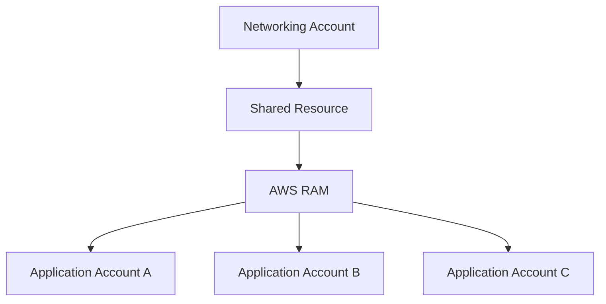
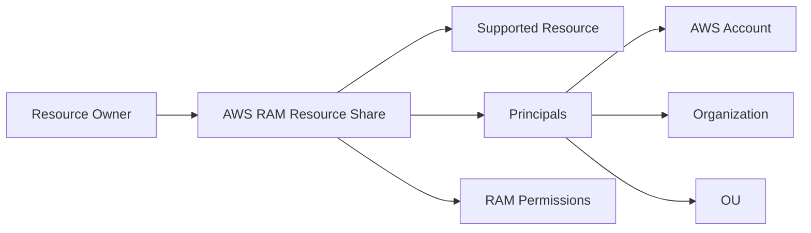
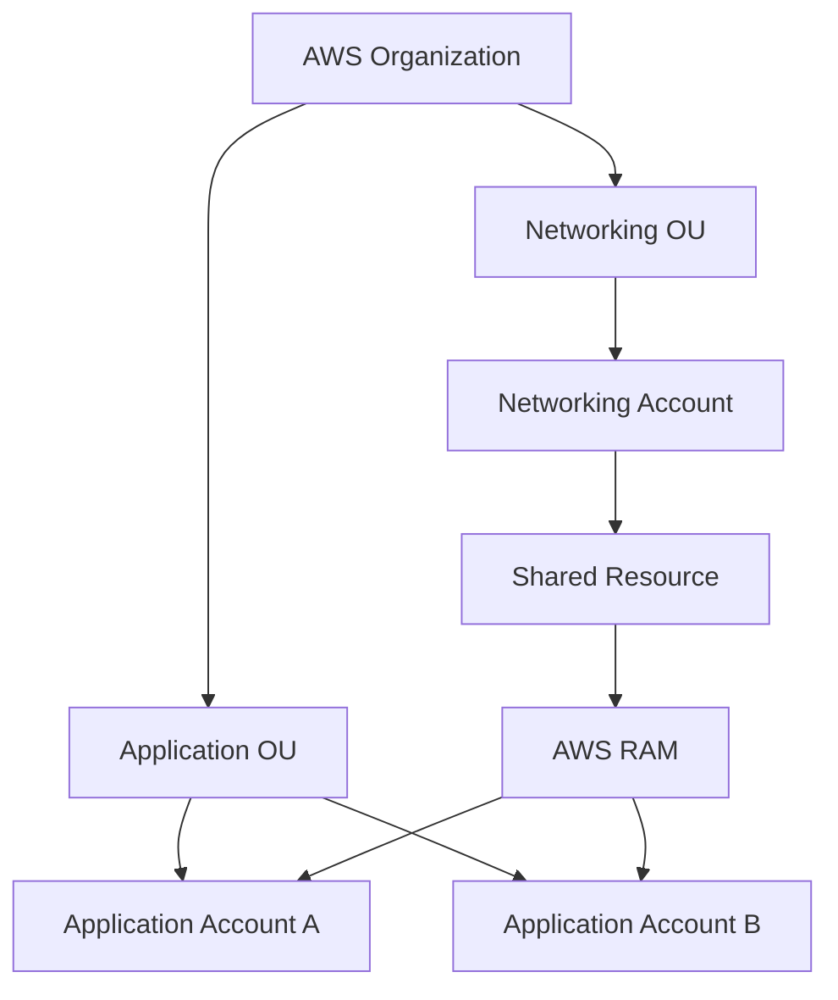
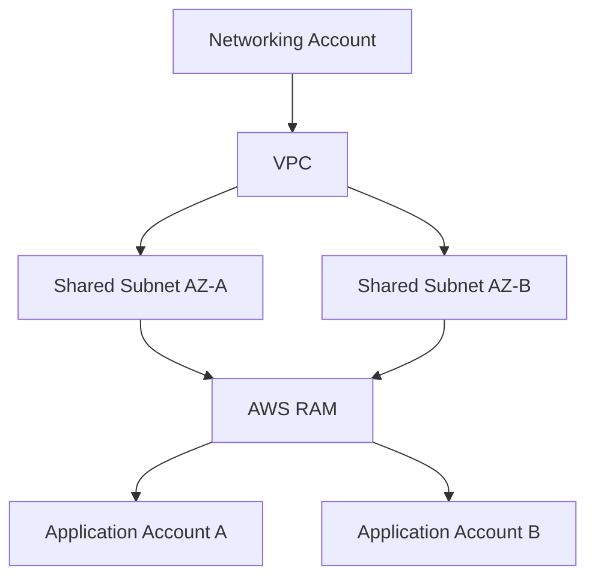
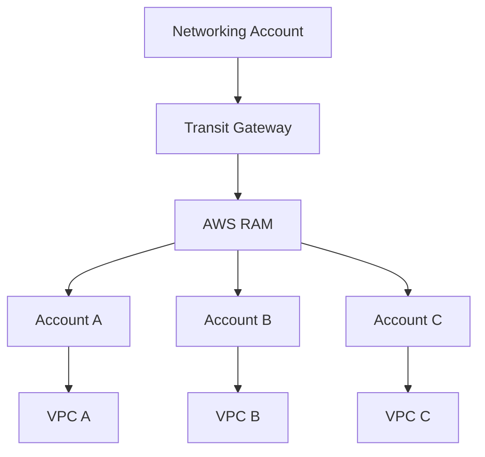
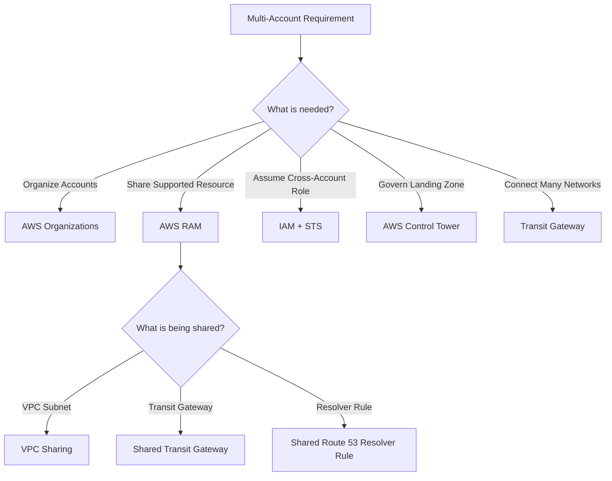
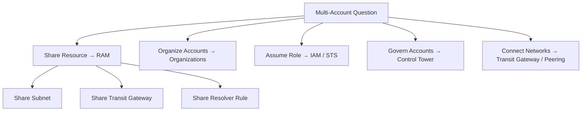

# AWS Resource Access Manager (RAM) — Cross-Account Resource Sharing

## 📑 Table of Contents

1. [Mental Model](#1-mental-model)
2. [Core Purpose](#2-core-purpose)
3. [How AWS RAM Works](#3-how-aws-ram-works)
4. [What Can Be Shared](#4-what-can-be-shared)
5. [AWS Organizations Integration](#5-aws-organizations-integration)
6. [VPC Subnet Sharing](#6-vpc-subnet-sharing)
7. [RAM and Transit Gateway](#7-ram-and-transit-gateway)
8. [RAM vs Other Services](#8-ram-vs-other-services)
9. [RAM Decision Map](#9-ram-decision-map)
10. [High-Value Exam Traps](#10-high-value-exam-traps)
11. [Scenario Check](#11-scenario-check)
12. [AWS RAM in 20 Seconds](#12-aws-ram-in-20-seconds)

---

# 1. Mental Model

> [!TIP]
> 🧠 **Mental Model**
>
> **AWS RAM = Share AWS Resources Across Accounts**
>
> ```text
> Account A
> owns resource
>      ↓
> AWS RAM
>      ↓
> Account B
> uses resource
> ```
>
> Think:
>
> **SHARE, DON'T DUPLICATE**

AWS Resource Access Manager (RAM) allows supported AWS resources to be shared across AWS accounts.

> [!IMPORTANT]
> 🎯 **SAA Memory**
>
> ```text
> ORGANIZE ACCOUNTS
> → AWS Organizations
>
> SHARE RESOURCES
> → AWS RAM
>
> ASSUME ROLE
> → IAM / STS
> ```

---

# 2. Core Purpose

Without resource sharing, multiple AWS accounts might need to create duplicate infrastructure.

Example:

```text
Account A → Transit Gateway A
Account B → Transit Gateway B
Account C → Transit Gateway C
```

With AWS RAM, supported resources can be centrally owned and shared.



This is particularly useful in **multi-account architectures**.

> [!TIP]
> 💡 **Exam Pattern**
>
> ```text
> Multiple AWS Accounts
> +
> Need to use the same supported resource
> +
> Avoid duplication
> ```
>
> → **AWS RAM**

---

# 3. How AWS RAM Works

The account that owns the resource creates a **Resource Share**.

Conceptually:

```text
Resource Owner
      ↓
Resource Share
      ↓
AWS RAM
      ↓
Principals
```

A resource share defines:

```text
Resources
+
Principals
+
Permissions
```

Principals can include supported identities such as:

- AWS accounts
- AWS Organizations
- Organizational Units (OUs)

depending on the sharing configuration and resource type.



> [!IMPORTANT]
> AWS RAM does not mean transferring ownership of the resource.
>
> ```text
> Owner Account
> → Owns / manages resource
>
> Consumer Account
> → Uses shared resource
> ```

---

# 4. What Can Be Shared

AWS RAM works only with **supported resource types**.

High-value SAA examples include:

- VPC subnets
- Transit Gateways
- Route 53 Resolver rules
- AWS License Manager configurations
- Other supported AWS resource types

> [!CAUTION]
> ⚠️ **Exam Trap**
>
> AWS RAM does **not** mean:
>
> ```text
> "Share absolutely any AWS resource"
> ```
>
> The resource type must support AWS RAM.

For the SAA exam, the most important mental associations are:

```text
Shared VPC Subnet
→ RAM

Shared Transit Gateway
→ RAM

Shared Route 53 Resolver Rule
→ RAM
```

---

# 5. AWS Organizations Integration

RAM becomes especially useful together with AWS Organizations.



Resources can be shared with accounts or organizational structures such as OUs when supported.

This avoids manually managing resource shares account by account.

> [!TIP]
> 💡 **Exam Pattern**
>
> ```text
> AWS Organizations
> +
> Many Accounts
> +
> Centrally Shared Infrastructure
> ```
>
> → **AWS RAM**

---

## Organizations vs RAM

These services solve different problems.

```text
AWS Organizations
→ ORGANIZE / GOVERN ACCOUNTS

AWS RAM
→ SHARE RESOURCES
```

> [!IMPORTANT]
> 🎯 **Don't Confuse**
>
> AWS Organizations itself is not the service whose primary purpose is sharing infrastructure resources.
>
> RAM performs the resource sharing.

---

# 6. VPC Subnet Sharing

One of the most important RAM scenarios is **VPC sharing**.

A central networking account can own a VPC and share subnets with other accounts.



Application accounts can deploy supported resources into shared subnets without owning the VPC itself.

Think:

```text
Networking Team
→ Owns VPC

Application Teams
→ Deploy resources into shared subnets
```

> [!TIP]
> 💡 **Exam Pattern**
>
> ```text
> Central Networking Account
> +
> Multiple Application Accounts
> +
> Use Same VPC Infrastructure
> ```
>
> → **VPC Sharing with AWS RAM**

---

## VPC Sharing vs VPC Peering

These solve different requirements.

```text
VPC Sharing
→ Multiple accounts use centrally owned VPC subnets

VPC Peering
→ Connect two separate VPCs
```

Architecture difference:

```text
VPC SHARING

Central VPC
├── Account A resources
├── Account B resources
└── Account C resources
```

versus:

```text
VPC PEERING

VPC A
  ↕
Peering
  ↕
VPC B
```

> [!CAUTION]
> ⚠️ **Exam Trap**
>
> ```text
> SHARE SUBNET
> → RAM
>
> CONNECT TWO VPCs
> → VPC Peering / Transit Gateway
> ```

See [Amazon VPC](../Networking/aws_vpc.md).

---

# 7. RAM and Transit Gateway

A Transit Gateway can be centrally owned and shared with other accounts using AWS RAM.



This is common in centralized networking architectures.

Think:

```text
Many Accounts
+
Central Transit Gateway
        ↓
AWS RAM
```

> [!TIP]
> 💡 **Exam Pattern**
>
> ```text
> Share Transit Gateway
> across AWS accounts
> ```
>
> → **AWS RAM**

---

# 8. RAM vs Other Services

## RAM vs AWS Organizations

```text
Organizations
→ Manage accounts / OUs / governance

RAM
→ Share supported resources
```

Example:

```text
"Group accounts into OUs"
→ Organizations

"Share a subnet with accounts in an OU"
→ RAM + Organizations
```

---

## RAM vs IAM Cross-Account Access

IAM and RAM are related to cross-account architectures, but solve different problems.

```text
AWS RAM
→ Share supported resource

IAM / STS
→ Assume identity / access another account
```

Example:

```text
Account B needs to use a shared subnet
→ RAM

User in Account B needs to assume an admin role in Account A
→ IAM Role + STS
```

> [!IMPORTANT]
> 🎯 **SAA Memory**
>
> ```text
> SHARE RESOURCE
> → RAM
>
> ASSUME ROLE
> → IAM / STS
> ```

---

## RAM vs VPC Peering

```text
RAM
→ Share supported infrastructure

VPC Peering
→ Network connectivity between two VPCs
```

---

## RAM vs Transit Gateway

```text
Transit Gateway
→ CONNECT networks

RAM
→ SHARE the Transit Gateway
```

These services can therefore work together.

---

## RAM vs Control Tower

```text
AWS RAM
→ Share resources

AWS Control Tower
→ Establish and govern a multi-account environment
```

> [!IMPORTANT]
> 🎯 **Multi-Account Memory**
>
> ```text
> ORGANIZE
> → Organizations
>
> GOVERN
> → Control Tower
>
> SHARE
> → RAM
>
> ASSUME
> → IAM / STS
>
> CONNECT
> → Transit Gateway
> ```

---

## Quick Comparison

| Requirement                       | Service               |
| --------------------------------- | --------------------- |
| Organize AWS accounts             | **AWS Organizations** |
| Share supported resources         | **AWS RAM**           |
| Assume a cross-account role       | **IAM + STS**         |
| Connect many VPCs/networks        | **Transit Gateway**   |
| Connect two VPCs directly         | **VPC Peering**       |
| Govern multi-account landing zone | **Control Tower**     |

---

# 9. RAM Decision Map



---

# 10. High-Value Exam Traps

> [!CAUTION]
> ⚠️ **Trap 1 — Organizations vs RAM**
>
> ```text
> ORGANIZE ACCOUNTS
> → Organizations
>
> SHARE RESOURCES
> → RAM
> ```

---

> [!CAUTION]
> ⚠️ **Trap 2 — RAM vs IAM**
>
> ```text
> Share Infrastructure Resource
> → RAM
>
> Assume Role in Another Account
> → IAM + STS
> ```

---

> [!CAUTION]
> ⚠️ **Trap 3 — RAM vs VPC Peering**
>
> ```text
> Share Subnet
> → RAM
>
> Connect Separate VPCs
> → VPC Peering / Transit Gateway
> ```

---

> [!CAUTION]
> ⚠️ **Trap 4 — Transit Gateway**
>
> ```text
> Transit Gateway
> → CONNECTS NETWORKS
>
> RAM
> → SHARES THE TRANSIT GATEWAY
> ```

---

> [!CAUTION]
> ⚠️ **Trap 5 — Ownership**
>
> Sharing a resource does not transfer its ownership.
>
> ```text
> Owner Account
> → Owns resource
>
> Consumer Account
> → Uses resource
> ```

---

> [!CAUTION]
> ⚠️ **Trap 6 — Supported Resources**
>
> RAM does not share every AWS resource.
>
> The resource type must support RAM.

---

> [!CAUTION]
> ⚠️ **Trap 7 — VPC Sharing**
>
> ```text
> Central Networking Account
> +
> Other Accounts Deploy into Shared Subnets
> ```
>
> → **AWS RAM**
>
> You do not need a separate VPC in every participating account merely to achieve this design.

---

# 11. Scenario Check

## Scenario 1 — Shared Subnets

> A company has a central networking account. Application teams in multiple AWS accounts need to deploy resources into centrally managed VPC subnets.

```text
Central VPC
+
Shared Subnets
+
Multiple Accounts
        ↓
AWS RAM
```

> [!TIP]
> **Answer: VPC Sharing using AWS RAM**

---

## Scenario 2 — Shared Transit Gateway

> A company operates hundreds of AWS accounts but wants one centrally managed Transit Gateway.

```text
Central Transit Gateway
+
Multiple Accounts
        ↓
AWS RAM
```

---

## Scenario 3 — Cross-Account Administrator

> An administrator in Account A must temporarily obtain permissions in Account B.

```text
Cross-Account Identity
        ↓
IAM Role
+
STS AssumeRole
```

Not RAM.

---

## Scenario 4 — Organize Accounts

> A company needs to place production and development AWS accounts into separate organizational units.

```text
Accounts
+
OUs
    ↓
AWS Organizations
```

Not RAM.

---

## Scenario 5 — Connect Separate VPCs

> Two independently owned VPCs need direct private connectivity.

```text
VPC A
+
VPC B
    ↓
VPC Peering
```

RAM is not itself the network connectivity mechanism.

---

## Scenario 6 — Shared DNS Rules

> Multiple accounts need to use centrally managed Route 53 Resolver rules.

```text
Central Resolver Rules
+
Multiple Accounts
        ↓
AWS RAM
```

---

# 12. AWS RAM in 20 Seconds



> [!NOTE]
> 🧠 **SAA Memory**
>
> **RAM → SHARE RESOURCES**
>
> **ORGANIZATIONS → ORGANIZE ACCOUNTS**
>
> **CONTROL TOWER → GOVERN**
>
> **IAM / STS → ASSUME ROLE**
>
> **TRANSIT GATEWAY → CONNECT NETWORKS**
>
> ---
>
> High-value RAM examples:
>
> **VPC SUBNET → RAM**
>
> **TRANSIT GATEWAY → RAM**
>
> **ROUTE 53 RESOLVER RULE → RAM**
>
> ---
>
> Fastest mnemonic:
>
> ```text
> ORGANIZE → Organizations
> SHARE    → RAM
> GOVERN   → Control Tower
> ASSUME   → IAM / STS
> CONNECT  → Transit Gateway
> ```

---

# 🔗 Related Notes

## Security

- [AWS IAM](aws_iam.md)

## Networking

- [Amazon VPC](../Networking/aws_vpc.md)
- [Network Connectivity](../Networking/aws_network_connectivity.md)
- [Amazon Route 53](../Networking/aws_route53.md)

---

# 📚 Study Order

1. RAM Mental Model
2. Resource Shares
3. RAM + Organizations
4. VPC Subnet Sharing
5. Transit Gateway Sharing
6. RAM vs IAM / STS
7. RAM vs Organizations
8. RAM vs VPC Peering

---

# 📚 Sources

- AWS Resource Access Manager — What is AWS RAM?
- AWS Resource Access Manager — Shareable AWS Resources
- AWS Resource Access Manager — AWS Organizations Integration
- Amazon VPC — VPC Sharing
- AWS Transit Gateway — Cross-Account Sharing

---

**Reviewed:** 2026-09-23  
**Focus:** SAA-C03 multi-account resource sharing, VPC sharing and centralized infrastructure.
