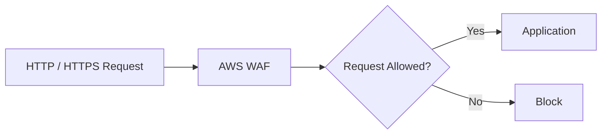
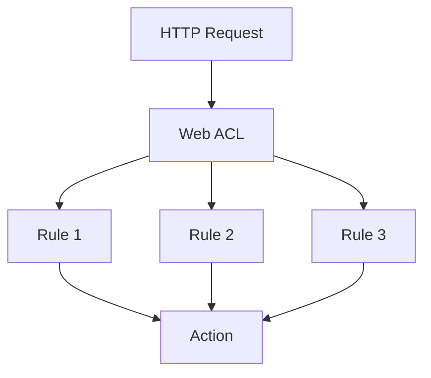
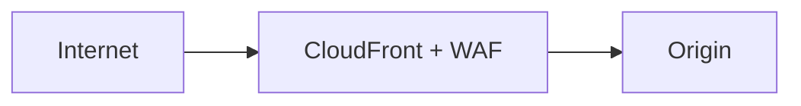
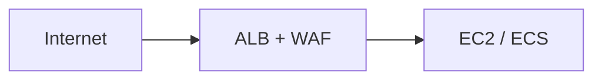
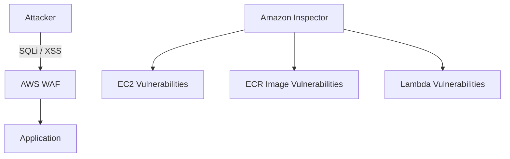
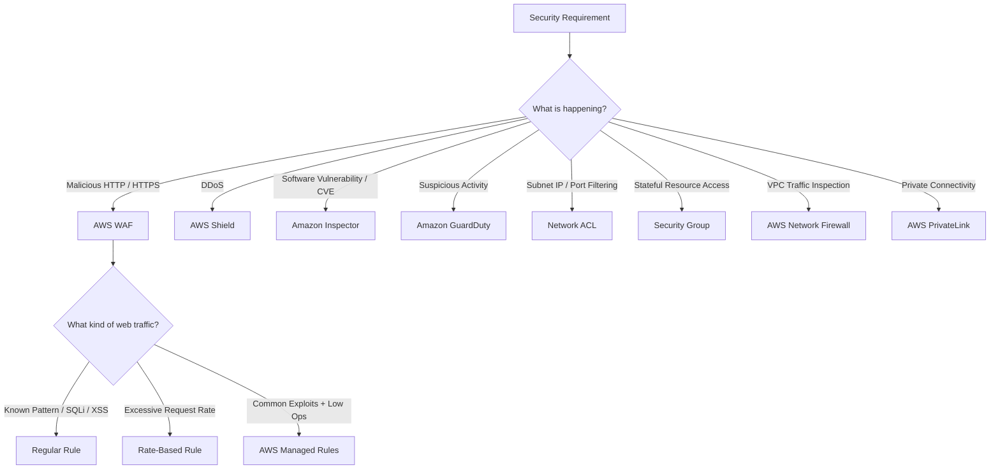
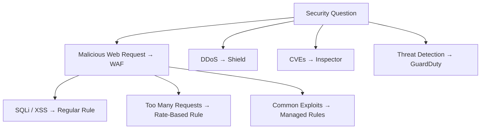

# AWS WAF — Web Application Firewall

## 📑 Table of Contents

1. [Mental Model](#1-mental-model)
2. [Core Purpose](#2-core-purpose)
3. [Web ACL](#3-web-acl)
4. [WAF Rules](#4-waf-rules)
5. [Regular vs Rate-Based Rules](#5-regular-vs-rate-based-rules)
6. [AWS Managed Rules](#6-aws-managed-rules)
7. [WAF Integrations](#7-waf-integrations)
8. [Monitoring and Logging](#8-monitoring-and-logging)
9. [WAF vs Other Security Services](#9-waf-vs-other-security-services)
10. [Decision Map](#10-decision-map)
11. [High-Value Exam Traps](#11-high-value-exam-traps)
12. [Scenario Check](#12-scenario-check)
13. [AWS WAF in 20 Seconds](#13-aws-waf-in-20-seconds)

---

# 1. Mental Model

> [!TIP]
> 🧠 **Mental Model**
>
> **AWS WAF = Layer 7 protection for web applications and APIs**
>
> ```text
> HTTP / HTTPS Request
>          ↓
>       AWS WAF
>          ↓
> Is this web request allowed?
> ```

AWS WAF inspects **HTTP/HTTPS requests** and filters malicious or unwanted web traffic.

> [!IMPORTANT]
> 🎯 **SAA Memory**
>
> ```text
> WAF
> → WEB REQUEST PROTECTION
>
> Shield
> → DDoS PROTECTION
>
> Inspector
> → VULNERABILITY SCANNING
>
> GuardDuty
> → THREAT DETECTION
> ```

---

# 2. Core Purpose

AWS WAF protects web applications and APIs by inspecting incoming web requests.

It can evaluate characteristics such as:

- Source IP address
- Geographic location
- URI path
- Query strings
- HTTP headers
- Request body
- SQL injection patterns
- Cross-Site Scripting (XSS) patterns

Conceptually:



> [!TIP]
> 💡 **Exam Pattern**
>
> ```text
> Malicious HTTP / HTTPS Requests
> ```
>
> → **AWS WAF**

---

# 3. Web ACL

A **Web ACL** contains the rules that AWS WAF evaluates.

Think:

```text
Web ACL
= Collection of WAF Rules
```

Architecture:



A Web ACL also has a **default action** for requests that do not match its rules.

Common rule actions include:

```text
ALLOW
→ Allow request

BLOCK
→ Block request

COUNT
→ Count matching requests without blocking
```

> [!IMPORTANT]
> 🎯 **Mental Model**
>
> ```text
> Web ACL
>    ↓
> Rules
>    ↓
> Actions
> ```

---

# 4. WAF Rules

Rules define what AWS WAF should inspect and what action it should take when a request matches.

For SAA, the most important distinction is:

```text
Regular Rule
→ WHAT does the request look like?

Rate-Based Rule
→ HOW MANY requests are being sent?
```

---

## Regular Rule

A regular rule matches requests based on specific characteristics or attack patterns.

Examples:

- Specific IP address
- Geographic location
- URI
- Headers
- Query strings
- Request body
- SQL injection
- XSS

Example:

```text
Request contains SQL Injection
            ↓
       Regular Rule
            ↓
           BLOCK
```

> [!TIP]
> 💡 **Exam Pattern**
>
> ```text
> Known Request Characteristic
> or
> Known Attack Pattern
> ```
>
> → **Regular Rule**

Examples:

```text
Specific IP
→ Regular Rule

Specific Country
→ Regular Rule

SQL Injection
→ Regular Rule

XSS
→ Regular Rule
```

---

## Rate-Based Rule

A rate-based rule tracks the rate of incoming requests and applies the configured action when the rate exceeds the configured threshold.

Useful for:

- Excessive HTTP requests
- HTTP floods
- Abusive clients
- Bots
- Brute-force-like traffic

Example:

```text
Client A → Normal Rate    → ALLOW
Client B → Normal Rate    → ALLOW
Client C → Excessive Rate → ACTION
```

> [!TIP]
> 💡 **Exam Pattern**
>
> Look for:
>
> ```text
> "High number of requests"
>
> "Excessive requests"
>
> "Limit request rate"
>
> "HTTP flood"
>
> "Minimize impact on legitimate users"
> ```
>
> → **Rate-Based Rule**

---

# 5. Regular vs Rate-Based Rules

This is one of the most important WAF distinctions for SAA.

| Requirement                | Rule           |
| -------------------------- | -------------- |
| Block specific IP          | **Regular**    |
| Block specific country     | **Regular**    |
| Filter URI / header / body | **Regular**    |
| SQL Injection              | **Regular**    |
| XSS                        | **Regular**    |
| Excessive request rate     | **Rate-Based** |
| HTTP flood                 | **Rate-Based** |
| Rate-limit abusive clients | **Rate-Based** |

> [!IMPORTANT]
> 🧠 **SAA Memory**
>
> ```text
> REGULAR
> → WHAT?
>
> RATE-BASED
> → HOW MANY?
> ```

> [!CAUTION]
> ⚠️ **Exam Trap**
>
> Do not choose a regular rule merely because you could identify individual malicious IP addresses.
>
> If the scenario emphasizes **frequently changing sources + excessive request rates**, a rate-based rule is usually the stronger clue.

---

# 6. AWS Managed Rules

AWS provides preconfigured rule groups for common web threats.

They reduce the need to manually create and maintain every protection rule.

Common protection areas include:

- SQL injection
- XSS
- Known bad inputs
- Common web vulnerabilities

Think:

```text
Common Web Threats
+
Minimal Rule Management
        ↓
AWS Managed Rules
```

> [!TIP]
> 💡 **Exam Pattern**
>
> ```text
> Common Web Exploits
> +
> Minimal Operational Overhead
> ```
>
> → **AWS Managed Rules**

---

# 7. WAF Integrations

AWS WAF can protect supported web-facing AWS resources.

Important SAA examples:

- Amazon CloudFront
- Application Load Balancer (ALB)
- Amazon API Gateway
- AWS AppSync

---

## CloudFront + WAF



Malicious requests can be filtered before reaching the origin.

> [!TIP]
> 💡 **Exam Pattern**
>
> ```text
> Global Web Application
> +
> CloudFront
> +
> Malicious HTTP Requests
> ```
>
> → **CloudFront + AWS WAF**

---

## ALB + WAF



This is a common pattern for regional web applications.

> [!TIP]
> 💡 **Exam Pattern**
>
> ```text
> ALB
> +
> Malicious HTTP Requests
> ```
>
> → **AWS WAF**

---

## API Gateway + WAF

For supported API Gateway configurations, WAF can protect APIs from malicious web requests.

Think:

```text
API
+
SQLi / XSS / Malicious HTTP
        ↓
AWS WAF
```

Do not confuse this with API Gateway throttling:

```text
API Gateway Throttling
→ Control API request rate

AWS WAF
→ Filter malicious / unwanted web requests
```

---

# 8. Monitoring and Logging

## Amazon CloudWatch

AWS WAF exposes metrics that can be monitored with CloudWatch.

Examples:

- Allowed requests
- Blocked requests
- Counted requests
- Rule activity

Think:

```text
WAF
→ PROTECT

CloudWatch
→ MONITOR
```

---

## WAF Logging

WAF logging can provide request information such as:

- Source IP
- URI
- User-Agent
- Geographic information
- Request details

Useful for:

```text
Security Analysis
Troubleshooting
Forensics
```

---

# 9. WAF vs Other Security Services

This is the highest-value comparison section.

| Requirement                          | Service                 |
| ------------------------------------ | ----------------------- |
| Malicious HTTP request               | **WAF**                 |
| SQL Injection / XSS                  | **WAF**                 |
| Excessive HTTP requests              | **WAF Rate-Based Rule** |
| DDoS protection                      | **Shield**              |
| Find software vulnerabilities / CVEs | **Inspector**           |
| Detect suspicious activity           | **GuardDuty**           |
| Subnet IP / port filtering           | **NACL**                |
| Stateful network access              | **Security Group**      |
| VPC network inspection               | **Network Firewall**    |
| Private service connectivity         | **PrivateLink**         |

---

## WAF vs Shield

```text
WAF
→ WEB REQUEST FILTERING

Shield
→ DDoS PROTECTION
```

### WAF

Think:

- SQL Injection
- XSS
- HTTP filtering
- IP filtering
- URI / header / body inspection
- Rate-based rules

### Shield

Think:

- DDoS
- Volumetric attacks
- Network / transport attacks

> [!IMPORTANT]
> 🧠 **Don't Confuse**
>
> ```text
> WAF
> → Is the WEB REQUEST malicious?
>
> Shield
> → Is someone trying to OVERWHELM the application?
> ```

WAF and Shield can be used together.

---

## WAF vs Inspector

```text
WAF
→ ATTACKS AGAINST WEB APPLICATION

Inspector
→ VULNERABILITIES INSIDE WORKLOAD
```

Example:



> [!TIP]
> 💡 **Exam Pattern**
>
> ```text
> Block Malicious Web Requests
> → WAF
>
> Find CVEs / Vulnerable Software
> → Inspector
> ```

---

## WAF vs GuardDuty

```text
WAF
→ BLOCK / FILTER WEB REQUESTS

GuardDuty
→ DETECT THREATS
```

Examples:

```text
SQL Injection
→ WAF

XSS
→ WAF

Suspicious API Activity
→ GuardDuty

Potentially Compromised Credentials
→ GuardDuty
```

> [!IMPORTANT]
> 🧠 **Memory**
>
> ```text
> WAF       → BLOCK WEB ATTACKS
> Inspector → FIND VULNERABILITIES
> GuardDuty → DETECT THREATS
> Shield    → DDoS
> ```

---

## WAF vs NACL

```text
WAF
→ APPLICATION LAYER

NACL
→ SUBNET / NETWORK LAYER
```

WAF understands:

```text
GET /login
POST /checkout
Headers
URI
SQL Injection
XSS
```

NACL controls:

```text
IP
Protocol
Port
Allow / Deny
```

> [!CAUTION]
> ⚠️ **Exam Trap**
>
> ```text
> SQLi / XSS / HTTP Rate Limiting
> → WAF
>
> Subnet-Level IP / Port Filtering
> → NACL
> ```

---

## WAF vs Security Groups

```text
Security Group
→ WHO CAN REACH THE RESOURCE?

WAF
→ WHAT WEB REQUESTS SHOULD BE ALLOWED?
```

Example:

```text
Allow TCP 443 to ALB / EC2
→ Security Group

Block SQL Injection over HTTPS
→ WAF
```

> [!IMPORTANT]
> Security Groups do not understand whether an HTTPS request contains SQL injection or XSS.

---

## WAF vs Network Firewall

```text
AWS WAF
→ WEB APPLICATION TRAFFIC
→ HTTP / HTTPS

AWS Network Firewall
→ VPC NETWORK TRAFFIC
→ NETWORK INSPECTION / FILTERING
```

Think:

```text
WEB REQUEST SECURITY
→ WAF

VPC NETWORK SECURITY
→ Network Firewall
```

---

## WAF vs PrivateLink

```text
PrivateLink
→ PRIVATE CONNECTIVITY

WAF
→ WEB REQUEST PROTECTION
```

PrivateLink does not exist to:

- Detect SQL Injection
- Detect XSS
- Inspect malicious web requests
- Rate-limit abusive web clients

> [!CAUTION]
> ⚠️ **Exam Trap**
>
> ```text
> PRIVATE
> → PrivateLink
>
> MALICIOUS HTTP
> → WAF
> ```

---

# 10. Decision Map



---

# 11. High-Value Exam Traps

> [!CAUTION]
> ⚠️ **Trap 1 — SQL Injection / XSS**
>
> ```text
> SQL Injection
> XSS
> Malicious HTTP
>        ↓
> AWS WAF
> ```

---

> [!CAUTION]
> ⚠️ **Trap 2 — HTTP Flood**
>
> ```text
> Excessive HTTP Requests
>        ↓
> WAF Rate-Based Rule
> ```

---

> [!CAUTION]
> ⚠️ **Trap 3 — WAF vs Shield**
>
> ```text
> Web Request Attack
> → WAF
>
> DDoS
> → Shield
> ```

---

> [!CAUTION]
> ⚠️ **Trap 4 — WAF vs Inspector**
>
> ```text
> Attack Request
> → WAF
>
> Vulnerable Software
> → Inspector
> ```

---

> [!CAUTION]
> ⚠️ **Trap 5 — WAF vs GuardDuty**
>
> ```text
> Block Web Attack
> → WAF
>
> Detect Threat
> → GuardDuty
> ```

---

> [!CAUTION]
> ⚠️ **Trap 6 — WAF vs Security Group**
>
> ```text
> Allow HTTPS Port 443
> → Security Group
>
> Inspect HTTPS Request
> → WAF
> ```

---

> [!CAUTION]
> ⚠️ **Trap 7 — Regular vs Rate-Based**
>
> ```text
> WHAT does the request look like?
> → Regular
>
> HOW MANY requests?
> → Rate-Based
> ```

---

> [!CAUTION]
> ⚠️ **Trap 8 — Changing Attack Sources**
>
> If malicious traffic comes from many or frequently changing IP addresses, manually maintaining IP rules may be inefficient.
>
> If the key requirement is controlling excessive request rates:
>
> → **Rate-Based Rule**

---

> [!CAUTION]
> ⚠️ **Trap 9 — Managed Rules**
>
> ```text
> Common Web Exploits
> +
> Minimum Rule Maintenance
> ```
>
> → **AWS Managed Rules**

---

# 12. Scenario Check

## Scenario 1 — SQL Injection

> An internet-facing application is receiving requests containing SQL injection patterns.

```text
Malicious HTTP Content
        ↓
AWS WAF
```

---

## Scenario 2 — HTTP Flood from Changing Sources

> An ALB receives a high number of illegitimate requests from frequently changing external sources. The company wants to minimize impact on legitimate users.

```text
Excessive Request Rate
+
Changing Sources
        ↓
WAF Rate-Based Rule
+
Web ACL associated with ALB
```

> [!TIP]
> **Answer: AWS WAF Rate-Based Rule**

### Why not a regular rule?

A regular rule is useful when matching a known request characteristic.

The strongest clue here is:

```text
EXCESSIVE REQUEST RATE
```

→ **Rate-Based Rule**

### Why not NACL?

NACL does not provide application-level HTTP rate-based filtering.

### Why not PrivateLink?

PrivateLink provides private connectivity, not web request filtering.

---

## Scenario 3 — Vulnerable EC2 Package

> A company needs to identify known vulnerabilities in software packages installed on EC2.

```text
Software Vulnerability
+
CVE
    ↓
Amazon Inspector
```

Not WAF.

---

## Scenario 4 — DDoS

> A public application requires protection against distributed denial-of-service attacks.

```text
DDoS
 ↓
AWS Shield
```

WAF can complement Shield for application-layer filtering, but the direct DDoS clue points to **Shield**.

---

## Scenario 5 — Block Malicious Requests at CloudFront

> A global application uses CloudFront and needs to block malicious HTTP requests before they reach the origin.

```text
Internet
   ↓
CloudFront + WAF
   ↓
Origin
```

---

## Scenario 6 — Allow HTTPS

> EC2 instances should accept HTTPS only from an Application Load Balancer.

```text
Network Access
+
TCP 443
    ↓
Security Group
```

Not WAF.

---

# 13. AWS WAF in 20 Seconds



> [!NOTE]
> 🧠 **SAA Memory**
>
> **WAF → WEB REQUESTS**
>
> **WEB ACL → COLLECTION OF RULES**
>
> **REGULAR → WHAT?**
>
> **RATE-BASED → HOW MANY?**
>
> **MANAGED RULES → PRECONFIGURED PROTECTION**
>
> **SQLi / XSS → WAF**
>
> **HTTP FLOOD → WAF RATE-BASED**
>
> **DDoS → SHIELD**
>
> **CVEs → INSPECTOR**
>
> **THREATS → GUARDDUTY**
>
> **SUBNET FILTERING → NACL**
>
> **RESOURCE NETWORK ACCESS → SECURITY GROUP**
>
> **VPC TRAFFIC INSPECTION → NETWORK FIREWALL**
>
> **PRIVATE CONNECTIVITY → PRIVATELINK**

---

# 🔗 Related Notes

## Security

- [AWS Shield](aws_shield.md)
- [Amazon Inspector](aws_inspector.md)
- [Amazon GuardDuty](aws_guardduty.md)
- [AWS IAM](aws_iam.md)

## Networking

- [Amazon CloudFront](../Networking/aws_cloudfront.md)
- [Amazon VPC](../Networking/aws_vpc.md)

## Integration

- [Amazon API Gateway](../Integration/aws_apigateway.md)

---

# 📚 Study Order

1. WAF Mental Model
2. Web ACL
3. Regular Rule
4. Rate-Based Rule
5. Regular vs Rate-Based
6. Managed Rules
7. WAF + CloudFront / ALB / API Gateway
8. WAF vs Shield
9. WAF vs Inspector
10. WAF vs GuardDuty
11. Decision Map
12. Exam Traps

---

# 📚 Sources

- AWS WAF — Developer Guide
- AWS WAF — Web ACLs
- AWS WAF — Rate-Based Rules
- AWS WAF — Managed Rule Groups
- AWS WAF — Logging and Monitoring

---

**Reviewed:** 2026-09-24  
**Focus:** SAA-C03 Layer 7 protection, Web ACLs, rate-based rules and security-service selection.
