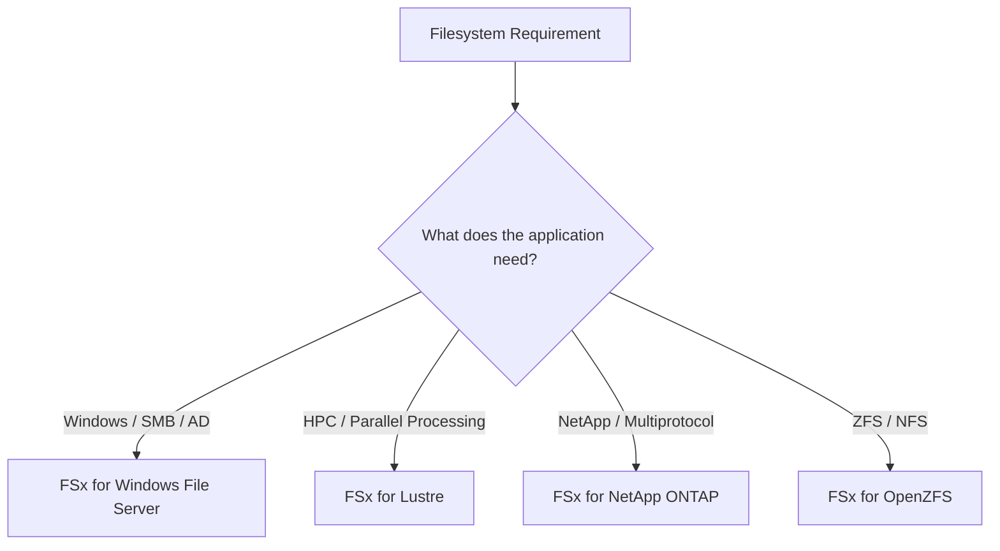
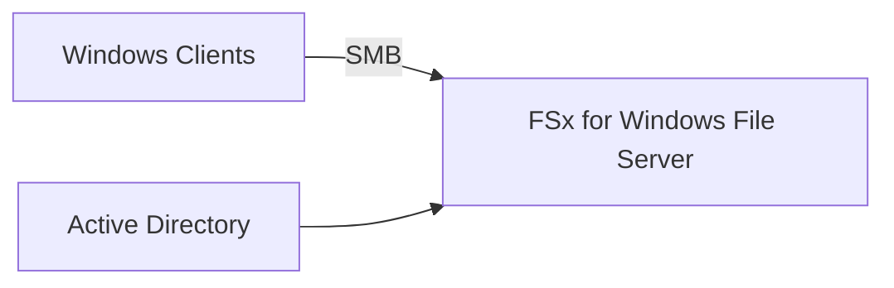
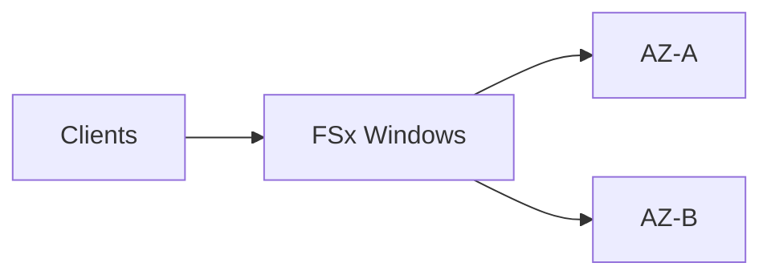
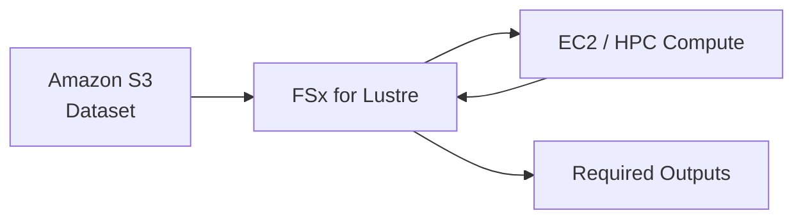
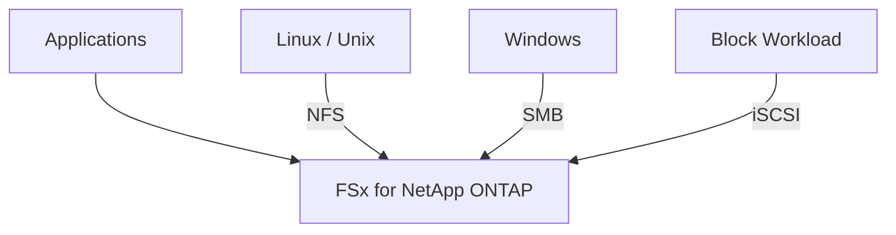
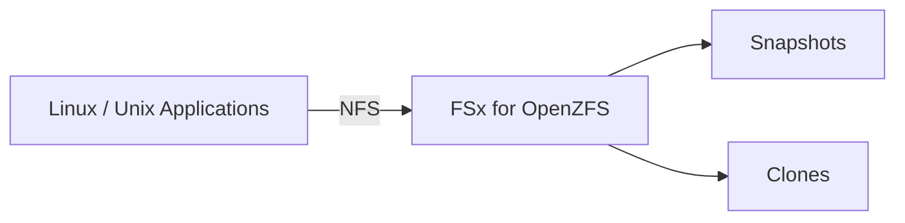
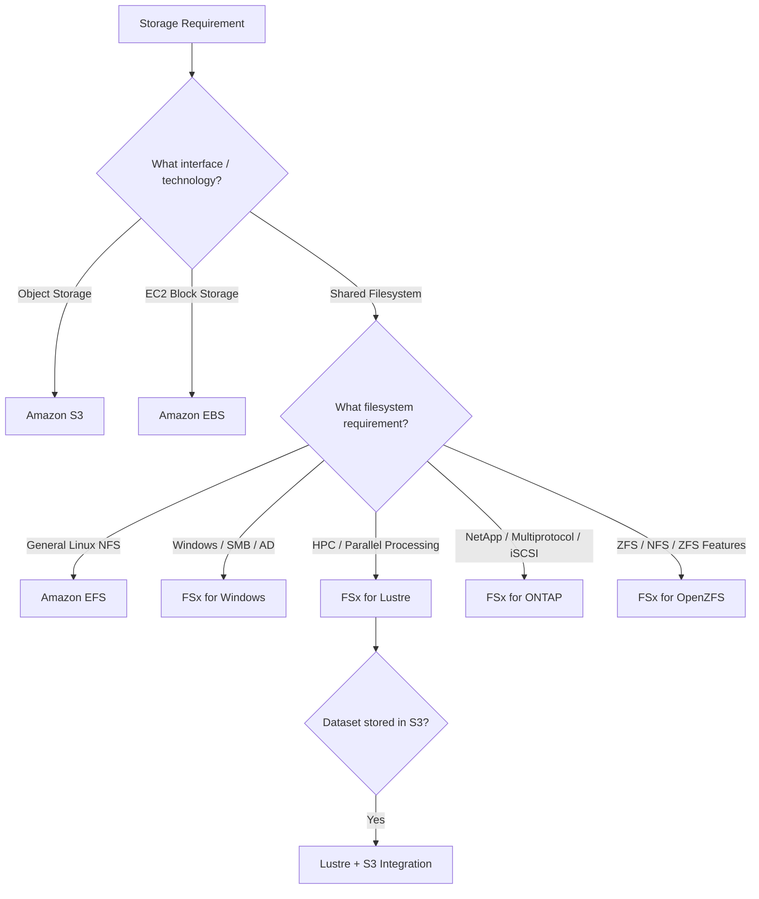
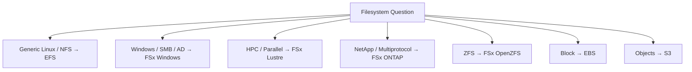

# Amazon FSx — Specialized Managed File Systems

## 📑 Table of Contents

1. [Mental Model](#1-mental-model)
2. [FSx Family](#2-fsx-family)
3. [FSx for Windows File Server](#3-fsx-for-windows-file-server)
4. [FSx for Lustre](#4-fsx-for-lustre)
5. [FSx for NetApp ONTAP](#5-fsx-for-netapp-ontap)
6. [FSx for OpenZFS](#6-fsx-for-openzfs)
7. [FSx vs EFS vs EBS vs S3](#7-fsx-vs-efs-vs-ebs-vs-s3)
8. [FSx Decision Map](#8-fsx-decision-map)
9. [High-Value Exam Traps](#9-high-value-exam-traps)
10. [Scenario Check](#10-scenario-check)
11. [Amazon FSx in 30 Seconds](#11-amazon-fsx-in-30-seconds)

---

# 1. Mental Model

> [!TIP]
> 🧠 **Mental Model**
>
> **Amazon FSx = Managed Specialized File Systems**
>
> ```text
> Windows / SMB
> → FSx for Windows File Server
>
> HPC / Parallel Processing
> → FSx for Lustre
>
> NetApp / Multiprotocol
> → FSx for NetApp ONTAP
>
> ZFS / NFS
> → FSx for OpenZFS
> ```

Amazon FSx is not one interchangeable filesystem.

It is a family of managed file systems optimized for different technologies and workloads.

> [!IMPORTANT]
> 🎯 **SAA Memory**
>
> ```text
> WINDOWS → Windows File Server
>
> HPC → Lustre
>
> NETAPP → ONTAP
>
> ZFS → OpenZFS
> ```

---

# 2. FSx Family

The first question should always be:

> **What filesystem technology does the application require?**

| Service                         | Main Capability                      | Strong Exam Clue                      |
| ------------------------------- | ------------------------------------ | ------------------------------------- |
| **FSx for Windows File Server** | Native Windows file system           | SMB, Windows, Active Directory        |
| **FSx for Lustre**              | High-performance parallel filesystem | HPC, ML, simulations, S3 datasets     |
| **FSx for NetApp ONTAP**        | NetApp managed filesystem            | NFS + SMB + iSCSI, NetApp, SnapMirror |
| **FSx for OpenZFS**             | Managed ZFS filesystem               | ZFS, NFS, snapshots, clones           |



---

# 3. FSx for Windows File Server

Think:

```text
WINDOWS
+
SMB
+
ACTIVE DIRECTORY
```

FSx for Windows File Server provides managed Windows-compatible file storage.

Common requirements:

- SMB
- Windows applications
- Active Directory integration
- Windows file shares
- Windows-compatible permissions
- NTFS semantics

Architecture:



> [!TIP]
> 💡 **Exam Pattern**
>
> ```text
> Windows Application
> +
> Shared Files
> +
> SMB
> +
> Active Directory
> ```
>
> → **FSx for Windows File Server**

---

## High Availability

When automatic failover across Availability Zones is required, evaluate an appropriate **Multi-AZ deployment**.



> [!IMPORTANT]
> Multi-AZ addresses availability.
>
> It does not replace backups or correct permissions.

---

## Permissions

A Windows-compatible share does not automatically mean every user can access every file.

Think:

```text
Active Directory Identity
+
Share Permissions
+
File ACLs
```

> [!CAUTION]
> ⚠️ **Exam Trap**
>
> ```text
> SMB support
> ≠
> Automatically correct permissions
> ```

---

# 4. FSx for Lustre

Think:

```text
HIGH PERFORMANCE
+
PARALLEL FILESYSTEM
+
HPC / ML
```

FSx for Lustre is designed for workloads requiring high-performance parallel file access.

Common use cases:

- HPC
- Machine Learning
- Large-scale data processing
- Scientific simulations
- Media processing
- Large datasets stored in S3


> [!TIP]
> 💡 **Exam Pattern**
>
> ```text
> Linux
> +
> HPC
> +
> Massive Dataset
> +
> Parallel Processing
> ```
>
> → **FSx for Lustre**

---

## Lustre + S3

One of the highest-value SAA associations is:

```text
S3
↓
FSx for Lustre
↓
High-Performance Processing
```

Supported data repository associations allow Lustre to work with datasets stored in S3.

Conceptually:



Think:

```text
S3 = Durable Object Storage

Lustre = Fast Processing Filesystem
```

> [!IMPORTANT]
> 🎯 **SAA Memory**
>
> ```text
> COLD / DURABLE DATASET
> → S3
>
> HOT / HIGH-PERFORMANCE PROCESSING
> → FSx for Lustre
> ```

---

## Scratch vs Persistent

Lustre has different deployment models.

### Scratch

Think:

```text
Temporary
+
High Performance
+
Data Can Be Recreated
```

Use when the filesystem's data is temporary and can be regenerated.

```text
S3 Dataset
    ↓
Lustre Scratch
    ↓
Processing
    ↓
Required Output
    ↓
Preserve Externally
```

> [!CAUTION]
> ⚠️ **Scratch**
>
> Do not treat Scratch as the durable copy of important data.

---

### Persistent

Think:

```text
Longer-Lived Workload
+
Data Replication
+
Failure Recovery
```

Persistent deployments provide stronger durability characteristics than Scratch.

> [!CAUTION]
> ⚠️ **Exam Trap**
>
> ```text
> Persistent
> ≠
> Automatically Multi-AZ
> ```
>
> Do not infer cross-AZ failover simply from the word **Persistent**.

---

## S3 Integration Is Not Magic Synchronization

> [!CAUTION]
> ⚠️ **Exam Trap**
>
> A linked S3 bucket does not mean every filesystem change has automatically and instantly appeared in S3.
>
> Understand the configured import/export behavior and ensure required outputs are preserved.

---

# 5. FSx for NetApp ONTAP

Think:

```text
NETAPP
+
MULTIPROTOCOL
+
ENTERPRISE MIGRATION
```

FSx for NetApp ONTAP is especially relevant for workloads already using NetApp technologies or requiring multiple storage protocols.

High-value protocols for SAA:

```text
NFS
SMB
iSCSI
```

Architecture:



> [!IMPORTANT]
> 🎯 **SAA Memory**
>
> **ONTAP = MULTIPROTOCOL**

---

## NetApp Migration

If the question contains terms such as:

```text
Existing NetApp Environment
SnapMirror
NetApp Migration
```

strongly consider:

**FSx for NetApp ONTAP**

> [!TIP]
> 💡 **Exam Pattern**
>
> ```text
> Existing NetApp
> +
> AWS Migration
> +
> Preserve NetApp Capabilities
> ```
>
> → **FSx for NetApp ONTAP**

---

## iSCSI

This is an especially useful distinction.

```text
Need shared block-style access using iSCSI
        ↓
FSx for NetApp ONTAP
```

Do not automatically choose EBS when the question explicitly requires shared/multiprotocol NetApp-style storage.

> [!TIP]
> 💡 **Exam Pattern**
>
> ```text
> iSCSI
> +
> Shared Storage
> +
> HA / NetApp Requirements
> ```
>
> → Consider **FSx for NetApp ONTAP**

---

# 6. FSx for OpenZFS

Think:

```text
ZFS
+
NFS
+
SNAPSHOTS / CLONES
```

FSx for OpenZFS provides managed ZFS-based file storage.

Common clues:

- Existing ZFS workload
- NFS
- ZFS semantics
- Snapshots
- Cloning
- Migration of ZFS-based applications



> [!TIP]
> 💡 **Exam Pattern**
>
> ```text
> Existing ZFS Application
> +
> Move to AWS
> +
> Preserve ZFS Capabilities
> ```
>
> → **FSx for OpenZFS**

---

# 7. FSx vs EFS vs EBS vs S3

This comparison is more important for SAA than memorizing every FSx feature.

| Requirement                      | Best Starting Point |
| -------------------------------- | ------------------- |
| General-purpose shared Linux NFS | **EFS**             |
| Windows-native SMB + AD          | **FSx for Windows** |
| HPC / parallel filesystem        | **FSx for Lustre**  |
| NetApp / NFS + SMB + iSCSI       | **FSx for ONTAP**   |
| ZFS-native filesystem            | **FSx for OpenZFS** |
| EC2 block storage                | **EBS**             |
| Object storage                   | **S3**              |

---

## EFS vs FSx

```text
Generic Linux Shared Filesystem
+
NFS
        ↓
EFS
```

But:

```text
NFS
+
NetApp Requirement
        ↓
FSx for ONTAP
```

or:

```text
NFS
+
ZFS Requirement
        ↓
FSx for OpenZFS
```

> [!CAUTION]
> ⚠️ **Exam Trap**
>
> **NFS alone does not automatically mean EFS.**
>
> Look for compatibility requirements.

---

## FSx Windows vs EFS

```text
Windows / SMB
→ FSx for Windows

Linux / NFS
→ EFS
```

This is one of the easiest SAA distinctions.

> [!IMPORTANT]
> 🎯 **Memory**
>
> ```text
> WINDOWS → SMB → FSx Windows
>
> LINUX → NFS → EFS
> ```

Unless the question specifically requires ONTAP, OpenZFS, or another specialized filesystem.

---

## FSx vs EBS

```text
EBS
→ BLOCK STORAGE
→ Typically attached to EC2

FSx
→ MANAGED FILESYSTEM FAMILY
```

But remember the ONTAP exception:

```text
FSx ONTAP
→ Can support iSCSI block access
```

Therefore always follow the **application requirement**, not only the broad service category.

---

## FSx vs S3

```text
S3
→ OBJECT STORAGE

FSx
→ FILESYSTEM
```

Example:

```text
Object:
s3://bucket/data/file.csv

Filesystem:
 /data/file.csv
```

Lustre can integrate with S3, but that does not turn S3 itself into a traditional POSIX filesystem.

---

# 8. FSx Decision Map



---

# 9. High-Value Exam Traps

> [!CAUTION]
> ⚠️ **Trap 1 — High Performance**
>
> ```text
> "High Performance"
> ≠
> Automatically Lustre
> ```
>
> Look for:
>
> - HPC
> - Parallel filesystem
> - Simulations
> - Large-scale processing

---

> [!CAUTION]
> ⚠️ **Trap 2 — NFS**
>
> ```text
> NFS
> ≠
> Automatically EFS
> ```
>
> Check for:
>
> ```text
> Generic Linux NFS
> → EFS
>
> NetApp
> → ONTAP
>
> ZFS
> → OpenZFS
> ```

---

> [!CAUTION]
> ⚠️ **Trap 3 — Windows**
>
> ```text
> Windows
> +
> SMB
> +
> Active Directory
> → FSx for Windows
> ```
>
> Not EFS.

---

> [!CAUTION]
> ⚠️ **Trap 4 — Lustre Persistent**
>
> ```text
> Persistent Lustre
> ≠
> Automatically Multi-AZ
> ```

Durability and Multi-AZ availability are separate concepts.

---

> [!CAUTION]
> ⚠️ **Trap 5 — Lustre Scratch**
>
> Scratch storage should be used when the data can be recreated.
>
> Do not make it the only durable copy of important data.

---

> [!CAUTION]
> ⚠️ **Trap 6 — S3 Integration**
>
> ```text
> Lustre + S3
> ≠
> Every change instantly synchronized
> ```
>
> Understand the configured data movement behavior.

---

> [!CAUTION]
> ⚠️ **Trap 7 — ONTAP**
>
> ```text
> NFS + SMB + iSCSI
> → ONTAP
> ```
>
> Multiprotocol requirements are a strong ONTAP clue.

---

> [!CAUTION]
> ⚠️ **Trap 8 — Snapshot vs HA**
>
> ```text
> Snapshot / Backup
> → Recover older data
>
> HA / Replication
> → Keep service available
> ```
>
> They solve different problems.

---

> [!CAUTION]
> ⚠️ **Trap 9 — Files vs Objects**
>
> ```text
> FSx
> → FILESYSTEM
>
> S3
> → OBJECT STORAGE
> ```

---

# 10. Scenario Check

## Scenario 1 — Windows File Share

> A company is migrating a Windows application that requires SMB shares and Active Directory integration.

```text
Windows
+
SMB
+
AD
    ↓
FSx for Windows File Server
```

---

## Scenario 2 — HPC Dataset in S3

> A company stores a large dataset in S3 and needs Linux HPC instances to process it using a high-performance parallel filesystem.

```text
S3 Dataset
+
HPC
+
Parallel Filesystem
        ↓
FSx for Lustre
```

> [!TIP]
> **Answer: FSx for Lustre + S3 integration**

---

## Scenario 3 — Temporary HPC Processing

> A dataset is stored durably in S3. Compute nodes require temporary high-performance filesystem storage and all temporary data can be recreated.

```text
Durable Data
→ S3

Temporary HPC Filesystem
→ Lustre Scratch
```

---

## Scenario 4 — NetApp Migration

> A company operates NetApp storage on premises and wants to migrate while preserving familiar NetApp capabilities and protocols.

```text
NetApp
+
AWS
    ↓
FSx for NetApp ONTAP
```

---

## Scenario 5 — Shared iSCSI Storage

> Multiple workloads require managed storage with iSCSI and NetApp-style data management.

```text
iSCSI
+
NetApp
+
Shared Storage
        ↓
FSx for NetApp ONTAP
```

---

## Scenario 6 — ZFS Migration

> A company has an existing ZFS application that uses NFS and relies on ZFS snapshots and cloning.

```text
ZFS
+
NFS
+
Snapshots / Clones
        ↓
FSx for OpenZFS
```

---

## Scenario 7 — Generic Linux Shared Filesystem

> Several Linux EC2 instances need a simple elastic shared NFS filesystem.

```text
Linux
+
Shared
+
NFS
+
No Specialized Requirement
        ↓
Amazon EFS
```

Not FSx just because it is a filesystem question.

---

# 11. Amazon FSx in 30 Seconds



> [!NOTE]
> 🧠 **SAA Memory**
>
> **EFS → GENERAL LINUX NFS**
>
> **FSx WINDOWS → SMB + AD**
>
> **FSx LUSTRE → HPC + PARALLEL**
>
> **FSx ONTAP → NETAPP + MULTIPROTOCOL**
>
> **FSx OPENZFS → ZFS + NFS**
>
> **EBS → BLOCK**
>
> **S3 → OBJECTS**
>
> ---
>
> Fastest FSx mnemonic:
>
> ```text
> WINDOWS → SMB
>
> LUSTRE → HPC
>
> ONTAP → NETAPP
>
> OPENZFS → ZFS
> ```

---

# 🔗 Related Notes

## Storage

- [Storage Overview](storage_overview.md)
- [Amazon EFS](aws_efs.md)
- [Amazon EBS](aws_ebs.md)
- [Amazon S3](aws_s3.md)
- [AWS Storage Gateway](aws_storage_gateway.md)
- [AWS DataSync](aws_datasync.md)

## Compute

- [Amazon EC2](../Compute/aws_ec2.md)

---

# 📚 Study Order

1. FSx Family
2. FSx Windows → SMB + AD
3. FSx Lustre → HPC + S3
4. Lustre Scratch vs Persistent
5. FSx ONTAP → Multiprotocol
6. FSx OpenZFS → ZFS
7. EFS vs FSx
8. EBS vs FSx vs S3
9. Decision Map
10. Exam Traps

---

# 📚 Sources

- AWS FSx for Windows File Server
- AWS FSx for Lustre — Deployment Options
- AWS FSx for Lustre — S3 Data Repository Associations
- AWS FSx for NetApp ONTAP
- AWS FSx for OpenZFS

---

**Reviewed:** 2026-09-23  
**Focus:** SAA-C03 filesystem selection, Windows workloads, HPC, NetApp and ZFS.
