# Amazon S3 — Objects, Protection and Lifecycle

## 📑 Table of Contents

1. [Mental Model](#1-mental-model)
2. [Core Concepts](#2-core-concepts)
3. [Storage Classes](#3-storage-classes)
4. [Lifecycle](#4-lifecycle)
5. [Versioning](#5-versioning)
6. [Replication](#6-replication)
7. [Access and Encryption](#7-access-and-encryption)
8. [Presigned URLs](#8-presigned-urls)
9. [Object Lock](#9-object-lock)
10. [Performance and Transfer](#10-performance-and-transfer)
11. [Events and Notifications](#11-events-and-notifications)
12. [S3 Decision Map](#12-s3-decision-map)
13. [High-Value Exam Traps](#13-high-value-exam-traps)
14. [Scenario Check](#14-scenario-check)
15. [S3 Decision in 30 Seconds](#15-s3-decision-in-30-seconds)

---

# 1. Mental Model

> [!TIP]
> 🧠 **Mental Model**
>
> **S3 = Object Storage**
>
> Store objects by key and access them through APIs.
>
> Choose the storage class based primarily on:
>
> - Access frequency
> - Retrieval speed
> - Resilience requirements
> - Retention period
> - Cost

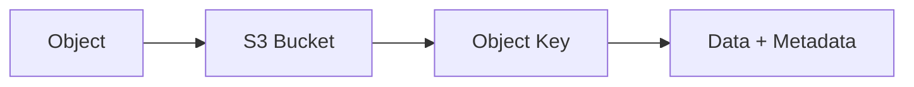

S3 provides durable **object storage**.

It is not:

- A normal shared POSIX filesystem → think [EFS](aws_efs.md)
- An EC2 block device → think [EBS](aws_ebs.md)

> [!IMPORTANT]
> 🎯 **SAA Memory**
>
> **S3 = OBJECTS**
>
> **EBS = BLOCK**
>
> **EFS = SHARED FILESYSTEM**

---

# 2. Core Concepts

## Buckets

This note focuses primarily on general-purpose S3 buckets.

A bucket is created in a specific AWS Region.

Objects are identified by their **object key**.

```text
s3://my-bucket/images/cat.jpg
     └───────┘ └────────────┘
       Bucket       Key
```

For general-purpose buckets, bucket names must be unique within an AWS partition.

---

## Strong Consistency

S3 provides strong consistency for:

- Object writes
- Overwrites
- Deletes
- LIST operations

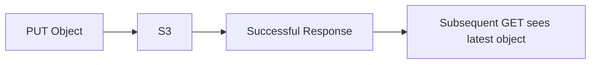

> [!CAUTION]
> ⚠️ **Exam Trap**
>
> **Strong consistency ≠ synchronous Cross-Region Replication**
>
> Strong consistency describes S3 operations within the service.
>
> Replication is a separate asynchronous mechanism.

---

# 3. Storage Classes

The key exam question is:

> **How frequently is the object accessed, and how quickly must it be retrieved?**

| Storage Class                     | Best For                            | Retrieval        | Key Distinction                               |
| --------------------------------- | ----------------------------------- | ---------------- | --------------------------------------------- |
| **S3 Standard**                   | Frequently accessed data            | Immediate        | Multi-AZ, no minimum storage duration         |
| **S3 Intelligent-Tiering**        | Unknown/changing access             | Immediate\*      | Automatically moves data between access tiers |
| **S3 Standard-IA**                | Infrequent access                   | Immediate        | Multi-AZ, retrieval charge, 30-day minimum    |
| **S3 One Zone-IA**                | Infrequent, recreatable data        | Immediate        | Single AZ, lower cost                         |
| **S3 Glacier Instant Retrieval**  | Rare access but immediate retrieval | Milliseconds     | 90-day minimum                                |
| **S3 Glacier Flexible Retrieval** | Archive                             | Minutes to hours | Restore required                              |
| **S3 Glacier Deep Archive**       | Long-term archive                   | Hours            | Lowest-cost archive, 180-day minimum          |
| **S3 Express One Zone**           | Very low-latency access             | Immediate        | Single-AZ directory buckets                   |

\* Some Intelligent-Tiering archive tiers require restoration before access.

---

## Storage Class Decision Map

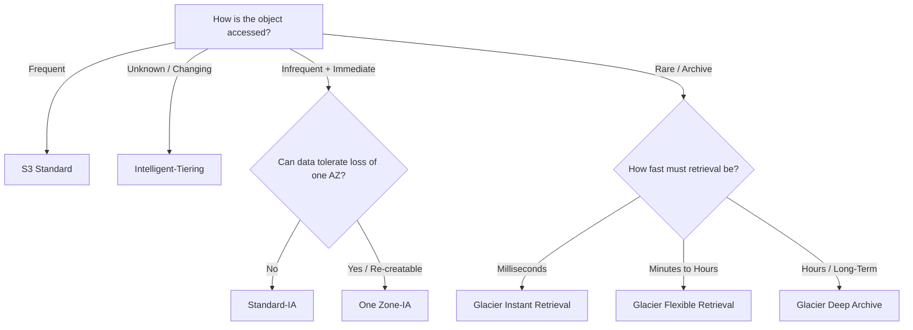

> [!TIP]
> 💡 **Exam Pattern**
>
> **Unknown access pattern**
>
> → Intelligent-Tiering
>
> **Infrequent + immediate access**
>
> → Standard-IA
>
> **Re-creatable + infrequent**
>
> → One Zone-IA
>
> **Archive + milliseconds**
>
> → Glacier Instant Retrieval
>
> **Archive + minutes/hours**
>
> → Glacier Flexible Retrieval
>
> **Long-term archive + lowest cost**
>
> → Glacier Deep Archive

> [!WARNING]
> Minimum storage durations are **billing conditions**, not locks preventing deletion.

---

# 4. Lifecycle

S3 Lifecycle automates transitions and expiration.

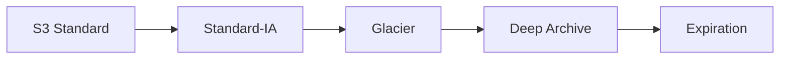

Lifecycle rules can:

- Transition eligible objects to another storage class
- Expire current versions
- Expire noncurrent versions
- Remove expired delete markers
- Abort incomplete multipart uploads

> [!TIP]
> 💡 **Exam Pattern**
>
> **Objects become less frequently accessed as they age**
>
> → S3 Lifecycle

Example:

```text
Day 0   → S3 Standard
Day 30  → Standard-IA
Day 90  → Glacier
Day 365 → Delete
```

> [!CAUTION]
> ⚠️ **Exam Trap**
>
> Lifecycle transitions do not eliminate minimum-storage-duration charges.

---

# 5. Versioning

Versioning preserves multiple versions of an object.

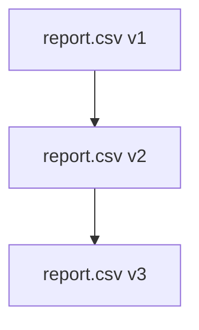

If versioning is enabled and you execute:

```text
DELETE report.csv
```

S3 normally creates:

```text
Delete Marker ← Current
report.csv v3
report.csv v2
report.csv v1
```

The previous versions still exist.

> [!IMPORTANT]
> 🎯 **SAA Memory**
>
> **DELETE without VersionId**
>
> → Creates a **Delete Marker**
>
> **DELETE with VersionId**
>
> → Deletes that specific version

Suspending versioning does **not** delete existing versions.

---

## Versioning + Lifecycle

Versioned buckets require thinking about:

```text
Current Version
Noncurrent Versions
Delete Markers
```

If a requirement says:

> "Delete objects completely after N days"

check whether old versions must also be expired.

> [!CAUTION]
> ⚠️ **Exam Trap**
>
> Expiring only the current version does **not necessarily erase all historical data**.

---

# 6. Replication

S3 supports:

```text
CRR = Cross-Region Replication
SRR = Same-Region Replication
```

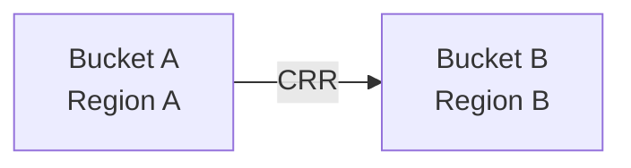

General-purpose bucket replication requires:

- Versioning
- Appropriate IAM permissions
- Replication configuration

Replication is **asynchronous**.

---

## CRR vs SRR

| Requirement                          | Think                           |
| ------------------------------------ | ------------------------------- |
| Copy data to another Region          | **CRR**                         |
| Copy data within same Region         | **SRR**                         |
| Replicate existing eligible objects  | **S3 Batch Replication**        |
| Defined replication-time requirement | **S3 Replication Time Control** |

---

## Existing Objects

Normal live replication rules primarily handle eligible new writes.

For existing eligible objects:

```text
S3 Batch Replication
```

> [!TIP]
> 💡 **Exam Pattern**
>
> **Existing objects + replication**
>
> → S3 Batch Replication

---

## SSE-KMS Replication

SSE-KMS replication requires appropriate:

- Replication configuration
- Source KMS permissions
- Destination KMS permissions

> [!CAUTION]
> ⚠️ **Exam Trap**
>
> **S3 permission alone may not be enough for SSE-KMS objects.**
>
> KMS authorization must also allow the operation.

---

## Delete Behavior

Do not assume every deletion behaves identically during replication.

Delete-marker replication is configurable.

Permanent deletion of a specific source version does not automatically mean that the corresponding destination version is deleted.

---

# 7. Access and Encryption

## Access Control

Prefer:

```text
IAM Policies
     +
Bucket Policies
     +
S3 Block Public Access
```

New general-purpose buckets normally use:

```text
Bucket owner enforced
        ↓
ACLs disabled
```

> [!IMPORTANT]
> Prefer policies over legacy ACLs.

---

## Encryption

| Mechanism                  | Key Idea                                        |
| -------------------------- | ----------------------------------------------- |
| **SSE-S3**                 | S3 manages encryption and keys                  |
| **SSE-KMS**                | KMS-backed encryption with key control/auditing |
| **DSSE-KMS**               | Two layers of server-side encryption            |
| **SSE-C**                  | Customer provides encryption key material to S3 |
| **Client-side encryption** | Client encrypts before sending data to S3       |
| **TLS**                    | Encryption in transit                           |

---

## Encryption Mental Model

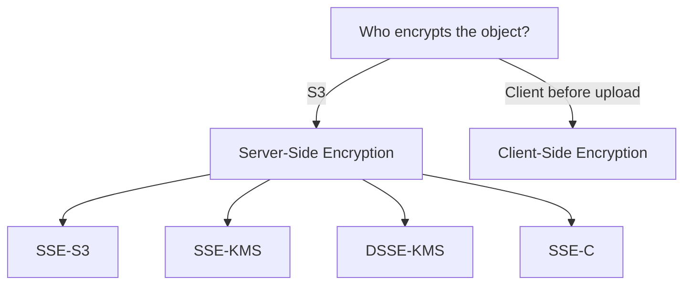

### SSE-C vs Client-Side Encryption

This is a common exam distinction.

```text
SSE-C
Client → plaintext + key → AWS S3
S3 performs encryption
S3 does not store the customer key
```

```text
Client-Side Encryption
Client encrypts locally
        ↓
Ciphertext → AWS S3
```

> [!CAUTION]
> ⚠️ **Exam Trap**
>
> If the question says:
>
> **"Unencrypted data and the master key must never be sent to AWS"**
>
> → **Client-side encryption**
>
> NOT SSE-C.

---

## SSE-KMS

Reading an SSE-KMS encrypted object generally requires authorization for both:

```text
s3:GetObject
      +
kms:Decrypt
```

> [!IMPORTANT]
> 🎯 **SAA Memory**
>
> **SSE-KMS = S3 permission + KMS permission**

---

## Default Encryption

Changing a bucket's default encryption does **not** automatically re-encrypt all existing objects.

S3 Bucket Keys can reduce KMS request costs for supported SSE-KMS workloads.

> [!WARNING]
> Encryption does **not** mean the object is automatically private.
>
> Encryption and authorization solve different problems.

---

# 8. Presigned URLs

Presigned URLs provide temporary access to private S3 objects.

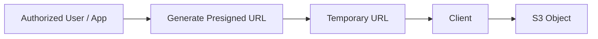

They delegate the permissions of the signer for a limited period.

> [!IMPORTANT]
> Presigned URLs are effectively **bearer credentials**.

Their effective lifetime may be shorter when generated using temporary credentials.

Explicit denies still apply.

---

## Presigned URL vs CloudFront

| Requirement                          | Think                              |
| ------------------------------------ | ---------------------------------- |
| Temporary direct access to S3 object | **S3 Presigned URL**               |
| Private globally cached content      | **CloudFront Signed URL / Cookie** |

See [Amazon CloudFront](../Networking/aws_cloudfront.md).

---

# 9. Object Lock

Object Lock provides **WORM** protection for object versions.

```text
WORM
Write Once
Read Many
```

Object Lock requires versioning.

---

## Governance vs Compliance

| Mode           | Can Retention Be Bypassed?                          |
| -------------- | --------------------------------------------------- |
| **Governance** | Yes, with appropriate permission and bypass request |
| **Compliance** | No during the retention period                      |

> [!IMPORTANT]
> 🎯 **SAA Memory**
>
> **Governance = privileged bypass possible**
>
> **Compliance = cannot shorten/bypass during retention**

---

## Legal Hold

Legal Hold:

- Has no expiration date
- Remains until explicitly removed by an authorized user
- Is independent from retention periods

```text
Retention
→ Time-based

Legal Hold
→ Until explicitly removed
```

> [!CAUTION]
> ⚠️ **Exam Trap**
>
> **Versioning ≠ Object Lock**
>
> Versioning preserves history.
>
> Object Lock prevents protected versions from being deleted.

---

# 10. Performance and Transfer

## Multipart Upload

Multipart upload splits a large object into parts.

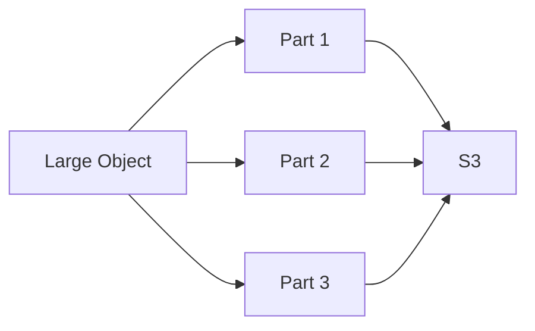

Benefits:

- Retry individual failed parts
- Parallel upload
- Better handling of large/unreliable transfers

Remember to clean up abandoned multipart uploads.

---

## Range GET

Range GET retrieves only part of an object.

```text
GET bytes=0-999
```

Useful when the client does not need the entire object.

---

## Transfer Acceleration

Transfer Acceleration improves long-distance transfers between clients and S3.

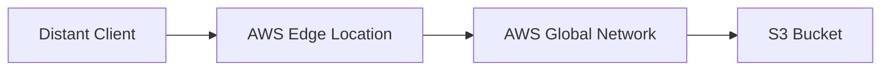

> [!CAUTION]
> ⚠️ **Exam Trap**
>
> Transfer Acceleration:
>
> - Does **not** cache objects
> - Does **not** create replicas
> - Is **not** CloudFront

---

## CloudFront vs Transfer Acceleration

| Requirement                                  | Service                                       |
| -------------------------------------------- | --------------------------------------------- |
| Repeated global content delivery             | [CloudFront](../Networking/aws_cloudfront.md) |
| Accelerate long-distance transfer to/from S3 | **S3 Transfer Acceleration**                  |
| Temporary direct private S3 access           | **Presigned URL**                             |

---

## Private S3 Access

For private connectivity from a VPC:

```text
S3 Gateway Endpoint
```

is commonly the cost-effective choice when its connectivity scope satisfies the requirement.

For supported hybrid/private connectivity scenarios, an S3 interface endpoint may be appropriate.

> [!TIP]
> 💡 **Exam Pattern**
>
> **Private EC2 → S3 without NAT/Internet**
>
> → **Gateway VPC Endpoint**

---

# 11. Events and Notifications

S3 can generate events for operations such as object creation or deletion.

Possible integrations include:

```text
S3
├── SNS
├── SQS
├── Lambda
└── EventBridge
```

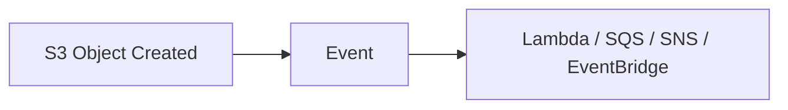

Event notifications can arrive more than once and are not globally ordered.

Applications should therefore consider **idempotency**.

> [!CAUTION]
> ⚠️ **Exam Trap**
>
> Avoid writing results back into the same triggering S3 location without appropriate filtering.
>
> Otherwise:
>
> ```text
> S3 Event
>    ↓
> Lambda
>    ↓
> Writes to S3
>    ↓
> New Event
>    ↓
> Lambda
>    ↓
> ♾️
> ```

For routing patterns requiring capabilities beyond direct S3 notification destinations, consider EventBridge.

---

# 12. S3 Decision Map

```mermaid
flowchart TD
    A[S3 Requirement]

    A --> B[Storage Class]
    A --> C[Protect Data]
    A --> D[Move Data]
    A --> E[Access]
    A --> F[Replication]

    B --> B1["Unknown access → Intelligent-Tiering"]
    B --> B2["Infrequent immediate → Standard-IA"]
    B --> B3["Archive immediate → Glacier Instant"]
    B --> B4["Archive hours → Deep Archive"]

    C --> C1["Recover old versions → Versioning"]
    C --> C2["Prevent deletion → Object Lock"]
    C --> C3["Automatic transitions → Lifecycle"]

    D --> D1["Large upload → Multipart"]
    D --> D2["Long-distance transfer → Transfer Acceleration"]

    E --> E1["Temporary direct access → Presigned URL"]
    E --> E2["Global cached access → CloudFront"]
    E --> E3["Private VPC access → Gateway Endpoint"]

    F --> F1["Different Region → CRR"]
    F --> F2["Same Region → SRR"]
    F --> F3["Existing objects → Batch Replication"]
```

---

# 13. High-Value Exam Traps

> [!WARNING]
> **Trap 1 — Glacier Retrieval**
>
> Glacier Instant Retrieval → **No restore job**
>
> Glacier Flexible Retrieval / Deep Archive → **Restore required**

---

> [!WARNING]
> **Trap 2 — Strong Consistency**
>
> Strong consistency does **not** mean synchronous replication.

---

> [!WARNING]
> **Trap 3 — Lifecycle vs Object Lock**
>
> Lifecycle → transition / expire data
>
> Object Lock → prevent protected version deletion

---

> [!WARNING]
> **Trap 4 — Delete Marker**
>
> A delete marker is **not** permanent deletion of all versions.

---

> [!WARNING]
> **Trap 5 — SSE-KMS**
>
> S3 access alone may not be sufficient.
>
> Think:
>
> **S3 permission + KMS permission**

---

> [!WARNING]
> **Trap 6 — Transfer Acceleration**
>
> Transfer Acceleration does not:
>
> - Cache content
> - Create replicas
> - Replace CloudFront

---

> [!WARNING]
> **Trap 7 — One Zone**
>
> One Zone storage classes do **not** protect against loss of that AZ.

---

> [!WARNING]
> **Trap 8 — Versioning vs Object Lock**
>
> Versioning → Recover old versions
>
> Object Lock → Prevent protected versions from being deleted

---

> [!WARNING]
> **Trap 9 — Encryption vs Access**
>
> An encrypted object can still be exposed by an overly permissive access policy.
>
> **Encryption ≠ Authorization**

---

# 14. Scenario Check

## Scenario 1 — Unknown Access Pattern

> Objects have unpredictable access patterns and the company wants automatic storage-cost optimization.

```text
→ S3 Intelligent-Tiering
```

---

## Scenario 2 — Immediate Archive Retrieval

> Data is accessed only a few times per year but must be retrieved in milliseconds.

```text
→ S3 Glacier Instant Retrieval
```

Not Glacier Flexible Retrieval or Deep Archive.

---

## Scenario 3 — Long-Term Archive

> Records must be retained for years and retrieval can take hours.

```text
→ S3 Glacier Deep Archive
```

---

## Scenario 4 — Accidental Delete

> Users may accidentally delete important objects and administrators need to recover previous versions.

```text
→ S3 Versioning
```

---

## Scenario 5 — Compliance Records

> Records must be immediately readable, infrequently accessed, and impossible to delete for a fixed retention period.

Think:

```text
Storage Requirement
        +
Deletion Protection
```

Possible architecture:

```text
Immediate-access storage class
        +
Object Lock Compliance Mode
```

> [!CAUTION]
> Versioning alone does not prevent a sufficiently privileged principal from permanently deleting a specific version.

---

## Scenario 6 — Existing Objects Need Cross-Region Replication

```text
Existing Objects
      +
Different Region
      ↓
S3 Batch Replication
```

---

## Scenario 7 — Private EC2 Access to S3

> EC2 instances in private subnets need access to S3 without using the Internet or NAT Gateway.

```text
→ S3 Gateway VPC Endpoint
```

---

## Scenario 8 — Global Static Content

> Users around the world repeatedly download the same static objects.

```text
→ CloudFront + S3
```

Not Transfer Acceleration.

---

# 15. S3 Decision in 30 Seconds

```mermaid
flowchart TD
    Q[S3 Question]

    Q --> A["Frequent access → Standard"]
    Q --> B["Unknown access → Intelligent-Tiering"]
    Q --> C["Infrequent + immediate → Standard-IA"]
    Q --> D["Archive + milliseconds → Glacier Instant"]
    Q --> E["Archive + hours → Glacier Flexible / Deep Archive"]

    Q --> F["Recover versions → Versioning"]
    Q --> G["Prevent deletion → Object Lock"]
    Q --> H["Transition / expire → Lifecycle"]

    Q --> I["Cross-Region → CRR"]
    Q --> J["Existing objects → Batch Replication"]

    Q --> K["Temporary direct access → Presigned URL"]
    Q --> L["Global cache → CloudFront"]
    Q --> M["Long-distance S3 transfer → Transfer Acceleration"]

    Q --> N["Private VPC → Gateway Endpoint"]
```

> [!NOTE]
> 🧠 **SAA Memory**
>
> **OBJECTS → S3**
>
> **Unknown access → Intelligent-Tiering**
>
> **Infrequent + immediate → Standard-IA**
>
> **Archive + immediate → Glacier Instant Retrieval**
>
> **Archive + hours → Glacier Flexible / Deep Archive**
>
> **Recover versions → Versioning**
>
> **Prevent deletion → Object Lock**
>
> **Move/archive automatically → Lifecycle**
>
> **Different Region → CRR**
>
> **Existing objects → Batch Replication**
>
> **Temporary access → Presigned URL**
>
> **Global cache → CloudFront**
>
> **Long-distance S3 transfer → Transfer Acceleration**
>
> **Private VPC access → Gateway Endpoint**
>
> **SSE-KMS → S3 + KMS permissions**

---

# 🔗 Related Notes

## Storage

- [Storage Overview](storage_overview.md)
- [Amazon EBS](aws_ebs.md)
- [Amazon EFS](aws_efs.md)
- [AWS Storage Gateway](aws_storage_gateway.md)
- [AWS DataSync](aws_datasync.md)
- [AWS Transfer Family](aws_transfer_family.md)

## Networking

- [Amazon CloudFront](../Networking/aws_cloudfront.md)
- [VPC Endpoints](../Networking/aws_vpc_endpoints.md)

## Security

- [AWS IAM](../Security/aws_iam.md)

---

# 📚 Sources

- AWS S3 — Bucket overview
- AWS S3 — Storage classes
- AWS S3 — Lifecycle transitions
- AWS S3 — Versioning
- AWS S3 — Replication
- AWS S3 — Object Lock
- AWS S3 — Server-side encryption
- AWS S3 — Event notifications

---

**Reviewed:** 2026-09-23  
**Focus:** SAA-C03 S3 architecture decisions and exam patterns.
