# AWS Storage Gateway — Hybrid Storage Interfaces

## 📑 Table of Contents

1. [Mental Model](#1-mental-model)
2. [Gateway Types](#2-gateway-types)
3. [S3 File Gateway](#3-s3-file-gateway)
4. [Volume Gateway](#4-volume-gateway)
5. [Tape Gateway](#5-tape-gateway)
6. [Local Cache and Hybrid Access](#6-local-cache-and-hybrid-access)
7. [Storage Gateway + S3 Lifecycle](#7-storage-gateway--s3-lifecycle)
8. [Storage Gateway vs Other Services](#8-storage-gateway-vs-other-services)
9. [Storage Gateway Decision Map](#9-storage-gateway-decision-map)
10. [High-Value Exam Traps](#10-high-value-exam-traps)
11. [Scenario Check](#11-scenario-check)
12. [Storage Gateway in 30 Seconds](#12-storage-gateway-in-30-seconds)

---

# 1. Mental Model

> [!TIP]
> 🧠 **Mental Model**
>
> **AWS Storage Gateway = Bridge between on-premises applications and AWS storage.**
>
> Keep familiar storage protocols such as:
>
> - SMB / NFS
> - iSCSI
> - Virtual Tape Library
>
> while using AWS storage behind the scenes.

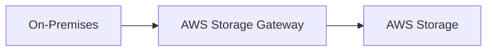

Choose the gateway based primarily on:

1. **What protocol/interface does the application need?**
2. **Where must the primary dataset reside?**

> [!IMPORTANT]
> 🎯 **SAA Memory**
>
> **SMB / NFS → S3 File Gateway**
>
> **iSCSI Disk → Volume Gateway**
>
> **Virtual Tapes → Tape Gateway**

---

# 2. Gateway Types

| Gateway                     | Application Interface | Data Location / Main Use Case                                          |
| --------------------------- | --------------------- | ---------------------------------------------------------------------- |
| **S3 File Gateway**         | NFS / SMB             | Files stored as S3 objects; frequently accessed data cached locally    |
| **Volume Gateway — Cached** | iSCSI                 | Primary data stored in AWS; frequently accessed data cached locally    |
| **Volume Gateway — Stored** | iSCSI                 | Complete primary dataset stored locally; asynchronous cloud backups    |
| **Tape Gateway**            | iSCSI VTL             | Replace physical tape infrastructure while preserving backup workflows |

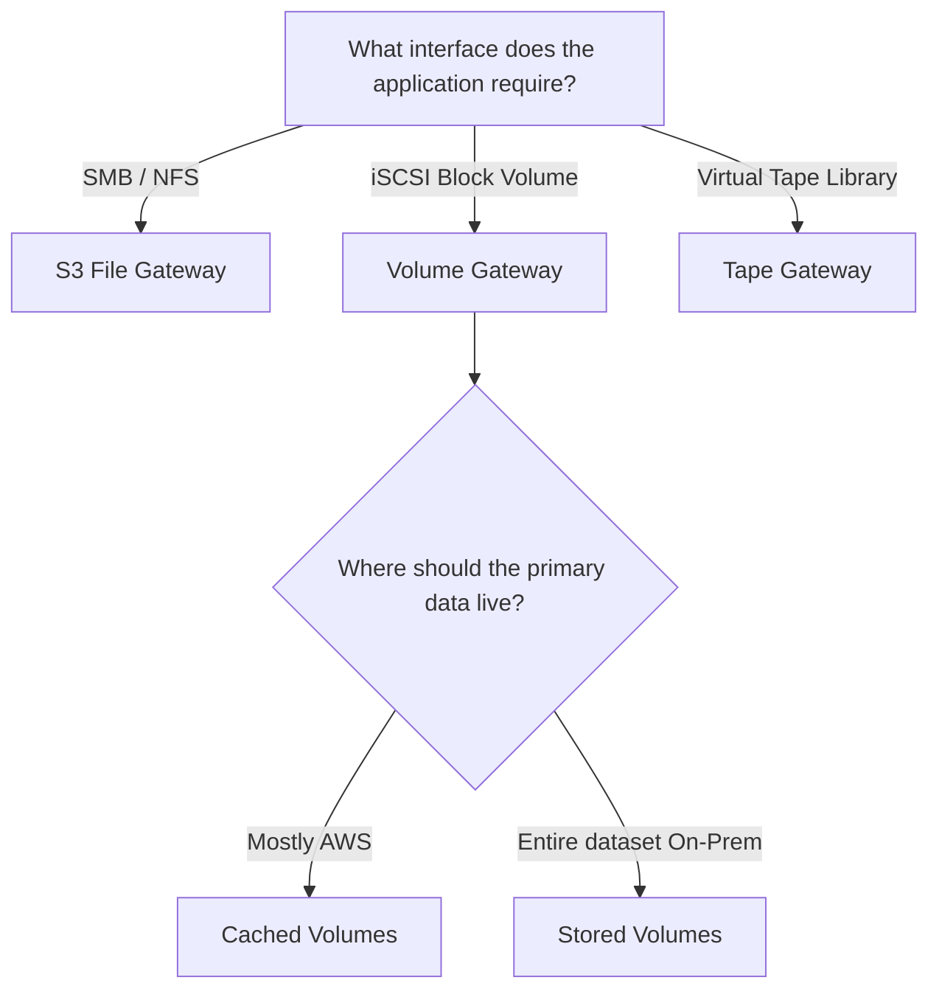

---

# 3. S3 File Gateway

S3 File Gateway allows existing applications to access Amazon S3 using standard file protocols:

```text
SMB
or
NFS
 ↓
S3 File Gateway
 ↓
Amazon S3
```

Applications continue working with files while the gateway maps those files to **S3 objects**.

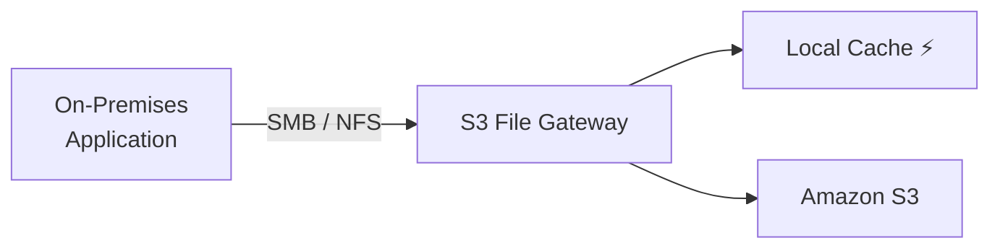

This is useful when an application:

- Already uses SMB or NFS
- Cannot or should not be rewritten to use S3 APIs
- Requires ongoing hybrid access
- Benefits from low-latency access to frequently used files
- Needs durable S3-backed storage

> [!TIP]
> 💡 **Exam Pattern**
>
> **On-premises + SMB/NFS + local cache + S3**
>
> → **S3 File Gateway**

---

## How It Works

Conceptually:

```text
Application
    │
    │ SMB / NFS
    ▼
S3 File Gateway
    │
    ├── Local Cache ⚡
    │
    └── Amazon S3 ☁️
```

The gateway provides the file interface while Amazon S3 provides durable object storage.

Recently or frequently accessed data can remain cached locally.

> [!IMPORTANT]
> 🎯 **SAA Memory**
>
> **S3 File Gateway = FILE interface in front, S3 objects behind it.**

---

## Direct S3 Changes

Direct modifications to the backing S3 bucket may require the gateway's cache to be refreshed before those changes become visible through the file share.

Do not treat multiple independent caches or writers as if they were a coordinated distributed filesystem.

---

# 4. Volume Gateway

Volume Gateway exposes **iSCSI block storage** to on-premises applications.

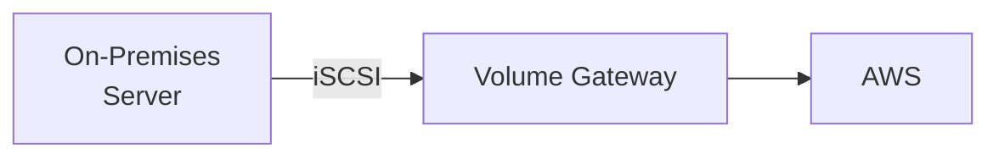

There are two important modes:

```text
CACHED
→ Most data in AWS
→ Active working set cached locally

STORED
→ Entire primary dataset stays locally
→ Cloud backups stored as EBS snapshots
```

> [!IMPORTANT]
> 🎯 **SAA Memory**
>
> **Cached = AWS is primary**
>
> **Stored = On-premises is primary**

---

## Cached Volumes

Use cached volumes when:

- The primary dataset can reside in AWS
- Local storage capacity should be minimized
- Frequently accessed data needs local low-latency access

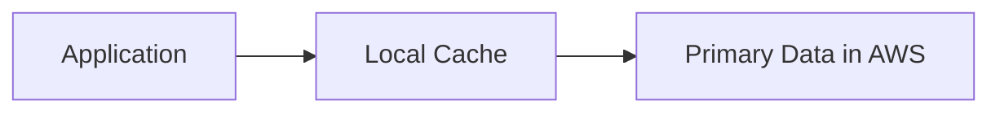

---

## Stored Volumes

Use stored volumes when:

- The complete primary dataset must remain on-premises
- Applications require low-latency access to the entire dataset
- AWS is used for cloud backups

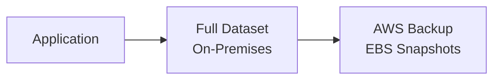

> [!CAUTION]
> ⚠️ **Exam Trap**
>
> Volume Gateway does **not** expose user files as normal S3 objects.
>
> That is the **S3 File Gateway** model.

---

# 5. Tape Gateway

Tape Gateway replaces physical tape infrastructure with **virtual tapes**.

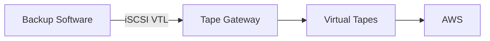

It is designed to preserve existing tape-based backup workflows.

Think:

```text
Existing backup software
        +
Virtual Tape Library
        +
Replace physical tapes
        ↓
Tape Gateway
```

Archived tapes are intended for long-term retention.

Archived content must be retrieved before it can be used again.

> [!TIP]
> 💡 **Exam Pattern**
>
> **Replace physical tapes without replacing existing backup software**
>
> → **Tape Gateway**

> [!CAUTION]
> ⚠️ **Exam Trap**
>
> Do not choose Tape Gateway merely because a question contains the words:
>
> **backup**, **archive**, or **long-term retention**.
>
> Look for the actual interface:
>
> **Virtual Tape Library / tape backup software → Tape Gateway**

---

# 6. Local Cache and Hybrid Access

Local caching is one of the most important Storage Gateway concepts.

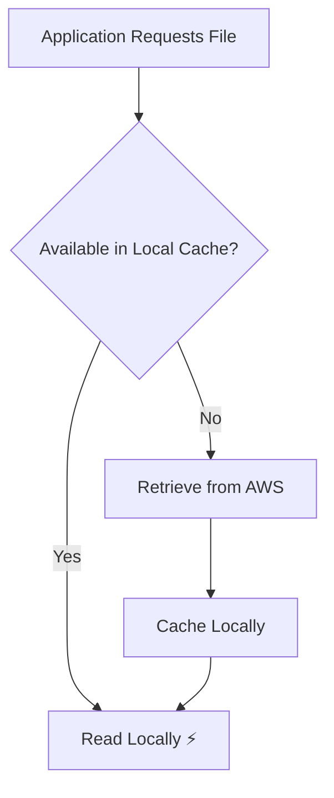

This can provide:

- Low-latency access to frequently used data
- Less repeated retrieval over the network
- Smaller local storage requirements in applicable gateway modes

> [!IMPORTANT]
> 🎯 **SAA Memory**
>
> When a question explicitly requires:
>
> **Hybrid storage + local cache + SMB/NFS**
>
> think **S3 File Gateway**.

---

## Asynchronous Uploads

Some gateway operations involve asynchronous communication with AWS.

A successful local write does not necessarily mean the corresponding data has already completed its transfer to AWS.

Operational considerations include:

- Network bandwidth
- Cache sizing
- Upload buffers where applicable
- Pending uploads
- Gateway/site failure before pending data reaches AWS

> [!WARNING]
> **Local cache is not an independent backup.**

---

# 7. Storage Gateway + S3 Lifecycle

This is an important SAA pattern for **S3 File Gateway**.

Because File Gateway stores files as S3 objects, S3 Lifecycle can manage those objects over time.

Example:

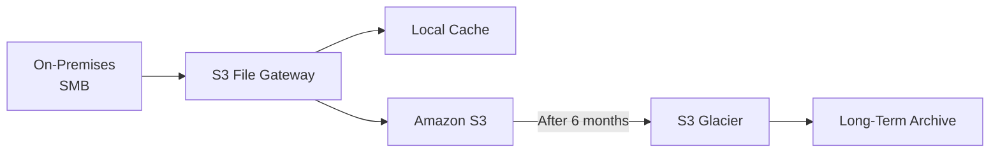

This architecture is useful when the requirements include:

```text
On-Premises Files
        +
SMB / NFS
        +
Local Cache
        +
Durable AWS Storage
        +
Archive Older Data
```

Think:

```text
S3 File Gateway
        +
Amazon S3
        +
S3 Lifecycle
        ↓
S3 Glacier
```

> [!TIP]
> 💡 **Exam Pattern**
>
> **SMB/NFS + local cache + S3 + archive after N months**
>
> → **S3 File Gateway + S3 Lifecycle**

---

## Archive Retrieval Caveat

Be careful when transitioning File Gateway objects into archival storage classes.

Objects transitioned to storage classes that require restoration cannot simply be accessed normally through the file share until they have been restored and made appropriately accessible again.

> [!CAUTION]
> ⚠️ **Exam Trap**
>
> Always compare the archive policy with the application's retrieval requirement.
>
> ```text
> Must remain immediately accessible
> → Don't transition it to a restore-required class yet
>
> No longer needs immediate access
> → Archive class may be appropriate
> ```

---

# 8. Storage Gateway vs Other Services

| Requirement                                        | Service                                       |
| -------------------------------------------------- | --------------------------------------------- |
| Ongoing on-prem SMB/NFS + S3 backing + local cache | **S3 File Gateway**                           |
| On-prem block interface + cloud storage/backup     | **Volume Gateway**                            |
| Replace physical tape infrastructure               | **Tape Gateway**                              |
| Copy / migrate / synchronize datasets              | [AWS DataSync](aws_datasync.md)               |
| SFTP / FTPS / FTP transfers                        | [AWS Transfer Family](aws_transfer_family.md) |
| Shared Linux filesystem directly in AWS            | [Amazon EFS](aws_efs.md)                      |
| Specialized managed filesystem                     | [Amazon FSx](aws_fsx.md)                      |

---

## File Gateway vs DataSync

This is especially important for the exam.

```text
DataSync
→ MOVE / COPY / SYNC

File Gateway
→ ACCESS + CACHE
```

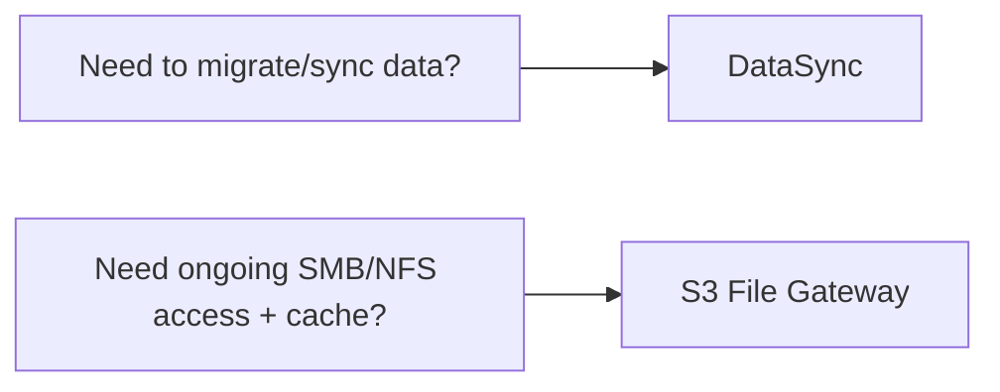

> [!CAUTION]
> ⚠️ **Exam Trap**
>
> DataSync is **not** a persistent local cache appliance.
>
> If the requirement says:
>
> **"recently accessed files must be cached locally"**
>
> → Think **File Gateway**, not DataSync.

---

## File Gateway vs Transfer Family

```text
Existing local application needs SMB/NFS
→ File Gateway

External users/applications transfer using SFTP/FTPS/FTP
→ Transfer Family
```

---

## File Gateway vs EFS

```text
Hybrid On-Prem + SMB/NFS + S3 backing
→ File Gateway

Shared filesystem directly used by AWS compute
→ EFS / FSx depending on requirements
```

---

# 9. Storage Gateway Decision Map

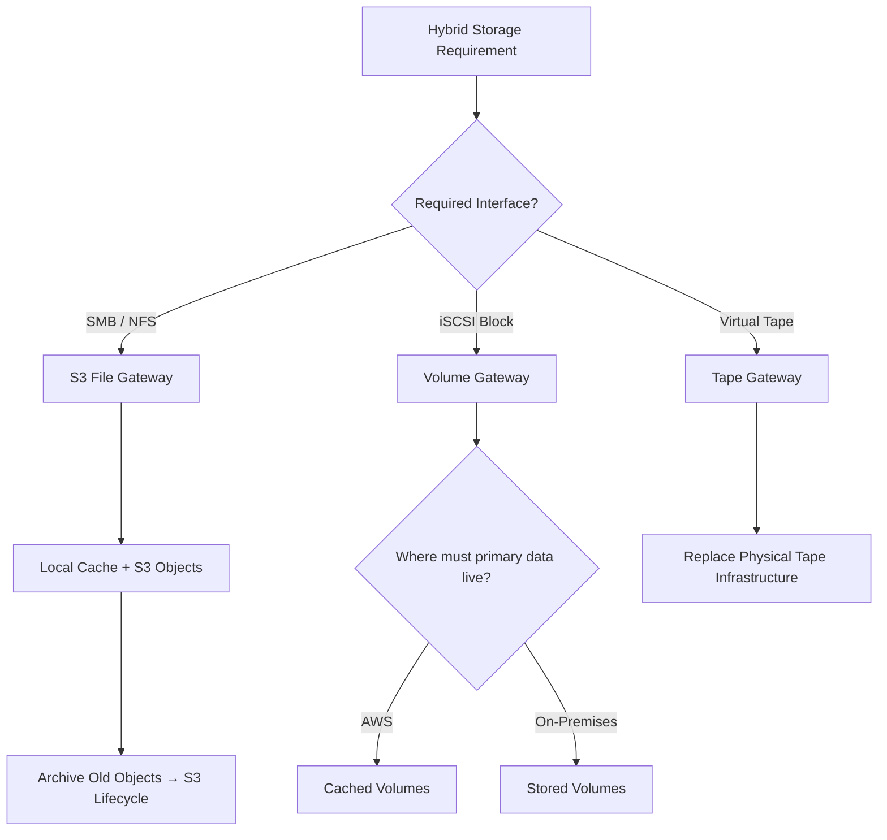

---

# 10. High-Value Exam Traps

> [!WARNING]
> **Trap 1 — Protocol First**
>
> **NFS / SMB → File Gateway**
>
> **iSCSI disk → Volume Gateway**
>
> **Virtual Tape Library → Tape Gateway**

---

> [!WARNING]
> **Trap 2 — Cached vs Stored Volumes**
>
> They are not synonyms.
>
> **Cached → Primary data in AWS**
>
> **Stored → Complete primary dataset on-premises**

---

> [!WARNING]
> **Trap 3 — File Gateway vs Volume Gateway**
>
> **File Gateway → Files become S3 objects**
>
> **Volume Gateway → Block storage; not normal user-visible S3 files**

---

> [!WARNING]
> **Trap 4 — File Gateway vs DataSync**
>
> **Ongoing access + local cache → File Gateway**
>
> **Move / copy / synchronize → DataSync**

---

> [!WARNING]
> **Trap 5 — Archive ≠ Automatically Tape Gateway**
>
> Archive requirements alone do not imply Tape Gateway.
>
> Look for **virtual tapes / tape backup workflows**.

---

> [!WARNING]
> **Trap 6 — Cache ≠ Backup**
>
> Local cache is not unlimited offline storage and is not an independent backup.

---

> [!WARNING]
> **Trap 7 — Glacier Access**
>
> Moving File Gateway-backed S3 objects into a restore-required archive class changes how quickly they can be accessed again.

---

# 11. Scenario Check

## Scenario 1 — SMB + Cache + Archive

> A company stores corporate documents on-premises.
>
> Requirements:
>
> - Existing applications use **SMB**
> - Recently accessed files need **low-latency local access**
> - Durable storage is required in AWS
> - Files remain immediately accessible for six months
> - Older files are archived for long-term retention

Break it down:

```text
SMB
 ↓
File interface

Local Cache
 ↓
Hybrid Storage Gateway

Durable AWS storage
 ↓
Amazon S3

Archive after 6 months
 ↓
S3 Lifecycle
```

Architecture:

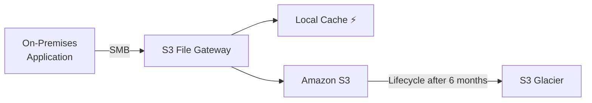

> [!TIP]
> **Answer: S3 File Gateway + S3 Lifecycle**

Why not the alternatives?

```text
Tape Gateway
→ Wrong interface/use case: virtual tape backup

DataSync
→ Transfers/synchronizes data but does not provide persistent local cache

EBS
→ Block storage for EC2; does not solve the SMB + hybrid cache requirement
```

---

## Scenario 2 — Entire Dataset Must Stay Local

> An on-premises application uses iSCSI and requires low-latency access to its **entire dataset**, with cloud backups.

```text
iSCSI
+
Entire primary dataset local
+
Cloud backups
        ↓
Volume Gateway — Stored
```

---

## Scenario 3 — Reduce Local Storage Capacity

> An on-premises application requires iSCSI block storage, but only frequently accessed data needs to remain locally cached.

```text
iSCSI
+
Primary data in AWS
+
Working set cached locally
        ↓
Volume Gateway — Cached
```

---

## Scenario 4 — Replace Physical Tapes

> Existing enterprise backup software uses tape workflows and the company wants to eliminate physical tape infrastructure.

```text
Virtual Tape Library
        ↓
Tape Gateway
```

---

## Scenario 5 — One-Time Migration

> A company needs to move a large NFS dataset from its data center to Amazon S3 and does not require ongoing local cached access.

```text
MOVE / COPY / SYNC
        ↓
AWS DataSync
```

Not File Gateway.

---

# 12. Storage Gateway in 30 Seconds

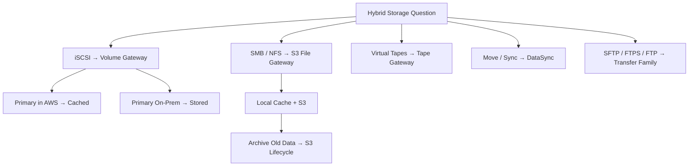

> [!NOTE]
> 🧠 **SAA Memory**
>
> **SMB/NFS + S3 + local cache → S3 File Gateway**
>
> **iSCSI + primary data AWS → Cached Volume Gateway**
>
> **iSCSI + entire dataset local → Stored Volume Gateway**
>
> **Virtual tapes → Tape Gateway**
>
> **Move/sync datasets → DataSync**
>
> **SFTP/FTPS/FTP → Transfer Family**
>
> **Archive old File Gateway objects → S3 Lifecycle**
>
> **Cache ≠ Backup**

---

# 🔗 Related Notes

## Storage

- [Storage Overview](storage_overview.md)
- [Amazon S3](aws_s3.md)
- [AWS DataSync](aws_datasync.md)
- [AWS Transfer Family](aws_transfer_family.md)
- [Amazon EFS](aws_efs.md)
- [Amazon FSx](aws_fsx.md)

---

# 📚 Sources

- AWS Storage Gateway — S3 File Gateway
- AWS Storage Gateway — Volume Gateway
- AWS Storage Gateway — Tape Gateway

---

**Reviewed:** 2026-09-23  
**Focus:** SAA-C03 hybrid storage decisions and exam patterns.
